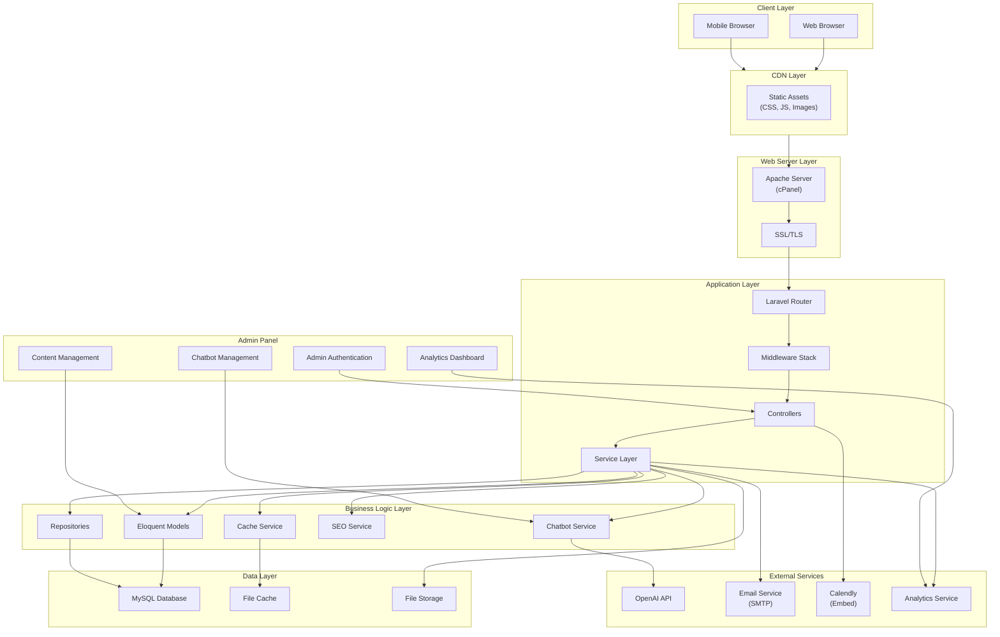
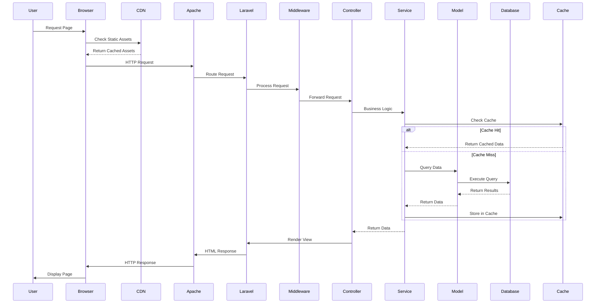

# System Architecture Overview

## 1. Overview

This document provides a high-level overview of the system architecture for The Strengths Toolbox website rebuild project. The architecture is designed to support a modern, production-grade Laravel MVC application with integrated SEO, AI chatbot functionality, performance optimization, and comprehensive content management capabilities.

### 1.1 Purpose and Scope

This architecture document outlines:
- Overall system structure and component relationships
- Technology stack and integration points
- Data flow and request handling
- Scalability and performance considerations
- Security architecture

### 1.2 Reference Documents

- Business Requirements: `documentation/00-business-requirement/business-requirement-document.md`
- Laravel MVC Architecture: `02-laravel-mvc-architecture.md`
- Database Architecture: `03-database-architecture.md`
- Frontend Architecture: `04-frontend-architecture.md`

## 2. Technology Stack Summary

### 2.1 Backend
- **Framework:** Laravel (PHP 8.1+)
- **Architecture Pattern:** MVC (Model-View-Controller)
- **Database:** MySQL 8.0+
- **Cache:** File-based cache (cPanel compatible), Redis (optional)
- **Queue:** Database queue driver (cPanel compatible)

### 2.2 Frontend
- **CSS Framework:** Tailwind CSS 3.x
- **JavaScript:** Vanilla JS with Alpine.js (lightweight)
- **Build Tool:** Vite
- **Templating:** Blade templates

### 2.3 Third-Party Integrations
- **AI Chatbot:** OpenAI API (GPT-4/GPT-3.5)
- **Email:** Laravel Mail (SMTP)
- **Calendar:** Calendly integration (embed)
- **Analytics:** Google Analytics / Plausible Analytics

### 2.4 Deployment
- **Hosting:** cPanel shared hosting
- **Web Server:** Apache (via cPanel)
- **PHP Version:** 8.1 or higher
- **SSL:** Let's Encrypt (via cPanel)

## 3. System Architecture Diagram



## 4. Component Relationships

### 4.1 Request Flow



### 4.2 Component Layers

#### 4.2.1 Presentation Layer
- **Blade Templates:** Server-side rendering
- **Tailwind CSS:** Utility-first styling
- **Alpine.js:** Lightweight JavaScript interactions
- **Responsive Design:** Mobile-first approach

#### 4.2.2 Application Layer
- **Controllers:** Handle HTTP requests and responses
- **Middleware:** Authentication, CSRF protection, rate limiting
- **Routes:** URL routing and RESTful endpoints

#### 4.2.3 Business Logic Layer
- **Services:** Core business logic and orchestration
- **Repositories:** Data access abstraction
- **Models:** Eloquent ORM models with relationships

#### 4.2.4 Data Layer
- **MySQL Database:** Primary data storage
- **File Cache:** Session and cache storage
- **File Storage:** Media and document storage

#### 4.2.5 Integration Layer
- **OpenAI API:** Chatbot functionality
- **Email Service:** Transactional emails
- **Analytics:** User behavior tracking

## 5. Data Flow Overview

### 5.1 User Request Flow

1. **User initiates request** → Browser sends HTTP request
2. **CDN check** → Static assets served from CDN if available
3. **Web server** → Apache receives request and forwards to Laravel
4. **Routing** → Laravel router matches URL to controller action
5. **Middleware** → Authentication, CSRF, rate limiting checks
6. **Controller** → Handles request, calls appropriate service
7. **Service** → Business logic execution, data validation
8. **Model/Repository** → Database queries or cache retrieval
9. **Response** → Data formatted and passed to view
10. **View rendering** → Blade template compiled to HTML
11. **Response sent** → HTML returned to browser

### 5.2 Admin Panel Flow

1. **Admin login** → Authentication via Laravel Auth
2. **Dashboard** → Admin dashboard with analytics
3. **Content management** → CRUD operations for pages, blog, forms
4. **SEO management** → Meta tags, schema markup configuration
5. **Chatbot management** → Configure prompts, view conversations
6. **Analytics** → View user behavior and conversion metrics

### 5.3 Chatbot Flow

1. **User message** → Frontend widget sends message
2. **API endpoint** → Laravel receives chatbot request
3. **Chatbot service** → Processes message, retrieves context
4. **OpenAI API** → Sends message with context to OpenAI
5. **Response handling** → Receives and processes AI response
6. **Storage** → Saves conversation to database
7. **Response** → Returns AI response to frontend

## 6. Integration Points

### 6.1 External API Integrations

#### OpenAI API
- **Purpose:** AI chatbot responses
- **Authentication:** API key stored in environment
- **Rate Limiting:** Implemented at service level
- **Error Handling:** Graceful degradation if API unavailable

#### Email Service
- **Purpose:** Transactional emails (contact forms, notifications)
- **Configuration:** SMTP settings in environment
- **Queue:** Background job processing for emails

#### Calendly
- **Purpose:** Booking calendar integration
- **Implementation:** Embedded widget (no API integration required)
- **Location:** Contact and booking pages

#### Analytics
- **Purpose:** User behavior and conversion tracking
- **Implementation:** JavaScript snippet in layout
- **Privacy:** GDPR-compliant implementation

### 6.2 Internal Integrations

#### SEO Integration
- **Location:** All controllers and views
- **Implementation:** Service layer for meta tag management
- **Schema Markup:** JSON-LD structured data

#### Caching Integration
- **Location:** Service layer and controllers
- **Strategy:** Cache frequently accessed data
- **Invalidation:** Event-driven cache clearing

#### Admin Panel Integration
- **Location:** Separate admin routes and controllers
- **Authentication:** Laravel authentication with role-based access
- **Access:** Admin-only routes protected by middleware

## 7. Security Architecture

### 7.1 Authentication & Authorization
- **User Authentication:** Laravel's built-in authentication
- **Admin Authentication:** Separate admin guard
- **Role-Based Access:** Middleware for role checking
- **Password Security:** Bcrypt hashing

### 7.2 Data Protection
- **CSRF Protection:** Laravel CSRF tokens on all forms
- **SQL Injection Prevention:** Eloquent ORM parameter binding
- **XSS Prevention:** Blade template escaping
- **Input Validation:** Form request validation

### 7.3 HTTPS/SSL
- **SSL Certificate:** Let's Encrypt via cPanel
- **Force HTTPS:** Middleware to redirect HTTP to HTTPS
- **Secure Cookies:** HTTPS-only cookie configuration

### 7.4 Rate Limiting
- **API Endpoints:** Rate limiting on chatbot API
- **Form Submissions:** Rate limiting on contact forms
- **Login Attempts:** Throttling on authentication

## 8. Scalability Considerations

### 8.1 Performance Optimization
- **Caching Strategy:** Multi-level caching (view, query, application)
- **Asset Optimization:** Minification, compression, CDN
- **Database Optimization:** Indexing, query optimization
- **Image Optimization:** WebP format, lazy loading

### 8.2 Resource Management
- **Memory Usage:** Efficient query execution
- **File Storage:** Organized storage structure
- **Session Management:** Database sessions for scalability

### 8.3 cPanel Constraints
- **Shared Hosting:** Optimized for shared hosting environment
- **Resource Limits:** Efficient resource usage
- **No Redis Requirement:** File-based caching for compatibility

## 9. Monitoring and Logging

### 9.1 Application Logging
- **Laravel Logs:** Application errors and exceptions
- **Access Logs:** Apache access logs
- **Error Tracking:** Exception logging with context

### 9.2 Performance Monitoring
- **Page Load Times:** Tracked via analytics
- **Database Queries:** Query logging in development
- **Cache Hit Rates:** Monitor cache effectiveness

## 10. Deployment Architecture

### 10.1 cPanel Deployment
- **File Structure:** Standard Laravel structure
- **Public Directory:** Document root configuration
- **Environment Configuration:** `.env` file management
- **Database Setup:** MySQL database via cPanel

### 10.2 Deployment Workflow
1. **Development:** Local development environment
2. **Staging:** Test on staging server (if available)
3. **Production:** Deploy to cPanel hosting
4. **Database Migration:** Run migrations on production
5. **Cache Clear:** Clear application cache
6. **Asset Compilation:** Build production assets

## 11. Dependencies

### 11.1 Core Dependencies
- Laravel Framework 10.x
- PHP 8.1+
- MySQL 8.0+
- Composer for dependency management

### 11.2 Key Packages
- `guzzlehttp/guzzle` - HTTP client for OpenAI API
- `laravel/tinker` - Development tools
- `spatie/laravel-sitemap` - Sitemap generation (optional)
- `spatie/laravel-schema-org` - Schema markup (optional)

## 12. Configuration

### 12.1 Environment Variables
```env
APP_NAME="The Strengths Toolbox"
APP_ENV=production
APP_DEBUG=false
APP_URL=https://www.thestrengthstoolbox.com

DB_CONNECTION=mysql
DB_HOST=localhost
DB_DATABASE=strengthstoolbox
DB_USERNAME=username
DB_PASSWORD=password

OPENAI_API_KEY=your_openai_api_key
OPENAI_MODEL=gpt-4

MAIL_MAILER=smtp
MAIL_HOST=smtp.example.com
MAIL_PORT=587
MAIL_USERNAME=email@example.com
MAIL_PASSWORD=password
```

### 12.2 Key Configuration Files
- `config/app.php` - Application configuration
- `config/database.php` - Database configuration
- `config/cache.php` - Cache configuration
- `config/services.php` - Third-party service configuration

## 13. Best Practices

### 13.1 Code Organization
- Follow Laravel conventions
- Use service layer for business logic
- Keep controllers thin
- Implement repository pattern where beneficial

### 13.2 Performance
- Implement caching at multiple levels
- Optimize database queries
- Minimize N+1 query problems
- Use eager loading for relationships

### 13.3 Security
- Always validate user input
- Use parameterized queries
- Implement rate limiting
- Keep dependencies updated

### 13.4 Maintainability
- Write clear, documented code
- Follow PSR standards
- Implement comprehensive error handling
- Use version control effectively

---

**Document Version:** 1.0  
**Last Updated:** 2025  
**Next Review:** Upon architecture changes