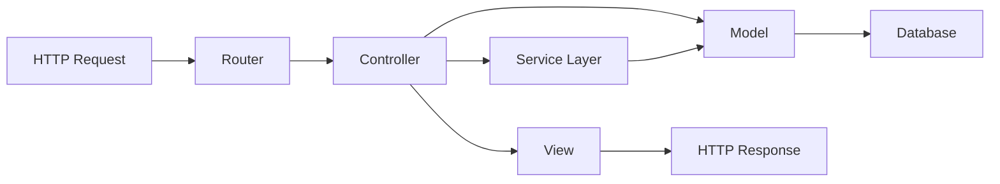
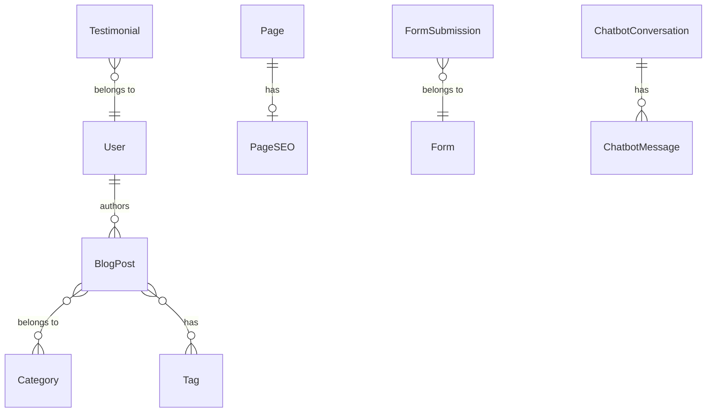

# Laravel MVC Architecture

## 1. Overview

This document describes the Laravel MVC (Model-View-Controller) architecture implementation for The Strengths Toolbox website. The architecture follows Laravel best practices while maintaining simplicity suitable for a cPanel deployment environment.

### 1.1 Purpose and Scope

This document covers:
- MVC pattern implementation in Laravel
- Directory structure and organization
- Controller organization and responsibilities
- Model structure and Eloquent relationships
- View organization with Blade templates
- Routing strategy
- Middleware usage
- Service layer pattern

### 1.2 Reference Documents

- System Architecture Overview: `01-system-architecture-overview.md`
- Database Architecture: `03-database-architecture.md`
- Frontend Architecture: `04-frontend-architecture.md`

## 2. MVC Pattern Overview

The MVC pattern separates concerns into three main components:



### 2.1 Model (M)
- Represents data and business logic
- Eloquent ORM models
- Database interactions
- Relationships between entities

### 2.2 View (V)
- Presentation layer
- Blade templates
- HTML/CSS/JavaScript
- User interface rendering

### 2.3 Controller (C)
- Handles HTTP requests
- Coordinates between Model and View
- Business logic orchestration
- Response generation

## 3. Directory Structure

```
app/
├── Console/
│   └── Commands/              # Artisan commands
├── Exceptions/
│   └── Handler.php            # Exception handling
├── Http/
│   ├── Controllers/
│   │   ├── Admin/            # Admin panel controllers
│   │   ├── Api/              # API controllers
│   │   └── Web/              # Web controllers
│   ├── Middleware/
│   │   ├── AdminAuth.php     # Admin authentication
│   │   ├── ForceHttps.php    # HTTPS enforcement
│   │   └── RateLimit.php     # Rate limiting
│   ├── Requests/
│   │   └── FormRequest.php   # Form validation
│   └── Kernel.php            # HTTP kernel
├── Models/
│   ├── Page.php              # Page model
│   ├── BlogPost.php          # Blog post model
│   ├── FormSubmission.php    # Form submission model
│   ├── Testimonial.php       # Testimonial model
│   ├── User.php              # User model
│   └── ChatbotConversation.php # Chatbot conversation model
├── Services/
│   ├── ChatbotService.php    # Chatbot business logic
│   ├── SEOService.php        # SEO management
│   ├── EmailService.php      # Email handling
│   └── CacheService.php      # Cache management
├── Repositories/
│   ├── PageRepository.php    # Page data access
│   └── BlogPostRepository.php # Blog data access
└── Providers/
    ├── AppServiceProvider.php
    └── RouteServiceProvider.php

resources/
├── views/
│   ├── layouts/
│   │   ├── app.blade.php     # Main layout
│   │   └── admin.blade.php   # Admin layout
│   ├── components/           # Reusable components
│   ├── pages/                # Page views
│   ├── blog/                 # Blog views
│   ├── admin/                # Admin views
│   └── partials/             # Partial views
├── css/
│   └── app.css               # Tailwind CSS
└── js/
    └── app.js                # JavaScript

routes/
├── web.php                   # Web routes
├── admin.php                 # Admin routes
└── api.php                   # API routes

config/
├── app.php
├── database.php
├── cache.php
└── services.php
```

## 4. Controller Organization

### 4.1 Web Controllers

Located in `app/Http/Controllers/Web/`:

#### HomeController
- Handles homepage
- Displays hero section, testimonials, CTAs
- Processes eBook sign-up form

#### PageController
- Handles static pages (About, Contact, etc.)
- Displays page content from database
- Manages SEO metadata

#### BlogController
- Lists blog posts
- Displays individual blog post
- Handles blog search
- Category/tag filtering

#### ContactController
- Displays contact form
- Processes contact form submissions
- Sends email notifications

#### StrengthsProgrammeController
- Displays strengths programme page
- Shows programme details
- Handles consultation booking links

### 4.2 Admin Controllers

Located in `app/Http/Controllers/Admin/`:

#### AdminDashboardController
- Admin dashboard overview
- Analytics display
- Quick stats

#### AdminPageController
- CRUD operations for pages
- Page content management
- SEO metadata management

#### AdminBlogController
- Blog post management
- Category and tag management
- Media library integration

#### AdminFormController
- Form submission management
- Form submission viewing
- Export functionality

#### AdminSEOController
- SEO settings management
- Meta tag templates
- Schema markup configuration

#### AdminChatbotController
- Chatbot configuration
- Conversation history
- Prompt management

### 4.3 API Controllers

Located in `app/Http/Controllers/Api/`:

#### ChatbotController
- Handles chatbot API requests
- Processes user messages
- Returns AI responses
- Manages conversation context

## 5. Controller Pattern

### 5.1 Standard Controller Structure

```php
<?php

namespace App\Http\Controllers\Web;

use App\Http\Controllers\Controller;
use App\Services\PageService;
use Illuminate\Http\Request;

class PageController extends Controller
{
    protected $pageService;

    public function __construct(PageService $pageService)
    {
        $this->pageService = $pageService;
    }

    public function show($slug)
    {
        $page = $this->pageService->getBySlug($slug);
        
        if (!$page) {
            abort(404);
        }

        return view('pages.show', compact('page'));
    }
}
```

### 5.2 Controller Responsibilities

Controllers should:
- Handle HTTP requests
- Validate input (via Form Requests)
- Call service layer for business logic
- Return appropriate responses
- Keep business logic minimal

Controllers should NOT:
- Contain complex business logic
- Directly access database (use services/repositories)
- Contain presentation logic (use views)
- Handle file operations directly

## 6. Model Structure

### 6.1 Eloquent Models

Models represent database tables and handle data relationships:

#### Page Model
```php
<?php

namespace App\Models;

use Illuminate\Database\Eloquent\Model;
use Illuminate\Database\Eloquent\SoftDeletes;

class Page extends Model
{
    use SoftDeletes;

    protected $fillable = [
        'title',
        'slug',
        'content',
        'meta_title',
        'meta_description',
        'is_published',
    ];

    public function seo()
    {
        return $this->hasOne(PageSEO::class);
    }
}
```

#### BlogPost Model
```php
<?php

namespace App\Models;

use Illuminate\Database\Eloquent\Model;
use Illuminate\Database\Eloquent\SoftDeletes;

class BlogPost extends Model
{
    use SoftDeletes;

    protected $fillable = [
        'title',
        'slug',
        'excerpt',
        'content',
        'published_at',
        'is_published',
        'author_id',
    ];

    public function author()
    {
        return $this->belongsTo(User::class, 'author_id');
    }

    public function categories()
    {
        return $this->belongsToMany(Category::class);
    }

    public function tags()
    {
        return $this->belongsToMany(Tag::class);
    }
}
```

### 6.2 Model Relationships



### 6.3 Model Best Practices

- Use Eloquent relationships for data access
- Implement accessors and mutators when needed
- Use scopes for reusable query logic
- Implement soft deletes for important data
- Use fillable/guarded for mass assignment protection

## 7. View Organization

### 7.1 Blade Template Structure

```
resources/views/
├── layouts/
│   ├── app.blade.php          # Main web layout
│   └── admin.blade.php        # Admin layout
├── components/
│   ├── header.blade.php       # Site header
│   ├── footer.blade.php       # Site footer
│   ├── navigation.blade.php   # Navigation menu
│   ├── cta-button.blade.php   # CTA button component
│   └── testimonial-card.blade.php # Testimonial card
├── pages/
│   ├── home.blade.php         # Homepage
│   ├── show.blade.php         # Page display
│   └── contact.blade.php      # Contact page
├── blog/
│   ├── index.blade.php        # Blog listing
│   └── show.blade.php         # Blog post
└── partials/
    ├── hero-section.blade.php # Hero section
    └── testimonials.blade.php # Testimonials section
```

### 7.2 Layout Inheritance

#### Main Layout (app.blade.php)
```blade
<!DOCTYPE html>
<html lang="{{ str_replace('_', '-', app()->getLocale()) }}">
<head>
    <meta charset="utf-8">
    <meta name="viewport" content="width=device-width, initial-scale=1">
    <title>@yield('title', 'The Strengths Toolbox')</title>
    @include('partials.meta')
    @vite(['resources/css/app.css', 'resources/js/app.js'])
</head>
<body>
    @include('components.header')
    
    <main>
        @yield('content')
    </main>
    
    @include('components.footer')
    
    @stack('scripts')
</body>
</html>
```

#### Page Template
```blade
@extends('layouts.app')

@section('title', $page->meta_title ?? $page->title)

@section('content')
    <article>
        <h1>{{ $page->title }}</h1>
        {!! $page->content !!}
    </article>
@endsection
```

### 7.3 Component Usage

Blade components for reusable UI elements:

```blade
{{-- Using a component --}}
<x-cta-button 
    text="Book Your Consultation" 
    url="/contact" 
    style="primary" 
/>

{{-- Testimonial component --}}
<x-testimonial-card 
    :testimonial="$testimonial" 
/>
```

## 8. Routing Strategy

### 8.1 Web Routes (routes/web.php)

```php
<?php

use App\Http\Controllers\Web\HomeController;
use App\Http\Controllers\Web\PageController;
use App\Http\Controllers\Web\BlogController;
use App\Http\Controllers\Web\ContactController;
use Illuminate\Support\Facades\Route;

// Homepage
Route::get('/', [HomeController::class, 'index'])->name('home');

// Static pages
Route::get('/about-us', [PageController::class, 'show'])->name('about');
Route::get('/strengths-programme', [PageController::class, 'show'])->name('strengths-programme');
Route::get('/contact', [ContactController::class, 'show'])->name('contact');

// Blog
Route::get('/blog', [BlogController::class, 'index'])->name('blog.index');
Route::get('/blog/{slug}', [BlogController::class, 'show'])->name('blog.show');

// Dynamic pages (catch-all for CMS pages)
Route::get('/{slug}', [PageController::class, 'show'])->name('page.show');
```

### 8.2 Admin Routes (routes/admin.php)

```php
<?php

use App\Http\Controllers\Admin\AdminDashboardController;
use App\Http\Controllers\Admin\AdminPageController;
use Illuminate\Support\Facades\Route;

Route::prefix('admin')->name('admin.')->middleware(['auth:admin'])->group(function () {
    Route::get('/', [AdminDashboardController::class, 'index'])->name('dashboard');
    
    Route::resource('pages', AdminPageController::class);
    Route::resource('blog', AdminBlogController::class);
    // ... other admin routes
});
```

### 8.3 API Routes (routes/api.php)

```php
<?php

use App\Http\Controllers\Api\ChatbotController;
use Illuminate\Support\Facades\Route;

Route::prefix('api/v1')->group(function () {
    Route::post('/chatbot/message', [ChatbotController::class, 'sendMessage'])
        ->middleware('throttle:10,1')
        ->name('api.chatbot.message');
});
```

## 9. Middleware Usage

### 9.1 Middleware Stack

```mermaid
graph LR
    Request --> TrustProxies
    TrustProxies --> ForceHttps
    ForceHttps --> EncryptCookies
    EncryptCookies --> AddQueuedCookies
    AddQueuedCookies --> StartSession
    StartSession --> ShareErrors
    ShareErrors --> VerifyCsrfToken
    VerifyCsrfToken --> SubstituteBindings
    SubstituteBindings --> Controller
```



### 9.2 Custom Middleware

#### ForceHttps Middleware
```php
<?php

namespace App\Http\Middleware;

use Closure;
use Illuminate\Http\Request;

class ForceHttps
{
    public function handle(Request $request, Closure $next)
    {
        if (!$request->secure() && app()->environment('production')) {
            return redirect()->secure($request->getRequestUri());
        }
        
        return $next($request);
    }
}
```

#### AdminAuth Middleware
```php
<?php

namespace App\Http\Middleware;

use Closure;
use Illuminate\Support\Facades\Auth;

class AdminAuth
{
    public function handle($request, Closure $next)
    {
        if (!Auth::guard('admin')->check()) {
            return redirect()->route('admin.login');
        }
        
        return $next($request);
    }
}
```

## 10. Service Layer Pattern

### 10.1 Service Layer Purpose

Services contain business logic that doesn't belong in controllers or models:

- Complex business operations
- Integration with external APIs
- Data transformation
- Orchestration of multiple models

### 10.2 Service Examples

#### PageService
```php
<?php

namespace App\Services;

use App\Models\Page;
use App\Repositories\PageRepository;
use Illuminate\Support\Facades\Cache;

class PageService
{
    protected $pageRepository;

    public function __construct(PageRepository $pageRepository)
    {
        $this->pageRepository = $pageRepository;
    }

    public function getBySlug($slug)
    {
        return Cache::remember("page.{$slug}", 3600, function () use ($slug) {
            return $this->pageRepository->findBySlug($slug);
        });
    }

    public function createPage(array $data)
    {
        $page = $this->pageRepository->create($data);
        Cache::forget("page.{$page->slug}");
        return $page;
    }
}
```

#### ChatbotService
```php
<?php

namespace App\Services;

use App\Models\ChatbotConversation;
use App\Models\ChatbotMessage;
use GuzzleHttp\Client;
use Illuminate\Support\Facades\Log;

class ChatbotService
{
    protected $client;
    protected $apiKey;

    public function __construct()
    {
        $this->client = new Client();
        $this->apiKey = config('services.openai.api_key');
    }

    public function sendMessage($conversationId, $userMessage)
    {
        $conversation = ChatbotConversation::findOrFail($conversationId);
        $context = $this->getConversationContext($conversation);
        
        $response = $this->callOpenAI($context, $userMessage);
        
        $this->saveMessage($conversation, $userMessage, $response);
        
        return $response;
    }

    protected function callOpenAI($context, $message)
    {
        // OpenAI API integration logic
    }
}
```

## 11. Repository Pattern (Optional)

### 11.1 When to Use Repositories

Repositories are useful when:
- Complex query logic needs to be reused
- Testing requires data access abstraction
- Multiple data sources need to be abstracted

### 11.2 Repository Example

```php
<?php

namespace App\Repositories;

use App\Models\Page;
use Illuminate\Support\Collection;

class PageRepository
{
    public function findBySlug(string $slug): ?Page
    {
        return Page::where('slug', $slug)
            ->where('is_published', true)
            ->first();
    }

    public function getAllPublished(): Collection
    {
        return Page::where('is_published', true)
            ->orderBy('created_at', 'desc')
            ->get();
    }

    public function create(array $data): Page
    {
        return Page::create($data);
    }
}
```

## 12. Request Validation

### 12.1 Form Requests

Form requests handle validation logic:

```php
<?php

namespace App\Http\Requests;

use Illuminate\Foundation\Http\FormRequest;

class ContactFormRequest extends FormRequest
{
    public function rules()
    {
        return [
            'name' => 'required|string|max:255',
            'email' => 'required|email|max:255',
            'message' => 'required|string|max:5000',
        ];
    }

    public function messages()
    {
        return [
            'name.required' => 'Please provide your name.',
            'email.required' => 'Please provide your email address.',
            'message.required' => 'Please enter your message.',
        ];
    }
}
```

## 13. Best Practices

### 13.1 Controller Best Practices
- Keep controllers thin (delegate to services)
- Use dependency injection
- Return appropriate HTTP status codes
- Use resource controllers for CRUD operations

### 13.2 Model Best Practices
- Use Eloquent relationships
- Implement accessors/mutators for data transformation
- Use scopes for reusable queries
- Protect mass assignment with fillable/guarded

### 13.3 View Best Practices
- Keep views simple and focused
- Use components for reusable UI
- Avoid business logic in views
- Use Blade directives effectively

### 13.4 Service Best Practices
- Single responsibility principle
- Dependency injection
- Error handling and logging
- Cache frequently accessed data

## 14. Dependencies

### 14.1 Core Laravel Components
- Illuminate/Routing
- Illuminate/Database
- Illuminate/View
- Illuminate/Http

### 14.2 Additional Packages
- `guzzlehttp/guzzle` - HTTP client for API calls
- `laravel/sanctum` - API authentication (if needed)

## 15. Configuration

### 15.1 Route Service Provider
```php
protected $namespace = 'App\\Http\\Controllers';

public function boot()
{
    $this->configureRateLimiting();
    
    $this->routes(function () {
        Route::middleware('web')
            ->namespace($this->namespace)
            ->group(base_path('routes/web.php'));
            
        Route::prefix('admin')
            ->middleware(['web', 'auth:admin'])
            ->namespace($this->namespace . '\\Admin')
            ->group(base_path('routes/admin.php'));
    });
}
```

---

**Document Version:** 1.0  
**Last Updated:** 2025  
**Next Review:** Upon architecture changes