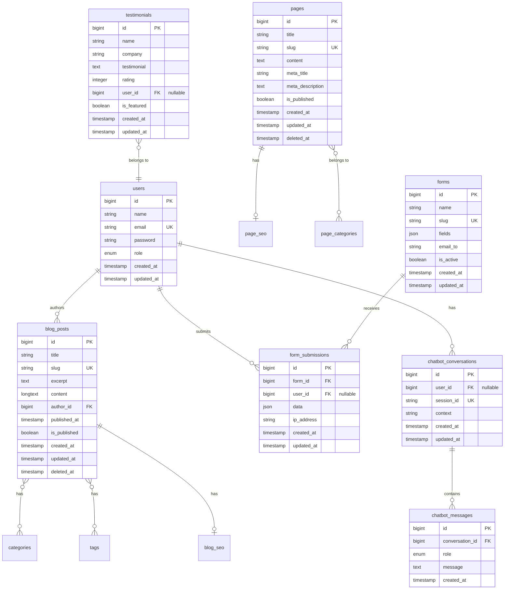

# Database Architecture

## 1. Overview

This document describes the MySQL database architecture for The Strengths Toolbox website. The database design supports content management, blog functionality, form submissions, user management, SEO metadata, and AI chatbot conversations.

### 1.1 Purpose and Scope

This document covers:
- Database schema design
- Entity Relationship Diagrams (ERD)
- Table structures and relationships
- Indexing strategy
- Data integrity constraints
- Migration strategy

### 1.2 Reference Documents

- System Architecture Overview: `01-system-architecture-overview.md`
- Laravel MVC Architecture: `02-laravel-mvc-architecture.md`

## 2. Database Overview

### 2.1 Database Specifications

- **Database System:** MySQL 8.0+
- **Character Set:** utf8mb4
- **Collation:** utf8mb4_unicode_ci
- **Storage Engine:** InnoDB
- **Connection:** Via Laravel Eloquent ORM

### 2.2 Database Naming Conventions

- **Tables:** Plural, snake_case (e.g., `blog_posts`, `form_submissions`)
- **Columns:** snake_case (e.g., `created_at`, `is_published`)
- **Foreign Keys:** `{table}_id` (e.g., `user_id`, `page_id`)
- **Indexes:** `idx_{table}_{column}` or `idx_{table}_{columns}`

## 3. Entity Relationship Diagram



## 4. Core Tables

### 4.1 Users Table

Stores user accounts for admin panel and optional user accounts.

```sql
CREATE TABLE `users` (
    `id` BIGINT UNSIGNED NOT NULL AUTO_INCREMENT,
    `name` VARCHAR(255) NOT NULL,
    `email` VARCHAR(255) NOT NULL,
    `email_verified_at` TIMESTAMP NULL,
    `password` VARCHAR(255) NOT NULL,
    `role` ENUM('admin', 'editor', 'author') DEFAULT 'author',
    `remember_token` VARCHAR(100) NULL,
    `created_at` TIMESTAMP NULL,
    `updated_at` TIMESTAMP NULL,
    PRIMARY KEY (`id`),
    UNIQUE KEY `users_email_unique` (`email`),
    KEY `idx_users_role` (`role`)
) ENGINE=InnoDB DEFAULT CHARSET=utf8mb4 COLLATE=utf8mb4_unicode_ci;
```

**Columns:**
- `id`: Primary key
- `name`: User's full name
- `email`: Unique email address
- `email_verified_at`: Email verification timestamp
- `password`: Hashed password (bcrypt)
- `role`: User role (admin, editor, author)
- `remember_token`: For "remember me" functionality

**Indexes:**
- Primary key on `id`
- Unique index on `email`
- Index on `role` for role-based queries

### 4.2 Pages Table

Stores static pages and dynamic content pages.

```sql
CREATE TABLE `pages` (
    `id` BIGINT UNSIGNED NOT NULL AUTO_INCREMENT,
    `title` VARCHAR(255) NOT NULL,
    `slug` VARCHAR(255) NOT NULL,
    `content` LONGTEXT NOT NULL,
    `excerpt` TEXT NULL,
    `meta_title` VARCHAR(255) NULL,
    `meta_description` TEXT NULL,
    `meta_keywords` VARCHAR(255) NULL,
    `is_published` BOOLEAN DEFAULT FALSE,
    `published_at` TIMESTAMP NULL,
    `created_at` TIMESTAMP NULL,
    `updated_at` TIMESTAMP NULL,
    `deleted_at` TIMESTAMP NULL,
    PRIMARY KEY (`id`),
    UNIQUE KEY `pages_slug_unique` (`slug`),
    KEY `idx_pages_published` (`is_published`, `published_at`),
    KEY `idx_pages_deleted` (`deleted_at`)
) ENGINE=InnoDB DEFAULT CHARSET=utf8mb4 COLLATE=utf8mb4_unicode_ci;
```

**Columns:**
- `id`: Primary key
- `title`: Page title
- `slug`: URL-friendly identifier (unique)
- `content`: Page content (HTML)
- `excerpt`: Short description
- `meta_title`: SEO title tag
- `meta_description`: SEO meta description
- `meta_keywords`: SEO keywords (optional)
- `is_published`: Publication status
- `published_at`: Publication timestamp
- `deleted_at`: Soft delete timestamp

**Indexes:**
- Primary key on `id`
- Unique index on `slug`
- Composite index on `is_published` and `published_at` for published pages query
- Index on `deleted_at` for soft delete queries

### 4.3 Page SEO Table

Stores additional SEO metadata for pages.

```sql
CREATE TABLE `page_seo` (
    `id` BIGINT UNSIGNED NOT NULL AUTO_INCREMENT,
    `page_id` BIGINT UNSIGNED NOT NULL,
    `og_title` VARCHAR(255) NULL,
    `og_description` TEXT NULL,
    `og_image` VARCHAR(255) NULL,
    `twitter_card` VARCHAR(50) DEFAULT 'summary',
    `canonical_url` VARCHAR(255) NULL,
    `schema_markup` JSON NULL,
    `created_at` TIMESTAMP NULL,
    `updated_at` TIMESTAMP NULL,
    PRIMARY KEY (`id`),
    UNIQUE KEY `page_seo_page_id_unique` (`page_id`),
    CONSTRAINT `page_seo_page_id_foreign` 
        FOREIGN KEY (`page_id`) REFERENCES `pages` (`id`) ON DELETE CASCADE
) ENGINE=InnoDB DEFAULT CHARSET=utf8mb4 COLLATE=utf8mb4_unicode_ci;
```

**Columns:**
- `id`: Primary key
- `page_id`: Foreign key to pages table
- `og_title`: Open Graph title
- `og_description`: Open Graph description
- `og_image`: Open Graph image URL
- `twitter_card`: Twitter card type
- `canonical_url`: Canonical URL
- `schema_markup`: JSON-LD schema data

### 4.4 Blog Posts Table

Stores blog posts and articles.

```sql
CREATE TABLE `blog_posts` (
    `id` BIGINT UNSIGNED NOT NULL AUTO_INCREMENT,
    `title` VARCHAR(255) NOT NULL,
    `slug` VARCHAR(255) NOT NULL,
    `excerpt` TEXT NULL,
    `content` LONGTEXT NOT NULL,
    `featured_image` VARCHAR(255) NULL,
    `author_id` BIGINT UNSIGNED NOT NULL,
    `published_at` TIMESTAMP NULL,
    `is_published` BOOLEAN DEFAULT FALSE,
    `views_count` INT UNSIGNED DEFAULT 0,
    `created_at` TIMESTAMP NULL,
    `updated_at` TIMESTAMP NULL,
    `deleted_at` TIMESTAMP NULL,
    PRIMARY KEY (`id`),
    UNIQUE KEY `blog_posts_slug_unique` (`slug`),
    KEY `idx_blog_posts_author` (`author_id`),
    KEY `idx_blog_posts_published` (`is_published`, `published_at`),
    KEY `idx_blog_posts_deleted` (`deleted_at`),
    CONSTRAINT `blog_posts_author_id_foreign` 
        FOREIGN KEY (`author_id`) REFERENCES `users` (`id`) ON DELETE RESTRICT
) ENGINE=InnoDB DEFAULT CHARSET=utf8mb4 COLLATE=utf8mb4_unicode_ci;
```

**Columns:**
- `id`: Primary key
- `title`: Blog post title
- `slug`: URL-friendly identifier (unique)
- `excerpt`: Post excerpt/summary
- `content`: Full post content (HTML)
- `featured_image`: Featured image URL
- `author_id`: Foreign key to users table
- `published_at`: Publication timestamp
- `is_published`: Publication status
- `views_count`: View counter
- `deleted_at`: Soft delete timestamp

### 4.5 Categories Table

Stores blog post categories.

```sql
CREATE TABLE `categories` (
    `id` BIGINT UNSIGNED NOT NULL AUTO_INCREMENT,
    `name` VARCHAR(255) NOT NULL,
    `slug` VARCHAR(255) NOT NULL,
    `description` TEXT NULL,
    `created_at` TIMESTAMP NULL,
    `updated_at` TIMESTAMP NULL,
    PRIMARY KEY (`id`),
    UNIQUE KEY `categories_slug_unique` (`slug`)
) ENGINE=InnoDB DEFAULT CHARSET=utf8mb4 COLLATE=utf8mb4_unicode_ci;
```

### 4.6 Tags Table

Stores blog post tags.

```sql
CREATE TABLE `tags` (
    `id` BIGINT UNSIGNED NOT NULL AUTO_INCREMENT,
    `name` VARCHAR(255) NOT NULL,
    `slug` VARCHAR(255) NOT NULL,
    `created_at` TIMESTAMP NULL,
    `updated_at` TIMESTAMP NULL,
    PRIMARY KEY (`id`),
    UNIQUE KEY `tags_slug_unique` (`slug`)
) ENGINE=InnoDB DEFAULT CHARSET=utf8mb4 COLLATE=utf8mb4_unicode_ci;
```

### 4.7 Blog Post Categories Pivot Table

Many-to-many relationship between blog posts and categories.

```sql
CREATE TABLE `blog_post_category` (
    `blog_post_id` BIGINT UNSIGNED NOT NULL,
    `category_id` BIGINT UNSIGNED NOT NULL,
    PRIMARY KEY (`blog_post_id`, `category_id`),
    KEY `idx_bpc_category` (`category_id`),
    CONSTRAINT `bpc_blog_post_id_foreign` 
        FOREIGN KEY (`blog_post_id`) REFERENCES `blog_posts` (`id`) ON DELETE CASCADE,
    CONSTRAINT `bpc_category_id_foreign` 
        FOREIGN KEY (`category_id`) REFERENCES `categories` (`id`) ON DELETE CASCADE
) ENGINE=InnoDB DEFAULT CHARSET=utf8mb4 COLLATE=utf8mb4_unicode_ci;
```

### 4.8 Blog Post Tags Pivot Table

Many-to-many relationship between blog posts and tags.

```sql
CREATE TABLE `blog_post_tag` (
    `blog_post_id` BIGINT UNSIGNED NOT NULL,
    `tag_id` BIGINT UNSIGNED NOT NULL,
    PRIMARY KEY (`blog_post_id`, `tag_id`),
    KEY `idx_bpt_tag` (`tag_id`),
    CONSTRAINT `bpt_blog_post_id_foreign` 
        FOREIGN KEY (`blog_post_id`) REFERENCES `blog_posts` (`id`) ON DELETE CASCADE,
    CONSTRAINT `bpt_tag_id_foreign` 
        FOREIGN KEY (`tag_id`) REFERENCES `tags` (`id`) ON DELETE CASCADE
) ENGINE=InnoDB DEFAULT CHARSET=utf8mb4 COLLATE=utf8mb4_unicode_ci;
```

### 4.9 Forms Table

Stores form definitions.

```sql
CREATE TABLE `forms` (
    `id` BIGINT UNSIGNED NOT NULL AUTO_INCREMENT,
    `name` VARCHAR(255) NOT NULL,
    `slug` VARCHAR(255) NOT NULL,
    `fields` JSON NOT NULL,
    `email_to` VARCHAR(255) NOT NULL,
    `success_message` TEXT NULL,
    `is_active` BOOLEAN DEFAULT TRUE,
    `created_at` TIMESTAMP NULL,
    `updated_at` TIMESTAMP NULL,
    PRIMARY KEY (`id`),
    UNIQUE KEY `forms_slug_unique` (`slug`)
) ENGINE=InnoDB DEFAULT CHARSET=utf8mb4 COLLATE=utf8mb4_unicode_ci;
```

**Columns:**
- `id`: Primary key
- `name`: Form name
- `slug`: Form identifier
- `fields`: JSON array of form field definitions
- `email_to`: Email address to send submissions
- `success_message`: Success message to display
- `is_active`: Whether form is active

### 4.10 Form Submissions Table

Stores form submission data.

```sql
CREATE TABLE `form_submissions` (
    `id` BIGINT UNSIGNED NOT NULL AUTO_INCREMENT,
    `form_id` BIGINT UNSIGNED NOT NULL,
    `user_id` BIGINT UNSIGNED NULL,
    `data` JSON NOT NULL,
    `ip_address` VARCHAR(45) NULL,
    `user_agent` TEXT NULL,
    `is_read` BOOLEAN DEFAULT FALSE,
    `created_at` TIMESTAMP NULL,
    `updated_at` TIMESTAMP NULL,
    PRIMARY KEY (`id`),
    KEY `idx_form_submissions_form` (`form_id`),
    KEY `idx_form_submissions_user` (`user_id`),
    KEY `idx_form_submissions_created` (`created_at`),
    CONSTRAINT `form_submissions_form_id_foreign` 
        FOREIGN KEY (`form_id`) REFERENCES `forms` (`id`) ON DELETE CASCADE,
    CONSTRAINT `form_submissions_user_id_foreign` 
        FOREIGN KEY (`user_id`) REFERENCES `users` (`id`) ON DELETE SET NULL
) ENGINE=InnoDB DEFAULT CHARSET=utf8mb4 COLLATE=utf8mb4_unicode_ci;
```

**Columns:**
- `id`: Primary key
- `form_id`: Foreign key to forms table
- `user_id`: Foreign key to users (nullable for anonymous submissions)
- `data`: JSON object containing form field values
- `ip_address`: Submitter's IP address
- `user_agent`: Submitter's user agent
- `is_read`: Whether submission has been read by admin

### 4.11 Chatbot Conversations Table

Stores chatbot conversation sessions.

```sql
CREATE TABLE `chatbot_conversations` (
    `id` BIGINT UNSIGNED NOT NULL AUTO_INCREMENT,
    `user_id` BIGINT UNSIGNED NULL,
    `session_id` VARCHAR(255) NOT NULL,
    `context` TEXT NULL,
    `created_at` TIMESTAMP NULL,
    `updated_at` TIMESTAMP NULL,
    PRIMARY KEY (`id`),
    UNIQUE KEY `chatbot_conversations_session_unique` (`session_id`),
    KEY `idx_chatbot_conversations_user` (`user_id`),
    CONSTRAINT `chatbot_conversations_user_id_foreign` 
        FOREIGN KEY (`user_id`) REFERENCES `users` (`id`) ON DELETE SET NULL
) ENGINE=InnoDB DEFAULT CHARSET=utf8mb4 COLLATE=utf8mb4_unicode_ci;
```

**Columns:**
- `id`: Primary key
- `user_id`: Foreign key to users (nullable for anonymous users)
- `session_id`: Unique session identifier
- `context`: Conversation context data (JSON)

### 4.12 Chatbot Messages Table

Stores individual messages in chatbot conversations.

```sql
CREATE TABLE `chatbot_messages` (
    `id` BIGINT UNSIGNED NOT NULL AUTO_INCREMENT,
    `conversation_id` BIGINT UNSIGNED NOT NULL,
    `role` ENUM('user', 'assistant', 'system') NOT NULL,
    `message` TEXT NOT NULL,
    `tokens_used` INT UNSIGNED NULL,
    `created_at` TIMESTAMP NULL,
    PRIMARY KEY (`id`),
    KEY `idx_chatbot_messages_conversation` (`conversation_id`),
    KEY `idx_chatbot_messages_created` (`created_at`),
    CONSTRAINT `chatbot_messages_conversation_id_foreign` 
        FOREIGN KEY (`conversation_id`) REFERENCES `chatbot_conversations` (`id`) ON DELETE CASCADE
) ENGINE=InnoDB DEFAULT CHARSET=utf8mb4 COLLATE=utf8mb4_unicode_ci;
```

**Columns:**
- `id`: Primary key
- `conversation_id`: Foreign key to chatbot_conversations
- `role`: Message role (user, assistant, system)
- `message`: Message content
- `tokens_used`: OpenAI tokens used (for cost tracking)

### 4.13 Testimonials Table

Stores client testimonials.

```sql
CREATE TABLE `testimonials` (
    `id` BIGINT UNSIGNED NOT NULL AUTO_INCREMENT,
    `name` VARCHAR(255) NOT NULL,
    `company` VARCHAR(255) NULL,
    `testimonial` TEXT NOT NULL,
    `rating` TINYINT UNSIGNED NULL,
    `user_id` BIGINT UNSIGNED NULL,
    `is_featured` BOOLEAN DEFAULT FALSE,
    `display_order` INT UNSIGNED DEFAULT 0,
    `created_at` TIMESTAMP NULL,
    `updated_at` TIMESTAMP NULL,
    PRIMARY KEY (`id`),
    KEY `idx_testimonials_featured` (`is_featured`, `display_order`),
    KEY `idx_testimonials_user` (`user_id`),
    CONSTRAINT `testimonials_user_id_foreign` 
        FOREIGN KEY (`user_id`) REFERENCES `users` (`id`) ON DELETE SET NULL
) ENGINE=InnoDB DEFAULT CHARSET=utf8mb4 COLLATE=utf8mb4_unicode_ci;
```

**Columns:**
- `id`: Primary key
- `name`: Testimonial author name
- `company`: Company name (optional)
- `testimonial`: Testimonial text
- `rating`: Rating (1-5, optional)
- `user_id`: Foreign key to users (if testimonial is from registered user)
- `is_featured`: Whether to feature on homepage
- `display_order`: Order for display sorting

## 5. Indexing Strategy

### 5.1 Primary Indexes

All tables have primary keys on `id` column for fast lookups.

### 5.2 Foreign Key Indexes

All foreign key columns are indexed for efficient joins:
- `blog_posts.author_id`
- `form_submissions.form_id`
- `form_submissions.user_id`
- `chatbot_conversations.user_id`
- `chatbot_messages.conversation_id`

### 5.3 Query Optimization Indexes

Indexes for common query patterns:

**Pages:**
- `idx_pages_published`: For listing published pages
- `idx_pages_deleted`: For soft delete queries

**Blog Posts:**
- `idx_blog_posts_published`: For listing published posts
- `idx_blog_posts_author`: For author-specific queries
- `idx_blog_posts_deleted`: For soft delete queries

**Form Submissions:**
- `idx_form_submissions_created`: For date-based queries
- `idx_form_submissions_form`: For form-specific queries

**Chatbot:**
- `idx_chatbot_messages_created`: For chronological message retrieval

**Testimonials:**
- `idx_testimonials_featured`: For featured testimonials display

### 5.4 Unique Indexes

- `users.email`: Ensure unique email addresses
- `pages.slug`: Ensure unique page URLs
- `blog_posts.slug`: Ensure unique blog post URLs
- `forms.slug`: Ensure unique form identifiers
- `chatbot_conversations.session_id`: Ensure unique sessions

## 6. Data Integrity Constraints

### 6.1 Foreign Key Constraints

All foreign keys have appropriate constraints:
- **ON DELETE CASCADE**: For dependent data (e.g., messages when conversation deleted)
- **ON DELETE RESTRICT**: For critical relationships (e.g., blog posts when author deleted)
- **ON DELETE SET NULL**: For optional relationships (e.g., submissions when user deleted)

### 6.2 Check Constraints

Consider adding check constraints for:
- `testimonials.rating`: Must be between 1 and 5
- `users.role`: Must be valid enum value
- `blog_posts.views_count`: Must be >= 0

### 6.3 Default Values

- Boolean fields default to `FALSE` or appropriate value
- Timestamps default to `NULL` (Laravel handles these)
- Counters default to `0`

## 7. Migration Strategy

### 7.1 Laravel Migrations

All database changes will be managed through Laravel migrations:

```php
<?php

use Illuminate\Database\Migrations\Migration;
use Illuminate\Database\Schema\Blueprint;
use Illuminate\Support\Facades\Schema;

return new class extends Migration
{
    public function up()
    {
        Schema::create('pages', function (Blueprint $table) {
            $table->id();
            $table->string('title');
            $table->string('slug')->unique();
            $table->longText('content');
            $table->text('excerpt')->nullable();
            $table->string('meta_title')->nullable();
            $table->text('meta_description')->nullable();
            $table->boolean('is_published')->default(false);
            $table->timestamp('published_at')->nullable();
            $table->timestamps();
            $table->softDeletes();
            
            $table->index(['is_published', 'published_at']);
        });
    }

    public function down()
    {
        Schema::dropIfExists('pages');
    }
};
```

### 7.2 Migration Order

Migrations should be created in dependency order:
1. `users` table (no dependencies)
2. `pages` table (no dependencies)
3. `page_seo` table (depends on pages)
4. `blog_posts` table (depends on users)
5. `categories` and `tags` tables (no dependencies)
6. Pivot tables (depend on blog_posts, categories, tags)
7. `forms` table (no dependencies)
8. `form_submissions` table (depends on forms, users)
9. `chatbot_conversations` table (depends on users)
10. `chatbot_messages` table (depends on conversations)
11. `testimonials` table (depends on users)

## 8. Data Relationships Summary

### 8.1 One-to-One
- `pages` → `page_seo` (one page has one SEO record)

### 8.2 One-to-Many
- `users` → `blog_posts` (one user authors many posts)
- `users` → `form_submissions` (one user has many submissions)
- `users` → `chatbot_conversations` (one user has many conversations)
- `forms` → `form_submissions` (one form receives many submissions)
- `chatbot_conversations` → `chatbot_messages` (one conversation has many messages)

### 8.3 Many-to-Many
- `blog_posts` ↔ `categories` (posts belong to many categories)
- `blog_posts` ↔ `tags` (posts have many tags)

## 9. Performance Considerations

### 9.1 Query Optimization
- Use eager loading to prevent N+1 queries
- Index frequently queried columns
- Use composite indexes for multi-column queries
- Consider query caching for expensive queries

### 9.2 Storage Optimization
- Use appropriate data types (avoid over-sizing)
- Consider TEXT vs VARCHAR for content fields
- Use JSON for flexible schema (forms, chatbot context)
- Implement soft deletes instead of hard deletes where appropriate

### 9.3 Scalability
- Design for horizontal scaling if needed
- Consider partitioning for large tables (future)
- Archive old data (form submissions, chatbot messages)

## 10. Backup Strategy

### 10.1 Database Backups
- Daily automated backups via cPanel
- Weekly full database exports
- Backup retention: 30 days

### 10.2 Backup Contents
- All table structures
- All data
- Foreign key relationships
- Indexes

## 11. Security Considerations

### 11.1 Data Protection
- Passwords stored as bcrypt hashes
- Sensitive data (IP addresses) stored securely
- SQL injection prevention via Eloquent ORM
- Input validation at application level

### 11.2 Access Control
- Database user with minimal required privileges
- Separate database user for application
- No direct database access from web server

## 12. Dependencies

### 12.1 Laravel Components
- `Illuminate/Database` - Database abstraction
- `Illuminate/Database/Eloquent` - ORM
- `Illuminate/Database/Migrations` - Migration management

### 12.2 MySQL Features Used
- Foreign key constraints
- Indexes (primary, unique, composite)
- JSON data type
- ENUM data type
- TIMESTAMP data type
- Soft deletes (via Laravel)

---

**Document Version:** 1.0  
**Last Updated:** 2025  
**Next Review:** Upon schema changes