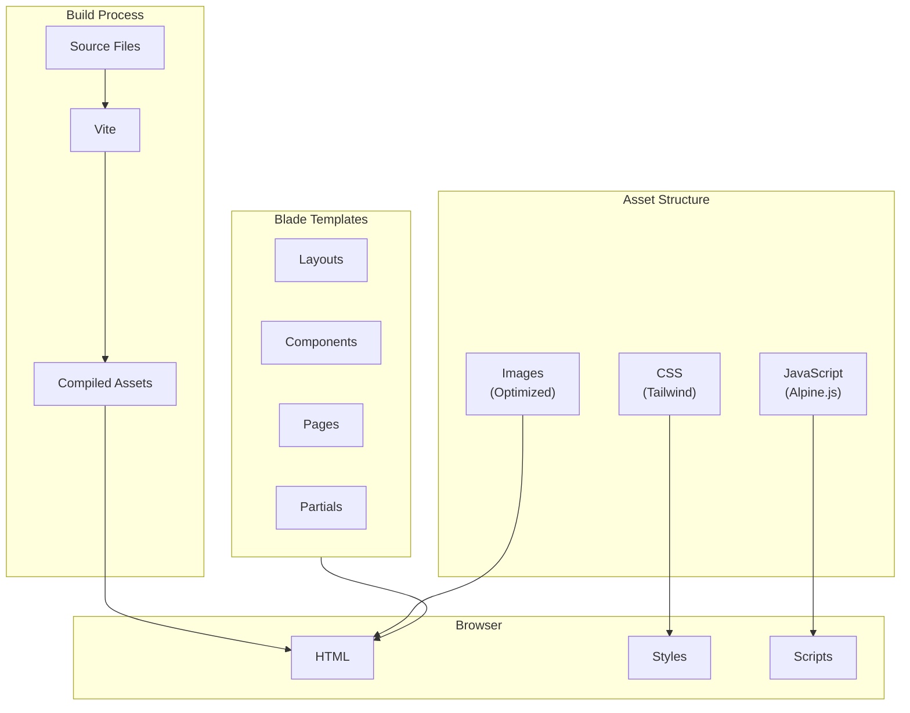

# Frontend Architecture

## 1. Overview

This document describes the frontend architecture for The Strengths Toolbox website, focusing on Tailwind CSS implementation, responsive design, mobile-first approach, and modern JavaScript practices.

### 1.1 Purpose and Scope

This document covers:
- Tailwind CSS implementation and configuration
- Component structure and organization
- Responsive design breakpoints and strategy
- Mobile-first approach
- Asset management with Vite
- JavaScript organization
- Blade template structure
- Reusable components
- Design system and theme

### 1.2 Reference Documents

- System Architecture Overview: `01-system-architecture-overview.md`
- Laravel MVC Architecture: `02-laravel-mvc-architecture.md`
- SEO Architecture: `05-seo-architecture.md`

## 2. Technology Stack

### 2.1 Core Technologies

- **CSS Framework:** Tailwind CSS 3.x
- **JavaScript:** Vanilla JavaScript with Alpine.js
- **Build Tool:** Vite
- **Templating:** Laravel Blade
- **Package Manager:** npm

### 2.2 Key Packages

```json
{
  "devDependencies": {
    "vite": "^4.0.0",
    "laravel-vite-plugin": "^0.7.0",
    "tailwindcss": "^3.3.0",
    "autoprefixer": "^10.4.0",
    "postcss": "^8.4.0",
    "alpinejs": "^3.12.0"
  }
}
```

## 3. Frontend Architecture Overview



## 4. Tailwind CSS Implementation

### 4.1 Configuration

Tailwind configuration file: `tailwind.config.js`

```javascript
/** @type {import('tailwindcss').Config} */
export default {
  content: [
    "./resources/**/*.blade.php",
    "./resources/**/*.js",
    "./resources/**/*.vue",
  ],
  theme: {
    extend: {
      colors: {
        primary: {
          50: '#f0f9ff',
          100: '#e0f2fe',
          200: '#bae6fd',
          300: '#7dd3fc',
          400: '#38bdf8',
          500: '#0ea5e9',
          600: '#0284c7',
          700: '#0369a1',
          800: '#075985',
          900: '#0c4a6e',
        },
        secondary: {
          50: '#faf5ff',
          100: '#f3e8ff',
          200: '#e9d5ff',
          300: '#d8b4fe',
          400: '#c084fc',
          500: '#a855f7',
          600: '#9333ea',
          700: '#7e22ce',
          800: '#6b21a8',
          900: '#581c87',
        },
      },
      fontFamily: {
        sans: ['Inter', 'system-ui', 'sans-serif'],
        serif: ['Merriweather', 'serif'],
      },
      spacing: {
        '18': '4.5rem',
        '88': '22rem',
      },
    },
  },
  plugins: [
    require('@tailwindcss/forms'),
    require('@tailwindcss/typography'),
  ],
}
```

### 4.2 Custom CSS

Main CSS file: `resources/css/app.css`

```css
@tailwind base;
@tailwind components;
@tailwind utilities;

@layer base {
  html {
    @apply scroll-smooth;
  }
  
  body {
    @apply font-sans antialiased;
  }
  
  h1, h2, h3, h4, h5, h6 {
    @apply font-bold;
  }
}

@layer components {
  .btn {
    @apply px-6 py-3 rounded-lg font-semibold transition-colors duration-200;
  }
  
  .btn-primary {
    @apply bg-primary-600 text-white hover:bg-primary-700 focus:ring-2 focus:ring-primary-500 focus:ring-offset-2;
  }
  
  .btn-secondary {
    @apply bg-secondary-600 text-white hover:bg-secondary-700 focus:ring-2 focus:ring-secondary-500 focus:ring-offset-2;
  }
  
  .btn-outline {
    @apply border-2 border-primary-600 text-primary-600 hover:bg-primary-600 hover:text-white;
  }
  
  .container-custom {
    @apply container mx-auto px-4 sm:px-6 lg:px-8;
  }
  
  .section-padding {
    @apply py-12 md:py-16 lg:py-20;
  }
}

@layer utilities {
  .text-balance {
    text-wrap: balance;
  }
}
```

### 4.3 Tailwind Plugins

**Forms Plugin:**
- Styled form inputs
- Consistent form styling
- Accessible form elements

**Typography Plugin:**
- Prose classes for content
- Blog post styling
- Rich text content formatting

## 5. Responsive Design Strategy

### 5.1 Mobile-First Approach

All styles start with mobile (base) and progressively enhance for larger screens:

```html
<!-- Mobile-first example -->
<div class="
  grid 
  grid-cols-1 
  gap-4 
  md:grid-cols-2 
  lg:grid-cols-3 
  xl:grid-cols-4
">
  <!-- Content -->
</div>
```

### 5.2 Breakpoint System

Tailwind's default breakpoints:

| Breakpoint | Min Width | Usage |
|------------|-----------|-------|
| `sm` | 640px | Small tablets |
| `md` | 768px | Tablets |
| `lg` | 1024px | Desktops |
| `xl` | 1280px | Large desktops |
| `2xl` | 1536px | Extra large screens |

### 5.3 Responsive Patterns

#### Container Pattern
```html
<div class="container mx-auto px-4 sm:px-6 lg:px-8">
  <!-- Content with responsive padding -->
</div>
```

#### Grid Pattern
```html
<div class="grid grid-cols-1 md:grid-cols-2 lg:grid-cols-3 gap-6">
  <!-- Responsive grid -->
</div>
```

#### Typography Pattern
```html
<h1 class="text-3xl md:text-4xl lg:text-5xl font-bold">
  Responsive Heading
</h1>
```

## 6. Component Structure

### 6.1 Blade Component Organization

```
resources/views/
├── components/
│   ├── header.blade.php
│   ├── footer.blade.php
│   ├── navigation.blade.php
│   ├── cta-button.blade.php
│   ├── testimonial-card.blade.php
│   ├── blog-card.blade.php
│   ├── form-input.blade.php
│   └── chatbot-widget.blade.php
├── layouts/
│   ├── app.blade.php
│   └── admin.blade.php
└── partials/
    ├── hero-section.blade.php
    ├── testimonials-section.blade.php
    └── newsletter-signup.blade.php
```

### 6.2 Reusable Components

#### CTA Button Component

`resources/views/components/cta-button.blade.php`:

```blade
@props([
    'text' => 'Click Here',
    'url' => '#',
    'style' => 'primary',
    'size' => 'md'
])

@php
    $classes = [
        'btn',
        'btn-' . $style,
        'text-' . $size === 'sm' ? 'sm' : ($size === 'lg' ? 'lg' : 'base')
    ];
@endphp

<a href="{{ $url }}" class="{{ implode(' ', $classes) }}">
    {{ $text }}
</a>
```

Usage:
```blade
<x-cta-button 
    text="Book Your Consultation" 
    url="/contact" 
    style="primary" 
    size="lg"
/>
```

#### Testimonial Card Component

`resources/views/components/testimonial-card.blade.php`:

```blade
@props(['testimonial'])

<article class="bg-white rounded-lg shadow-md p-6 hover:shadow-lg transition-shadow">
    <div class="flex items-center mb-4">
        @if($testimonial->rating)
            <div class="flex text-yellow-400">
                @for($i = 0; $i < $testimonial->rating; $i++)
                    <svg class="w-5 h-5" fill="currentColor" viewBox="0 0 20 20">
                        <path d="M9.049 2.927c.3-.921 1.603-.921 1.902 0l1.07 3.292a1 1 0 00.95.69h3.462c.969 0 1.371 1.24.588 1.81l-2.8 2.034a1 1 0 00-.364 1.118l1.07 3.292c.3.921-.755 1.688-1.54 1.118l-2.8-2.034a1 1 0 00-1.175 0l-2.8 2.034c-.784.57-1.838-.197-1.539-1.118l1.07-3.292a1 1 0 00-.364-1.118L2.98 8.72c-.783-.57-.38-1.81.588-1.81h3.461a1 1 0 00.951-.69l1.07-3.292z"/>
                    </svg>
                @endfor
            </div>
        @endif
    </div>
    
    <p class="text-gray-700 mb-4">{{ $testimonial->testimonial }}</p>
    
    <footer class="flex items-center">
        <div>
            <p class="font-semibold text-gray-900">{{ $testimonial->name }}</p>
            @if($testimonial->company)
                <p class="text-sm text-gray-600">{{ $testimonial->company }}</p>
            @endif
        </div>
    </footer>
</article>
```

### 6.3 Layout Components

#### Main Layout

`resources/views/layouts/app.blade.php`:

```blade
<!DOCTYPE html>
<html lang="{{ str_replace('_', '-', app()->getLocale()) }}">
<head>
    <meta charset="utf-8">
    <meta name="viewport" content="width=device-width, initial-scale=1">
    <meta name="csrf-token" content="{{ csrf_token() }}">
    
    <title>@yield('title', config('app.name'))</title>
    
    @include('partials.meta')
    
    @vite(['resources/css/app.css', 'resources/js/app.js'])
    
    @stack('styles')
</head>
<body class="bg-gray-50 text-gray-900">
    @include('components.header')
    
    <main>
        @yield('content')
    </main>
    
    @include('components.footer')
    
    @stack('scripts')
</body>
</html>
```

## 7. JavaScript Organization

### 7.1 Alpine.js Integration

Main JavaScript file: `resources/js/app.js`

```javascript
import './bootstrap';
import Alpine from 'alpinejs';

// Register Alpine.js
window.Alpine = Alpine;
Alpine.start();

// Mobile menu toggle
document.addEventListener('DOMContentLoaded', function() {
    const mobileMenuButton = document.getElementById('mobile-menu-button');
    const mobileMenu = document.getElementById('mobile-menu');
    
    if (mobileMenuButton && mobileMenu) {
        mobileMenuButton.addEventListener('click', function() {
            mobileMenu.classList.toggle('hidden');
        });
    }
});

// Smooth scroll for anchor links
document.querySelectorAll('a[href^="#"]').forEach(anchor => {
    anchor.addEventListener('click', function (e) {
        e.preventDefault();
        const target = document.querySelector(this.getAttribute('href'));
        if (target) {
            target.scrollIntoView({
                behavior: 'smooth',
                block: 'start'
            });
        }
    });
});
```

### 7.2 Alpine.js Components

Example: Mobile Navigation

```blade
<div x-data="{ open: false }" class="md:hidden">
    <button @click="open = !open" class="p-2">
        <svg x-show="!open" class="w-6 h-6" fill="none" stroke="currentColor" viewBox="0 0 24 24">
            <path stroke-linecap="round" stroke-linejoin="round" stroke-width="2" d="M4 6h16M4 12h16M4 18h16"/>
        </svg>
        <svg x-show="open" class="w-6 h-6" fill="none" stroke="currentColor" viewBox="0 0 24 24">
            <path stroke-linecap="round" stroke-linejoin="round" stroke-width="2" d="M6 18L18 6M6 6l12 12"/>
        </svg>
    </button>
    
    <div x-show="open" x-transition class="absolute top-full left-0 right-0 bg-white shadow-lg">
        <!-- Navigation items -->
    </div>
</div>
```

### 7.3 Form Handling

Example: Contact Form with Alpine.js

```blade
<form 
    x-data="{ 
        submitting: false,
        success: false,
        error: false 
    }"
    @submit.prevent="
        submitting = true;
        fetch('/contact', {
            method: 'POST',
            headers: {
                'Content-Type': 'application/json',
                'X-CSRF-TOKEN': document.querySelector('meta[name=csrf-token]').content
            },
            body: JSON.stringify({
                name: $refs.name.value,
                email: $refs.email.value,
                message: $refs.message.value
            })
        })
        .then(response => response.json())
        .then(data => {
            submitting = false;
            if (data.success) {
                success = true;
            } else {
                error = true;
            }
        })
        .catch(() => {
            submitting = false;
            error = true;
        })
    "
>
    <!-- Form fields -->
</form>
```

## 8. Asset Management with Vite

### 8.1 Vite Configuration

`vite.config.js`:

```javascript
import { defineConfig } from 'vite';
import laravel from 'laravel-vite-plugin';

export default defineConfig({
    plugins: [
        laravel({
            input: [
                'resources/css/app.css',
                'resources/js/app.js',
            ],
            refresh: true,
        }),
    ],
});
```

### 8.2 Asset Compilation

**Development:**
```bash
npm run dev
```

**Production:**
```bash
npm run build
```

### 8.3 Asset Loading in Blade

```blade
@vite(['resources/css/app.css', 'resources/js/app.js'])
```

## 9. Image Optimization

### 9.1 Image Formats

- **WebP:** Primary format for modern browsers
- **JPEG:** Fallback for older browsers
- **PNG:** For images requiring transparency
- **SVG:** For icons and simple graphics

### 9.2 Responsive Images

```blade
<picture>
    <source 
        srcset="{{ asset('images/hero.webp') }}" 
        type="image/webp"
    >
    <source 
        srcset="{{ asset('images/hero.jpg') }}" 
        type="image/jpeg"
    >
    
</picture>
```

### 9.3 Lazy Loading

```blade

```

## 10. Design System

### 10.1 Color Palette

**Primary Colors:**
- Used for CTAs, links, and primary actions
- Blue-based palette for trust and professionalism

**Secondary Colors:**
- Used for accents and secondary actions
- Purple-based palette for creativity

**Neutral Colors:**
- Grays for text, backgrounds, and borders
- White for clean backgrounds

### 10.2 Typography

**Font Families:**
- **Sans-serif:** Inter (headings, body text)
- **Serif:** Merriweather (optional for blog content)

**Font Sizes:**
- Responsive typography scale
- Mobile: 16px base
- Desktop: 18px base

**Line Heights:**
- Body: 1.6
- Headings: 1.2

### 10.3 Spacing System

Tailwind's default spacing scale:
- 0.25rem (4px) increments
- Consistent spacing throughout

### 10.4 Component Patterns

**Buttons:**
- Primary: Solid background, white text
- Secondary: Different color, white text
- Outline: Border, transparent background

**Cards:**
- White background
- Rounded corners
- Shadow for depth
- Hover effects

**Forms:**
- Consistent input styling
- Clear labels
- Error states
- Success feedback

## 11. Mobile Responsiveness

### 11.1 Navigation

**Desktop:**
- Horizontal navigation bar
- Dropdown menus for sub-items
- Full menu visible

**Mobile:**
- Hamburger menu
- Slide-out or dropdown menu
- Touch-friendly targets (min 44x44px)

### 11.2 Content Layout

**Desktop:**
- Multi-column layouts
- Sidebar content
- Larger images

**Mobile:**
- Single column
- Stacked content
- Full-width images

### 11.3 Touch Interactions

- Large touch targets
- Swipe gestures (if applicable)
- Touch-friendly forms
- No hover-dependent interactions

## 12. Performance Optimization

### 12.1 CSS Optimization

- Purge unused Tailwind classes in production
- Minify CSS
- Critical CSS inlining (if needed)

### 12.2 JavaScript Optimization

- Code splitting (if needed)
- Minify JavaScript
- Defer non-critical scripts
- Use Alpine.js for lightweight interactions

### 12.3 Image Optimization

- WebP format
- Lazy loading
- Responsive images
- Appropriate sizing

## 13. Accessibility

### 13.1 Semantic HTML

- Proper heading hierarchy
- Semantic elements (nav, article, section)
- ARIA labels where needed

### 13.2 Keyboard Navigation

- All interactive elements keyboard accessible
- Focus indicators visible
- Logical tab order

### 13.3 Screen Readers

- Alt text for images
- Descriptive link text
- Form labels associated with inputs
- ARIA attributes where appropriate

## 14. Browser Compatibility

### 14.1 Supported Browsers

- Chrome (latest 2 versions)
- Firefox (latest 2 versions)
- Safari (latest 2 versions)
- Edge (latest 2 versions)
- Mobile browsers (iOS Safari, Chrome Mobile)

### 14.2 Progressive Enhancement

- Core functionality works without JavaScript
- Enhanced experience with JavaScript
- Graceful degradation for older browsers

## 15. Best Practices

### 15.1 Code Organization
- Keep components small and focused
- Reuse components where possible
- Follow consistent naming conventions
- Document complex components

### 15.2 Performance
- Minimize CSS and JavaScript
- Optimize images
- Use lazy loading
- Minimize HTTP requests

### 15.3 Maintainability
- Use Tailwind utility classes consistently
- Create custom components for repeated patterns
- Keep JavaScript minimal and focused
- Use Alpine.js for simple interactions

### 15.4 Accessibility
- Test with keyboard navigation
- Test with screen readers
- Ensure color contrast meets WCAG standards
- Provide alternative text for images

## 16. Dependencies

### 16.1 Core Dependencies
- Tailwind CSS 3.x
- Alpine.js 3.x
- Vite 4.x
- Laravel Vite Plugin

### 16.2 Optional Dependencies
- @tailwindcss/forms
- @tailwindcss/typography

## 17. Configuration

### 17.1 Tailwind Config
- Custom colors
- Custom spacing
- Custom fonts
- Plugin configuration

### 17.2 Vite Config
- Input files
- Build options
- Development server settings

---

**Document Version:** 1.0  
**Last Updated:** 2025  
**Next Review:** Upon frontend changes