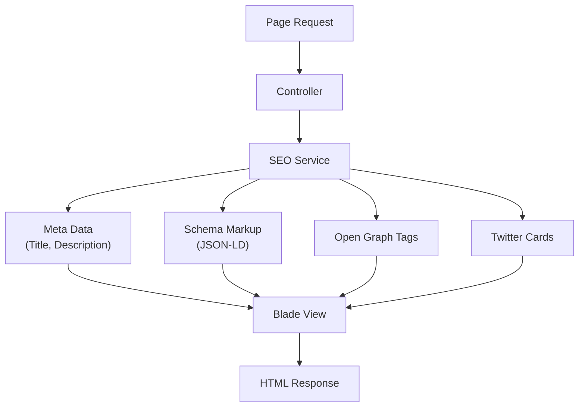

# SEO Architecture

## 1. Overview

This document describes the SEO (Search Engine Optimization) architecture for The Strengths Toolbox website. The architecture ensures proper meta tag management, schema markup, sitemap generation, and SEO-friendly URL structures.

### 1.1 Purpose and Scope

This document covers:
- SEO strategy and implementation
- Meta tags management system
- Schema markup structure
- Sitemap generation
- Robots.txt configuration
- URL structure and routing
- Canonical URLs
- Open Graph and Twitter Card tags
- SEO-friendly redirects

### 1.2 Reference Documents

- System Architecture Overview: `01-system-architecture-overview.md`
- Laravel MVC Architecture: `02-laravel-mvc-architecture.md`
- Database Architecture: `03-database-architecture.md`
- Frontend Architecture: `04-frontend-architecture.md`

## 2. SEO Strategy Overview

### 2.1 SEO Goals

- Improve organic search visibility
- Target relevant keywords (strengths-based development, CliftonStrengths, team building, sales training)
- Optimize for local search (South Africa)
- Improve Core Web Vitals scores
- Ensure mobile-friendly indexing

### 2.2 SEO Architecture Flow



## 3. Meta Tags Management

### 3.1 Meta Tags Structure

Each page should have:
- **Title Tag:** Unique, descriptive, 50-60 characters
- **Meta Description:** Compelling, 150-160 characters
- **Meta Keywords:** Relevant keywords (optional, less important)
- **Canonical URL:** Prevent duplicate content
- **Robots Meta:** Control indexing (if needed)

### 3.2 SEO Service Implementation

`app/Services/SEOService.php`:

```php
<?php

namespace App\Services;

use App\Models\Page;
use App\Models\BlogPost;

class SEOService
{
    public function getPageMeta($page)
    {
        return [
            'title' => $page->meta_title ?? $page->title,
            'description' => $page->meta_description ?? $this->generateDescription($page->content),
            'keywords' => $page->meta_keywords ?? $this->extractKeywords($page->content),
            'canonical' => url()->current(),
            'og_title' => $page->seo->og_title ?? $page->meta_title ?? $page->title,
            'og_description' => $page->seo->og_description ?? $page->meta_description,
            'og_image' => $page->seo->og_image ?? asset('images/og-default.jpg'),
            'og_url' => url()->current(),
            'twitter_card' => $page->seo->twitter_card ?? 'summary_large_image',
        ];
    }

    public function getBlogPostMeta($post)
    {
        return [
            'title' => $post->meta_title ?? $post->title . ' | The Strengths Toolbox',
            'description' => $post->meta_description ?? $post->excerpt,
            'keywords' => $this->extractKeywords($post->content),
            'canonical' => route('blog.show', $post->slug),
            'og_title' => $post->title,
            'og_description' => $post->excerpt,
            'og_image' => $post->featured_image ?? asset('images/og-default.jpg'),
            'og_url' => route('blog.show', $post->slug),
            'published_time' => $post->published_at?->toIso8601String(),
            'modified_time' => $post->updated_at->toIso8601String(),
            'author' => $post->author->name,
        ];
    }

    protected function generateDescription($content, $length = 160)
    {
        $text = strip_tags($content);
        $text = preg_replace('/\s+/', ' ', $text);
        return mb_substr($text, 0, $length) . '...';
    }

    protected function extractKeywords($content)
    {
        // Simple keyword extraction logic
        // Can be enhanced with NLP or predefined keyword lists
        return 'strengths-based development, team building, sales training';
    }
}
```

### 3.3 Meta Tags Partial

`resources/views/partials/meta.blade.php`:

```blade
@php
    $seoService = app(\App\Services\SEOService::class);
    $meta = isset($page) ? $seoService->getPageMeta($page) : 
            (isset($post) ? $seoService->getBlogPostMeta($post) : 
            $seoService->getDefaultMeta());
@endphp

{{-- Primary Meta Tags --}}
<meta charset="utf-8">
<meta name="viewport" content="width=device-width, initial-scale=1">
<meta name="description" content="{{ $meta['description'] }}">
@if(isset($meta['keywords']))
<meta name="keywords" content="{{ $meta['keywords'] }}">
@endif

{{-- Canonical URL --}}
<link rel="canonical" href="{{ $meta['canonical'] }}">

{{-- Open Graph / Facebook --}}
<meta property="og:type" content="{{ isset($post) ? 'article' : 'website' }}">
<meta property="og:url" content="{{ $meta['og_url'] }}">
<meta property="og:title" content="{{ $meta['og_title'] }}">
<meta property="og:description" content="{{ $meta['og_description'] }}">
<meta property="og:image" content="{{ $meta['og_image'] }}">

{{-- Twitter Card --}}
<meta name="twitter:card" content="{{ $meta['twitter_card'] }}">
<meta name="twitter:url" content="{{ $meta['og_url'] }}">
<meta name="twitter:title" content="{{ $meta['og_title'] }}">
<meta name="twitter:description" content="{{ $meta['og_description'] }}">
<meta name="twitter:image" content="{{ $meta['og_image'] }}">

{{-- Article Meta (for blog posts) --}}
@if(isset($post))
    <meta property="article:published_time" content="{{ $meta['published_time'] }}">
    <meta property="article:modified_time" content="{{ $meta['modified_time'] }}">
    <meta property="article:author" content="{{ $meta['author'] }}">
    @if($post->categories->count() > 0)
        @foreach($post->categories as $category)
            <meta property="article:tag" content="{{ $category->name }}">
        @endforeach
    @endif
@endif
```

## 4. Schema Markup

### 4.1 Schema Types

The website will use JSON-LD schema markup for:
- **Organization:** Company information
- **WebSite:** Site-wide search functionality
- **WebPage:** Individual pages
- **Article:** Blog posts
- **BreadcrumbList:** Navigation breadcrumbs
- **LocalBusiness:** Business location (if applicable)
- **Service:** Services offered
- **Review:** Testimonials

### 4.2 Schema Service

`app/Services/SchemaService.php`:

```php
<?php

namespace App\Services;

class SchemaService
{
    public function getOrganizationSchema()
    {
        return [
            '@context' => 'https://schema.org',
            '@type' => 'Organization',
            'name' => 'The Strengths Toolbox',
            'url' => config('app.url'),
            'logo' => asset('images/logo.png'),
            'description' => 'Build Strong Teams. Unlock Strong Profits.',
            'contactPoint' => [
                '@type' => 'ContactPoint',
                'telephone' => '+27-83-294-8033',
                'contactType' => 'Customer Service',
                'email' => 'welcome@eberhardniklaus.co.za',
            ],
            'sameAs' => [
                // Social media profiles if available
            ],
        ];
    }

    public function getWebSiteSchema()
    {
        return [
            '@context' => 'https://schema.org',
            '@type' => 'WebSite',
            'name' => 'The Strengths Toolbox',
            'url' => config('app.url'),
            'potentialAction' => [
                '@type' => 'SearchAction',
                'target' => [
                    '@type' => 'EntryPoint',
                    'urlTemplate' => route('search') . '?q={search_term_string}',
                ],
                'query-input' => 'required name=search_term_string',
            ],
        ];
    }

    public function getWebPageSchema($page)
    {
        return [
            '@context' => 'https://schema.org',
            '@type' => 'WebPage',
            'name' => $page->title,
            'description' => $page->meta_description ?? $this->generateDescription($page->content),
            'url' => url()->current(),
            'inLanguage' => 'en-ZA',
            'isPartOf' => [
                '@type' => 'WebSite',
                'name' => 'The Strengths Toolbox',
                'url' => config('app.url'),
            ],
        ];
    }

    public function getArticleSchema($post)
    {
        return [
            '@context' => 'https://schema.org',
            '@type' => 'Article',
            'headline' => $post->title,
            'description' => $post->excerpt,
            'image' => $post->featured_image ?? asset('images/og-default.jpg'),
            'datePublished' => $post->published_at?->toIso8601String(),
            'dateModified' => $post->updated_at->toIso8601String(),
            'author' => [
                '@type' => 'Person',
                'name' => $post->author->name,
            ],
            'publisher' => [
                '@type' => 'Organization',
                'name' => 'The Strengths Toolbox',
                'logo' => [
                    '@type' => 'ImageObject',
                    'url' => asset('images/logo.png'),
                ],
            ],
            'mainEntityOfPage' => [
                '@type' => 'WebPage',
                '@id' => route('blog.show', $post->slug),
            ],
        ];
    }

    public function getBreadcrumbSchema($items)
    {
        $breadcrumbList = [
            '@context' => 'https://schema.org',
            '@type' => 'BreadcrumbList',
            'itemListElement' => [],
        ];

        $position = 1;
        foreach ($items as $item) {
            $breadcrumbList['itemListElement'][] = [
                '@type' => 'ListItem',
                'position' => $position++,
                'name' => $item['name'],
                'item' => $item['url'],
            ];
        }

        return $breadcrumbList;
    }

    public function getServiceSchema($service)
    {
        return [
            '@context' => 'https://schema.org',
            '@type' => 'Service',
            'name' => $service->name,
            'description' => $service->description,
            'provider' => [
                '@type' => 'Organization',
                'name' => 'The Strengths Toolbox',
            ],
            'areaServed' => [
                '@type' => 'Country',
                'name' => 'South Africa',
            ],
        ];
    }
}
```

### 4.3 Schema in Views

`resources/views/layouts/app.blade.php`:

```blade
@php
    $schemaService = app(\App\Services\SchemaService::class);
@endphp

{{-- Organization Schema (on all pages) --}}
<script type="application/ld+json">
{!! json_encode($schemaService->getOrganizationSchema(), JSON_UNESCAPED_SLASHES | JSON_PRETTY_PRINT) !!}
</script>

{{-- Website Schema (on all pages) --}}
<script type="application/ld+json">
{!! json_encode($schemaService->getWebSiteSchema(), JSON_UNESCAPED_SLASHES | JSON_PRETTY_PRINT) !!}
</script>

{{-- Page-specific Schema --}}
@yield('schema')
```

Example in page view:

```blade
@section('schema')
<script type="application/ld+json">
{!! json_encode($schemaService->getWebPageSchema($page), JSON_UNESCAPED_SLASHES | JSON_PRETTY_PRINT) !!}
</script>
@endsection
```

## 5. URL Structure

### 5.1 SEO-Friendly URLs

**Pages:**
- `/about-us` (not `/page.php?id=1`)
- `/strengths-programme` (not `/programme?id=2`)
- `/contact` (not `/contact.php`)

**Blog:**
- `/blog` (blog listing)
- `/blog/strengths-based-leadership` (individual post)

**Categories:**
- `/blog/category/team-building` (category archive)

**Tags:**
- `/blog/tag/cliftonstrengths` (tag archive)

### 5.2 URL Routing

Routes defined in `routes/web.php`:

```php
// Clean, descriptive URLs
Route::get('/about-us', [PageController::class, 'show'])->name('about');
Route::get('/strengths-programme', [PageController::class, 'show'])->name('strengths-programme');
Route::get('/contact', [ContactController::class, 'show'])->name('contact');

// Blog with clean URLs
Route::get('/blog', [BlogController::class, 'index'])->name('blog.index');
Route::get('/blog/{slug}', [BlogController::class, 'show'])->name('blog.show');
Route::get('/blog/category/{slug}', [BlogController::class, 'category'])->name('blog.category');
Route::get('/blog/tag/{slug}', [BlogController::class, 'tag'])->name('blog.tag');
```

### 5.3 Slug Generation

Ensure slugs are:
- Lowercase
- Hyphenated (not underscores)
- Descriptive
- Unique
- URL-encoded safe

Example in model:

```php
use Illuminate\Support\Str;

public function setSlugAttribute($value)
{
    $this->attributes['slug'] = Str::slug($value);
}
```

## 6. Sitemap Generation

### 6.1 XML Sitemap

Sitemap includes:
- All published pages
- All published blog posts
- Static pages (home, about, contact)
- Categories and tags (optional)

### 6.2 Sitemap Controller

`app/Http/Controllers/SitemapController.php`:

```php
<?php

namespace App\Http\Controllers;

use App\Models\Page;
use App\Models\BlogPost;
use Illuminate\Http\Response;

class SitemapController extends Controller
{
    public function index()
    {
        $pages = Page::where('is_published', true)
            ->whereNotNull('published_at')
            ->get();
            
        $posts = BlogPost::where('is_published', true)
            ->whereNotNull('published_at')
            ->get();

        $content = view('sitemap.index', compact('pages', 'posts'));
        
        return response($content, 200)
            ->header('Content-Type', 'application/xml');
    }
}
```

### 6.3 Sitemap View

`resources/views/sitemap/index.blade.php`:

```xml
<?xml version="1.0" encoding="UTF-8"?>
<urlset xmlns="http://www.sitemaps.org/schemas/sitemap/0.9">
    {{-- Homepage --}}
    <url>
        <loc>{{ config('app.url') }}</loc>
        <lastmod>{{ now()->toAtomString() }}</lastmod>
        <changefreq>weekly</changefreq>
        <priority>1.0</priority>
    </url>
    
    {{-- Static Pages --}}
    @foreach($pages as $page)
    <url>
        <loc>{{ route('page.show', $page->slug) }}</loc>
        <lastmod>{{ $page->updated_at->toAtomString() }}</lastmod>
        <changefreq>monthly</changefreq>
        <priority>0.8</priority>
    </url>
    @endforeach
    
    {{-- Blog Posts --}}
    @foreach($posts as $post)
    <url>
        <loc>{{ route('blog.show', $post->slug) }}</loc>
        <lastmod>{{ $post->updated_at->toAtomString() }}</lastmod>
        <changefreq>monthly</changefreq>
        <priority>0.7</priority>
    </url>
    @endforeach
</urlset>
```

### 6.4 Sitemap Route

```php
Route::get('/sitemap.xml', [SitemapController::class, 'index'])->name('sitemap');
```

## 7. Robots.txt

### 7.1 Robots.txt Configuration

`public/robots.txt`:

```
User-agent: *
Allow: /

# Disallow admin area
Disallow: /admin/
Disallow: /api/

# Disallow search results
Disallow: /search?

# Sitemap location
Sitemap: https://www.thestrengthstoolbox.com/sitemap.xml
```

### 7.2 Dynamic Robots.txt (Optional)

For dynamic robots.txt based on environment:

```php
Route::get('/robots.txt', function() {
    $content = "User-agent: *\n";
    $content .= "Allow: /\n\n";
    $content .= "Disallow: /admin/\n";
    $content .= "Disallow: /api/\n\n";
    $content .= "Sitemap: " . config('app.url') . "/sitemap.xml";
    
    return response($content, 200)
        ->header('Content-Type', 'text/plain');
});
```

## 8. Redirects

### 8.1 301 Redirects

For URL changes and old URLs:

`routes/web.php`:

```php
// Old URL redirects
Route::get('/old-page', function() {
    return redirect('/new-page', 301);
});

// Redirect old blog URLs
Route::get('/blog/old-post-slug', function() {
    return redirect('/blog/new-post-slug', 301);
});
```

### 8.2 .htaccess Redirects

For cPanel/Apache, add to `public/.htaccess`:

```apache
# Redirect old URLs
Redirect 301 /old-page /new-page

# Force HTTPS
RewriteCond %{HTTPS} off
RewriteRule ^(.*)$ https://%{HTTP_HOST}%{REQUEST_URI} [L,R=301]

# Force www or non-www (choose one)
RewriteCond %{HTTP_HOST} !^www\. [NC]
RewriteRule ^(.*)$ https://www.%{HTTP_HOST}%{REQUEST_URI} [L,R=301]
```

## 9. Content Optimization

### 9.1 Heading Hierarchy

Proper H1-H6 structure:

```html
<h1>Main Page Title</h1>
  <h2>Section Title</h2>
    <h3>Subsection Title</h3>
      <h4>Sub-subsection Title</h4>
```

**Rules:**
- One H1 per page
- Logical hierarchy (don't skip levels)
- Descriptive, keyword-rich headings

### 9.2 Internal Linking

- Link to relevant pages and posts
- Use descriptive anchor text
- Include internal links in content
- Create topic clusters

### 9.3 Image Optimization

- Descriptive alt text
- Relevant file names
- Proper image sizing
- WebP format where possible

Example:

```html

```

## 10. Performance and Core Web Vitals

### 10.1 Core Web Vitals Impact

SEO factors:
- **LCP (Largest Contentful Paint):** < 2.5s
- **FID (First Input Delay):** < 100ms
- **CLS (Cumulative Layout Shift):** < 0.1

### 10.2 Mobile-First Indexing

- Responsive design
- Mobile-friendly navigation
- Fast mobile load times
- Touch-friendly elements

## 11. Local SEO (If Applicable)

### 11.1 Local Business Schema

If business has physical location:

```json
{
  "@context": "https://schema.org",
  "@type": "LocalBusiness",
  "name": "The Strengths Toolbox",
  "address": {
    "@type": "PostalAddress",
    "addressCountry": "ZA"
  },
  "telephone": "+27-83-294-8033",
  "url": "https://www.thestrengthstoolbox.com"
}
```

### 11.2 Google Business Profile

- Claim and verify Google Business Profile
- Keep information up to date
- Encourage reviews

## 12. Analytics and Tracking

### 12.1 Google Search Console

- Verify website ownership
- Submit sitemap
- Monitor search performance
- Fix indexing issues

### 12.2 Google Analytics

- Track organic traffic
- Monitor keyword performance
- Analyze user behavior
- Conversion tracking

## 13. Best Practices

### 13.1 Content
- Unique, valuable content
- Regular updates
- Keyword optimization (natural, not stuffed)
- Long-form content for blog posts (1000+ words)

### 13.2 Technical
- Fast page load times
- Mobile-responsive
- Secure (HTTPS)
- Accessible (WCAG compliance)

### 13.3 Links
- Quality internal linking
- Natural external links
- Avoid link farms
- Monitor broken links

## 14. Dependencies

### 14.1 Laravel Packages (Optional)
- `spatie/laravel-sitemap` - Sitemap generation
- `spatie/laravel-schema-org` - Schema markup helpers

### 14.2 Services
- Google Search Console
- Google Analytics
- Bing Webmaster Tools (optional)

## 15. Configuration

### 15.1 Environment Variables

```env
APP_URL=https://www.thestrengthstoolbox.com
APP_NAME="The Strengths Toolbox"

# Google Analytics (optional)
GOOGLE_ANALYTICS_ID=UA-XXXXXXXXX-X
```

### 15.2 SEO Configuration File

`config/seo.php`:

```php
<?php

return [
    'default_title' => 'The Strengths Toolbox - Build Strong Teams. Unlock Strong Profits.',
    'default_description' => 'Strengths-based development, team building, and sales training services.',
    'default_keywords' => 'strengths-based development, team building, sales training, CliftonStrengths',
    'og_default_image' => asset('images/og-default.jpg'),
    'twitter_handle' => '@strengthstoolbox', // if available
];
```

---

**Document Version:** 1.0  
**Last Updated:** 2025  
**Next Review:** Upon SEO strategy changes