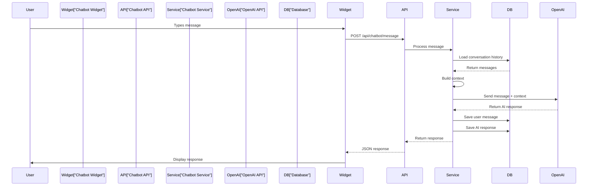
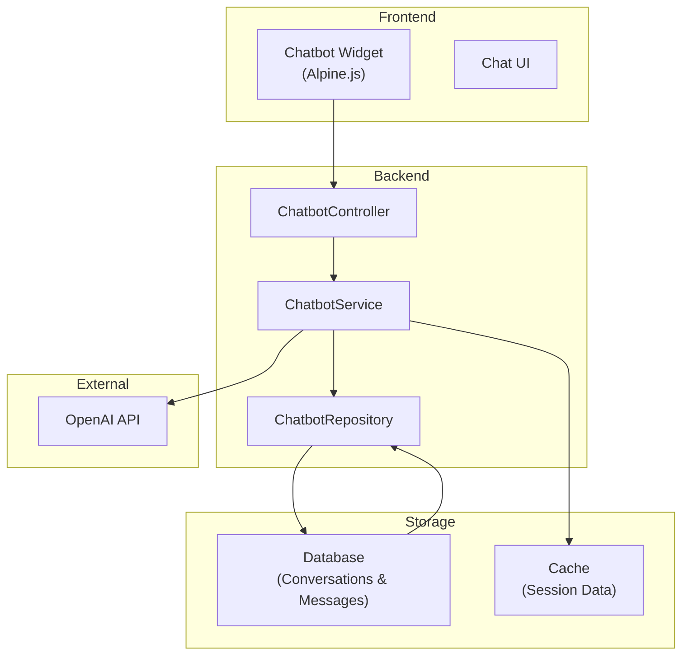

# AI Chatbot Integration Architecture

## 1. Overview

This document describes the AI chatbot integration architecture for The Strengths Toolbox website using OpenAI API. The chatbot provides intelligent customer support, answers questions about services, and helps guide visitors through the website.

### 1.1 Purpose and Scope

This document covers:
- OpenAI API integration
- Chatbot service architecture
- Conversation management
- Message storage and history
- Context management
- Rate limiting and error handling
- Frontend chatbot widget
- Admin chatbot management interface
- Training data and prompts configuration

### 1.2 Reference Documents

- System Architecture Overview: `01-system-architecture-overview.md`
- Laravel MVC Architecture: `02-laravel-mvc-architecture.md`
- Database Architecture: `03-database-architecture.md`
- Frontend Architecture: `04-frontend-architecture.md`

## 2. Architecture Overview

### 2.1 Chatbot Flow



### 2.2 Component Architecture



## 3. OpenAI API Integration

### 3.1 API Configuration

**Environment Variables:**

```env
OPENAI_API_KEY=sk-...
OPENAI_MODEL=gpt-4
OPENAI_MAX_TOKENS=500
OPENAI_TEMPERATURE=0.7
```

**Service Configuration:**

`config/services.php`:

```php
'openai' => [
    'api_key' => env('OPENAI_API_KEY'),
    'model' => env('OPENAI_MODEL', 'gpt-4'),
    'max_tokens' => env('OPENAI_MAX_TOKENS', 500),
    'temperature' => env('OPENAI_TEMPERATURE', 0.7),
    'timeout' => 30,
],
```

### 3.2 HTTP Client Setup

Using Guzzle HTTP client for API requests:

```php
use GuzzleHttp\Client;

$client = new Client([
    'base_uri' => 'https://api.openai.com/v1/',
    'headers' => [
        'Authorization' => 'Bearer ' . config('services.openai.api_key'),
        'Content-Type' => 'application/json',
    ],
    'timeout' => 30,
]);
```

## 4. Chatbot Service

### 4.1 Service Structure

`app/Services/ChatbotService.php`:

```php
<?php

namespace App\Services;

use App\Models\ChatbotConversation;
use App\Models\ChatbotMessage;
use App\Repositories\ChatbotRepository;
use GuzzleHttp\Client;
use Illuminate\Support\Facades\Cache;
use Illuminate\Support\Facades\Log;

class ChatbotService
{
    protected $client;
    protected $repository;
    protected $apiKey;
    protected $model;
    protected $maxTokens;
    protected $temperature;

    public function __construct(ChatbotRepository $repository)
    {
        $this->repository = $repository;
        $this->apiKey = config('services.openai.api_key');
        $this->model = config('services.openai.model');
        $this->maxTokens = config('services.openai.max_tokens');
        $this->temperature = config('services.openai.temperature');
        
        $this->client = new Client([
            'base_uri' => 'https://api.openai.com/v1/',
            'headers' => [
                'Authorization' => 'Bearer ' . $this->apiKey,
                'Content-Type' => 'application/json',
            ],
            'timeout' => 30,
        ]);
    }

    public function sendMessage($conversationId, $userMessage, $userId = null)
    {
        try {
            // Get or create conversation
            $conversation = $this->getOrCreateConversation($conversationId, $userId);
            
            // Save user message
            $userMessageRecord = $this->saveMessage(
                $conversation->id,
                'user',
                $userMessage
            );
            
            // Get conversation context
            $context = $this->getConversationContext($conversation);
            
            // Build messages array for OpenAI
            $messages = $this->buildMessagesArray($context, $userMessage);
            
            // Call OpenAI API
            $aiResponse = $this->callOpenAI($messages);
            
            // Save AI response
            $aiMessageRecord = $this->saveMessage(
                $conversation->id,
                'assistant',
                $aiResponse['content'],
                $aiResponse['tokens_used'] ?? null
            );
            
            return [
                'success' => true,
                'message' => $aiResponse['content'],
                'conversation_id' => $conversation->id,
            ];
            
        } catch (\Exception $e) {
            Log::error('Chatbot error: ' . $e->getMessage());
            
            return [
                'success' => false,
                'message' => 'Sorry, I encountered an error. Please try again later.',
                'error' => config('app.debug') ? $e->getMessage() : null,
            ];
        }
    }

    protected function getOrCreateConversation($sessionId, $userId = null)
    {
        $conversation = ChatbotConversation::where('session_id', $sessionId)->first();
        
        if (!$conversation) {
            $conversation = ChatbotConversation::create([
                'session_id' => $sessionId,
                'user_id' => $userId,
                'context' => json_encode($this->getDefaultContext()),
            ]);
        }
        
        return $conversation;
    }

    protected function getConversationContext($conversation)
    {
        // Get last 10 messages for context (to stay within token limits)
        $messages = ChatbotMessage::where('conversation_id', $conversation->id)
            ->orderBy('created_at', 'desc')
            ->limit(10)
            ->get()
            ->reverse();
        
        return $messages;
    }

    protected function buildMessagesArray($context, $userMessage)
    {
        $messages = [];
        
        // System message with instructions
        $messages[] = [
            'role' => 'system',
            'content' => $this->getSystemPrompt(),
        ];
        
        // Add conversation history
        foreach ($context as $message) {
            $messages[] = [
                'role' => $message->role,
                'content' => $message->message,
            ];
        }
        
        // Add current user message
        $messages[] = [
            'role' => 'user',
            'content' => $userMessage,
        ];
        
        return $messages;
    }

    protected function callOpenAI($messages)
    {
        $response = $this->client->post('chat/completions', [
            'json' => [
                'model' => $this->model,
                'messages' => $messages,
                'max_tokens' => $this->maxTokens,
                'temperature' => $this->temperature,
            ],
        ]);
        
        $data = json_decode($response->getBody()->getContents(), true);
        
        return [
            'content' => $data['choices'][0]['message']['content'],
            'tokens_used' => $data['usage']['total_tokens'] ?? null,
        ];
    }

    protected function saveMessage($conversationId, $role, $message, $tokensUsed = null)
    {
        return ChatbotMessage::create([
            'conversation_id' => $conversationId,
            'role' => $role,
            'message' => $message,
            'tokens_used' => $tokensUsed,
        ]);
    }

    protected function getSystemPrompt()
    {
        return "You are a helpful assistant for The Strengths Toolbox, a company that provides strengths-based development, team building, and sales training services. 

Your role is to:
- Answer questions about services, programs, and offerings
- Help visitors understand the benefits of strengths-based development
- Guide visitors to relevant pages or resources
- Provide information about booking consultations
- Be friendly, professional, and concise

Key information about The Strengths Toolbox:
- Services: Strengths-based development, team building, sales training, facilitation workshops
- Founder: Eberhard Niklaus
- Contact: +27 83 294 8033, welcome@eberhardniklaus.co.za
- Main offering: Build Strong Teams. Unlock Strong Profits.

If you don't know the answer to something, politely direct the user to contact the company directly or visit the contact page.";
    }

    protected function getDefaultContext()
    {
        return [
            'company' => 'The Strengths Toolbox',
            'services' => [
                'Strengths-based development',
                'Team building',
                'Sales training',
                'Facilitation workshops',
            ],
        ];
    }
}
```

## 5. API Controller

### 5.1 Chatbot API Controller

`app/Http/Controllers/Api/ChatbotController.php`:

```php
<?php

namespace App\Http\Controllers\Api;

use App\Http\Controllers\Controller;
use App\Services\ChatbotService;
use Illuminate\Http\Request;
use Illuminate\Support\Facades\Validator;

class ChatbotController extends Controller
{
    protected $chatbotService;

    public function __construct(ChatbotService $chatbotService)
    {
        $this->chatbotService = $chatbotService;
    }

    public function sendMessage(Request $request)
    {
        $validator = Validator::make($request->all(), [
            'message' => 'required|string|max:1000',
            'conversation_id' => 'nullable|string|max:255',
        ]);

        if ($validator->fails()) {
            return response()->json([
                'success' => false,
                'message' => 'Invalid request data.',
                'errors' => $validator->errors(),
            ], 422);
        }

        $conversationId = $request->input('conversation_id') 
            ?? $request->session()->getId();
        
        $userId = auth()->check() ? auth()->id() : null;

        $result = $this->chatbotService->sendMessage(
            $conversationId,
            $request->input('message'),
            $userId
        );

        return response()->json($result);
    }

    public function getConversationHistory($conversationId)
    {
        $conversation = \App\Models\ChatbotConversation::where('session_id', $conversationId)
            ->with('messages')
            ->first();

        if (!$conversation) {
            return response()->json([
                'success' => false,
                'message' => 'Conversation not found.',
            ], 404);
        }

        return response()->json([
            'success' => true,
            'conversation' => $conversation,
            'messages' => $conversation->messages,
        ]);
    }
}
```

### 5.2 API Routes

`routes/api.php`:

```php
<?php

use App\Http\Controllers\Api\ChatbotController;
use Illuminate\Support\Facades\Route;

Route::prefix('api/v1')->group(function () {
    Route::post('/chatbot/message', [ChatbotController::class, 'sendMessage'])
        ->middleware(['throttle:10,1'])
        ->name('api.chatbot.message');
    
    Route::get('/chatbot/conversation/{conversationId}', [ChatbotController::class, 'getConversationHistory'])
        ->middleware(['throttle:20,1'])
        ->name('api.chatbot.conversation');
});
```

## 6. Frontend Chatbot Widget

### 6.1 Widget Component

`resources/views/components/chatbot-widget.blade.php`:

```blade
<div 
    x-data="chatbotWidget()"
    class="fixed bottom-4 right-4 z-50"
    style="display: none;"
    x-show="isOpen"
>
    <div class="bg-white rounded-lg shadow-2xl w-96 h-[600px] flex flex-col">
        {{-- Header --}}
        <div class="bg-primary-600 text-white p-4 rounded-t-lg flex justify-between items-center">
            <div>
                <h3 class="font-semibold">Chat with us</h3>
                <p class="text-sm text-primary-100">We're here to help!</p>
            </div>
            <button @click="toggleChat" class="text-white hover:text-primary-200">
                <svg class="w-6 h-6" fill="none" stroke="currentColor" viewBox="0 0 24 24">
                    <path stroke-linecap="round" stroke-linejoin="round" stroke-width="2" d="M6 18L18 6M6 6l12 12"/>
                </svg>
            </button>
        </div>
        
        {{-- Messages --}}
        <div class="flex-1 overflow-y-auto p-4 space-y-4" x-ref="messagesContainer">
            <template x-for="message in messages" :key="message.id">
                <div 
                    :class="message.role === 'user' ? 'ml-auto' : 'mr-auto'"
                    class="max-w-[80%]"
                >
                    <div 
                        :class="message.role === 'user' 
                            ? 'bg-primary-600 text-white' 
                            : 'bg-gray-200 text-gray-800'"
                        class="rounded-lg p-3"
                    >
                        <p x-text="message.content"></p>
                    </div>
                    <span 
                        class="text-xs text-gray-500 mt-1 block"
                        x-text="formatTime(message.created_at)"
                    ></span>
                </div>
            </template>
        </div>
        
        {{-- Input --}}
        <div class="p-4 border-t">
            <form @submit.prevent="sendMessage" class="flex gap-2">
                <input 
                    type="text"
                    x-model="inputMessage"
                    @keydown.enter.prevent="sendMessage"
                    placeholder="Type your message..."
                    class="flex-1 border rounded-lg px-4 py-2 focus:outline-none focus:ring-2 focus:ring-primary-500"
                    :disabled="isLoading"
                >
                <button 
                    type="submit"
                    :disabled="isLoading || !inputMessage.trim()"
                    class="bg-primary-600 text-white px-4 py-2 rounded-lg hover:bg-primary-700 disabled:opacity-50"
                >
                    <span x-show="!isLoading">Send</span>
                    <span x-show="isLoading">...</span>
                </button>
            </form>
        </div>
    </div>
</div>

{{-- Toggle Button --}}
<button 
    @click="toggleChat"
    x-show="!isOpen"
    class="fixed bottom-4 right-4 bg-primary-600 text-white rounded-full p-4 shadow-lg hover:bg-primary-700 z-50"
>
    <svg class="w-6 h-6" fill="none" stroke="currentColor" viewBox="0 0 24 24">
        <path stroke-linecap="round" stroke-linejoin="round" stroke-width="2" d="M8 12h.01M12 12h.01M16 12h.01M21 12c0 4.418-4.03 8-9 8a9.863 9.863 0 01-4.255-.949L3 20l1.395-3.72C3.512 15.042 3 13.574 3 12c0-4.418 4.03-8 9-8s9 3.582 9 8z"/>
    </svg>
</button>

<script>
function chatbotWidget() {
    return {
        isOpen: false,
        messages: [],
        inputMessage: '',
        isLoading: false,
        conversationId: null,
        
        init() {
            // Generate or retrieve conversation ID
            this.conversationId = this.getConversationId();
            // Load conversation history if exists
            this.loadConversationHistory();
        },
        
        toggleChat() {
            this.isOpen = !this.isOpen;
            if (this.isOpen) {
                this.scrollToBottom();
            }
        },
        
        async sendMessage() {
            if (!this.inputMessage.trim() || this.isLoading) return;
            
            const userMessage = this.inputMessage.trim();
            this.inputMessage = '';
            
            // Add user message to UI
            this.messages.push({
                id: Date.now(),
                role: 'user',
                content: userMessage,
                created_at: new Date().toISOString(),
            });
            
            this.scrollToBottom();
            this.isLoading = true;
            
            try {
                const response = await fetch('/api/v1/chatbot/message', {
                    method: 'POST',
                    headers: {
                        'Content-Type': 'application/json',
                        'X-CSRF-TOKEN': document.querySelector('meta[name=csrf-token]').content,
                    },
                    body: JSON.stringify({
                        message: userMessage,
                        conversation_id: this.conversationId,
                    }),
                });
                
                const data = await response.json();
                
                if (data.success) {
                    this.messages.push({
                        id: Date.now() + 1,
                        role: 'assistant',
                        content: data.message,
                        created_at: new Date().toISOString(),
                    });
                    
                    if (data.conversation_id) {
                        this.conversationId = data.conversation_id;
                        this.saveConversationId(data.conversation_id);
                    }
                } else {
                    this.messages.push({
                        id: Date.now() + 1,
                        role: 'assistant',
                        content: data.message || 'Sorry, something went wrong.',
                        created_at: new Date().toISOString(),
                    });
                }
            } catch (error) {
                this.messages.push({
                    id: Date.now() + 1,
                    role: 'assistant',
                    content: 'Sorry, I encountered an error. Please try again.',
                    created_at: new Date().toISOString(),
                });
            } finally {
                this.isLoading = false;
                this.scrollToBottom();
            }
        },
        
        async loadConversationHistory() {
            if (!this.conversationId) return;
            
            try {
                const response = await fetch(`/api/v1/chatbot/conversation/${this.conversationId}`);
                const data = await response.json();
                
                if (data.success && data.messages) {
                    this.messages = data.messages.map(msg => ({
                        id: msg.id,
                        role: msg.role,
                        content: msg.message,
                        created_at: msg.created_at,
                    }));
                    this.scrollToBottom();
                }
            } catch (error) {
                console.error('Failed to load conversation history:', error);
            }
        },
        
        scrollToBottom() {
            this.$nextTick(() => {
                const container = this.$refs.messagesContainer;
                if (container) {
                    container.scrollTop = container.scrollHeight;
                }
            });
        },
        
        getConversationId() {
            return localStorage.getItem('chatbot_conversation_id') || this.generateConversationId();
        },
        
        saveConversationId(id) {
            localStorage.setItem('chatbot_conversation_id', id);
        },
        
        generateConversationId() {
            return 'conv_' + Date.now() + '_' + Math.random().toString(36).substr(2, 9);
        },
        
        formatTime(timestamp) {
            const date = new Date(timestamp);
            return date.toLocaleTimeString('en-US', { 
                hour: '2-digit', 
                minute: '2-digit' 
            });
        },
    };
}
</script>
```

### 6.2 Include Widget in Layout

`resources/views/layouts/app.blade.php`:

```blade
@include('components.chatbot-widget')
```

## 7. Rate Limiting

### 7.1 API Rate Limiting

Rate limiting middleware in `app/Http/Kernel.php`:

```php
'api' => [
    'throttle:api',
    \Illuminate\Routing\Middleware\SubstituteBindings::class,
],
```

Rate limits in `routes/api.php`:
- Chatbot messages: 10 requests per minute
- Conversation history: 20 requests per minute

### 7.2 Service-Level Rate Limiting

Additional rate limiting in ChatbotService:

```php
protected function checkRateLimit($sessionId)
{
    $key = 'chatbot_rate_limit:' . $sessionId;
    $count = Cache::get($key, 0);
    
    if ($count >= 10) {
        throw new \Exception('Rate limit exceeded. Please try again later.');
    }
    
    Cache::put($key, $count + 1, 60); // 1 minute
}
```

## 8. Error Handling

### 8.1 Error Scenarios

- OpenAI API timeout
- OpenAI API rate limit
- Invalid API key
- Network errors
- Invalid response format

### 8.2 Error Responses

```php
try {
    // API call
} catch (\GuzzleHttp\Exception\ClientException $e) {
    // Handle 4xx errors
    Log::error('OpenAI API client error: ' . $e->getMessage());
    return $this->getErrorResponse('Invalid request to AI service.');
} catch (\GuzzleHttp\Exception\ServerException $e) {
    // Handle 5xx errors
    Log::error('OpenAI API server error: ' . $e->getMessage());
    return $this->getErrorResponse('AI service is temporarily unavailable.');
} catch (\Exception $e) {
    // Handle other errors
    Log::error('Chatbot error: ' . $e->getMessage());
    return $this->getErrorResponse('An error occurred. Please try again.');
}
```

## 9. Admin Management Interface

### 9.1 Conversation Management

Admin can view:
- All conversations
- Conversation history
- Message counts
- Token usage statistics
- User feedback (if implemented)

### 9.2 Prompt Management

Admin can configure:
- System prompt
- Default context
- Response templates
- Fallback messages

## 10. Database Schema

See Database Architecture document for:
- `chatbot_conversations` table
- `chatbot_messages` table
- Relationships and indexes

## 11. Best Practices

### 11.1 Security
- Validate all user input
- Sanitize messages before sending to OpenAI
- Rate limit API endpoints
- Log errors without exposing sensitive data

### 11.2 Performance
- Cache conversation context
- Limit conversation history length
- Use appropriate token limits
- Monitor API response times

### 11.3 User Experience
- Provide loading indicators
- Handle errors gracefully
- Maintain conversation context
- Clear, concise responses

## 12. Dependencies

### 12.1 Required Packages
- `guzzlehttp/guzzle` - HTTP client for OpenAI API
- `laravel/framework` - Core framework

### 12.2 External Services
- OpenAI API account and API key

## 13. Configuration

### 13.1 Environment Variables

```env
OPENAI_API_KEY=sk-...
OPENAI_MODEL=gpt-4
OPENAI_MAX_TOKENS=500
OPENAI_TEMPERATURE=0.7
```

### 13.2 Service Configuration

See `config/services.php` section above.

---

**Document Version:** 1.0  
**Last Updated:** 2025  
**Next Review:** Upon chatbot feature changes