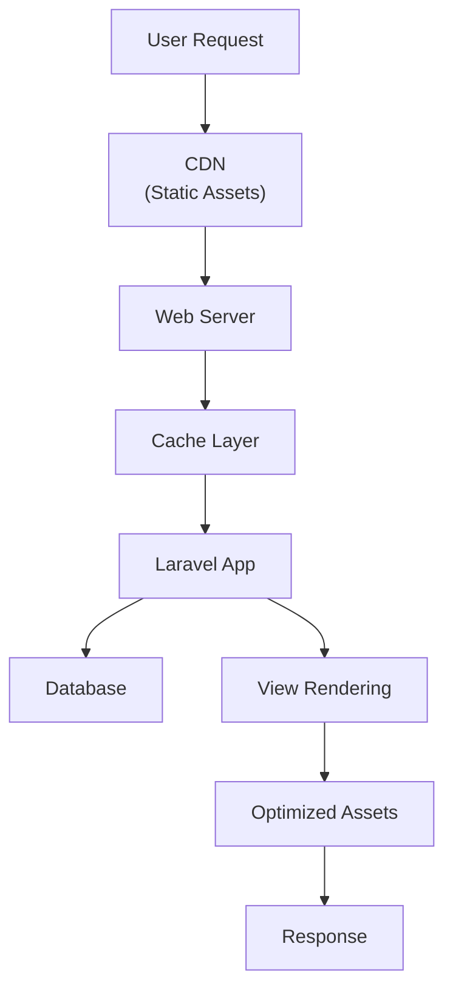
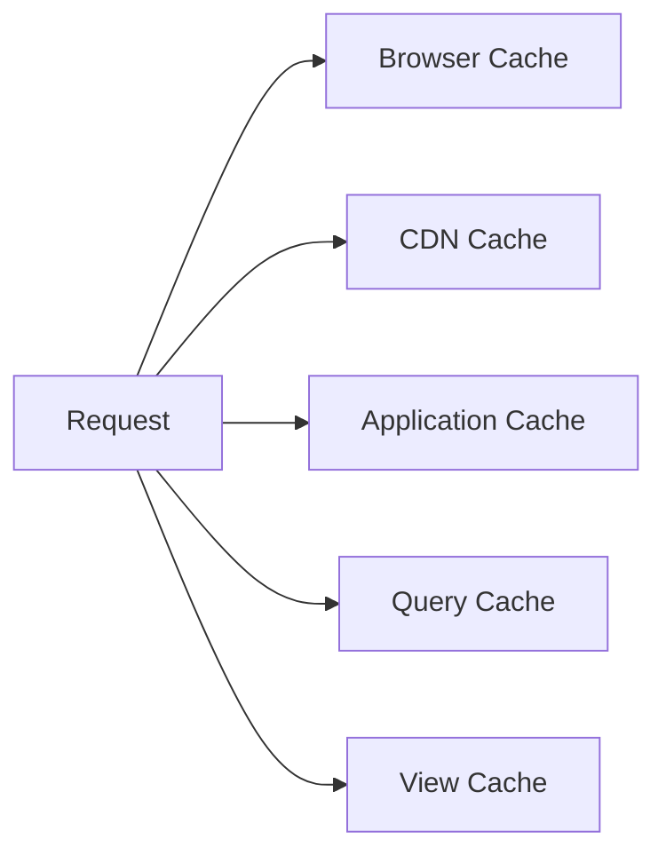

# Performance & Optimization Architecture

## 1. Overview

This document describes the performance optimization architecture for The Strengths Toolbox website. The architecture focuses on page speed optimization, caching strategies, asset optimization, and Core Web Vitals compliance.

### 1.1 Purpose and Scope

This document covers:
- Page speed optimization strategies
- Caching strategy (Laravel cache, file cache)
- Asset optimization (minification, compression)
- Image optimization (WebP, lazy loading)
- Database query optimization
- CDN integration
- Core Web Vitals optimization
- Lazy loading implementation
- Code splitting

### 1.2 Reference Documents

- System Architecture Overview: `01-system-architecture-overview.md`
- Laravel MVC Architecture: `02-laravel-mvc-architecture.md`
- Database Architecture: `03-database-architecture.md`
- Frontend Architecture: `04-frontend-architecture.md`

## 2. Performance Goals

### 2.1 Target Metrics

- **Page Load Time:** < 3 seconds
- **First Contentful Paint (FCP):** < 1.8 seconds
- **Largest Contentful Paint (LCP):** < 2.5 seconds
- **First Input Delay (FID):** < 100 milliseconds
- **Cumulative Layout Shift (CLS):** < 0.1
- **Time to Interactive (TTI):** < 3.8 seconds

### 2.2 Performance Architecture



## 3. Caching Strategy

### 3.1 Multi-Level Caching



### 3.2 Laravel Cache Configuration

`config/cache.php`:

```php
'default' => env('CACHE_DRIVER', 'file'),

'stores' => [
    'file' => [
        'driver' => 'file',
        'path' => storage_path('framework/cache/data'),
    ],
    
    'array' => [
        'driver' => 'array',
    ],
],
```

### 3.3 Cache Implementation

#### Page Caching

```php
use Illuminate\Support\Facades\Cache;

public function show($slug)
{
    $cacheKey = "page.{$slug}";
    
    $page = Cache::remember($cacheKey, 3600, function () use ($slug) {
        return Page::where('slug', $slug)
            ->where('is_published', true)
            ->with('seo')
            ->first();
    });
    
    if (!$page) {
        abort(404);
    }
    
    return view('pages.show', compact('page'));
}
```

#### Query Result Caching

```php
public function getFeaturedTestimonials()
{
    return Cache::remember('testimonials.featured', 7200, function () {
        return Testimonial::where('is_featured', true)
            ->orderBy('display_order')
            ->limit(6)
            ->get();
    });
}
```

#### View Caching

```php
use Illuminate\Support\Facades\View;

// Cache rendered view
$html = Cache::remember("view.page.{$page->id}", 3600, function () use ($page) {
    return View::make('pages.show', compact('page'))->render();
});

return response($html);
```

### 3.4 Cache Invalidation

```php
use Illuminate\Support\Facades\Cache;
use Illuminate\Support\Facades\Event;

// Invalidate cache when page is updated
Event::listen('page.updated', function ($page) {
    Cache::forget("page.{$page->slug}");
    Cache::forget("view.page.{$page->id}");
});

// In model observer
class PageObserver
{
    public function updated(Page $page)
    {
        Cache::forget("page.{$page->slug}");
    }
    
    public function deleted(Page $page)
    {
        Cache::forget("page.{$page->slug}");
    }
}
```

### 3.5 HTTP Caching Headers

```php
public function show($slug)
{
    $page = $this->getPage($slug);
    
    return response()
        ->view('pages.show', compact('page'))
        ->header('Cache-Control', 'public, max-age=3600')
        ->header('ETag', md5($page->updated_at));
}
```

## 4. Asset Optimization

### 4.1 Vite Build Configuration

`vite.config.js`:

```javascript
import { defineConfig } from 'vite';
import laravel from 'laravel-vite-plugin';

export default defineConfig({
    plugins: [
        laravel({
            input: [
                'resources/css/app.css',
                'resources/js/app.js',
            ],
            refresh: true,
        }),
    ],
    build: {
        cssCodeSplit: false,
        rollupOptions: {
            output: {
                manualChunks: undefined,
            },
        },
        minify: 'terser',
        terserOptions: {
            compress: {
                drop_console: true,
            },
        },
    },
});
```

### 4.2 CSS Optimization

**Tailwind CSS Purging:**

`tailwind.config.js`:

```javascript
module.exports = {
    content: [
        "./resources/**/*.blade.php",
        "./resources/**/*.js",
    ],
    // ... other config
}
```

**Production Build:**

```bash
npm run build
```

This will:
- Purge unused CSS
- Minify CSS
- Optimize for production

### 4.3 JavaScript Optimization

**Code Splitting (if needed):**

```javascript
// Lazy load components
const ChatbotWidget = () => import('./components/ChatbotWidget.vue');
```

**Minification:**

Vite automatically minifies JavaScript in production builds.

### 4.4 Asset Compression

**Gzip Compression:**

`.htaccess` (for Apache):

```apache
<IfModule mod_deflate.c>
    AddOutputFilterByType DEFLATE text/html
    AddOutputFilterByType DEFLATE text/css
    AddOutputFilterByType DEFLATE text/javascript
    AddOutputFilterByType DEFLATE application/javascript
    AddOutputFilterByType DEFLATE application/json
    AddOutputFilterByType DEFLATE image/svg+xml
</IfModule>
```

**Brotli Compression (if available):**

```apache
<IfModule mod_brotli.c>
    AddOutputFilterByType BROTLI_COMPRESS text/html text/css text/javascript application/javascript application/json
</IfModule>
```

## 5. Image Optimization

### 5.1 Image Formats

**WebP Format:**

```php
// Convert images to WebP
use Intervention\Image\Facades\Image;

$image = Image::make($uploadedFile);
$image->encode('webp', 85)->save($webpPath);
```

**Responsive Images:**

```blade
<picture>
    <source 
        srcset="{{ asset('images/hero.webp') }}" 
        type="image/webp"
    >
    <source 
        srcset="{{ asset('images/hero.jpg') }}" 
        type="image/jpeg"
    >
    
</picture>
```

### 5.2 Lazy Loading

**Native Lazy Loading:**

```blade

```

**Intersection Observer (for older browsers):**

```javascript
// Lazy load images with Intersection Observer
const images = document.querySelectorAll('img[data-src]');

const imageObserver = new IntersectionObserver((entries, observer) => {
    entries.forEach(entry => {
        if (entry.isIntersecting) {
            const img = entry.target;
            img.src = img.dataset.src;
            img.removeAttribute('data-src');
            observer.unobserve(img);
        }
    });
});

images.forEach(img => imageObserver.observe(img));
```

### 5.3 Image Sizing

**Responsive Image Sizes:**

```blade

```

### 5.4 Image Compression

**Before Upload:**

- Compress images before uploading
- Use appropriate dimensions
- Optimize file size

**On-the-Fly Optimization (if needed):**

```php
use Intervention\Image\Facades\Image;

public function optimizeImage($path, $quality = 85)
{
    $image = Image::make($path);
    $image->resize(1200, null, function ($constraint) {
        $constraint->aspectRatio();
        $constraint->upsize();
    });
    $image->save($path, $quality);
}
```

## 6. Database Query Optimization

### 6.1 Eager Loading

**Prevent N+1 Queries:**

```php
// Bad: N+1 query problem
$posts = BlogPost::all();
foreach ($posts as $post) {
    echo $post->author->name; // Query for each post
}

// Good: Eager loading
$posts = BlogPost::with('author', 'categories', 'tags')->get();
foreach ($posts as $post) {
    echo $post->author->name; // No additional queries
}
```

### 6.2 Query Optimization

**Select Only Needed Columns:**

```php
// Bad: Select all columns
$pages = Page::all();

// Good: Select only needed columns
$pages = Page::select('id', 'title', 'slug', 'excerpt')
    ->where('is_published', true)
    ->get();
```

**Use Indexes:**

```php
// Ensure queries use indexes
$page = Page::where('slug', $slug)
    ->where('is_published', true)
    ->first(); // Uses index on slug
```

### 6.3 Query Caching

```php
use Illuminate\Support\Facades\Cache;
use Illuminate\Support\Facades\DB;

public function getPopularPosts()
{
    return Cache::remember('blog.popular', 3600, function () {
        return BlogPost::select('id', 'title', 'slug', 'views_count')
            ->where('is_published', true)
            ->orderBy('views_count', 'desc')
            ->limit(5)
            ->get();
    });
}
```

### 6.4 Database Connection Pooling

For high-traffic scenarios, consider:
- Connection pooling
- Read/write database splitting (if needed)
- Query result caching

## 7. Core Web Vitals Optimization

### 7.1 Largest Contentful Paint (LCP)

**Optimization Strategies:**

1. **Optimize Largest Element:**
   - Optimize hero images
   - Use WebP format
   - Proper image sizing
   - Lazy load below-the-fold images

2. **Reduce Server Response Time:**
   - Implement caching
   - Optimize database queries
   - Use CDN for static assets

3. **Eliminate Render-Blocking Resources:**
   - Defer non-critical CSS
   - Inline critical CSS
   - Defer JavaScript

**Critical CSS Inlining:**

```blade
<style>
    /* Critical CSS for above-the-fold content */
    {{ file_get_contents(public_path('css/critical.css')) }}
</style>
<link rel="preload" href="{{ asset('css/app.css') }}" as="style" onload="this.onload=null;this.rel='stylesheet'">
```

### 7.2 First Input Delay (FID)

**Optimization Strategies:**

1. **Reduce JavaScript Execution Time:**
   - Minimize JavaScript
   - Code splitting
   - Defer non-critical scripts

2. **Optimize Event Handlers:**
   - Use event delegation
   - Debounce/throttle handlers
   - Remove unused event listeners

**Defer JavaScript:**

```blade
<script src="{{ asset('js/app.js') }}" defer></script>
```

### 7.3 Cumulative Layout Shift (CLS)

**Optimization Strategies:**

1. **Set Image Dimensions:**
   ```html
   
   ```

2. **Reserve Space for Ads/Embeds:**
   ```html
   <div style="min-height: 250px;">
       <!-- Ad or embed content -->
   </div>
   ```

3. **Avoid Inserting Content Above Existing Content:**
   - Load content in order
   - Use skeleton loaders

4. **Use Font Display Swap:**
   ```css
   @font-face {
       font-family: 'Inter';
       font-display: swap;
   }
   ```

## 8. CDN Integration

### 8.1 CDN Configuration

**For Static Assets:**

```php
// config/filesystems.php
'disks' => [
    'cdn' => [
        'driver' => 's3', // or other CDN driver
        'url' => env('CDN_URL'),
        // ... CDN configuration
    ],
],
```

**Asset URLs:**

```blade

```

### 8.2 CDN Caching Headers

Set appropriate cache headers for CDN:
- CSS/JS: Long cache (1 year)
- Images: Long cache (1 year)
- HTML: Short cache (1 hour)

## 9. Lazy Loading Implementation

### 9.1 Content Lazy Loading

**Lazy Load Sections:**

```blade
<div 
    x-data="{ loaded: false }"
    x-intersect="loaded = true"
>
    <template x-if="loaded">
        <div>
            <!-- Heavy content -->
        </div>
    </template>
</div>
```

### 9.2 Component Lazy Loading

**Lazy Load Chatbot Widget:**

```blade
<div 
    x-data="{ showChatbot: false }"
    x-intersect="showChatbot = true"
>
    <template x-if="showChatbot">
        <x-chatbot-widget />
    </template>
</div>
```

## 10. Code Splitting

### 10.1 JavaScript Code Splitting

**Dynamic Imports:**

```javascript
// Load component on demand
const loadChatbot = async () => {
    const { default: ChatbotWidget } = await import('./ChatbotWidget');
    return ChatbotWidget;
};
```

### 10.2 Route-Based Splitting

**Lazy Load Routes (if using SPA features):**

```javascript
const routes = [
    {
        path: '/blog',
        component: () => import('./pages/Blog.vue'),
    },
];
```

## 11. Monitoring and Measurement

### 11.1 Performance Monitoring

**Google PageSpeed Insights:**
- Regular testing
- Monitor Core Web Vitals
- Identify optimization opportunities

**Laravel Debugbar (Development):**
- Query analysis
- Performance profiling
- Memory usage

### 11.2 Real User Monitoring (RUM)

**Google Analytics:**
- Track page load times
- Monitor Core Web Vitals
- User experience metrics

**Custom Performance Tracking:**

```javascript
// Track page load performance
window.addEventListener('load', () => {
    const perfData = performance.timing;
    const pageLoadTime = perfData.loadEventEnd - perfData.navigationStart;
    
    // Send to analytics
    gtag('event', 'page_load_time', {
        'value': pageLoadTime,
    });
});
```

## 12. Best Practices

### 12.1 General
- Minimize HTTP requests
- Use CDN for static assets
- Enable compression
- Optimize images
- Minimize CSS and JavaScript
- Use caching effectively

### 12.2 Laravel Specific
- Use eager loading
- Cache expensive queries
- Use database indexes
- Optimize view rendering
- Use queue for heavy tasks

### 12.3 Frontend Specific
- Lazy load images
- Defer non-critical JavaScript
- Inline critical CSS
- Minimize DOM manipulation
- Use efficient selectors

## 13. Performance Checklist

### 13.1 Development
- [ ] Enable query logging in development
- [ ] Use Laravel Debugbar
- [ ] Test with slow 3G connection
- [ ] Monitor memory usage
- [ ] Check for N+1 queries

### 13.2 Production
- [ ] Enable caching
- [ ] Minify assets
- [ ] Optimize images
- [ ] Enable compression
- [ ] Set cache headers
- [ ] Use CDN
- [ ] Monitor Core Web Vitals

## 14. Dependencies

### 14.1 Required Packages
- `laravel/framework` - Core framework with caching
- `vite` - Asset bundling
- `tailwindcss` - CSS framework

### 14.2 Optional Packages
- `intervention/image` - Image optimization
- `spatie/laravel-responsecache` - Response caching

## 15. Configuration

### 15.1 Environment Variables

```env
CACHE_DRIVER=file
CACHE_PREFIX=strengthstoolbox_

# CDN (if used)
CDN_URL=https://cdn.example.com
```

### 15.2 Cache Configuration

See `config/cache.php` for cache driver settings.

---

**Document Version:** 1.0  
**Last Updated:** 2025  
**Next Review:** Upon performance optimization changes