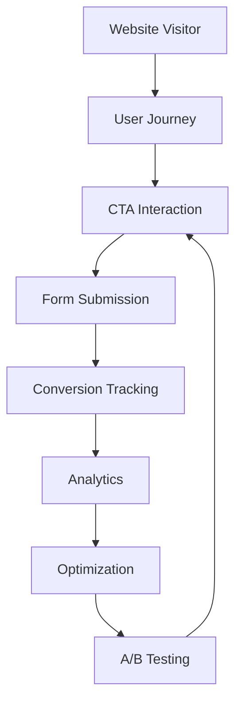

# Content Optimization for Conversion Architecture

## 1. Overview

This document describes the content optimization architecture for conversion on The Strengths Toolbox website. The architecture focuses on CTA placement, tracking, A/B testing, form optimization, and conversion funnel analysis.

### 1.1 Purpose and Scope

This document covers:
- Conversion optimization strategy
- CTA placement and tracking
- A/B testing framework
- Form optimization
- Landing page optimization
- User journey mapping
- Analytics integration
- Conversion funnel tracking
- Heatmap and user behavior tracking

### 1.2 Reference Documents

- System Architecture Overview: `01-system-architecture-overview.md`
- Laravel MVC Architecture: `02-laravel-mvc-architecture.md`
- Frontend Architecture: `04-frontend-architecture.md`
- Performance Optimization: `07-performance-optimization-architecture.md`

## 2. Conversion Strategy Overview

### 2.1 Conversion Goals

**Primary Conversions:**
- Consultation booking (Calendly)
- Contact form submission
- eBook download sign-up
- Newsletter subscription

**Secondary Conversions:**
- Blog post engagement
- Service page views
- Testimonial views
- Resource downloads

### 2.2 Conversion Architecture



## 3. CTA Placement and Tracking

### 3.1 CTA Strategy

**Primary CTAs:**
- "Book Your Complimentary 30-Minute Breakthrough Call"
- "Download Free eBook"
- "Contact Us"
- "Learn More"

**CTA Placement:**
- Hero section (above the fold)
- End of content sections
- Sidebar (sticky)
- Footer
- Exit intent popup

### 3.2 CTA Component

`resources/views/components/cta-button.blade.php`:

```blade
@props([
    'text' => 'Click Here',
    'url' => '#',
    'style' => 'primary',
    'size' => 'md',
    'tracking' => true,
    'event' => 'cta_click'
])

@php
    $trackingId = $tracking ? 'cta-' . Str::slug($text) . '-' . uniqid() : null;
@endphp

<a 
    href="{{ $url }}" 
    class="btn btn-{{ $style }} text-{{ $size }}"
    @if($tracking)
        onclick="trackCTA('{{ $event }}', '{{ $text }}', '{{ $url }}')"
        data-tracking-id="{{ $trackingId }}"
    @endif
>
    {{ $text }}
</a>
```

### 3.3 CTA Tracking JavaScript

`resources/js/cta-tracking.js`:

```javascript
function trackCTA(event, text, url) {
    // Google Analytics event
    if (typeof gtag !== 'undefined') {
        gtag('event', event, {
            'event_category': 'CTA',
            'event_label': text,
            'event_value': 1,
        });
    }
    
    // Custom tracking
    fetch('/api/tracking/cta', {
        method: 'POST',
        headers: {
            'Content-Type': 'application/json',
            'X-CSRF-TOKEN': document.querySelector('meta[name=csrf-token]').content,
        },
        body: JSON.stringify({
            event: event,
            text: text,
            url: url,
            page: window.location.pathname,
            timestamp: new Date().toISOString(),
        }),
    });
}

// Track CTA visibility
function trackCTAVisibility() {
    const ctas = document.querySelectorAll('[data-tracking-id]');
    
    const observer = new IntersectionObserver((entries) => {
        entries.forEach(entry => {
            if (entry.isIntersecting) {
                const cta = entry.target;
                const trackingId = cta.getAttribute('data-tracking-id');
                
                if (!cta.dataset.viewed) {
                    // Track CTA view
                    fetch('/api/tracking/cta-view', {
                        method: 'POST',
                        headers: {
                            'Content-Type': 'application/json',
                            'X-CSRF-TOKEN': document.querySelector('meta[name=csrf-token]').content,
                        },
                        body: JSON.stringify({
                            tracking_id: trackingId,
                            page: window.location.pathname,
                        }),
                    });
                    
                    cta.dataset.viewed = 'true';
                }
            }
        });
    }, { threshold: 0.5 });
    
    ctas.forEach(cta => observer.observe(cta));
}

// Initialize on page load
document.addEventListener('DOMContentLoaded', trackCTAVisibility);
```

### 3.4 CTA Tracking Database

**Migration:**

```php
Schema::create('cta_tracking', function (Blueprint $table) {
    $table->id();
    $table->string('tracking_id')->unique();
    $table->string('event_type'); // click, view
    $table->string('cta_text');
    $table->string('cta_url');
    $table->string('page_path');
    $table->string('session_id')->nullable();
    $table->string('ip_address')->nullable();
    $table->timestamp('created_at');
    
    $table->index(['event_type', 'created_at']);
    $table->index('page_path');
});
```

## 4. A/B Testing Framework

### 4.1 A/B Test Structure

**Test Configuration:**

```php
// config/ab-testing.php
return [
    'hero_cta' => [
        'variants' => [
            'A' => [
                'text' => 'Book Your Complimentary 30-Minute Breakthrough Call',
                'style' => 'primary',
            ],
            'B' => [
                'text' => 'Get Your Free Consultation',
                'style' => 'primary',
            ],
        ],
        'traffic_split' => 50, // 50/50 split
        'metric' => 'conversion_rate',
    ],
];
```

### 4.2 A/B Test Service

`app/Services/ABTestService.php`:

```php
<?php

namespace App\Services;

use Illuminate\Support\Facades\Cookie;
use Illuminate\Support\Facades\Cache;

class ABTestService
{
    public function getVariant($testName)
    {
        $sessionId = session()->getId();
        $cookieKey = "ab_test_{$testName}";
        
        // Check if variant already assigned
        if (Cookie::has($cookieKey)) {
            return Cookie::get($cookieKey);
        }
        
        // Assign variant based on traffic split
        $variant = $this->assignVariant($testName);
        
        // Store in cookie (30 days)
        Cookie::queue($cookieKey, $variant, 43200);
        
        // Track assignment
        $this->trackAssignment($testName, $variant, $sessionId);
        
        return $variant;
    }
    
    protected function assignVariant($testName)
    {
        $config = config("ab-testing.{$testName}");
        $split = $config['traffic_split'] ?? 50;
        
        // Simple random assignment
        return (rand(1, 100) <= $split) ? 'A' : 'B';
    }
    
    protected function trackAssignment($testName, $variant, $sessionId)
    {
        // Store in database or cache
        Cache::put("ab_test:{$testName}:{$sessionId}", $variant, 43200);
    }
    
    public function trackConversion($testName, $variant, $conversionType)
    {
        // Track conversion for A/B test
        \DB::table('ab_test_conversions')->insert([
            'test_name' => $testName,
            'variant' => $variant,
            'conversion_type' => $conversionType,
            'session_id' => session()->getId(),
            'created_at' => now(),
        ]);
    }
}
```

### 4.3 A/B Test in Views

```blade
@php
    $abTestService = app(\App\Services\ABTestService::class);
    $variant = $abTestService->getVariant('hero_cta');
    $ctaConfig = config("ab-testing.hero_cta.variants.{$variant}");
@endphp

<x-cta-button 
    text="{{ $ctaConfig['text'] }}" 
    url="/contact" 
    style="{{ $ctaConfig['style'] }}"
    :tracking="true"
    event="hero_cta_{{ $variant }}"
/>
```

### 4.4 A/B Test Results Tracking

**Database Table:**

```php
Schema::create('ab_test_conversions', function (Blueprint $table) {
    $table->id();
    $table->string('test_name');
    $table->string('variant'); // A or B
    $table->string('conversion_type');
    $table->string('session_id');
    $table->timestamp('created_at');
    
    $table->index(['test_name', 'variant', 'created_at']);
});
```

## 5. Form Optimization

### 5.1 Form Best Practices

**Form Design:**
- Minimal fields (only necessary)
- Clear labels
- Inline validation
- Progress indicators (for multi-step)
- Mobile-friendly
- Clear error messages

### 5.2 Form Tracking

**Track Form Interactions:**

```javascript
// Track form field interactions
document.querySelectorAll('form input, form textarea, form select').forEach(field => {
    field.addEventListener('focus', function() {
        trackEvent('form_field_focus', {
            field_name: this.name,
            form_id: this.closest('form').id,
        });
    });
    
    field.addEventListener('blur', function() {
        trackEvent('form_field_blur', {
            field_name: this.name,
            form_id: this.closest('form').id,
            has_value: this.value.length > 0,
        });
    });
});

// Track form submission
document.querySelectorAll('form').forEach(form => {
    form.addEventListener('submit', function(e) {
        trackEvent('form_submit', {
            form_id: this.id,
            form_action: this.action,
        });
    });
});
```

### 5.3 Form Abandonment Tracking

```javascript
// Track form abandonment
let formStartTime = null;
let formFieldsFilled = {};

document.querySelectorAll('form').forEach(form => {
    form.addEventListener('submit', function() {
        // Clear abandonment tracking on successful submit
        clearFormAbandonmentTracking(form.id);
    });
    
    // Track when user starts filling form
    form.addEventListener('focusin', function() {
        if (!formStartTime) {
            formStartTime = Date.now();
            trackEvent('form_start', { form_id: form.id });
        }
    });
    
    // Track field completion
    form.querySelectorAll('input, textarea, select').forEach(field => {
        field.addEventListener('change', function() {
            formFieldsFilled[this.name] = true;
        });
    });
});

// Track abandonment on page unload
window.addEventListener('beforeunload', function() {
    document.querySelectorAll('form').forEach(form => {
        if (formStartTime && !form.querySelector('[data-submitted]')) {
            const timeSpent = Date.now() - formStartTime;
            const fieldsCompleted = Object.keys(formFieldsFilled).length;
            
            trackEvent('form_abandon', {
                form_id: form.id,
                time_spent: timeSpent,
                fields_completed: fieldsCompleted,
            });
        }
    });
});
```

## 6. Landing Page Optimization

### 6.1 Landing Page Structure

**Optimal Structure:**
1. **Hero Section:** Clear value proposition + primary CTA
2. **Problem/Solution:** Address visitor pain points
3. **Benefits:** Key benefits list
4. **Social Proof:** Testimonials, case studies
5. **Features:** What's included
6. **Final CTA:** Strong closing CTA
7. **Trust Signals:** Certifications, guarantees

### 6.2 Landing Page Tracking

**Track Scroll Depth:**

```javascript
// Track scroll depth
let maxScroll = 0;
let scrollMilestones = [25, 50, 75, 100];
let reachedMilestones = [];

window.addEventListener('scroll', function() {
    const scrollPercent = Math.round(
        (window.scrollY / (document.documentElement.scrollHeight - window.innerHeight)) * 100
    );
    
    if (scrollPercent > maxScroll) {
        maxScroll = scrollPercent;
        
        scrollMilestones.forEach(milestone => {
            if (scrollPercent >= milestone && !reachedMilestones.includes(milestone)) {
                reachedMilestones.push(milestone);
                trackEvent('scroll_depth', {
                    depth: milestone,
                    page: window.location.pathname,
                });
            }
        });
    }
});
```

**Track Time on Page:**

```javascript
let pageStartTime = Date.now();

window.addEventListener('beforeunload', function() {
    const timeOnPage = Math.round((Date.now() - pageStartTime) / 1000);
    
    trackEvent('time_on_page', {
        time: timeOnPage,
        page: window.location.pathname,
    });
});
```

## 7. User Journey Mapping

### 7.1 Journey Tracking

**Track User Path:**

```javascript
// Track page views in sequence
let journey = JSON.parse(sessionStorage.getItem('user_journey') || '[]');

// Add current page
journey.push({
    page: window.location.pathname,
    timestamp: new Date().toISOString(),
    referrer: document.referrer,
});

// Keep only last 10 pages
if (journey.length > 10) {
    journey = journey.slice(-10);
}

sessionStorage.setItem('user_journey', JSON.stringify(journey));

// Send to server periodically
if (journey.length >= 3) {
    fetch('/api/tracking/journey', {
        method: 'POST',
        headers: {
            'Content-Type': 'application/json',
            'X-CSRF-TOKEN': document.querySelector('meta[name=csrf-token]').content,
        },
        body: JSON.stringify({ journey: journey }),
    });
}
```

### 7.2 Conversion Funnel Tracking

**Funnel Stages:**

1. **Awareness:** Homepage visit
2. **Interest:** Service page view
3. **Consideration:** Blog post read
4. **Intent:** Form start
5. **Action:** Form submission

**Track Funnel Progress:**

```php
// app/Services/ConversionFunnelService.php
class ConversionFunnelService
{
    public function trackStage($sessionId, $stage, $data = [])
    {
        \DB::table('conversion_funnel')->insert([
            'session_id' => $sessionId,
            'stage' => $stage,
            'data' => json_encode($data),
            'created_at' => now(),
        ]);
    }
    
    public function getFunnelStats($startDate, $endDate)
    {
        return \DB::table('conversion_funnel')
            ->select('stage', \DB::raw('COUNT(*) as count'))
            ->whereBetween('created_at', [$startDate, $endDate])
            ->groupBy('stage')
            ->get();
    }
}
```

## 8. Analytics Integration

### 8.1 Google Analytics

**Event Tracking:**

```javascript
function trackEvent(eventName, parameters = {}) {
    // Google Analytics 4
    if (typeof gtag !== 'undefined') {
        gtag('event', eventName, parameters);
    }
    
    // Universal Analytics (if still using)
    if (typeof ga !== 'undefined') {
        ga('send', 'event', parameters.category || 'General', eventName, parameters.label);
    }
}
```

**Conversion Goals:**

Set up goals in Google Analytics:
- Consultation booking
- Form submission
- eBook download
- Newsletter signup

### 8.2 Custom Analytics

**Track to Database:**

```php
// app/Http/Controllers/Api/TrackingController.php
class TrackingController extends Controller
{
    public function trackEvent(Request $request)
    {
        $validated = $request->validate([
            'event' => 'required|string',
            'data' => 'nullable|array',
        ]);
        
        \DB::table('analytics_events')->insert([
            'session_id' => session()->getId(),
            'event_name' => $validated['event'],
            'event_data' => json_encode($validated['data'] ?? []),
            'page_path' => $request->input('page', request()->path()),
            'ip_address' => $request->ip(),
            'user_agent' => $request->userAgent(),
            'created_at' => now(),
        ]);
        
        return response()->json(['success' => true]);
    }
}
```

## 9. Heatmap and User Behavior Tracking

### 9.1 Heatmap Integration

**Third-Party Services:**
- Hotjar
- Crazy Egg
- Microsoft Clarity

**Implementation:**

```blade
@if(config('services.hotjar.enabled'))
<script>
    (function(h,o,t,j,a,r){
        h.hj=h.hj||function(){(h.hj.q=h.hj.q||[]).push(arguments)};
        h._hjSettings={hjid:{{ config('services.hotjar.id') }},hjsv:6};
        a=o.getElementsByTagName('head')[0];
        r=o.createElement('script');r.async=1;
        r.src=t+h._hjSettings.hjid+j+h._hjSettings.hjsv;
        a.appendChild(r);
    })(window,document,'https://static.hotjar.com/c/hotjar-','.js?sv=');
</script>
@endif
```

### 9.2 Click Tracking

**Track Click Heatmap:**

```javascript
// Track all clicks
document.addEventListener('click', function(e) {
    const element = e.target;
    const rect = element.getBoundingClientRect();
    
    trackEvent('click', {
        element: element.tagName,
        id: element.id,
        class: element.className,
        x: Math.round(rect.left + rect.width / 2),
        y: Math.round(rect.top + rect.height / 2),
        page: window.location.pathname,
    });
});
```

## 10. Conversion Optimization Checklist

### 10.1 CTA Optimization
- [ ] Clear, action-oriented CTA text
- [ ] Prominent placement (above fold)
- [ ] Multiple CTAs on long pages
- [ ] Contrasting colors
- [ ] Mobile-friendly size
- [ ] CTA tracking implemented

### 10.2 Form Optimization
- [ ] Minimal required fields
- [ ] Clear labels and placeholders
- [ ] Inline validation
- [ ] Mobile-friendly
- [ ] Form abandonment tracking
- [ ] Success message/redirect

### 10.3 Page Optimization
- [ ] Clear value proposition
- [ ] Social proof visible
- [ ] Trust signals displayed
- [ ] Fast page load
- [ ] Mobile responsive
- [ ] Clear navigation

### 10.4 Analytics
- [ ] Google Analytics configured
- [ ] Conversion goals set up
- [ ] Event tracking implemented
- [ ] Funnel tracking active
- [ ] Regular reporting schedule

## 11. Best Practices

### 11.1 Testing
- Test one element at a time
- Run tests for statistical significance
- Document test results
- Implement winning variants

### 11.2 Tracking
- Track all conversion points
- Monitor user behavior
- Analyze conversion funnels
- Regular optimization reviews

### 11.3 Optimization
- Focus on high-traffic pages
- Prioritize primary conversions
- Test continuously
- Data-driven decisions

## 12. Dependencies

### 12.1 Required
- Google Analytics
- Laravel framework
- Database for tracking

### 12.2 Optional
- Hotjar or similar heatmap tool
- A/B testing service
- Advanced analytics platform

## 13. Configuration

### 13.1 Environment Variables

```env
GOOGLE_ANALYTICS_ID=G-XXXXXXXXXX
HOTJAR_ID=1234567
HOTJAR_ENABLED=true
```

### 13.2 Service Configuration

`config/services.php`:

```php
'hotjar' => [
    'id' => env('HOTJAR_ID'),
    'enabled' => env('HOTJAR_ENABLED', false),
],
```

---

**Document Version:** 1.0  
**Last Updated:** 2025  
**Next Review:** Upon conversion optimization changes