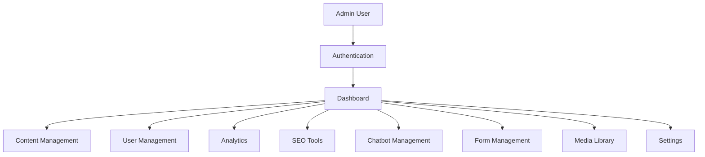

# Admin Panel Architecture

## 1. Overview

This document describes the admin panel architecture for The Strengths Toolbox website. The admin panel provides comprehensive content management, user management, analytics, SEO tools, and chatbot management capabilities.

### 1.1 Purpose and Scope

This document covers:
- Admin panel structure and navigation
- Content management system
- User and role management
- Analytics dashboard
- SEO tools and management
- Chatbot management interface
- Form submission management
- Blog post management
- Media library management
- Settings and configuration

### 1.2 Reference Documents

- System Architecture Overview: `01-system-architecture-overview.md`
- Laravel MVC Architecture: `02-laravel-mvc-architecture.md`
- Database Architecture: `03-database-architecture.md`
- SEO Architecture: `05-seo-architecture.md`
- AI Chatbot Architecture: `06-ai-chatbot-architecture.md`

## 2. Admin Panel Overview

### 2.1 Admin Panel Architecture



### 2.2 Admin Panel Structure

```
/admin
├── /dashboard          # Main dashboard
├── /pages              # Page management
├── /blog               # Blog management
├── /forms              # Form management
├── /submissions        # Form submissions
├── /testimonials       # Testimonial management
├── /users              # User management
├── /seo                # SEO management
├── /chatbot            # Chatbot management
├── /analytics          # Analytics dashboard
├── /media              # Media library
└── /settings           # Site settings
```

## 3. Authentication and Authorization

### 3.1 Admin Authentication

**Separate Admin Guard:**

`config/auth.php`:

```php
'guards' => [
    'web' => [
        'driver' => 'session',
        'provider' => 'users',
    ],
    'admin' => [
        'driver' => 'session',
        'provider' => 'admins',
    ],
],

'providers' => [
    'admins' => [
        'driver' => 'eloquent',
        'model' => App\Models\User::class,
        'where' => ['role' => 'admin'],
    ],
],
```

### 3.2 Admin Middleware

`app/Http/Middleware/AdminAuth.php`:

```php
<?php

namespace App\Http\Middleware;

use Closure;
use Illuminate\Support\Facades\Auth;

class AdminAuth
{
    public function handle($request, Closure $next)
    {
        if (!Auth::guard('admin')->check()) {
            return redirect()->route('admin.login');
        }
        
        $user = Auth::guard('admin')->user();
        
        if (!in_array($user->role, ['admin', 'editor'])) {
            abort(403, 'Unauthorized access.');
        }
        
        return $next($request);
    }
}
```

### 3.3 Role-Based Access Control

**User Roles:**
- **Admin:** Full access
- **Editor:** Content management, no user management
- **Author:** Blog post creation only

**Role Checking:**

```php
if (Auth::guard('admin')->user()->role === 'admin') {
    // Admin-only functionality
}
```

## 4. Dashboard

### 4.1 Dashboard Overview

**Dashboard Components:**
- Quick stats (pages, posts, submissions)
- Recent activity
- Analytics overview
- Conversion metrics
- System status

### 4.2 Dashboard Controller

`app/Http/Controllers/Admin/AdminDashboardController.php`:

```php
<?php

namespace App\Http\Controllers\Admin;

use App\Http\Controllers\Controller;
use App\Models\Page;
use App\Models\BlogPost;
use App\Models\FormSubmission;
use Illuminate\Http\Request;

class AdminDashboardController extends Controller
{
    public function index()
    {
        $stats = [
            'pages' => Page::count(),
            'published_pages' => Page::where('is_published', true)->count(),
            'blog_posts' => BlogPost::count(),
            'published_posts' => BlogPost::where('is_published', true)->count(),
            'recent_submissions' => FormSubmission::latest()->limit(5)->get(),
            'unread_submissions' => FormSubmission::where('is_read', false)->count(),
        ];
        
        return view('admin.dashboard', compact('stats'));
    }
}
```

### 4.3 Dashboard View

`resources/views/admin/dashboard.blade.php`:

```blade
@extends('layouts.admin')

@section('title', 'Dashboard')

@section('content')
<div class="grid grid-cols-1 md:grid-cols-2 lg:grid-cols-4 gap-6 mb-8">
    <div class="bg-white rounded-lg shadow p-6">
        <h3 class="text-gray-500 text-sm font-medium">Total Pages</h3>
        <p class="text-3xl font-bold text-gray-900">{{ $stats['pages'] }}</p>
        <p class="text-sm text-gray-600">{{ $stats['published_pages'] }} published</p>
    </div>
    
    <div class="bg-white rounded-lg shadow p-6">
        <h3 class="text-gray-500 text-sm font-medium">Blog Posts</h3>
        <p class="text-3xl font-bold text-gray-900">{{ $stats['blog_posts'] }}</p>
        <p class="text-sm text-gray-600">{{ $stats['published_posts'] }} published</p>
    </div>
    
    <div class="bg-white rounded-lg shadow p-6">
        <h3 class="text-gray-500 text-sm font-medium">Form Submissions</h3>
        <p class="text-3xl font-bold text-gray-900">{{ $stats['unread_submissions'] }}</p>
        <p class="text-sm text-gray-600">unread</p>
    </div>
    
    <div class="bg-white rounded-lg shadow p-6">
        <h3 class="text-gray-500 text-sm font-medium">Recent Activity</h3>
        <p class="text-sm text-gray-600">Last 7 days</p>
    </div>
</div>

{{-- Recent Submissions --}}
<div class="bg-white rounded-lg shadow">
    <div class="p-6 border-b">
        <h2 class="text-xl font-semibold">Recent Form Submissions</h2>
    </div>
    <div class="p-6">
        @if($stats['recent_submissions']->count() > 0)
            <table class="min-w-full">
                <thead>
                    <tr>
                        <th class="text-left">Form</th>
                        <th class="text-left">Submitted</th>
                        <th class="text-left">Status</th>
                        <th class="text-right">Actions</th>
                    </tr>
                </thead>
                <tbody>
                    @foreach($stats['recent_submissions'] as $submission)
                    <tr>
                        <td>{{ $submission->form->name }}</td>
                        <td>{{ $submission->created_at->diffForHumans() }}</td>
                        <td>
                            @if($submission->is_read)
                                <span class="text-green-600">Read</span>
                            @else
                                <span class="text-yellow-600">Unread</span>
                            @endif
                        </td>
                        <td class="text-right">
                            <a href="{{ route('admin.submissions.show', $submission) }}" class="text-primary-600">View</a>
                        </td>
                    </tr>
                    @endforeach
                </tbody>
            </table>
        @else
            <p class="text-gray-500">No recent submissions</p>
        @endif
    </div>
</div>
@endsection
```

## 5. Content Management System

### 5.1 Page Management

**CRUD Operations:**

`app/Http/Controllers/Admin/AdminPageController.php`:

```php
<?php

namespace App\Http\Controllers\Admin;

use App\Http\Controllers\Controller;
use App\Models\Page;
use App\Http\Requests\Admin\PageRequest;
use Illuminate\Http\Request;

class AdminPageController extends Controller
{
    public function index()
    {
        $pages = Page::withTrashed()->latest()->paginate(20);
        return view('admin.pages.index', compact('pages'));
    }
    
    public function create()
    {
        return view('admin.pages.create');
    }
    
    public function store(PageRequest $request)
    {
        $page = Page::create($request->validated());
        
        return redirect()
            ->route('admin.pages.show', $page)
            ->with('success', 'Page created successfully.');
    }
    
    public function show(Page $page)
    {
        return view('admin.pages.show', compact('page'));
    }
    
    public function edit(Page $page)
    {
        return view('admin.pages.edit', compact('page'));
    }
    
    public function update(PageRequest $request, Page $page)
    {
        $page->update($request->validated());
        
        return redirect()
            ->route('admin.pages.show', $page)
            ->with('success', 'Page updated successfully.');
    }
    
    public function destroy(Page $page)
    {
        $page->delete();
        
        return redirect()
            ->route('admin.pages.index')
            ->with('success', 'Page deleted successfully.');
    }
}
```

### 5.2 Blog Management

**Blog Post Controller:**

Similar structure to Page Controller with additional features:
- Category and tag management
- Featured image upload
- Publication scheduling
- Draft/Published status

### 5.3 Rich Text Editor

**TinyMCE or Similar:**

```blade
<textarea 
    name="content" 
    id="content"
    class="tinymce-editor"
>{{ old('content', $page->content ?? '') }}</textarea>

<script src="https://cdn.tiny.cloud/1/YOUR_API_KEY/tinymce/6/tinymce.min.js"></script>
<script>
tinymce.init({
    selector: '#content',
    plugins: 'lists link image table code',
    toolbar: 'undo redo | formatselect | bold italic | alignleft aligncenter alignright | bullist numlist | link image | code',
    height: 500,
});
</script>
```

## 6. User Management

### 6.1 User Management Controller

`app/Http/Controllers/Admin/AdminUserController.php`:

```php
<?php

namespace App\Http\Controllers\Admin;

use App\Http\Controllers\Controller;
use App\Models\User;
use Illuminate\Http\Request;
use Illuminate\Support\Facades\Hash;

class AdminUserController extends Controller
{
    public function index()
    {
        $users = User::latest()->paginate(20);
        return view('admin.users.index', compact('users'));
    }
    
    public function create()
    {
        return view('admin.users.create');
    }
    
    public function store(Request $request)
    {
        $validated = $request->validate([
            'name' => 'required|string|max:255',
            'email' => 'required|email|unique:users',
            'password' => 'required|min:8|confirmed',
            'role' => 'required|in:admin,editor,author',
        ]);
        
        $user = User::create([
            'name' => $validated['name'],
            'email' => $validated['email'],
            'password' => Hash::make($validated['password']),
            'role' => $validated['role'],
        ]);
        
        return redirect()
            ->route('admin.users.show', $user)
            ->with('success', 'User created successfully.');
    }
    
    public function show(User $user)
    {
        return view('admin.users.show', compact('user'));
    }
    
    public function edit(User $user)
    {
        return view('admin.users.edit', compact('user'));
    }
    
    public function update(Request $request, User $user)
    {
        $validated = $request->validate([
            'name' => 'required|string|max:255',
            'email' => 'required|email|unique:users,email,' . $user->id,
            'password' => 'nullable|min:8|confirmed',
            'role' => 'required|in:admin,editor,author',
        ]);
        
        $user->update([
            'name' => $validated['name'],
            'email' => $validated['email'],
            'role' => $validated['role'],
        ]);
        
        if ($request->filled('password')) {
            $user->update([
                'password' => Hash::make($validated['password']),
            ]);
        }
        
        return redirect()
            ->route('admin.users.show', $user)
            ->with('success', 'User updated successfully.');
    }
    
    public function destroy(User $user)
    {
        $user->delete();
        
        return redirect()
            ->route('admin.users.index')
            ->with('success', 'User deleted successfully.');
    }
}
```

## 7. Analytics Dashboard

### 7.1 Analytics Controller

`app/Http/Controllers/Admin/AdminAnalyticsController.php`:

```php
<?php

namespace App\Http\Controllers\Admin;

use App\Http\Controllers\Controller;
use Illuminate\Http\Request;
use Illuminate\Support\Facades\DB;

class AdminAnalyticsController extends Controller
{
    public function index(Request $request)
    {
        $startDate = $request->input('start_date', now()->subDays(30));
        $endDate = $request->input('end_date', now());
        
        $stats = [
            'page_views' => $this->getPageViews($startDate, $endDate),
            'form_submissions' => $this->getFormSubmissions($startDate, $endDate),
            'cta_clicks' => $this->getCTAClicks($startDate, $endDate),
            'popular_pages' => $this->getPopularPages($startDate, $endDate),
            'conversion_rate' => $this->getConversionRate($startDate, $endDate),
        ];
        
        return view('admin.analytics.index', compact('stats', 'startDate', 'endDate'));
    }
    
    protected function getPageViews($startDate, $endDate)
    {
        return DB::table('analytics_events')
            ->where('event_name', 'page_view')
            ->whereBetween('created_at', [$startDate, $endDate])
            ->count();
    }
    
    protected function getFormSubmissions($startDate, $endDate)
    {
        return DB::table('form_submissions')
            ->whereBetween('created_at', [$startDate, $endDate])
            ->count();
    }
    
    protected function getCTAClicks($startDate, $endDate)
    {
        return DB::table('cta_tracking')
            ->where('event_type', 'click')
            ->whereBetween('created_at', [$startDate, $endDate])
            ->count();
    }
    
    protected function getPopularPages($startDate, $endDate)
    {
        return DB::table('analytics_events')
            ->select('page_path', DB::raw('COUNT(*) as views'))
            ->where('event_name', 'page_view')
            ->whereBetween('created_at', [$startDate, $endDate])
            ->groupBy('page_path')
            ->orderBy('views', 'desc')
            ->limit(10)
            ->get();
    }
    
    protected function getConversionRate($startDate, $endDate)
    {
        $visitors = $this->getPageViews($startDate, $endDate);
        $conversions = $this->getFormSubmissions($startDate, $endDate);
        
        return $visitors > 0 ? round(($conversions / $visitors) * 100, 2) : 0;
    }
}
```

## 8. SEO Management

### 8.1 SEO Tools Controller

`app/Http/Controllers/Admin/AdminSEOController.php`:

```php
<?php

namespace App\Http\Controllers\Admin;

use App\Http\Controllers\Controller;
use App\Models\Page;
use App\Models\BlogPost;
use Illuminate\Http\Request;

class AdminSEOController extends Controller
{
    public function index()
    {
        $pages = Page::whereNull('meta_title')
            ->orWhereNull('meta_description')
            ->get();
            
        $posts = BlogPost::whereNull('meta_title')
            ->orWhereNull('meta_description')
            ->get();
        
        return view('admin.seo.index', compact('pages', 'posts'));
    }
    
    public function editPage(Page $page)
    {
        return view('admin.seo.edit-page', compact('page'));
    }
    
    public function updatePage(Request $request, Page $page)
    {
        $validated = $request->validate([
            'meta_title' => 'nullable|string|max:255',
            'meta_description' => 'nullable|string|max:500',
            'meta_keywords' => 'nullable|string|max:255',
        ]);
        
        $page->update($validated);
        
        // Update SEO table if exists
        if ($page->seo) {
            $page->seo->update([
                'og_title' => $request->input('og_title'),
                'og_description' => $request->input('og_description'),
                'og_image' => $request->input('og_image'),
            ]);
        }
        
        return redirect()
            ->route('admin.seo.index')
            ->with('success', 'SEO settings updated.');
    }
}
```

## 9. Chatbot Management

### 9.1 Chatbot Management Controller

`app/Http/Controllers/Admin/AdminChatbotController.php`:

```php
<?php

namespace App\Http\Controllers\Admin;

use App\Http\Controllers\Controller;
use App\Models\ChatbotConversation;
use App\Models\ChatbotMessage;
use Illuminate\Http\Request;

class AdminChatbotController extends Controller
{
    public function index()
    {
        $conversations = ChatbotConversation::with('messages')
            ->latest()
            ->paginate(20);
        
        return view('admin.chatbot.index', compact('conversations'));
    }
    
    public function show(ChatbotConversation $conversation)
    {
        $conversation->load('messages');
        return view('admin.chatbot.show', compact('conversation'));
    }
    
    public function settings()
    {
        $settings = config('chatbot');
        return view('admin.chatbot.settings', compact('settings'));
    }
    
    public function updateSettings(Request $request)
    {
        $validated = $request->validate([
            'system_prompt' => 'required|string',
            'max_tokens' => 'required|integer|min:100|max:2000',
            'temperature' => 'required|numeric|min:0|max:1',
        ]);
        
        // Update configuration (store in database or config file)
        // Implementation depends on configuration storage strategy
        
        return redirect()
            ->route('admin.chatbot.settings')
            ->with('success', 'Chatbot settings updated.');
    }
}
```

## 10. Form Submission Management

### 10.1 Form Submission Controller

`app/Http/Controllers/Admin/AdminFormSubmissionController.php`:

```php
<?php

namespace App\Http\Controllers\Admin;

use App\Http\Controllers\Controller;
use App\Models\FormSubmission;
use Illuminate\Http\Request;

class AdminFormSubmissionController extends Controller
{
    public function index(Request $request)
    {
        $query = FormSubmission::with('form');
        
        if ($request->has('form_id')) {
            $query->where('form_id', $request->form_id);
        }
        
        if ($request->has('unread')) {
            $query->where('is_read', false);
        }
        
        $submissions = $query->latest()->paginate(20);
        
        return view('admin.submissions.index', compact('submissions'));
    }
    
    public function show(FormSubmission $submission)
    {
        $submission->update(['is_read' => true]);
        return view('admin.submissions.show', compact('submission'));
    }
    
    public function destroy(FormSubmission $submission)
    {
        $submission->delete();
        
        return redirect()
            ->route('admin.submissions.index')
            ->with('success', 'Submission deleted.');
    }
    
    public function export(Request $request)
    {
        // Export submissions to CSV
        // Implementation
    }
}
```

## 11. Media Library

### 11.1 Media Management

**File Upload:**

```php
public function upload(Request $request)
{
    $validated = $request->validate([
        'file' => 'required|image|max:5120', // 5MB max
    ]);
    
    $path = $request->file('file')->store('media', 'public');
    
    $media = Media::create([
        'filename' => $request->file('file')->getClientOriginalName(),
        'path' => $path,
        'mime_type' => $request->file('file')->getMimeType(),
        'size' => $request->file('file')->getSize(),
    ]);
    
    return response()->json([
        'success' => true,
        'media' => $media,
    ]);
}
```

## 12. Settings Management

### 12.1 Site Settings

**Settings Controller:**

```php
public function index()
{
    $settings = [
        'site_name' => config('app.name'),
        'site_email' => config('mail.from.address'),
        'contact_phone' => config('app.contact_phone'),
        // ... other settings
    ];
    
    return view('admin.settings.index', compact('settings'));
}

public function update(Request $request)
{
    // Update settings (store in database or .env)
    // Implementation
    
    return redirect()
        ->route('admin.settings.index')
        ->with('success', 'Settings updated.');
}
```

## 13. Admin Layout

### 13.1 Admin Layout Template

`resources/views/layouts/admin.blade.php`:

```blade
<!DOCTYPE html>
<html lang="en">
<head>
    <meta charset="utf-8">
    <meta name="viewport" content="width=device-width, initial-scale=1">
    <title>@yield('title', 'Admin') - {{ config('app.name') }}</title>
    @vite(['resources/css/app.css', 'resources/js/app.js'])
</head>
<body class="bg-gray-100">
    @include('admin.partials.sidebar')
    
    <div class="ml-64">
        @include('admin.partials.header')
        
        <main class="p-8">
            @if(session('success'))
                <div class="bg-green-100 border border-green-400 text-green-700 px-4 py-3 rounded mb-4">
                    {{ session('success') }}
                </div>
            @endif
            
            @yield('content')
        </main>
    </div>
</body>
</html>
```

## 14. Best Practices

### 14.1 Security
- Separate admin authentication
- Role-based access control
- CSRF protection on all forms
- Input validation
- Secure file uploads

### 14.2 User Experience
- Intuitive navigation
- Clear action buttons
- Confirmation for destructive actions
- Success/error messages
- Responsive design

### 14.3 Performance
- Paginate large lists
- Lazy load images
- Cache expensive queries
- Optimize database queries

## 15. Dependencies

### 15.1 Required Packages
- `laravel/framework` - Core framework
- `laravel/ui` or custom auth - Authentication

### 15.2 Optional Packages
- `spatie/laravel-permission` - Advanced permissions
- `intervention/image` - Image manipulation
- `maatwebsite/excel` - Excel export

## 16. Configuration

### 16.1 Admin Routes

`routes/admin.php`:

```php
<?php

use Illuminate\Support\Facades\Route;

Route::prefix('admin')->name('admin.')->middleware(['auth:admin'])->group(function () {
    Route::get('/', [AdminDashboardController::class, 'index'])->name('dashboard');
    
    Route::resource('pages', AdminPageController::class);
    Route::resource('blog', AdminBlogController::class);
    Route::resource('users', AdminUserController::class);
    Route::resource('submissions', AdminFormSubmissionController::class);
    
    Route::get('/analytics', [AdminAnalyticsController::class, 'index'])->name('analytics');
    Route::get('/seo', [AdminSEOController::class, 'index'])->name('seo');
    Route::get('/chatbot', [AdminChatbotController::class, 'index'])->name('chatbot');
    Route::get('/settings', [AdminSettingsController::class, 'index'])->name('settings');
});
```

---

**Document Version:** 1.0  
**Last Updated:** 2025  
**Next Review:** Upon admin panel changes