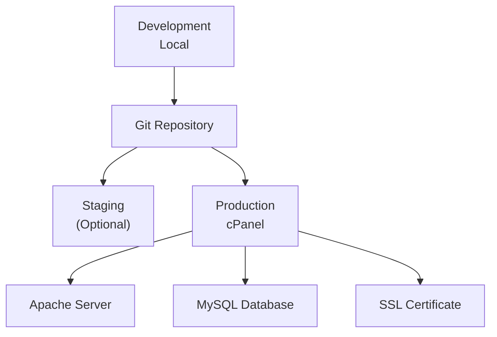

# Deployment Architecture

## 1. Overview

This document describes the deployment architecture for The Strengths Toolbox website on cPanel hosting. The architecture addresses cPanel-specific constraints, deployment workflows, and production configuration.

### 1.1 Purpose and Scope

This document covers:
- cPanel deployment strategy
- Server requirements
- Environment configuration
- Database setup on cPanel
- File structure for cPanel
- SSL/HTTPS configuration
- Backup strategy
- Deployment workflow
- Monitoring and logging
- Security hardening for shared hosting

### 1.2 Reference Documents

- System Architecture Overview: `01-system-architecture-overview.md`
- Laravel MVC Architecture: `02-laravel-mvc-architecture.md`
- Database Architecture: `03-database-architecture.md`
- Performance Optimization: `07-performance-optimization-architecture.md`

## 2. Deployment Overview

### 2.1 Deployment Architecture



### 2.2 cPanel Environment

**cPanel Structure:**
- Document root: `public_html/`
- Laravel app: `public_html/` or subdirectory
- Database: MySQL via cPanel
- PHP: Managed via cPanel
- SSL: Let's Encrypt via cPanel

## 3. Server Requirements

### 3.1 Minimum Requirements

- **PHP:** 8.1 or higher
- **MySQL:** 8.0 or higher (or MariaDB equivalent)
- **Apache:** 2.4+ with mod_rewrite
- **Memory:** 256MB PHP memory limit (minimum)
- **Storage:** Sufficient for application and media files

### 3.2 PHP Extensions Required

- `php-mbstring`
- `php-xml`
- `php-curl`
- `php-zip`
- `php-gd`
- `php-mysql`
- `php-openssl`
- `php-json`
- `php-fileinfo`

### 3.3 PHP Configuration

**php.ini Settings (via cPanel):**

```ini
memory_limit = 256M
upload_max_filesize = 10M
post_max_size = 10M
max_execution_time = 300
max_input_time = 300
```

## 4. File Structure for cPanel

### 4.1 Recommended Structure

**Option 1: Root Deployment (Recommended)**

```
public_html/
├── .htaccess              # Laravel .htaccess
├── index.php              # Laravel entry point
├── app/                   # Application code
├── bootstrap/
├── config/
├── database/
├── public/                # Public assets (CSS, JS, images)
│   ├── css/
│   ├── js/
│   └── images/
├── resources/
├── routes/
├── storage/               # Must be writable
│   ├── app/
│   ├── framework/
│   └── logs/
├── vendor/
├── .env                   # Environment configuration
└── composer.json
```

**Option 2: Subdirectory Deployment**

```
public_html/
├── thestrengthstoolbox/   # Laravel app in subdirectory
│   ├── app/
│   ├── public/
│   └── ...
└── .htaccess              # Redirect to subdirectory
```

### 4.2 Document Root Configuration

**For Root Deployment:**

cPanel should point document root to `public_html/` (which contains Laravel's `public/` contents).

**For Subdirectory Deployment:**

Laravel app in subdirectory, document root remains `public_html/`, with rewrite rules to point to subdirectory.

### 4.3 .htaccess Configuration

**Main .htaccess (public_html/.htaccess):**

```apache
<IfModule mod_rewrite.c>
    <IfModule mod_negotiation.c>
        Options -MultiViews -Indexes
    </IfModule>

    RewriteEngine On

    # Handle Authorization Header
    RewriteCond %{HTTP:Authorization} .
    RewriteRule .* - [E=HTTP_AUTHORIZATION:%{HTTP:Authorization}]

    # Redirect Trailing Slashes If Not A Folder...
    RewriteCond %{REQUEST_FILENAME} !-d
    RewriteCond %{REQUEST_URI} (.+)/$
    RewriteRule ^ %1 [L,R=301]

    # Send Requests To Front Controller...
    RewriteCond %{REQUEST_FILENAME} !-d
    RewriteCond %{REQUEST_FILENAME} !-f
    RewriteRule ^ index.php [L]
</IfModule>

# Force HTTPS
RewriteCond %{HTTPS} off
RewriteRule ^(.*)$ https://%{HTTP_HOST}%{REQUEST_URI} [L,R=301]

# Force www or non-www (choose one)
RewriteCond %{HTTP_HOST} !^www\. [NC]
RewriteRule ^(.*)$ https://www.%{HTTP_HOST}%{REQUEST_URI} [L,R=301]

# Security Headers
<IfModule mod_headers.c>
    Header set X-Content-Type-Options "nosniff"
    Header set X-Frame-Options "SAMEORIGIN"
    Header set X-XSS-Protection "1; mode=block"
    Header set Referrer-Policy "strict-origin-when-cross-origin"
</IfModule>

# Gzip Compression
<IfModule mod_deflate.c>
    AddOutputFilterByType DEFLATE text/html text/css text/javascript application/javascript application/json
</IfModule>

# Browser Caching
<IfModule mod_expires.c>
    ExpiresActive On
    ExpiresByType image/jpg "access plus 1 year"
    ExpiresByType image/jpeg "access plus 1 year"
    ExpiresByType image/gif "access plus 1 year"
    ExpiresByType image/png "access plus 1 year"
    ExpiresByType image/webp "access plus 1 year"
    ExpiresByType text/css "access plus 1 month"
    ExpiresByType application/javascript "access plus 1 month"
</IfModule>
```

## 5. Environment Configuration

### 5.1 .env File Setup

**Production .env:**

```env
APP_NAME="The Strengths Toolbox"
APP_ENV=production
APP_KEY=base64:... # Generated via php artisan key:generate
APP_DEBUG=false
APP_URL=https://www.thestrengthstoolbox.com

LOG_CHANNEL=stack
LOG_LEVEL=error

DB_CONNECTION=mysql
DB_HOST=localhost
DB_PORT=3306
DB_DATABASE=strengthstoolbox_db
DB_USERNAME=strengthstoolbox_user
DB_PASSWORD=secure_password_here

BROADCAST_DRIVER=log
CACHE_DRIVER=file
FILESYSTEM_DISK=local
QUEUE_CONNECTION=database
SESSION_DRIVER=database
SESSION_LIFETIME=120

MAIL_MAILER=smtp
MAIL_HOST=smtp.example.com
MAIL_PORT=587
MAIL_USERNAME=noreply@thestrengthstoolbox.com
MAIL_PASSWORD=email_password
MAIL_ENCRYPTION=tls
MAIL_FROM_ADDRESS=noreply@thestrengthstoolbox.com
MAIL_FROM_NAME="${APP_NAME}"

OPENAI_API_KEY=sk-...
OPENAI_MODEL=gpt-4
OPENAI_MAX_TOKENS=500

GOOGLE_ANALYTICS_ID=G-XXXXXXXXXX
```

### 5.2 Environment Security

**Important:**
- Never commit `.env` to version control
- Use strong passwords
- Keep `APP_DEBUG=false` in production
- Rotate `APP_KEY` if compromised
- Restrict file permissions: `chmod 600 .env`

## 6. Database Setup on cPanel

### 6.1 Create Database

**Via cPanel MySQL Databases:**

1. Create new database: `strengthstoolbox_db`
2. Create database user: `strengthstoolbox_user`
3. Grant all privileges to user on database
4. Note credentials for `.env` file

### 6.2 Run Migrations

**Via SSH or cPanel Terminal:**

```bash
cd /home/username/public_html
php artisan migrate --force
```

**Or via cPanel File Manager + Terminal:**

1. Navigate to application directory
2. Open Terminal
3. Run migration command

### 6.3 Seed Database (Optional)

```bash
php artisan db:seed --force
```

## 7. SSL/HTTPS Configuration

### 7.1 Let's Encrypt SSL

**Via cPanel SSL/TLS:**

1. Navigate to SSL/TLS Status
2. Select domain
3. Click "Run AutoSSL" or "Install SSL Certificate"
4. Select Let's Encrypt
5. Install certificate

### 7.2 Force HTTPS

**Already configured in .htaccess (see above)**

**Additional Laravel Middleware:**

`app/Http/Middleware/ForceHttps.php`:

```php
<?php

namespace App\Http\Middleware;

use Closure;
use Illuminate\Http\Request;

class ForceHttps
{
    public function handle(Request $request, Closure $next)
    {
        if (!$request->secure() && app()->environment('production')) {
            return redirect()->secure($request->getRequestUri());
        }
        
        return $next($request);
    }
}
```

Register in `app/Http/Kernel.php`:

```php
protected $middleware = [
    // ...
    \App\Http\Middleware\ForceHttps::class,
];
```

## 8. Deployment Workflow

### 8.1 Deployment Steps

**1. Prepare Local Environment:**
```bash
# Ensure all changes committed
git status

# Run tests (if available)
php artisan test

# Build production assets
npm run build
```

**2. Upload Files:**
- Via FTP/SFTP: Upload all files except `.env`
- Via Git: Clone repository on server (if Git available)
- Via cPanel File Manager: Upload and extract

**3. Set Permissions:**
```bash
chmod -R 755 storage bootstrap/cache
chmod 600 .env
```

**4. Install Dependencies:**
```bash
composer install --no-dev --optimize-autoloader
npm install --production
npm run build
```

**5. Configure Environment:**
- Create `.env` file
- Set all required variables
- Generate application key: `php artisan key:generate`

**6. Run Migrations:**
```bash
php artisan migrate --force
```

**7. Clear Caches:**
```bash
php artisan config:clear
php artisan cache:clear
php artisan route:clear
php artisan view:clear
```

**8. Optimize for Production:**
```bash
php artisan config:cache
php artisan route:cache
php artisan view:cache
```

### 8.2 Automated Deployment Script

**deploy.sh (for SSH access):**

```bash
#!/bin/bash

echo "Starting deployment..."

# Navigate to application directory
cd /home/username/public_html

# Pull latest changes (if using Git)
# git pull origin main

# Install dependencies
composer install --no-dev --optimize-autoloader

# Build assets
npm install --production
npm run build

# Run migrations
php artisan migrate --force

# Clear and cache
php artisan config:clear
php artisan cache:clear
php artisan route:clear
php artisan view:clear

# Optimize
php artisan config:cache
php artisan route:cache
php artisan view:cache

echo "Deployment complete!"
```

## 9. Backup Strategy

### 9.1 Database Backups

**Via cPanel Backup:**

1. Navigate to Backup in cPanel
2. Generate full backup or database-only backup
3. Download backup file
4. Store securely off-server

**Automated Backups:**

Set up cron job in cPanel:

```bash
# Daily database backup
0 2 * * * /usr/local/bin/mysqldump -u username -p'password' database_name > /home/username/backups/db_$(date +\%Y\%m\%d).sql
```

### 9.2 File Backups

**Via cPanel:**

1. Use Backup Wizard
2. Generate full backup
3. Download and store securely

**Automated File Backups:**

```bash
# Weekly file backup
0 3 * * 0 tar -czf /home/username/backups/files_$(date +\%Y\%m\%d).tar.gz /home/username/public_html
```

### 9.3 Backup Retention

- **Daily backups:** Keep 7 days
- **Weekly backups:** Keep 4 weeks
- **Monthly backups:** Keep 12 months

## 10. Monitoring and Logging

### 10.1 Application Logs

**Laravel Logs:**

Located in `storage/logs/laravel.log`

**View Logs via cPanel:**

1. Navigate to File Manager
2. Go to `storage/logs/`
3. View or download log files

**Log Rotation:**

Configure in `config/logging.php`:

```php
'daily' => [
    'driver' => 'daily',
    'path' => storage_path('logs/laravel.log'),
    'level' => env('LOG_LEVEL', 'error'),
    'days' => 14, // Keep logs for 14 days
],
```

### 10.2 Error Monitoring

**Laravel Exception Handler:**

`app/Exceptions/Handler.php`:

```php
public function report(Throwable $exception)
{
    if ($this->shouldReport($exception)) {
        // Log to file
        \Log::error($exception->getMessage(), [
            'exception' => $exception,
            'url' => request()->url(),
            'user' => auth()->id(),
        ]);
        
        // Optional: Send to external service (Sentry, Bugsnag, etc.)
    }
    
    parent::report($exception);
}
```

### 10.3 Server Monitoring

**cPanel Metrics:**
- CPU usage
- Memory usage
- Disk space
- Bandwidth

**Application Monitoring:**
- Uptime monitoring (UptimeRobot, Pingdom)
- Performance monitoring (Google PageSpeed Insights)
- Error tracking (if implemented)

## 11. Security Hardening

### 11.1 File Permissions

```bash
# Directories
find . -type d -exec chmod 755 {} \;

# Files
find . -type f -exec chmod 644 {} \;

# Storage and cache (writable)
chmod -R 775 storage bootstrap/cache

# .env (readable only by owner)
chmod 600 .env
```

### 11.2 Directory Protection

**Protect Sensitive Directories:**

`.htaccess` in sensitive directories:

```apache
# Deny access to .env
<Files ".env">
    Order allow,deny
    Deny from all
</Files>

# Deny access to storage (except public)
<IfModule mod_rewrite.c>
    RewriteEngine On
    RewriteCond %{REQUEST_URI} ^storage/
    RewriteRule ^(.*)$ - [F,L]
</IfModule>
```

### 11.3 Security Headers

**Already configured in main .htaccess (see above)**

**Additional Laravel Middleware:**

```php
// app/Http/Middleware/SecurityHeaders.php
public function handle($request, Closure $next)
{
    $response = $next($request);
    
    $response->headers->set('X-Content-Type-Options', 'nosniff');
    $response->headers->set('X-Frame-Options', 'SAMEORIGIN');
    $response->headers->set('X-XSS-Protection', '1; mode=block');
    $response->headers->set('Referrer-Policy', 'strict-origin-when-cross-origin');
    
    return $response;
}
```

### 11.4 CSRF Protection

Laravel includes CSRF protection by default. Ensure it's enabled:

```php
// app/Http/Middleware/VerifyCsrfToken.php
protected $except = [
    // Only add routes that truly need to be excluded
];
```

## 12. Performance Optimization for Production

### 12.1 Caching

**Enable All Caches:**

```bash
php artisan config:cache
php artisan route:cache
php artisan view:cache
php artisan event:cache
```

### 12.2 Autoloader Optimization

```bash
composer install --optimize-autoloader --no-dev
```

### 12.3 Asset Optimization

```bash
npm run build
```

This will:
- Minify CSS and JavaScript
- Purge unused Tailwind classes
- Optimize assets for production

## 13. Troubleshooting

### 13.1 Common Issues

**500 Internal Server Error:**
- Check file permissions
- Check `.env` configuration
- Check Laravel logs
- Check Apache error logs

**Database Connection Error:**
- Verify database credentials in `.env`
- Check database user permissions
- Verify database exists

**Asset Loading Issues:**
- Run `npm run build`
- Check `public/build/` directory exists
- Verify Vite manifest

**Permission Denied:**
- Check `storage/` and `bootstrap/cache/` permissions
- Ensure web server user has write access

### 13.2 Debug Mode

**Never enable in production:**

```env
APP_DEBUG=false
```

If debugging needed temporarily:
1. Enable debug mode
2. Fix issue
3. Disable immediately
4. Clear config cache

## 14. Maintenance Mode

### 14.1 Enable Maintenance Mode

```bash
php artisan down
```

**With Custom Message:**

```bash
php artisan down --message="We're performing maintenance. Please check back soon."
```

### 14.2 Disable Maintenance Mode

```bash
php artisan up
```

## 15. Dependencies

### 15.1 Server Requirements
- PHP 8.1+
- MySQL 8.0+
- Apache 2.4+
- Composer
- Node.js and npm (for asset building)

### 15.2 cPanel Features Used
- MySQL Database Management
- File Manager
- SSL/TLS Manager
- Backup Wizard
- Cron Jobs
- PHP Version Selector

## 16. Configuration Checklist

### 16.1 Pre-Deployment
- [ ] Server requirements met
- [ ] PHP extensions installed
- [ ] Database created
- [ ] SSL certificate installed
- [ ] File permissions set

### 16.2 Deployment
- [ ] Files uploaded
- [ ] Dependencies installed
- [ ] Environment configured
- [ ] Migrations run
- [ ] Caches cleared and optimized
- [ ] Assets built

### 16.3 Post-Deployment
- [ ] Site accessible via HTTPS
- [ ] All pages loading correctly
- [ ] Forms working
- [ ] Database connections working
- [ ] Logs being written
- [ ] Backups configured

## 17. Best Practices

### 17.1 Security
- Keep Laravel and dependencies updated
- Use strong passwords
- Enable HTTPS
- Restrict file permissions
- Regular security audits

### 17.2 Performance
- Enable all caches
- Optimize assets
- Use CDN for static assets (if available)
- Monitor performance metrics

### 17.3 Maintenance
- Regular backups
- Monitor logs
- Update dependencies
- Test after updates
- Document changes

---

**Document Version:** 1.0  
**Last Updated:** 2025  
**Next Review:** Upon deployment changes