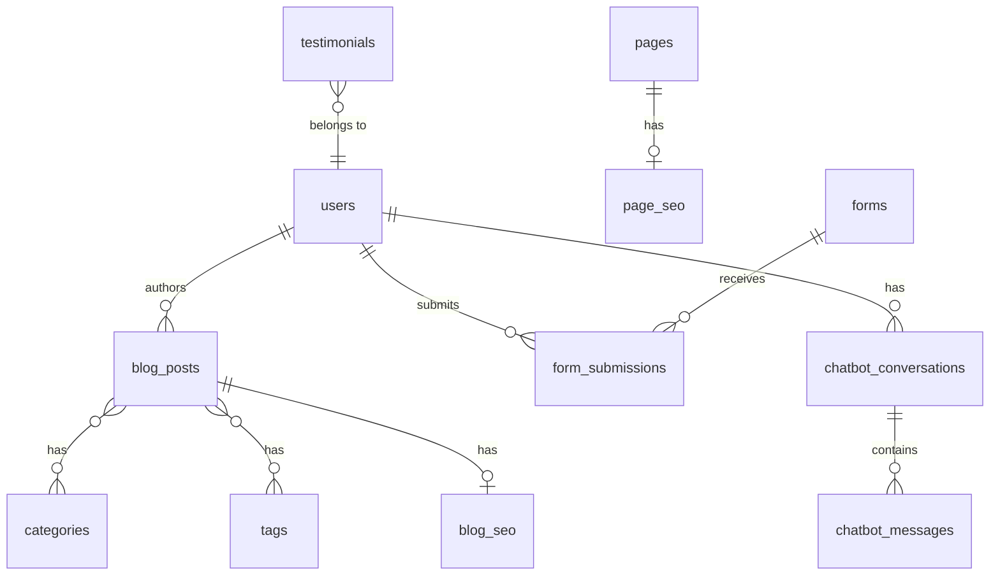

# P1.2 Database Setup Implementation Plan

## 1. Overview and Objectives

### 1.1 Purpose
This document provides detailed step-by-step instructions for designing and implementing the database schema for The Strengths Toolbox website. This includes creating migrations, Eloquent models, defining relationships, and setting up seeders for test data.

### 1.2 Scope
This implementation plan covers tasks P1.2.1 through P1.2.6:
- **P1.2.1**: Design database schema
- **P1.2.2**: Create migration files
- **P1.2.3**: Create Eloquent models
- **P1.2.4**: Define model relationships
- **P1.2.5**: Create seeders for test data
- **P1.2.6**: Run migrations and seeders

### 1.3 Success Criteria
- Complete database schema designed and documented
- All migration files created and tested
- All Eloquent models created with proper attributes
- All model relationships defined and tested
- Seeders created with realistic test data
- Database successfully migrated and seeded

## 2. Prerequisites

### 2.1 Required Knowledge
- MySQL database design principles
- Laravel migrations
- Eloquent ORM
- Database relationships (one-to-one, one-to-many, many-to-many)
- Foreign key constraints

### 2.2 Dependencies
- Task P1.1.1 completed (Laravel installed)
- Task P1.1.2 completed (Database configured)
- MySQL database created and accessible

### 2.3 Reference Documents
- Database Architecture: `documentation/01-architecture/03-database-architecture.md`
- Laravel MVC Architecture: `documentation/01-architecture/02-laravel-mvc-architecture.md`

## 3. Task P1.2.1: Design Database Schema

### 3.1 Overview
Design the complete database schema based on the requirements and architecture documents. This includes all tables, columns, indexes, and relationships.

### 3.2 Schema Design Summary

The database will include the following core tables:
1. **users** - User accounts (admin, editor, author)
2. **pages** - Static and dynamic content pages
3. **page_seo** - SEO metadata for pages
4. **blog_posts** - Blog posts and articles
5. **categories** - Blog post categories
6. **tags** - Blog post tags
7. **blog_post_category** - Pivot table (many-to-many)
8. **blog_post_tag** - Pivot table (many-to-many)
9. **forms** - Form definitions
10. **form_submissions** - Form submission data
11. **chatbot_conversations** - Chatbot conversation sessions
12. **chatbot_messages** - Individual chatbot messages
13. **testimonials** - Client testimonials

### 3.3 Entity Relationship Diagram



### 3.4 Table Specifications

#### 3.4.1 Users Table
- **Purpose**: Store user accounts for admin panel
- **Key Fields**: id, name, email, password, role
- **Indexes**: Primary key (id), unique (email), index (role)

#### 3.4.2 Pages Table
- **Purpose**: Store static and dynamic content pages
- **Key Fields**: id, title, slug, content, meta_title, meta_description, is_published
- **Indexes**: Primary key (id), unique (slug), composite (is_published, published_at)

#### 3.4.3 Blog Posts Table
- **Purpose**: Store blog posts and articles
- **Key Fields**: id, title, slug, content, author_id, published_at, is_published
- **Indexes**: Primary key (id), unique (slug), foreign key (author_id)

#### 3.4.4 Forms Table
- **Purpose**: Store form definitions
- **Key Fields**: id, name, slug, fields (JSON), email_to, is_active
- **Indexes**: Primary key (id), unique (slug)

#### 3.4.5 Form Submissions Table
- **Purpose**: Store form submission data
- **Key Fields**: id, form_id, user_id, data (JSON), ip_address
- **Indexes**: Primary key (id), foreign keys (form_id, user_id)

#### 3.4.6 Chatbot Tables
- **chatbot_conversations**: Store conversation sessions
- **chatbot_messages**: Store individual messages
- **Relationships**: One conversation has many messages

#### 3.4.7 Testimonials Table
- **Purpose**: Store client testimonials
- **Key Fields**: id, name, company, testimonial, rating, is_featured
- **Indexes**: Primary key (id), composite (is_featured, display_order)

## 4. Task P1.2.2: Create Migration Files

### 4.1 Overview
Create Laravel migration files for all database tables in the correct dependency order.

### 4.2 Migration Order
1. Users (no dependencies)
2. Pages (no dependencies)
3. Page SEO (depends on pages)
4. Blog Posts (depends on users)
5. Categories (no dependencies)
6. Tags (no dependencies)
7. Blog Post Categories pivot (depends on blog_posts, categories)
8. Blog Post Tags pivot (depends on blog_posts, tags)
9. Forms (no dependencies)
10. Form Submissions (depends on forms, users)
11. Chatbot Conversations (depends on users)
12. Chatbot Messages (depends on chatbot_conversations)
13. Testimonials (depends on users)

### 4.3 Step-by-Step Implementation

#### Step 1: Create Users Migration
```bash
php artisan make:migration create_users_table
```

**File: `database/migrations/YYYY_MM_DD_HHMMSS_create_users_table.php`**
```php
<?php

use Illuminate\Database\Migrations\Migration;
use Illuminate\Database\Schema\Blueprint;
use Illuminate\Support\Facades\Schema;

return new class extends Migration
{
    public function up(): void
    {
        Schema::create('users', function (Blueprint $table) {
            $table->id();
            $table->string('name');
            $table->string('email')->unique();
            $table->timestamp('email_verified_at')->nullable();
            $table->string('password');
            $table->enum('role', ['admin', 'editor', 'author'])->default('author');
            $table->rememberToken();
            $table->timestamps();
            
            $table->index('role');
        });
    }

    public function down(): void
    {
        Schema::dropIfExists('users');
    }
};
```

#### Step 2: Create Pages Migration
```bash
php artisan make:migration create_pages_table
```

**File: `database/migrations/YYYY_MM_DD_HHMMSS_create_pages_table.php`**
```php
<?php

use Illuminate\Database\Migrations\Migration;
use Illuminate\Database\Schema\Blueprint;
use Illuminate\Support\Facades\Schema;

return new class extends Migration
{
    public function up(): void
    {
        Schema::create('pages', function (Blueprint $table) {
            $table->id();
            $table->string('title');
            $table->string('slug')->unique();
            $table->longText('content');
            $table->text('excerpt')->nullable();
            $table->string('meta_title')->nullable();
            $table->text('meta_description')->nullable();
            $table->string('meta_keywords')->nullable();
            $table->boolean('is_published')->default(false);
            $table->timestamp('published_at')->nullable();
            $table->timestamps();
            $table->softDeletes();
            
            $table->index(['is_published', 'published_at']);
            $table->index('deleted_at');
        });
    }

    public function down(): void
    {
        Schema::dropIfExists('pages');
    }
};
```

#### Step 3: Create Page SEO Migration
```bash
php artisan make:migration create_page_seo_table
```

**File: `database/migrations/YYYY_MM_DD_HHMMSS_create_page_seo_table.php`**
```php
<?php

use Illuminate\Database\Migrations\Migration;
use Illuminate\Database\Schema\Blueprint;
use Illuminate\Support\Facades\Schema;

return new class extends Migration
{
    public function up(): void
    {
        Schema::create('page_seo', function (Blueprint $table) {
            $table->id();
            $table->foreignId('page_id')->unique()->constrained()->onDelete('cascade');
            $table->string('og_title')->nullable();
            $table->text('og_description')->nullable();
            $table->string('og_image')->nullable();
            $table->string('twitter_card')->default('summary');
            $table->string('canonical_url')->nullable();
            $table->json('schema_markup')->nullable();
            $table->timestamps();
        });
    }

    public function down(): void
    {
        Schema::dropIfExists('page_seo');
    }
};
```

#### Step 4: Create Blog Posts Migration
```bash
php artisan make:migration create_blog_posts_table
```

**File: `database/migrations/YYYY_MM_DD_HHMMSS_create_blog_posts_table.php`**
```php
<?php

use Illuminate\Database\Migrations\Migration;
use Illuminate\Database\Schema\Blueprint;
use Illuminate\Support\Facades\Schema;

return new class extends Migration
{
    public function up(): void
    {
        Schema::create('blog_posts', function (Blueprint $table) {
            $table->id();
            $table->string('title');
            $table->string('slug')->unique();
            $table->text('excerpt')->nullable();
            $table->longText('content');
            $table->string('featured_image')->nullable();
            $table->foreignId('author_id')->constrained('users')->onDelete('restrict');
            $table->timestamp('published_at')->nullable();
            $table->boolean('is_published')->default(false);
            $table->unsignedInteger('views_count')->default(0);
            $table->timestamps();
            $table->softDeletes();
            
            $table->index('author_id');
            $table->index(['is_published', 'published_at']);
            $table->index('deleted_at');
        });
    }

    public function down(): void
    {
        Schema::dropIfExists('blog_posts');
    }
};
```

#### Step 5: Create Categories Migration
```bash
php artisan make:migration create_categories_table
```

**File: `database/migrations/YYYY_MM_DD_HHMMSS_create_categories_table.php`**
```php
<?php

use Illuminate\Database\Migrations\Migration;
use Illuminate\Database\Schema\Blueprint;
use Illuminate\Support\Facades\Schema;

return new class extends Migration
{
    public function up(): void
    {
        Schema::create('categories', function (Blueprint $table) {
            $table->id();
            $table->string('name');
            $table->string('slug')->unique();
            $table->text('description')->nullable();
            $table->timestamps();
        });
    }

    public function down(): void
    {
        Schema::dropIfExists('categories');
    }
};
```

#### Step 6: Create Tags Migration
```bash
php artisan make:migration create_tags_table
```

**File: `database/migrations/YYYY_MM_DD_HHMMSS_create_tags_table.php`**
```php
<?php

use Illuminate\Database\Migrations\Migration;
use Illuminate\Database\Schema\Blueprint;
use Illuminate\Support\Facades\Schema;

return new class extends Migration
{
    public function up(): void
    {
        Schema::create('tags', function (Blueprint $table) {
            $table->id();
            $table->string('name');
            $table->string('slug')->unique();
            $table->timestamps();
        });
    }

    public function down(): void
    {
        Schema::dropIfExists('tags');
    }
};
```

#### Step 7: Create Blog Post Categories Pivot Migration
```bash
php artisan make:migration create_blog_post_category_table
```

**File: `database/migrations/YYYY_MM_DD_HHMMSS_create_blog_post_category_table.php`**
```php
<?php

use Illuminate\Database\Migrations\Migration;
use Illuminate\Database\Schema\Blueprint;
use Illuminate\Support\Facades\Schema;

return new class extends Migration
{
    public function up(): void
    {
        Schema::create('blog_post_category', function (Blueprint $table) {
            $table->foreignId('blog_post_id')->constrained()->onDelete('cascade');
            $table->foreignId('category_id')->constrained()->onDelete('cascade');
            
            $table->primary(['blog_post_id', 'category_id']);
            $table->index('category_id');
        });
    }

    public function down(): void
    {
        Schema::dropIfExists('blog_post_category');
    }
};
```

#### Step 8: Create Blog Post Tags Pivot Migration
```bash
php artisan make:migration create_blog_post_tag_table
```

**File: `database/migrations/YYYY_MM_DD_HHMMSS_create_blog_post_tag_table.php`**
```php
<?php

use Illuminate\Database\Migrations\Migration;
use Illuminate\Database\Schema\Blueprint;
use Illuminate\Support\Facades\Schema;

return new class extends Migration
{
    public function up(): void
    {
        Schema::create('blog_post_tag', function (Blueprint $table) {
            $table->foreignId('blog_post_id')->constrained()->onDelete('cascade');
            $table->foreignId('tag_id')->constrained()->onDelete('cascade');
            
            $table->primary(['blog_post_id', 'tag_id']);
            $table->index('tag_id');
        });
    }

    public function down(): void
    {
        Schema::dropIfExists('blog_post_tag');
    }
};
```

#### Step 9: Create Forms Migration
```bash
php artisan make:migration create_forms_table
```

**File: `database/migrations/YYYY_MM_DD_HHMMSS_create_forms_table.php`**
```php
<?php

use Illuminate\Database\Migrations\Migration;
use Illuminate\Database\Schema\Blueprint;
use Illuminate\Support\Facades\Schema;

return new class extends Migration
{
    public function up(): void
    {
        Schema::create('forms', function (Blueprint $table) {
            $table->id();
            $table->string('name');
            $table->string('slug')->unique();
            $table->json('fields');
            $table->string('email_to');
            $table->text('success_message')->nullable();
            $table->boolean('is_active')->default(true);
            $table->timestamps();
        });
    }

    public function down(): void
    {
        Schema::dropIfExists('forms');
    }
};
```

#### Step 10: Create Form Submissions Migration
```bash
php artisan make:migration create_form_submissions_table
```

**File: `database/migrations/YYYY_MM_DD_HHMMSS_create_form_submissions_table.php`**
```php
<?php

use Illuminate\Database\Migrations\Migration;
use Illuminate\Database\Schema\Blueprint;
use Illuminate\Support\Facades\Schema;

return new class extends Migration
{
    public function up(): void
    {
        Schema::create('form_submissions', function (Blueprint $table) {
            $table->id();
            $table->foreignId('form_id')->constrained()->onDelete('cascade');
            $table->foreignId('user_id')->nullable()->constrained()->onDelete('set null');
            $table->json('data');
            $table->string('ip_address', 45)->nullable();
            $table->text('user_agent')->nullable();
            $table->boolean('is_read')->default(false);
            $table->timestamps();
            
            $table->index('form_id');
            $table->index('user_id');
            $table->index('created_at');
        });
    }

    public function down(): void
    {
        Schema::dropIfExists('form_submissions');
    }
};
```

#### Step 11: Create Chatbot Conversations Migration
```bash
php artisan make:migration create_chatbot_conversations_table
```

**File: `database/migrations/YYYY_MM_DD_HHMMSS_create_chatbot_conversations_table.php`**
```php
<?php

use Illuminate\Database\Migrations\Migration;
use Illuminate\Database\Schema\Blueprint;
use Illuminate\Support\Facades\Schema;

return new class extends Migration
{
    public function up(): void
    {
        Schema::create('chatbot_conversations', function (Blueprint $table) {
            $table->id();
            $table->foreignId('user_id')->nullable()->constrained()->onDelete('set null');
            $table->string('session_id')->unique();
            $table->text('context')->nullable();
            $table->timestamps();
            
            $table->index('user_id');
        });
    }

    public function down(): void
    {
        Schema::dropIfExists('chatbot_conversations');
    }
};
```

#### Step 12: Create Chatbot Messages Migration
```bash
php artisan make:migration create_chatbot_messages_table
```

**File: `database/migrations/YYYY_MM_DD_HHMMSS_create_chatbot_messages_table.php`**
```php
<?php

use Illuminate\Database\Migrations\Migration;
use Illuminate\Database\Schema\Blueprint;
use Illuminate\Support\Facades\Schema;

return new class extends Migration
{
    public function up(): void
    {
        Schema::create('chatbot_messages', function (Blueprint $table) {
            $table->id();
            $table->foreignId('conversation_id')->constrained('chatbot_conversations')->onDelete('cascade');
            $table->enum('role', ['user', 'assistant', 'system']);
            $table->text('message');
            $table->unsignedInteger('tokens_used')->nullable();
            $table->timestamp('created_at');
            
            $table->index('conversation_id');
            $table->index('created_at');
        });
    }

    public function down(): void
    {
        Schema::dropIfExists('chatbot_messages');
    }
};
```

#### Step 13: Create Testimonials Migration
```bash
php artisan make:migration create_testimonials_table
```

**File: `database/migrations/YYYY_MM_DD_HHMMSS_create_testimonials_table.php`**
```php
<?php

use Illuminate\Database\Migrations\Migration;
use Illuminate\Database\Schema\Blueprint;
use Illuminate\Support\Facades\Schema;

return new class extends Migration
{
    public function up(): void
    {
        Schema::create('testimonials', function (Blueprint $table) {
            $table->id();
            $table->string('name');
            $table->string('company')->nullable();
            $table->text('testimonial');
            $table->tinyInteger('rating')->nullable()->unsigned();
            $table->foreignId('user_id')->nullable()->constrained()->onDelete('set null');
            $table->boolean('is_featured')->default(false);
            $table->unsignedInteger('display_order')->default(0);
            $table->timestamps();
            
            $table->index(['is_featured', 'display_order']);
            $table->index('user_id');
        });
    }

    public function down(): void
    {
        Schema::dropIfExists('testimonials');
    }
};
```

### 4.4 Validation
```bash
# Check migration status
php artisan migrate:status

# Test migrations (dry run)
php artisan migrate --pretend
```

## 5. Task P1.2.3: Create Eloquent Models

### 5.1 Overview
Create Eloquent models for all database tables with proper attributes, fillable fields, and casts.

### 5.2 Step-by-Step Implementation

#### Step 1: Create User Model
```bash
php artisan make:model User
```

**File: `app/Models/User.php`**
```php
<?php

namespace App\Models;

use Illuminate\Database\Eloquent\Factories\HasFactory;
use Illuminate\Foundation\Auth\User as Authenticatable;
use Illuminate\Notifications\Notifiable;
use Laravel\Sanctum\HasApiTokens;

class User extends Authenticatable
{
    use HasApiTokens, HasFactory, Notifiable;

    protected $fillable = [
        'name',
        'email',
        'password',
        'role',
    ];

    protected $hidden = [
        'password',
        'remember_token',
    ];

    protected $casts = [
        'email_verified_at' => 'datetime',
        'password' => 'hashed',
    ];

    public function blogPosts()
    {
        return $this->hasMany(BlogPost::class, 'author_id');
    }

    public function formSubmissions()
    {
        return $this->hasMany(FormSubmission::class);
    }

    public function chatbotConversations()
    {
        return $this->hasMany(ChatbotConversation::class);
    }

    public function testimonials()
    {
        return $this->hasMany(Testimonial::class);
    }

    public function isAdmin(): bool
    {
        return $this->role === 'admin';
    }

    public function isEditor(): bool
    {
        return in_array($this->role, ['admin', 'editor']);
    }
}
```

#### Step 2: Create Page Model
```bash
php artisan make:model Page
```

**File: `app/Models/Page.php`**
```php
<?php

namespace App\Models;

use Illuminate\Database\Eloquent\Factories\HasFactory;
use Illuminate\Database\Eloquent\Model;
use Illuminate\Database\Eloquent\SoftDeletes;

class Page extends Model
{
    use HasFactory, SoftDeletes;

    protected $fillable = [
        'title',
        'slug',
        'content',
        'excerpt',
        'meta_title',
        'meta_description',
        'meta_keywords',
        'is_published',
        'published_at',
    ];

    protected $casts = [
        'is_published' => 'boolean',
        'published_at' => 'datetime',
    ];

    public function seo()
    {
        return $this->hasOne(PageSEO::class);
    }

    public function scopePublished($query)
    {
        return $query->where('is_published', true)
            ->where('published_at', '<=', now());
    }
}
```

#### Step 3: Create PageSEO Model
```bash
php artisan make:model PageSEO
```

**File: `app/Models/PageSEO.php`**
```php
<?php

namespace App\Models;

use Illuminate\Database\Eloquent\Factories\HasFactory;
use Illuminate\Database\Eloquent\Model;

class PageSEO extends Model
{
    use HasFactory;

    protected $table = 'page_seo';

    protected $fillable = [
        'page_id',
        'og_title',
        'og_description',
        'og_image',
        'twitter_card',
        'canonical_url',
        'schema_markup',
    ];

    protected $casts = [
        'schema_markup' => 'array',
    ];

    public function page()
    {
        return $this->belongsTo(Page::class);
    }
}
```

#### Step 4: Create BlogPost Model
```bash
php artisan make:model BlogPost
```

**File: `app/Models/BlogPost.php`**
```php
<?php

namespace App\Models;

use Illuminate\Database\Eloquent\Factories\HasFactory;
use Illuminate\Database\Eloquent\Model;
use Illuminate\Database\Eloquent\SoftDeletes;

class BlogPost extends Model
{
    use HasFactory, SoftDeletes;

    protected $fillable = [
        'title',
        'slug',
        'excerpt',
        'content',
        'featured_image',
        'author_id',
        'published_at',
        'is_published',
        'views_count',
    ];

    protected $casts = [
        'is_published' => 'boolean',
        'published_at' => 'datetime',
        'views_count' => 'integer',
    ];

    public function author()
    {
        return $this->belongsTo(User::class, 'author_id');
    }

    public function categories()
    {
        return $this->belongsToMany(Category::class, 'blog_post_category');
    }

    public function tags()
    {
        return $this->belongsToMany(Tag::class, 'blog_post_tag');
    }

    public function scopePublished($query)
    {
        return $query->where('is_published', true)
            ->where('published_at', '<=', now());
    }

    public function incrementViews()
    {
        $this->increment('views_count');
    }
}
```

#### Step 5: Create Category Model
```bash
php artisan make:model Category
```

**File: `app/Models/Category.php`**
```php
<?php

namespace App\Models;

use Illuminate\Database\Eloquent\Factories\HasFactory;
use Illuminate\Database\Eloquent\Model;

class Category extends Model
{
    use HasFactory;

    protected $fillable = [
        'name',
        'slug',
        'description',
    ];

    public function blogPosts()
    {
        return $this->belongsToMany(BlogPost::class, 'blog_post_category');
    }
}
```

#### Step 6: Create Tag Model
```bash
php artisan make:model Tag
```

**File: `app/Models/Tag.php`**
```php
<?php

namespace App\Models;

use Illuminate\Database\Eloquent\Factories\HasFactory;
use Illuminate\Database\Eloquent\Model;

class Tag extends Model
{
    use HasFactory;

    protected $fillable = [
        'name',
        'slug',
    ];

    public function blogPosts()
    {
        return $this->belongsToMany(BlogPost::class, 'blog_post_tag');
    }
}
```

#### Step 7: Create Form Model
```bash
php artisan make:model Form
```

**File: `app/Models/Form.php`**
```php
<?php

namespace App\Models;

use Illuminate\Database\Eloquent\Factories\HasFactory;
use Illuminate\Database\Eloquent\Model;

class Form extends Model
{
    use HasFactory;

    protected $fillable = [
        'name',
        'slug',
        'fields',
        'email_to',
        'success_message',
        'is_active',
    ];

    protected $casts = [
        'fields' => 'array',
        'is_active' => 'boolean',
    ];

    public function submissions()
    {
        return $this->hasMany(FormSubmission::class);
    }

    public function scopeActive($query)
    {
        return $query->where('is_active', true);
    }
}
```

#### Step 8: Create FormSubmission Model
```bash
php artisan make:model FormSubmission
```

**File: `app/Models/FormSubmission.php`**
```php
<?php

namespace App\Models;

use Illuminate\Database\Eloquent\Factories\HasFactory;
use Illuminate\Database\Eloquent\Model;

class FormSubmission extends Model
{
    use HasFactory;

    protected $fillable = [
        'form_id',
        'user_id',
        'data',
        'ip_address',
        'user_agent',
        'is_read',
    ];

    protected $casts = [
        'data' => 'array',
        'is_read' => 'boolean',
    ];

    public function form()
    {
        return $this->belongsTo(Form::class);
    }

    public function user()
    {
        return $this->belongsTo(User::class);
    }

    public function markAsRead()
    {
        $this->update(['is_read' => true]);
    }
}
```

#### Step 9: Create ChatbotConversation Model
```bash
php artisan make:model ChatbotConversation
```

**File: `app/Models/ChatbotConversation.php`**
```php
<?php

namespace App\Models;

use Illuminate\Database\Eloquent\Factories\HasFactory;
use Illuminate\Database\Eloquent\Model;

class ChatbotConversation extends Model
{
    use HasFactory;

    protected $fillable = [
        'user_id',
        'session_id',
        'context',
    ];

    protected $casts = [
        'context' => 'array',
    ];

    public function user()
    {
        return $this->belongsTo(User::class);
    }

    public function messages()
    {
        return $this->hasMany(ChatbotMessage::class, 'conversation_id');
    }
}
```

#### Step 10: Create ChatbotMessage Model
```bash
php artisan make:model ChatbotMessage
```

**File: `app/Models/ChatbotMessage.php`**
```php
<?php

namespace App\Models;

use Illuminate\Database\Eloquent\Factories\HasFactory;
use Illuminate\Database\Eloquent\Model;

class ChatbotMessage extends Model
{
    use HasFactory;

    const UPDATED_AT = null;

    protected $fillable = [
        'conversation_id',
        'role',
        'message',
        'tokens_used',
    ];

    protected $casts = [
        'tokens_used' => 'integer',
        'created_at' => 'datetime',
    ];

    public function conversation()
    {
        return $this->belongsTo(ChatbotConversation::class, 'conversation_id');
    }
}
```

#### Step 11: Create Testimonial Model
```bash
php artisan make:model Testimonial
```

**File: `app/Models/Testimonial.php`**
```php
<?php

namespace App\Models;

use Illuminate\Database\Eloquent\Factories\HasFactory;
use Illuminate\Database\Eloquent\Model;

class Testimonial extends Model
{
    use HasFactory;

    protected $fillable = [
        'name',
        'company',
        'testimonial',
        'rating',
        'user_id',
        'is_featured',
        'display_order',
    ];

    protected $casts = [
        'rating' => 'integer',
        'is_featured' => 'boolean',
        'display_order' => 'integer',
    ];

    public function user()
    {
        return $this->belongsTo(User::class);
    }

    public function scopeFeatured($query)
    {
        return $query->where('is_featured', true)
            ->orderBy('display_order');
    }
}
```

### 5.3 Validation
```bash
# Test model instantiation
php artisan tinker

# In tinker:
$user = new App\Models\User();
$page = new App\Models\Page();
# Should not throw errors
```

## 6. Task P1.2.4: Define Model Relationships

### 6.1 Overview
All relationships have been defined in the models above. This section provides a summary and validation.

### 6.2 Relationship Summary

#### One-to-Many Relationships
- User → BlogPosts (author)
- User → FormSubmissions
- User → ChatbotConversations
- User → Testimonials
- Form → FormSubmissions
- ChatbotConversation → ChatbotMessages

#### One-to-One Relationships
- Page → PageSEO

#### Many-to-Many Relationships
- BlogPost ↔ Category (via blog_post_category)
- BlogPost ↔ Tag (via blog_post_tag)

### 6.3 Validation Tests

**File: `tests/Feature/ModelRelationshipsTest.php`** (create test file)
```php
<?php

namespace Tests\Feature;

use App\Models\User;
use App\Models\Page;
use App\Models\BlogPost;
use App\Models\Category;
use Tests\TestCase;
use Illuminate\Foundation\Testing\RefreshDatabase;

class ModelRelationshipsTest extends TestCase
{
    use RefreshDatabase;

    public function test_user_has_many_blog_posts(): void
    {
        $user = User::factory()->create();
        $post = BlogPost::factory()->create(['author_id' => $user->id]);

        $this->assertTrue($user->blogPosts->contains($post));
    }

    public function test_page_has_one_seo(): void
    {
        $page = Page::factory()->create();
        $seo = $page->seo()->create([
            'og_title' => 'Test OG Title',
        ]);

        $this->assertNotNull($page->seo);
        $this->assertEquals('Test OG Title', $page->seo->og_title);
    }

    public function test_blog_post_belongs_to_many_categories(): void
    {
        $post = BlogPost::factory()->create();
        $category1 = Category::factory()->create();
        $category2 = Category::factory()->create();

        $post->categories()->attach([$category1->id, $category2->id]);

        $this->assertCount(2, $post->categories);
    }
}
```

## 7. Task P1.2.5: Create Seeders for Test Data

### 7.1 Overview
Create database seeders to populate tables with realistic test data for development and testing.

### 7.2 Step-by-Step Implementation

#### Step 1: Create DatabaseSeeder
```bash
php artisan make:seeder DatabaseSeeder
```

**File: `database/seeders/DatabaseSeeder.php`**
```php
<?php

namespace Database\Seeders;

use Illuminate\Database\Seeder;

class DatabaseSeeder extends Seeder
{
    public function run(): void
    {
        $this->call([
            UserSeeder::class,
            PageSeeder::class,
            CategorySeeder::class,
            TagSeeder::class,
            BlogPostSeeder::class,
            FormSeeder::class,
            TestimonialSeeder::class,
        ]);
    }
}
```

#### Step 2: Create UserSeeder
```bash
php artisan make:seeder UserSeeder
```

**File: `database/seeders/UserSeeder.php`**
```php
<?php

namespace Database\Seeders;

use App\Models\User;
use Illuminate\Database\Seeder;
use Illuminate\Support\Facades\Hash;

class UserSeeder extends Seeder
{
    public function run(): void
    {
        User::create([
            'name' => 'Admin User',
            'email' => 'admin@thestrengthstoolbox.com',
            'password' => Hash::make('password'),
            'role' => 'admin',
            'email_verified_at' => now(),
        ]);

        User::create([
            'name' => 'Editor User',
            'email' => 'editor@thestrengthstoolbox.com',
            'password' => Hash::make('password'),
            'role' => 'editor',
            'email_verified_at' => now(),
        ]);

        User::create([
            'name' => 'Author User',
            'email' => 'author@thestrengthstoolbox.com',
            'password' => Hash::make('password'),
            'role' => 'author',
            'email_verified_at' => now(),
        ]);
    }
}
```

#### Step 3: Create PageSeeder
```bash
php artisan make:seeder PageSeeder
```

**File: `database/seeders/PageSeeder.php`**
```php
<?php

namespace Database\Seeders;

use App\Models\Page;
use Illuminate\Database\Seeder;

class PageSeeder extends Seeder
{
    public function run(): void
    {
        Page::create([
            'title' => 'Home',
            'slug' => 'home',
            'content' => '<h1>Welcome to The Strengths Toolbox</h1><p>Build Strong Teams. Unlock Strong Profits.</p>',
            'excerpt' => 'Welcome to The Strengths Toolbox',
            'meta_title' => 'The Strengths Toolbox - Build Strong Teams',
            'meta_description' => 'Transform your team with strengths-based development programs.',
            'is_published' => true,
            'published_at' => now(),
        ]);

        Page::create([
            'title' => 'About Us',
            'slug' => 'about-us',
            'content' => '<h1>About The Strengths Toolbox</h1><p>We help organizations build stronger teams through proven strengths-based methodologies.</p>',
            'excerpt' => 'Learn about our mission and values',
            'meta_title' => 'About Us - The Strengths Toolbox',
            'meta_description' => 'Learn about The Strengths Toolbox and our approach to team development.',
            'is_published' => true,
            'published_at' => now(),
        ]);
    }
}
```

#### Step 4: Create CategorySeeder
```bash
php artisan make:seeder CategorySeeder
```

**File: `database/seeders/CategorySeeder.php`**
```php
<?php

namespace Database\Seeders;

use App\Models\Category;
use Illuminate\Database\Seeder;

class CategorySeeder extends Seeder
{
    public function run(): void
    {
        $categories = [
            ['name' => 'Team Development', 'slug' => 'team-development'],
            ['name' => 'Leadership', 'slug' => 'leadership'],
            ['name' => 'Sales Training', 'slug' => 'sales-training'],
            ['name' => 'Case Studies', 'slug' => 'case-studies'],
        ];

        foreach ($categories as $category) {
            Category::create($category);
        }
    }
}
```

#### Step 5: Create TagSeeder
```bash
php artisan make:seeder TagSeeder
```

**File: `database/seeders/TagSeeder.php`**
```php
<?php

namespace Database\Seeders;

use App\Models\Tag;
use Illuminate\Database\Seeder;

class TagSeeder extends Seeder
{
    public function run(): void
    {
        $tags = [
            ['name' => 'Strengths', 'slug' => 'strengths'],
            ['name' => 'Team Building', 'slug' => 'team-building'],
            ['name' => 'Performance', 'slug' => 'performance'],
            ['name' => 'Coaching', 'slug' => 'coaching'],
        ];

        foreach ($tags as $tag) {
            Tag::create($tag);
        }
    }
}
```

#### Step 6: Create BlogPostSeeder
```bash
php artisan make:seeder BlogPostSeeder
```

**File: `database/seeders/BlogPostSeeder.php`**
```php
<?php

namespace Database\Seeders;

use App\Models\BlogPost;
use App\Models\Category;
use App\Models\Tag;
use App\Models\User;
use Illuminate\Database\Seeder;

class BlogPostSeeder extends Seeder
{
    public function run(): void
    {
        $author = User::where('role', 'author')->first();

        $post = BlogPost::create([
            'title' => 'The Power of Strengths-Based Development',
            'slug' => 'power-of-strengths-based-development',
            'excerpt' => 'Discover how focusing on strengths can transform your team\'s performance.',
            'content' => '<p>Strengths-based development is a powerful approach to team building...</p>',
            'author_id' => $author->id,
            'is_published' => true,
            'published_at' => now()->subDays(5),
        ]);

        $category = Category::where('slug', 'team-development')->first();
        $tag = Tag::where('slug', 'strengths')->first();

        $post->categories()->attach($category->id);
        $post->tags()->attach($tag->id);
    }
}
```

#### Step 7: Create FormSeeder
```bash
php artisan make:seeder FormSeeder
```

**File: `database/seeders/FormSeeder.php`**
```php
<?php

namespace Database\Seeders;

use App\Models\Form;
use Illuminate\Database\Seeder;

class FormSeeder extends Seeder
{
    public function run(): void
    {
        Form::create([
            'name' => 'Contact Form',
            'slug' => 'contact',
            'fields' => [
                ['name' => 'name', 'type' => 'text', 'label' => 'Name', 'required' => true],
                ['name' => 'email', 'type' => 'email', 'label' => 'Email', 'required' => true],
                ['name' => 'message', 'type' => 'textarea', 'label' => 'Message', 'required' => true],
            ],
            'email_to' => 'info@thestrengthstoolbox.com',
            'success_message' => 'Thank you for your message. We will get back to you soon.',
            'is_active' => true,
        ]);
    }
}
```

#### Step 8: Create TestimonialSeeder
```bash
php artisan make:seeder TestimonialSeeder
```

**File: `database/seeders/TestimonialSeeder.php`**
```php
<?php

namespace Database\Seeders;

use App\Models\Testimonial;
use Illuminate\Database\Seeder;

class TestimonialSeeder extends Seeder
{
    public function run(): void
    {
        Testimonial::create([
            'name' => 'John Smith',
            'company' => 'ABC Corporation',
            'testimonial' => 'The Strengths Toolbox program transformed our team dynamics. Highly recommended!',
            'rating' => 5,
            'is_featured' => true,
            'display_order' => 1,
        ]);

        Testimonial::create([
            'name' => 'Jane Doe',
            'company' => 'XYZ Industries',
            'testimonial' => 'Outstanding results. Our team performance improved significantly.',
            'rating' => 5,
            'is_featured' => true,
            'display_order' => 2,
        ]);
    }
}
```

### 7.3 Validation
```bash
# Test individual seeders
php artisan db:seed --class=UserSeeder
php artisan db:seed --class=PageSeeder
```

## 8. Task P1.2.6: Run Migrations and Seeders

### 8.1 Overview
Execute all migrations to create database tables and run seeders to populate test data.

### 8.2 Step-by-Step Implementation

#### Step 1: Run Migrations
```bash
# Run all pending migrations
php artisan migrate

# Verify migration status
php artisan migrate:status
```

#### Step 2: Run Seeders
```bash
# Run all seeders
php artisan db:seed

# Or run specific seeder
php artisan db:seed --class=UserSeeder
```

#### Step 3: Fresh Migration with Seeding (Development Only)
```bash
# Drop all tables and re-run migrations and seeders
php artisan migrate:fresh --seed
```

### 8.3 Validation

#### Verify Tables Created
```bash
# Connect to MySQL
mysql -u root -p strengthstoolbox

# List tables
SHOW TABLES;

# Should show all 13 tables:
# - users
# - pages
# - page_seo
# - blog_posts
# - categories
# - tags
# - blog_post_category
# - blog_post_tag
# - forms
# - form_submissions
# - chatbot_conversations
# - chatbot_messages
# - testimonials
```

#### Verify Data Seeded
```bash
php artisan tinker

# In tinker:
User::count(); // Should return 3
Page::count(); // Should return 2
Category::count(); // Should return 4
Tag::count(); // Should return 4
BlogPost::count(); // Should return 1
Form::count(); // Should return 1
Testimonial::count(); // Should return 2
```

## 9. Testing and Validation

### 9.1 Complete Database Test
```bash
# 1. Verify all migrations ran successfully
php artisan migrate:status

# 2. Verify all models can be instantiated
php artisan tinker
# Test each model: new App\Models\User(), etc.

# 3. Verify relationships work
# In tinker:
$user = User::first();
$user->blogPosts; // Should return collection
$page = Page::first();
$page->seo; // Should return PageSEO instance

# 4. Verify seeders populated data
User::count(); // Should be > 0
```

### 9.2 Common Issues and Solutions

#### Issue: Foreign key constraint fails
**Solution**: Ensure migrations run in correct order. Check migration timestamps.

#### Issue: Seeder fails with "Model not found"
**Solution**: Ensure models are created before running seeders. Check namespace imports.

#### Issue: Duplicate entry for unique columns
**Solution**: Use `updateOrCreate()` or check if record exists before creating.

#### Issue: JSON column errors
**Solution**: Ensure `$casts` array includes JSON fields in models.

## 10. References

### 10.1 Architecture Documents
- Database Architecture: `documentation/01-architecture/03-database-architecture.md`
- Laravel MVC Architecture: `documentation/01-architecture/02-laravel-mvc-architecture.md`

### 10.2 External Resources
- [Laravel Migrations](https://laravel.com/docs/10.x/migrations)
- [Laravel Eloquent](https://laravel.com/docs/10.x/eloquent)
- [Laravel Seeders](https://laravel.com/docs/10.x/seeding)

### 10.3 Related Tasks
- **Previous Task**: P1.1 - Environment Setup
- **Next Task**: P1.3 - Project Structure Implementation Plan
- **Dependencies**: P1.1.1, P1.1.2
- **Dependent Tasks**: P1.3.1, P2.1.1, P2.2.1

---

**Document Version**: 1.0  
**Last Updated**: 2025  
**Status**: Ready for Implementation
