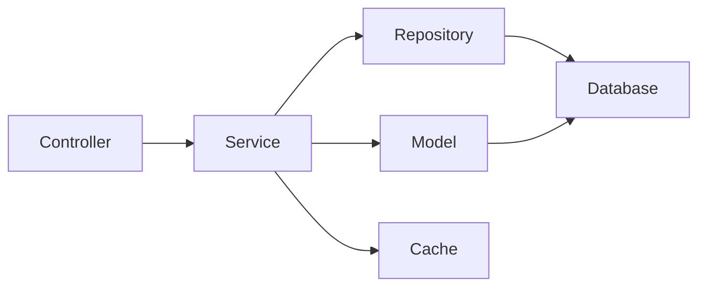

# P2.1 Service Layer Implementation Plan

## 1. Overview and Objectives

### 1.1 Purpose
This document provides detailed step-by-step instructions for implementing the service layer for The Strengths Toolbox website. The service layer encapsulates business logic, provides abstraction for data operations, and coordinates between controllers and repositories/models.

### 1.2 Scope
This implementation plan covers tasks P2.1.1 through P2.1.6:
- **P2.1.1**: Create PageService
- **P2.1.2**: Create BlogPostService
- **P2.1.3**: Create FormService
- **P2.1.4**: Create SEOService
- **P2.1.5**: Create EmailService
- **P2.1.6**: Create CacheService

### 1.3 Success Criteria
- All service classes created with proper structure
- Business logic properly encapsulated in services
- Dependency injection implemented correctly
- Error handling and logging in place
- Caching strategies implemented where appropriate
- Services are testable and maintainable
- All services follow clean code principles

## 2. Prerequisites

### 2.1 Required Knowledge
- Laravel service layer pattern
- Dependency injection in Laravel
- Eloquent ORM and model relationships
- Caching strategies in Laravel
- Exception handling
- Repository pattern (basic understanding)

### 2.2 Dependencies
- Task P1.2.3 completed (Eloquent models created)
- Task P1.3.2 completed (Service layer structure created)
- Task P2.2.1-P2.2.3 completed (Repositories created - optional, can work directly with models)
- Database migrations completed

### 2.3 Reference Documents
- Laravel MVC Architecture: `documentation/01-architecture/02-laravel-mvc-architecture.md`
- Database Architecture: `documentation/01-architecture/03-database-architecture.md`
- System Architecture Overview: `documentation/01-architecture/01-system-architecture-overview.md`

## 3. Service Layer Architecture

### 3.1 Service Layer Pattern
The service layer acts as an intermediary between controllers and data access layers, containing business logic that doesn't belong in controllers or models.



### 3.2 Service Responsibilities
- Business logic orchestration
- Data transformation and validation
- Caching management
- External API integration
- Complex query building
- Transaction management

### 3.3 Service Structure
All services follow a consistent structure:
- Constructor with dependency injection
- Public methods for business operations
- Protected methods for internal logic
- Proper error handling and logging
- Cache management where applicable

## 4. Task P2.1.1: Create PageService

### 4.1 Overview
Create a service to handle page-related business logic including retrieval, creation, updating, and caching of pages.

### 4.2 Step-by-Step Implementation

#### Step 1: Create Service Directory Structure
```bash
# Ensure Services directory exists
mkdir -p app/Services
```

#### Step 2: Create PageService Class

**File: `app/Services/PageService.php`**
```php
<?php

namespace App\Services;

use App\Models\Page;
use App\Repositories\PageRepository;
use Illuminate\Support\Facades\Cache;
use Illuminate\Support\Str;
use Illuminate\Database\Eloquent\Collection;

class PageService
{
    protected PageRepository $pageRepository;
    protected int $cacheTtl;

    public function __construct(PageRepository $pageRepository)
    {
        $this->pageRepository = $pageRepository;
        $this->cacheTtl = config('cache.ttl.pages', 3600); // 1 hour default
    }

    /**
     * Get a published page by slug
     *
     * @param string $slug
     * @return Page|null
     */
    public function getBySlug(string $slug): ?Page
    {
        return Cache::remember(
            "page.slug.{$slug}",
            $this->cacheTtl,
            fn() => $this->pageRepository->findPublishedBySlug($slug)
        );
    }

    /**
     * Get a page by ID (including unpublished)
     *
     * @param int $id
     * @return Page|null
     */
    public function getById(int $id): ?Page
    {
        return Cache::remember(
            "page.id.{$id}",
            $this->cacheTtl,
            fn() => $this->pageRepository->findById($id)
        );
    }

    /**
     * Get all published pages
     *
     * @return Collection
     */
    public function getAllPublished(): Collection
    {
        return Cache::remember(
            'pages.published.all',
            $this->cacheTtl,
            fn() => $this->pageRepository->getAllPublished()
        );
    }

    /**
     * Create a new page
     *
     * @param array $data
     * @return Page
     */
    public function create(array $data): Page
    {
        // Generate slug if not provided
        if (empty($data['slug'])) {
            $data['slug'] = $this->generateUniqueSlug($data['title']);
        } else {
            $data['slug'] = Str::slug($data['slug']);
        }

        $page = $this->pageRepository->create($data);

        // Clear relevant caches
        $this->clearPageCache($page);

        return $page;
    }

    /**
     * Update an existing page
     *
     * @param int $id
     * @param array $data
     * @return Page
     */
    public function update(int $id, array $data): Page
    {
        $page = $this->pageRepository->findById($id);

        if (!$page) {
            throw new \Exception("Page with ID {$id} not found");
        }

        // Update slug if title changed
        if (isset($data['title']) && $data['title'] !== $page->title) {
            if (empty($data['slug'])) {
                $data['slug'] = $this->generateUniqueSlug($data['title'], $id);
            }
        }

        if (isset($data['slug'])) {
            $data['slug'] = Str::slug($data['slug']);
        }

        $this->pageRepository->update($id, $data);
        $page->refresh();

        // Clear relevant caches
        $this->clearPageCache($page);

        return $page;
    }

    /**
     * Delete a page (soft delete)
     *
     * @param int $id
     * @return bool
     */
    public function delete(int $id): bool
    {
        $page = $this->pageRepository->findById($id);

        if (!$page) {
            throw new \Exception("Page with ID {$id} not found");
        }

        $result = $this->pageRepository->delete($id);

        // Clear relevant caches
        $this->clearPageCache($page);
        Cache::forget('pages.published.all');

        return $result;
    }

    /**
     * Generate a unique slug from title
     *
     * @param string $title
     * @param int|null $excludeId
     * @return string
     */
    protected function generateUniqueSlug(string $title, ?int $excludeId = null): string
    {
        $baseSlug = Str::slug($title);
        $slug = $baseSlug;
        $counter = 1;

        while ($this->pageRepository->slugExists($slug, $excludeId)) {
            $slug = $baseSlug . '-' . $counter;
            $counter++;
        }

        return $slug;
    }

    /**
     * Clear cache for a specific page
     *
     * @param Page $page
     * @return void
     */
    protected function clearPageCache(Page $page): void
    {
        Cache::forget("page.slug.{$page->slug}");
        Cache::forget("page.id.{$page->id}");
        Cache::forget('pages.published.all');
    }

    /**
     * Clear all page caches
     *
     * @return void
     */
    public function clearAllCache(): void
    {
        Cache::forget('pages.published.all');
        // Note: Individual page caches will expire naturally
    }
}
```

### 4.3 Validation
```bash
# Test the service
php artisan tinker

# In tinker:
$service = app(\App\Services\PageService::class);
$page = $service->getBySlug('about-us');
```

## 5. Task P2.1.2: Create BlogPostService

### 5.1 Overview
Create a service to handle blog post-related business logic including retrieval, creation, updating, publishing, and category/tag management.

### 5.2 Step-by-Step Implementation

**File: `app/Services/BlogPostService.php`**
```php
<?php

namespace App\Services;

use App\Models\BlogPost;
use App\Models\Category;
use App\Models\Tag;
use App\Repositories\BlogPostRepository;
use Illuminate\Support\Facades\Cache;
use Illuminate\Support\Str;
use Illuminate\Database\Eloquent\Collection;
use Carbon\Carbon;

class BlogPostService
{
    protected BlogPostRepository $blogPostRepository;
    protected int $cacheTtl;

    public function __construct(BlogPostRepository $blogPostRepository)
    {
        $this->blogPostRepository = $blogPostRepository;
        $this->cacheTtl = config('cache.ttl.blog_posts', 3600);
    }

    /**
     * Get a published blog post by slug
     *
     * @param string $slug
     * @return BlogPost|null
     */
    public function getPublishedBySlug(string $slug): ?BlogPost
    {
        return Cache::remember(
            "blog_post.published.slug.{$slug}",
            $this->cacheTtl,
            fn() => $this->blogPostRepository->findPublishedBySlug($slug)
        );
    }

    /**
     * Get a blog post by ID
     *
     * @param int $id
     * @return BlogPost|null
     */
    public function getById(int $id): ?BlogPost
    {
        return Cache::remember(
            "blog_post.id.{$id}",
            $this->cacheTtl,
            fn() => $this->blogPostRepository->findById($id)
        );
    }

    /**
     * Get paginated published blog posts
     *
     * @param int $perPage
     * @return \Illuminate\Contracts\Pagination\LengthAwarePaginator
     */
    public function getPublishedPaginated(int $perPage = 10)
    {
        $page = request()->get('page', 1);

        return Cache::remember(
            "blog_posts.published.page.{$page}.per_page.{$perPage}",
            $this->cacheTtl,
            fn() => $this->blogPostRepository->getPublishedPaginated($perPage)
        );
    }

    /**
     * Get recent blog posts
     *
     * @param int $limit
     * @return Collection
     */
    public function getRecent(int $limit = 5): Collection
    {
        return Cache::remember(
            "blog_posts.recent.{$limit}",
            $this->cacheTtl,
            fn() => $this->blogPostRepository->getRecent($limit)
        );
    }

    /**
     * Get blog posts by category
     *
     * @param string $categorySlug
     * @param int $perPage
     * @return \Illuminate\Contracts\Pagination\LengthAwarePaginator
     */
    public function getByCategory(string $categorySlug, int $perPage = 10)
    {
        $category = Category::where('slug', $categorySlug)->first();

        if (!$category) {
            return null;
        }

        $page = request()->get('page', 1);

        return Cache::remember(
            "blog_posts.category.{$categorySlug}.page.{$page}",
            $this->cacheTtl,
            fn() => $this->blogPostRepository->getByCategory($category->id, $perPage)
        );
    }

    /**
     * Get blog posts by tag
     *
     * @param string $tagSlug
     * @param int $perPage
     * @return \Illuminate\Contracts\Pagination\LengthAwarePaginator
     */
    public function getByTag(string $tagSlug, int $perPage = 10)
    {
        $tag = Tag::where('slug', $tagSlug)->first();

        if (!$tag) {
            return null;
        }

        $page = request()->get('page', 1);

        return Cache::remember(
            "blog_posts.tag.{$tagSlug}.page.{$page}",
            $this->cacheTtl,
            fn() => $this->blogPostRepository->getByTag($tag->id, $perPage)
        );
    }

    /**
     * Search blog posts
     *
     * @param string $query
     * @param int $perPage
     * @return \Illuminate\Contracts\Pagination\LengthAwarePaginator
     */
    public function search(string $query, int $perPage = 10)
    {
        return $this->blogPostRepository->search($query, $perPage);
    }

    /**
     * Create a new blog post
     *
     * @param array $data
     * @return BlogPost
     */
    public function create(array $data): BlogPost
    {
        // Generate slug if not provided
        if (empty($data['slug'])) {
            $data['slug'] = $this->generateUniqueSlug($data['title']);
        } else {
            $data['slug'] = Str::slug($data['slug']);
        }

        // Handle published_at
        if (isset($data['is_published']) && $data['is_published']) {
            if (empty($data['published_at'])) {
                $data['published_at'] = Carbon::now();
            }
        } else {
            $data['published_at'] = null;
        }

        // Extract categories and tags
        $categoryIds = $data['category_ids'] ?? [];
        $tagIds = $data['tag_ids'] ?? [];
        unset($data['category_ids'], $data['tag_ids']);

        $post = $this->blogPostRepository->create($data);

        // Attach categories and tags
        if (!empty($categoryIds)) {
            $post->categories()->sync($categoryIds);
        }

        if (!empty($tagIds)) {
            $post->tags()->sync($tagIds);
        }

        // Clear relevant caches
        $this->clearBlogPostCache($post);

        return $post->load(['categories', 'tags', 'author']);
    }

    /**
     * Update an existing blog post
     *
     * @param int $id
     * @param array $data
     * @return BlogPost
     */
    public function update(int $id, array $data): BlogPost
    {
        $post = $this->blogPostRepository->findById($id);

        if (!$post) {
            throw new \Exception("Blog post with ID {$id} not found");
        }

        // Update slug if title changed
        if (isset($data['title']) && $data['title'] !== $post->title) {
            if (empty($data['slug'])) {
                $data['slug'] = $this->generateUniqueSlug($data['title'], $id);
            }
        }

        if (isset($data['slug'])) {
            $data['slug'] = Str::slug($data['slug']);
        }

        // Handle published_at
        if (isset($data['is_published'])) {
            if ($data['is_published'] && empty($data['published_at'])) {
                $data['published_at'] = $post->published_at ?? Carbon::now();
            } elseif (!$data['is_published']) {
                $data['published_at'] = null;
            }
        }

        // Extract categories and tags
        $categoryIds = $data['category_ids'] ?? null;
        $tagIds = $data['tag_ids'] ?? null;
        unset($data['category_ids'], $data['tag_ids']);

        $this->blogPostRepository->update($id, $data);
        $post->refresh();

        // Sync categories and tags if provided
        if ($categoryIds !== null) {
            $post->categories()->sync($categoryIds);
        }

        if ($tagIds !== null) {
            $post->tags()->sync($tagIds);
        }

        // Clear relevant caches
        $this->clearBlogPostCache($post);

        return $post->load(['categories', 'tags', 'author']);
    }

    /**
     * Delete a blog post (soft delete)
     *
     * @param int $id
     * @return bool
     */
    public function delete(int $id): bool
    {
        $post = $this->blogPostRepository->findById($id);

        if (!$post) {
            throw new \Exception("Blog post with ID {$id} not found");
        }

        $result = $this->blogPostRepository->delete($id);

        // Clear relevant caches
        $this->clearBlogPostCache($post);
        $this->clearAllBlogPostCache();

        return $result;
    }

    /**
     * Generate a unique slug from title
     *
     * @param string $title
     * @param int|null $excludeId
     * @return string
     */
    protected function generateUniqueSlug(string $title, ?int $excludeId = null): string
    {
        $baseSlug = Str::slug($title);
        $slug = $baseSlug;
        $counter = 1;

        while ($this->blogPostRepository->slugExists($slug, $excludeId)) {
            $slug = $baseSlug . '-' . $counter;
            $counter++;
        }

        return $slug;
    }

    /**
     * Clear cache for a specific blog post
     *
     * @param BlogPost $post
     * @return void
     */
    protected function clearBlogPostCache(BlogPost $post): void
    {
        Cache::forget("blog_post.published.slug.{$post->slug}");
        Cache::forget("blog_post.id.{$post->id}");
        $this->clearAllBlogPostCache();
    }

    /**
     * Clear all blog post caches
     *
     * @return void
     */
    public function clearAllBlogPostCache(): void
    {
        Cache::forget('blog_posts.published.page.*');
        Cache::forget('blog_posts.recent.*');
        // Note: Individual post caches will expire naturally
    }
}
```

### 5.3 Validation
Test the service using tinker or create a test route.

## 6. Task P2.1.3: Create FormService

### 6.1 Overview
Create a service to handle form-related business logic including form retrieval, submission processing, and email notifications.

### 6.2 Step-by-Step Implementation

**File: `app/Services/FormService.php`**
```php
<?php

namespace App\Services;

use App\Models\Form;
use App\Models\FormSubmission;
use App\Repositories\FormRepository;
use App\Services\EmailService;
use Illuminate\Support\Facades\Log;
use Illuminate\Support\Str;

class FormService
{
    protected FormRepository $formRepository;
    protected EmailService $emailService;

    public function __construct(
        FormRepository $formRepository,
        EmailService $emailService
    ) {
        $this->formRepository = $formRepository;
        $this->emailService = $emailService;
    }

    /**
     * Get a form by slug
     *
     * @param string $slug
     * @return Form|null
     */
    public function getBySlug(string $slug): ?Form
    {
        return $this->formRepository->findBySlug($slug);
    }

    /**
     * Get a form by ID
     *
     * @param int $id
     * @return Form|null
     */
    public function getById(int $id): ?Form
    {
        return $this->formRepository->findById($id);
    }

    /**
     * Get all active forms
     *
     * @return \Illuminate\Database\Eloquent\Collection
     */
    public function getAllActive()
    {
        return $this->formRepository->getAllActive();
    }

    /**
     * Create a new form
     *
     * @param array $data
     * @return Form
     */
    public function create(array $data): Form
    {
        // Generate slug if not provided
        if (empty($data['slug'])) {
            $data['slug'] = $this->generateUniqueSlug($data['name']);
        } else {
            $data['slug'] = Str::slug($data['slug']);
        }

        // Ensure fields is JSON
        if (isset($data['fields']) && is_array($data['fields'])) {
            $data['fields'] = json_encode($data['fields']);
        }

        return $this->formRepository->create($data);
    }

    /**
     * Update an existing form
     *
     * @param int $id
     * @param array $data
     * @return Form
     */
    public function update(int $id, array $data): Form
    {
        $form = $this->formRepository->findById($id);

        if (!$form) {
            throw new \Exception("Form with ID {$id} not found");
        }

        // Update slug if name changed
        if (isset($data['name']) && $data['name'] !== $form->name) {
            if (empty($data['slug'])) {
                $data['slug'] = $this->generateUniqueSlug($data['name'], $id);
            }
        }

        if (isset($data['slug'])) {
            $data['slug'] = Str::slug($data['slug']);
        }

        // Ensure fields is JSON
        if (isset($data['fields']) && is_array($data['fields'])) {
            $data['fields'] = json_encode($data['fields']);
        }

        $this->formRepository->update($id, $data);
        $form->refresh();

        return $form;
    }

    /**
     * Delete a form
     *
     * @param int $id
     * @return bool
     */
    public function delete(int $id): bool
    {
        $form = $this->formRepository->findById($id);

        if (!$form) {
            throw new \Exception("Form with ID {$id} not found");
        }

        return $this->formRepository->delete($id);
    }

    /**
     * Process form submission
     *
     * @param int $formId
     * @param array $submissionData
     * @return FormSubmission
     */
    public function submit(int $formId, array $submissionData): FormSubmission
    {
        $form = $this->formRepository->findById($formId);

        if (!$form) {
            throw new \Exception("Form with ID {$formId} not found");
        }

        if (!$form->is_active) {
            throw new \Exception("Form is not active");
        }

        // Validate submission data against form fields
        $this->validateSubmission($form, $submissionData);

        // Create submission record
        $submission = FormSubmission::create([
            'form_id' => $formId,
            'data' => json_encode($submissionData),
            'ip_address' => request()->ip(),
            'user_id' => auth()->id(),
        ]);

        // Send email notification if configured
        if ($form->email_to) {
            try {
                $this->emailService->sendFormSubmissionNotification(
                    $form->email_to,
                    $form,
                    $submission
                );
            } catch (\Exception $e) {
                Log::error('Failed to send form submission email', [
                    'form_id' => $formId,
                    'submission_id' => $submission->id,
                    'error' => $e->getMessage(),
                ]);
            }
        }

        return $submission;
    }

    /**
     * Validate submission data against form fields
     *
     * @param Form $form
     * @param array $submissionData
     * @return void
     * @throws \Exception
     */
    protected function validateSubmission(Form $form, array $submissionData): void
    {
        $fields = json_decode($form->fields, true) ?? [];

        foreach ($fields as $field) {
            $fieldName = $field['name'] ?? null;
            $required = $field['required'] ?? false;
            $fieldType = $field['type'] ?? 'text';

            if ($required && empty($submissionData[$fieldName])) {
                throw new \Exception("Field '{$fieldName}' is required");
            }

            // Additional validation based on field type
            if (!empty($submissionData[$fieldName])) {
                $this->validateFieldType($fieldType, $fieldName, $submissionData[$fieldName]);
            }
        }
    }

    /**
     * Validate field value based on type
     *
     * @param string $type
     * @param string $fieldName
     * @param mixed $value
     * @return void
     * @throws \Exception
     */
    protected function validateFieldType(string $type, string $fieldName, $value): void
    {
        switch ($type) {
            case 'email':
                if (!filter_var($value, FILTER_VALIDATE_EMAIL)) {
                    throw new \Exception("Field '{$fieldName}' must be a valid email address");
                }
                break;

            case 'url':
                if (!filter_var($value, FILTER_VALIDATE_URL)) {
                    throw new \Exception("Field '{$fieldName}' must be a valid URL");
                }
                break;

            case 'number':
                if (!is_numeric($value)) {
                    throw new \Exception("Field '{$fieldName}' must be a number");
                }
                break;
        }
    }

    /**
     * Get submissions for a form
     *
     * @param int $formId
     * @param int $perPage
     * @return \Illuminate\Contracts\Pagination\LengthAwarePaginator
     */
    public function getSubmissions(int $formId, int $perPage = 20)
    {
        return FormSubmission::where('form_id', $formId)
            ->orderBy('created_at', 'desc')
            ->paginate($perPage);
    }

    /**
     * Generate a unique slug from name
     *
     * @param string $name
     * @param int|null $excludeId
     * @return string
     */
    protected function generateUniqueSlug(string $name, ?int $excludeId = null): string
    {
        $baseSlug = Str::slug($name);
        $slug = $baseSlug;
        $counter = 1;

        while ($this->formRepository->slugExists($slug, $excludeId)) {
            $slug = $baseSlug . '-' . $counter;
            $counter++;
        }

        return $slug;
    }
}
```

### 6.3 Validation
Test form submission processing and email notifications.

## 7. Task P2.1.4: Create SEOService

### 7.1 Overview
Create a service to handle SEO-related operations including meta tag generation, schema markup, and Open Graph tags.

### 7.2 Step-by-Step Implementation

**File: `app/Services/SEOService.php`**
```php
<?php

namespace App\Services;

use App\Models\Page;
use App\Models\BlogPost;
use Illuminate\Support\Facades\Cache;

class SEOService
{
    protected int $cacheTtl;

    public function __construct()
    {
        $this->cacheTtl = config('cache.ttl.seo', 7200); // 2 hours
    }

    /**
     * Get SEO metadata for a page
     *
     * @param Page $page
     * @return array
     */
    public function getPageMeta(Page $page): array
    {
        return Cache::remember(
            "seo.page.{$page->id}",
            $this->cacheTtl,
            function () use ($page) {
                $seo = $page->seo;

                return [
                    'title' => $seo->meta_title ?? $page->title,
                    'description' => $seo->meta_description ?? $this->generateDescription($page->content),
                    'keywords' => $seo->meta_keywords ?? '',
                    'canonical' => $seo->canonical_url ?? url('/' . $page->slug),
                    'og_title' => $seo->og_title ?? $page->title,
                    'og_description' => $seo->og_description ?? $this->generateDescription($page->content),
                    'og_image' => $seo->og_image ?? config('app.og_default_image'),
                    'og_type' => $seo->og_type ?? 'website',
                    'twitter_card' => $seo->twitter_card ?? 'summary_large_image',
                    'twitter_title' => $seo->twitter_title ?? $page->title,
                    'twitter_description' => $seo->twitter_description ?? $this->generateDescription($page->content),
                    'twitter_image' => $seo->twitter_image ?? config('app.og_default_image'),
                    'schema' => $this->generatePageSchema($page),
                ];
            }
        );
    }

    /**
     * Get SEO metadata for a blog post
     *
     * @param BlogPost $post
     * @return array
     */
    public function getBlogPostMeta(BlogPost $post): array
    {
        return Cache::remember(
            "seo.blog_post.{$post->id}",
            $this->cacheTtl,
            function () use ($post) {
                $seo = $post->seo;

                return [
                    'title' => $seo->meta_title ?? $post->title,
                    'description' => $seo->meta_description ?? $post->excerpt ?? $this->generateDescription($post->content),
                    'keywords' => $seo->meta_keywords ?? '',
                    'canonical' => $seo->canonical_url ?? url('/blog/' . $post->slug),
                    'og_title' => $seo->og_title ?? $post->title,
                    'og_description' => $seo->og_description ?? $post->excerpt ?? $this->generateDescription($post->content),
                    'og_image' => $seo->og_image ?? $post->featured_image ?? config('app.og_default_image'),
                    'og_type' => $seo->og_type ?? 'article',
                    'twitter_card' => $seo->twitter_card ?? 'summary_large_image',
                    'twitter_title' => $seo->twitter_title ?? $post->title,
                    'twitter_description' => $seo->twitter_description ?? $post->excerpt ?? $this->generateDescription($post->content),
                    'twitter_image' => $seo->twitter_image ?? $post->featured_image ?? config('app.og_default_image'),
                    'schema' => $this->generateArticleSchema($post),
                ];
            }
        );
    }

    /**
     * Generate default SEO metadata
     *
     * @return array
     */
    public function getDefaultMeta(): array
    {
        return [
            'title' => config('app.name') . ' - ' . config('app.tagline', ''),
            'description' => config('app.description', ''),
            'keywords' => config('app.keywords', ''),
            'canonical' => url('/'),
            'og_title' => config('app.name'),
            'og_description' => config('app.description', ''),
            'og_image' => config('app.og_default_image'),
            'og_type' => 'website',
            'twitter_card' => 'summary_large_image',
            'twitter_title' => config('app.name'),
            'twitter_description' => config('app.description', ''),
            'twitter_image' => config('app.og_default_image'),
            'schema' => $this->generateWebsiteSchema(),
        ];
    }

    /**
     * Generate description from content
     *
     * @param string $content
     * @param int $length
     * @return string
     */
    protected function generateDescription(string $content, int $length = 160): string
    {
        // Strip HTML tags
        $text = strip_tags($content);
        // Remove extra whitespace
        $text = preg_replace('/\s+/', ' ', $text);
        // Trim and truncate
        $text = trim($text);
        
        if (strlen($text) <= $length) {
            return $text;
        }

        return substr($text, 0, $length - 3) . '...';
    }

    /**
     * Generate schema markup for a page
     *
     * @param Page $page
     * @return array
     */
    protected function generatePageSchema(Page $page): array
    {
        return [
            '@context' => 'https://schema.org',
            '@type' => 'WebPage',
            'name' => $page->title,
            'description' => $this->generateDescription($page->content),
            'url' => url('/' . $page->slug),
            'inLanguage' => config('app.locale', 'en'),
            'isPartOf' => [
                '@type' => 'WebSite',
                'name' => config('app.name'),
                'url' => url('/'),
            ],
        ];
    }

    /**
     * Generate schema markup for a blog post (Article)
     *
     * @param BlogPost $post
     * @return array
     */
    protected function generateArticleSchema(BlogPost $post): array
    {
        $schema = [
            '@context' => 'https://schema.org',
            '@type' => 'Article',
            'headline' => $post->title,
            'description' => $post->excerpt ?? $this->generateDescription($post->content),
            'url' => url('/blog/' . $post->slug),
            'datePublished' => $post->published_at?->toIso8601String(),
            'dateModified' => $post->updated_at->toIso8601String(),
            'author' => [
                '@type' => 'Person',
                'name' => $post->author->name ?? config('app.name'),
            ],
            'publisher' => [
                '@type' => 'Organization',
                'name' => config('app.name'),
                'logo' => [
                    '@type' => 'ImageObject',
                    'url' => config('app.logo_url'),
                ],
            ],
        ];

        if ($post->featured_image) {
            $schema['image'] = [
                '@type' => 'ImageObject',
                'url' => asset($post->featured_image),
            ];
        }

        if ($post->categories->isNotEmpty()) {
            $schema['articleSection'] = $post->categories->first()->name;
        }

        return $schema;
    }

    /**
     * Generate schema markup for website
     *
     * @return array
     */
    protected function generateWebsiteSchema(): array
    {
        return [
            '@context' => 'https://schema.org',
            '@type' => 'WebSite',
            'name' => config('app.name'),
            'url' => url('/'),
            'description' => config('app.description', ''),
            'inLanguage' => config('app.locale', 'en'),
            'publisher' => [
                '@type' => 'Organization',
                'name' => config('app.name'),
                'logo' => [
                    '@type' => 'ImageObject',
                    'url' => config('app.logo_url'),
                ],
            ],
        ];
    }

    /**
     * Generate breadcrumb schema
     *
     * @param array $items
     * @return array
     */
    public function generateBreadcrumbSchema(array $items): array
    {
        $breadcrumbList = [
            '@context' => 'https://schema.org',
            '@type' => 'BreadcrumbList',
            'itemListElement' => [],
        ];

        foreach ($items as $position => $item) {
            $breadcrumbList['itemListElement'][] = [
                '@type' => 'ListItem',
                'position' => $position + 1,
                'name' => $item['name'],
                'item' => $item['url'] ?? null,
            ];
        }

        return $breadcrumbList;
    }

    /**
     * Clear SEO cache for a page
     *
     * @param Page $page
     * @return void
     */
    public function clearPageCache(Page $page): void
    {
        Cache::forget("seo.page.{$page->id}");
    }

    /**
     * Clear SEO cache for a blog post
     *
     * @param BlogPost $post
     * @return void
     */
    public function clearBlogPostCache(BlogPost $post): void
    {
        Cache::forget("seo.blog_post.{$post->id}");
    }
}
```

### 7.3 Configuration
Add SEO configuration to `config/app.php`:
```php
'og_default_image' => env('OG_DEFAULT_IMAGE', '/images/og-default.jpg'),
'logo_url' => env('LOGO_URL', '/images/logo.png'),
'description' => env('APP_DESCRIPTION', 'The Strengths Toolbox'),
'keywords' => env('APP_KEYWORDS', 'strengths, team building, leadership'),
```

## 8. Task P2.1.5: Create EmailService

### 8.1 Overview
Create a service to handle email operations including form submission notifications, contact emails, and other transactional emails.

### 8.2 Step-by-Step Implementation

**File: `app/Services/EmailService.php`**
```php
<?php

namespace App\Services;

use App\Models\Form;
use App\Models\FormSubmission;
use Illuminate\Support\Facades\Mail;
use Illuminate\Support\Facades\Log;
use App\Mail\FormSubmissionNotification;
use App\Mail\ContactFormMail;

class EmailService
{
    /**
     * Send form submission notification email
     *
     * @param string $to
     * @param Form $form
     * @param FormSubmission $submission
     * @return void
     */
    public function sendFormSubmissionNotification(
        string $to,
        Form $form,
        FormSubmission $submission
    ): void {
        try {
            Mail::to($to)->send(
                new FormSubmissionNotification($form, $submission)
            );
        } catch (\Exception $e) {
            Log::error('Failed to send form submission email', [
                'to' => $to,
                'form_id' => $form->id,
                'submission_id' => $submission->id,
                'error' => $e->getMessage(),
            ]);
            throw $e;
        }
    }

    /**
     * Send contact form email
     *
     * @param array $data
     * @return void
     */
    public function sendContactForm(array $data): void
    {
        try {
            $to = config('mail.contact_to', config('mail.from.address'));

            Mail::to($to)->send(new ContactFormMail($data));
        } catch (\Exception $e) {
            Log::error('Failed to send contact form email', [
                'data' => $data,
                'error' => $e->getMessage(),
            ]);
            throw $e;
        }
    }

    /**
     * Send email to multiple recipients
     *
     * @param array|string $to
     * @param string $subject
     * @param string $view
     * @param array $data
     * @return void
     */
    public function send($to, string $subject, string $view, array $data = []): void
    {
        try {
            Mail::send($view, $data, function ($message) use ($to, $subject) {
                if (is_array($to)) {
                    $message->to($to);
                } else {
                    $message->to($to);
                }
                $message->subject($subject);
            });
        } catch (\Exception $e) {
            Log::error('Failed to send email', [
                'to' => $to,
                'subject' => $subject,
                'error' => $e->getMessage(),
            ]);
            throw $e;
        }
    }
}
```

### 8.3 Create Mail Classes

**File: `app/Mail/FormSubmissionNotification.php`**
```php
<?php

namespace App\Mail;

use App\Models\Form;
use App\Models\FormSubmission;
use Illuminate\Bus\Queueable;
use Illuminate\Mail\Mailable;
use Illuminate\Queue\SerializesModels;

class FormSubmissionNotification extends Mailable
{
    use Queueable, SerializesModels;

    public Form $form;
    public FormSubmission $submission;

    public function __construct(Form $form, FormSubmission $submission)
    {
        $this->form = $form;
        $this->submission = $submission;
    }

    public function build()
    {
        $submissionData = json_decode($this->submission->data, true);

        return $this->subject("New {$this->form->name} Submission")
            ->view('emails.form-submission')
            ->with([
                'form' => $this->form,
                'submission' => $this->submission,
                'data' => $submissionData,
            ]);
    }
}
```

**File: `app/Mail/ContactFormMail.php`**
```php
<?php

namespace App\Mail;

use Illuminate\Bus\Queueable;
use Illuminate\Mail\Mailable;
use Illuminate\Queue\SerializesModels;

class ContactFormMail extends Mailable
{
    use Queueable, SerializesModels;

    public array $data;

    public function __construct(array $data)
    {
        $this->data = $data;
    }

    public function build()
    {
        return $this->subject('New Contact Form Submission')
            ->view('emails.contact')
            ->with(['data' => $this->data]);
    }
}
```

## 9. Task P2.1.6: Create CacheService

### 9.1 Overview
Create a service to manage application-wide caching strategies and provide a centralized cache management interface.

### 9.2 Step-by-Step Implementation

**File: `app/Services/CacheService.php`**
```php
<?php

namespace App\Services;

use Illuminate\Support\Facades\Cache;
use Illuminate\Support\Facades\Artisan;

class CacheService
{
    /**
     * Clear all application cache
     *
     * @return void
     */
    public function clearAll(): void
    {
        Artisan::call('cache:clear');
        Artisan::call('config:clear');
        Artisan::call('route:clear');
        Artisan::call('view:clear');
    }

    /**
     * Clear cache for a specific tag pattern
     *
     * @param string $pattern
     * @return void
     */
    public function clearByPattern(string $pattern): void
    {
        // Note: This works with file cache driver
        // For Redis/Memcached, use cache tags
        $this->clearAll();
    }

    /**
     * Clear page-related caches
     *
     * @return void
     */
    public function clearPages(): void
    {
        Cache::forget('pages.published.all');
        // Individual page caches will expire naturally
    }

    /**
     * Clear blog post-related caches
     *
     * @return void
     */
    public function clearBlogPosts(): void
    {
        $this->clearAll(); // Simplified for file cache
    }

    /**
     * Clear SEO-related caches
     *
     * @return void
     */
    public function clearSEO(): void
    {
        $this->clearAll(); // Simplified for file cache
    }

    /**
     * Warm up frequently accessed caches
     *
     * @return void
     */
    public function warmUp(): void
    {
        // This can be called via a scheduled command
        // Pre-load common data into cache
    }

    /**
     * Get cache statistics
     *
     * @return array
     */
    public function getStats(): array
    {
        // Basic stats - implementation depends on cache driver
        return [
            'driver' => config('cache.default'),
            'ttl' => config('cache.ttl', []),
        ];
    }
}
```

### 9.3 Cache Configuration

Add to `config/cache.php`:
```php
'ttl' => [
    'pages' => env('CACHE_TTL_PAGES', 3600),
    'blog_posts' => env('CACHE_TTL_BLOG_POSTS', 3600),
    'seo' => env('CACHE_TTL_SEO', 7200),
],
```

## 10. Service Registration

### 10.1 Service Provider (Optional)
If you want to register services with specific bindings, create or update `app/Providers/AppServiceProvider.php`:

```php
<?php

namespace App\Providers;

use Illuminate\Support\ServiceProvider;
use App\Services\PageService;
use App\Services\BlogPostService;
use App\Services\FormService;
use App\Services\SEOService;
use App\Services\EmailService;
use App\Services\CacheService;

class AppServiceProvider extends ServiceProvider
{
    public function register(): void
    {
        // Services are auto-resolved via dependency injection
        // No explicit binding needed unless you want interfaces
    }

    public function boot(): void
    {
        //
    }
}
```

## 11. Testing and Validation

### 11.1 Test Each Service
```bash
php artisan tinker

# Test PageService
$pageService = app(\App\Services\PageService::class);
$page = $pageService->getBySlug('about-us');

# Test BlogPostService
$blogService = app(\App\Services\BlogPostService::class);
$posts = $blogService->getPublishedPaginated(10);

# Test FormService
$formService = app(\App\Services\FormService::class);
$form = $formService->getBySlug('contact');

# Test SEOService
$seoService = app(\App\Services\SEOService::class);
$meta = $seoService->getDefaultMeta();

# Test EmailService
$emailService = app(\App\Services\EmailService::class);
// Test with actual form submission

# Test CacheService
$cacheService = app(\App\Services\CacheService::class);
$cacheService->clearAll();
```

### 11.2 Common Issues and Solutions

#### Issue: Service not found
**Solution**: Ensure the service class exists and namespace is correct. Check autoload with `composer dump-autoload`.

#### Issue: Repository dependency not resolved
**Solution**: Ensure repositories are created (P2.2) or modify services to work directly with models.

#### Issue: Cache not working
**Solution**: 
- Verify cache driver in `.env`: `CACHE_DRIVER=file`
- Check cache directory permissions: `storage/framework/cache`
- Clear config cache: `php artisan config:clear`

#### Issue: Email not sending
**Solution**:
- Check mail configuration in `.env`
- Verify SMTP credentials
- Check mail logs: `storage/logs/laravel.log`
- For development, use `MAIL_MAILER=log` to see emails in logs

## 12. References

### 12.1 Architecture Documents
- Laravel MVC Architecture: `documentation/01-architecture/02-laravel-mvc-architecture.md`
- Database Architecture: `documentation/01-architecture/03-database-architecture.md`
- System Architecture Overview: `documentation/01-architecture/01-system-architecture-overview.md`

### 12.2 External Resources
- [Laravel Service Container](https://laravel.com/docs/10.x/container)
- [Laravel Dependency Injection](https://laravel.com/docs/10.x/container#dependency-injection)
- [Laravel Caching](https://laravel.com/docs/10.x/cache)
- [Laravel Mail](https://laravel.com/docs/10.x/mail)

### 12.3 Related Tasks
- **Previous Task**: P1.3.2 - Set up service layer structure
- **Next Task**: P2.2 - Repository Layer Implementation
- **Dependent Tasks**: P2.3 - Controllers (will use these services)

---

**Document Version**: 1.0  
**Last Updated**: 2025  
**Status**: Ready for Implementation
