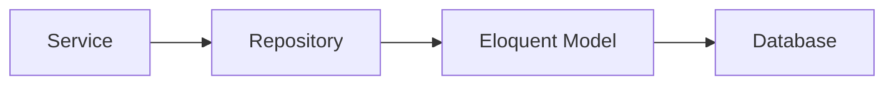

# P2.2 Repository Layer Implementation Plan

## 1. Overview and Objectives

### 1.1 Purpose
This document provides detailed step-by-step instructions for implementing the repository layer for The Strengths Toolbox website. The repository pattern provides an abstraction layer for data access, making the codebase more testable and maintainable.

### 1.2 Scope
This implementation plan covers tasks P2.2.1 through P2.2.3:
- **P2.2.1**: Create PageRepository
- **P2.2.2**: Create BlogPostRepository
- **P2.2.3**: Create FormRepository

### 1.3 Success Criteria
- All repository classes created with proper structure
- Data access logic properly abstracted
- Query optimization implemented
- Eager loading for relationships
- Repository methods are testable
- Consistent interface across repositories

## 2. Prerequisites

### 2.1 Required Knowledge
- Repository pattern
- Laravel Eloquent ORM
- Query optimization techniques
- Eager loading relationships
- Database indexing

### 2.2 Dependencies
- Task P1.2.3 completed (Eloquent models created)
- Task P1.3.3 completed (Repository structure created)
- Database migrations completed
- Model relationships defined

### 2.3 Reference Documents
- Laravel MVC Architecture: `documentation/01-architecture/02-laravel-mvc-architecture.md`
- Database Architecture: `documentation/01-architecture/03-database-architecture.md`
- System Architecture Overview: `documentation/01-architecture/01-system-architecture-overview.md`

## 3. Repository Pattern Overview

### 3.1 Repository Pattern Benefits
- Abstraction of data access logic
- Easier testing (can mock repositories)
- Centralized query logic
- Consistent data access patterns
- Easier to swap data sources

### 3.2 Repository Structure


### 3.3 Repository Responsibilities
- Data retrieval (find, get, paginate)
- Data manipulation (create, update, delete)
- Query building and optimization
- Eager loading relationships
- Filtering and searching

## 4. Task P2.2.1: Create PageRepository

### 4.1 Overview
Create a repository to handle all data access operations for pages, including queries, filtering, and optimization.

### 4.2 Step-by-Step Implementation

#### Step 1: Create Repository Directory Structure
```bash
# Ensure Repositories directory exists
mkdir -p app/Repositories
```

#### Step 2: Create PageRepository Class

**File: `app/Repositories/PageRepository.php`**
```php
<?php

namespace App\Repositories;

use App\Models\Page;
use Illuminate\Database\Eloquent\Collection;
use Illuminate\Contracts\Pagination\LengthAwarePaginator;

class PageRepository
{
    protected Page $model;

    public function __construct(Page $model)
    {
        $this->model = $model;
    }

    /**
     * Find a page by ID
     *
     * @param int $id
     * @return Page|null
     */
    public function findById(int $id): ?Page
    {
        return $this->model->with('seo')->find($id);
    }

    /**
     * Find a published page by slug
     *
     * @param string $slug
     * @return Page|null
     */
    public function findPublishedBySlug(string $slug): ?Page
    {
        return $this->model
            ->where('slug', $slug)
            ->where('is_published', true)
            ->with('seo')
            ->first();
    }

    /**
     * Find a page by slug (including unpublished)
     *
     * @param string $slug
     * @return Page|null
     */
    public function findBySlug(string $slug): ?Page
    {
        return $this->model
            ->where('slug', $slug)
            ->with('seo')
            ->first();
    }

    /**
     * Get all published pages
     *
     * @return Collection
     */
    public function getAllPublished(): Collection
    {
        return $this->model
            ->where('is_published', true)
            ->orderBy('created_at', 'desc')
            ->with('seo')
            ->get();
    }

    /**
     * Get all pages (including unpublished)
     *
     * @return Collection
     */
    public function getAll(): Collection
    {
        return $this->model
            ->orderBy('created_at', 'desc')
            ->with('seo')
            ->get();
    }

    /**
     * Get paginated pages
     *
     * @param int $perPage
     * @param array $filters
     * @return LengthAwarePaginator
     */
    public function getPaginated(int $perPage = 15, array $filters = []): LengthAwarePaginator
    {
        $query = $this->model->with('seo');

        // Apply filters
        if (isset($filters['is_published'])) {
            $query->where('is_published', $filters['is_published']);
        }

        if (isset($filters['search'])) {
            $query->where(function ($q) use ($filters) {
                $q->where('title', 'like', '%' . $filters['search'] . '%')
                  ->orWhere('content', 'like', '%' . $filters['search'] . '%');
            });
        }

        return $query
            ->orderBy('created_at', 'desc')
            ->paginate($perPage);
    }

    /**
     * Create a new page
     *
     * @param array $data
     * @return Page
     */
    public function create(array $data): Page
    {
        return $this->model->create($data);
    }

    /**
     * Update an existing page
     *
     * @param int $id
     * @param array $data
     * @return bool
     */
    public function update(int $id, array $data): bool
    {
        $page = $this->model->find($id);

        if (!$page) {
            return false;
        }

        return $page->update($data);
    }

    /**
     * Delete a page (soft delete)
     *
     * @param int $id
     * @return bool
     */
    public function delete(int $id): bool
    {
        $page = $this->model->find($id);

        if (!$page) {
            return false;
        }

        return $page->delete();
    }

    /**
     * Check if a slug exists
     *
     * @param string $slug
     * @param int|null $excludeId
     * @return bool
     */
    public function slugExists(string $slug, ?int $excludeId = null): bool
    {
        $query = $this->model->where('slug', $slug);

        if ($excludeId) {
            $query->where('id', '!=', $excludeId);
        }

        return $query->exists();
    }

    /**
     * Get pages by multiple slugs
     *
     * @param array $slugs
     * @return Collection
     */
    public function getBySlugs(array $slugs): Collection
    {
        return $this->model
            ->whereIn('slug', $slugs)
            ->where('is_published', true)
            ->with('seo')
            ->get();
    }

    /**
     * Get featured pages
     *
     * @param int $limit
     * @return Collection
     */
    public function getFeatured(int $limit = 5): Collection
    {
        return $this->model
            ->where('is_published', true)
            ->where('is_featured', true)
            ->orderBy('created_at', 'desc')
            ->limit($limit)
            ->with('seo')
            ->get();
    }
}
```

### 4.3 Validation
```bash
php artisan tinker

$repo = app(\App\Repositories\PageRepository::class);
$page = $repo->findPublishedBySlug('about-us');
```

## 5. Task P2.2.2: Create BlogPostRepository

### 5.1 Overview
Create a repository to handle all data access operations for blog posts, including complex queries, filtering, searching, and relationship management.

### 5.2 Step-by-Step Implementation

**File: `app/Repositories/BlogPostRepository.php`**
```php
<?php

namespace App\Repositories;

use App\Models\BlogPost;
use Illuminate\Database\Eloquent\Collection;
use Illuminate\Contracts\Pagination\LengthAwarePaginator;

class BlogPostRepository
{
    protected BlogPost $model;

    public function __construct(BlogPost $model)
    {
        $this->model = $model;
    }

    /**
     * Find a blog post by ID
     *
     * @param int $id
     * @return BlogPost|null
     */
    public function findById(int $id): ?BlogPost
    {
        return $this->model
            ->with(['author', 'categories', 'tags', 'seo'])
            ->find($id);
    }

    /**
     * Find a published blog post by slug
     *
     * @param string $slug
     * @return BlogPost|null
     */
    public function findPublishedBySlug(string $slug): ?BlogPost
    {
        return $this->model
            ->where('slug', $slug)
            ->where('is_published', true)
            ->where('published_at', '<=', now())
            ->with(['author', 'categories', 'tags', 'seo'])
            ->first();
    }

    /**
     * Find a blog post by slug (including unpublished)
     *
     * @param string $slug
     * @return BlogPost|null
     */
    public function findBySlug(string $slug): ?BlogPost
    {
        return $this->model
            ->where('slug', $slug)
            ->with(['author', 'categories', 'tags', 'seo'])
            ->first();
    }

    /**
     * Get paginated published blog posts
     *
     * @param int $perPage
     * @return LengthAwarePaginator
     */
    public function getPublishedPaginated(int $perPage = 10): LengthAwarePaginator
    {
        return $this->model
            ->where('is_published', true)
            ->where('published_at', '<=', now())
            ->orderBy('published_at', 'desc')
            ->with(['author', 'categories', 'tags'])
            ->paginate($perPage);
    }

    /**
     * Get recent published blog posts
     *
     * @param int $limit
     * @return Collection
     */
    public function getRecent(int $limit = 5): Collection
    {
        return $this->model
            ->where('is_published', true)
            ->where('published_at', '<=', now())
            ->orderBy('published_at', 'desc')
            ->limit($limit)
            ->with(['author', 'categories'])
            ->get();
    }

    /**
     * Get blog posts by category
     *
     * @param int $categoryId
     * @param int $perPage
     * @return LengthAwarePaginator
     */
    public function getByCategory(int $categoryId, int $perPage = 10): LengthAwarePaginator
    {
        return $this->model
            ->whereHas('categories', function ($query) use ($categoryId) {
                $query->where('categories.id', $categoryId);
            })
            ->where('is_published', true)
            ->where('published_at', '<=', now())
            ->orderBy('published_at', 'desc')
            ->with(['author', 'categories', 'tags'])
            ->paginate($perPage);
    }

    /**
     * Get blog posts by tag
     *
     * @param int $tagId
     * @param int $perPage
     * @return LengthAwarePaginator
     */
    public function getByTag(int $tagId, int $perPage = 10): LengthAwarePaginator
    {
        return $this->model
            ->whereHas('tags', function ($query) use ($tagId) {
                $query->where('tags.id', $tagId);
            })
            ->where('is_published', true)
            ->where('published_at', '<=', now())
            ->orderBy('published_at', 'desc')
            ->with(['author', 'categories', 'tags'])
            ->paginate($perPage);
    }

    /**
     * Search blog posts
     *
     * @param string $query
     * @param int $perPage
     * @return LengthAwarePaginator
     */
    public function search(string $query, int $perPage = 10): LengthAwarePaginator
    {
        return $this->model
            ->where(function ($q) use ($query) {
                $q->where('title', 'like', '%' . $query . '%')
                  ->orWhere('excerpt', 'like', '%' . $query . '%')
                  ->orWhere('content', 'like', '%' . $query . '%');
            })
            ->where('is_published', true)
            ->where('published_at', '<=', now())
            ->orderBy('published_at', 'desc')
            ->with(['author', 'categories', 'tags'])
            ->paginate($perPage);
    }

    /**
     * Get all blog posts (including unpublished)
     *
     * @return Collection
     */
    public function getAll(): Collection
    {
        return $this->model
            ->orderBy('created_at', 'desc')
            ->with(['author', 'categories', 'tags'])
            ->get();
    }

    /**
     * Get paginated blog posts with filters
     *
     * @param int $perPage
     * @param array $filters
     * @return LengthAwarePaginator
     */
    public function getPaginated(int $perPage = 15, array $filters = []): LengthAwarePaginator
    {
        $query = $this->model->with(['author', 'categories', 'tags']);

        // Apply filters
        if (isset($filters['is_published'])) {
            $query->where('is_published', $filters['is_published']);
        }

        if (isset($filters['author_id'])) {
            $query->where('author_id', $filters['author_id']);
        }

        if (isset($filters['category_id'])) {
            $query->whereHas('categories', function ($q) use ($filters) {
                $q->where('categories.id', $filters['category_id']);
            });
        }

        if (isset($filters['tag_id'])) {
            $query->whereHas('tags', function ($q) use ($filters) {
                $q->where('tags.id', $filters['tag_id']);
            });
        }

        if (isset($filters['search'])) {
            $query->where(function ($q) use ($filters) {
                $q->where('title', 'like', '%' . $filters['search'] . '%')
                  ->orWhere('excerpt', 'like', '%' . $filters['search'] . '%')
                  ->orWhere('content', 'like', '%' . $filters['search'] . '%');
            });
        }

        return $query
            ->orderBy('created_at', 'desc')
            ->paginate($perPage);
    }

    /**
     * Create a new blog post
     *
     * @param array $data
     * @return BlogPost
     */
    public function create(array $data): BlogPost
    {
        return $this->model->create($data);
    }

    /**
     * Update an existing blog post
     *
     * @param int $id
     * @param array $data
     * @return bool
     */
    public function update(int $id, array $data): bool
    {
        $post = $this->model->find($id);

        if (!$post) {
            return false;
        }

        return $post->update($data);
    }

    /**
     * Delete a blog post (soft delete)
     *
     * @param int $id
     * @return bool
     */
    public function delete(int $id): bool
    {
        $post = $this->model->find($id);

        if (!$post) {
            return false;
        }

        return $post->delete();
    }

    /**
     * Check if a slug exists
     *
     * @param string $slug
     * @param int|null $excludeId
     * @return bool
     */
    public function slugExists(string $slug, ?int $excludeId = null): bool
    {
        $query = $this->model->where('slug', $slug);

        if ($excludeId) {
            $query->where('id', '!=', $excludeId);
        }

        return $query->exists();
    }

    /**
     * Get related blog posts
     *
     * @param BlogPost $post
     * @param int $limit
     * @return Collection
     */
    public function getRelated(BlogPost $post, int $limit = 3): Collection
    {
        $categoryIds = $post->categories->pluck('id')->toArray();

        return $this->model
            ->where('id', '!=', $post->id)
            ->where('is_published', true)
            ->where('published_at', '<=', now())
            ->whereHas('categories', function ($query) use ($categoryIds) {
                $query->whereIn('categories.id', $categoryIds);
            })
            ->orderBy('published_at', 'desc')
            ->limit($limit)
            ->with(['author', 'categories'])
            ->get();
    }

    /**
     * Get blog posts by author
     *
     * @param int $authorId
     * @param int $perPage
     * @return LengthAwarePaginator
     */
    public function getByAuthor(int $authorId, int $perPage = 10): LengthAwarePaginator
    {
        return $this->model
            ->where('author_id', $authorId)
            ->where('is_published', true)
            ->where('published_at', '<=', now())
            ->orderBy('published_at', 'desc')
            ->with(['author', 'categories', 'tags'])
            ->paginate($perPage);
    }

    /**
     * Get featured blog posts
     *
     * @param int $limit
     * @return Collection
     */
    public function getFeatured(int $limit = 5): Collection
    {
        return $this->model
            ->where('is_published', true)
            ->where('is_featured', true)
            ->where('published_at', '<=', now())
            ->orderBy('published_at', 'desc')
            ->limit($limit)
            ->with(['author', 'categories'])
            ->get();
    }
}
```

### 5.3 Validation
Test the repository methods using tinker or unit tests.

## 6. Task P2.2.3: Create FormRepository

### 6.1 Overview
Create a repository to handle all data access operations for forms, including form retrieval and submission queries.

### 6.2 Step-by-Step Implementation

**File: `app/Repositories/FormRepository.php`**
```php
<?php

namespace App\Repositories;

use App\Models\Form;
use Illuminate\Database\Eloquent\Collection;
use Illuminate\Contracts\Pagination\LengthAwarePaginator;

class FormRepository
{
    protected Form $model;

    public function __construct(Form $model)
    {
        $this->model = $model;
    }

    /**
     * Find a form by ID
     *
     * @param int $id
     * @return Form|null
     */
    public function findById(int $id): ?Form
    {
        return $this->model->find($id);
    }

    /**
     * Find a form by slug
     *
     * @param string $slug
     * @return Form|null
     */
    public function findBySlug(string $slug): ?Form
    {
        return $this->model
            ->where('slug', $slug)
            ->first();
    }

    /**
     * Find an active form by slug
     *
     * @param string $slug
     * @return Form|null
     */
    public function findActiveBySlug(string $slug): ?Form
    {
        return $this->model
            ->where('slug', $slug)
            ->where('is_active', true)
            ->first();
    }

    /**
     * Get all forms
     *
     * @return Collection
     */
    public function getAll(): Collection
    {
        return $this->model
            ->orderBy('created_at', 'desc')
            ->get();
    }

    /**
     * Get all active forms
     *
     * @return Collection
     */
    public function getAllActive(): Collection
    {
        return $this->model
            ->where('is_active', true)
            ->orderBy('created_at', 'desc')
            ->get();
    }

    /**
     * Get paginated forms
     *
     * @param int $perPage
     * @param array $filters
     * @return LengthAwarePaginator
     */
    public function getPaginated(int $perPage = 15, array $filters = []): LengthAwarePaginator
    {
        $query = $this->model->newQuery();

        // Apply filters
        if (isset($filters['is_active'])) {
            $query->where('is_active', $filters['is_active']);
        }

        if (isset($filters['search'])) {
            $query->where(function ($q) use ($filters) {
                $q->where('name', 'like', '%' . $filters['search'] . '%')
                  ->orWhere('slug', 'like', '%' . $filters['search'] . '%');
            });
        }

        return $query
            ->orderBy('created_at', 'desc')
            ->paginate($perPage);
    }

    /**
     * Create a new form
     *
     * @param array $data
     * @return Form
     */
    public function create(array $data): Form
    {
        return $this->model->create($data);
    }

    /**
     * Update an existing form
     *
     * @param int $id
     * @param array $data
     * @return bool
     */
    public function update(int $id, array $data): bool
    {
        $form = $this->model->find($id);

        if (!$form) {
            return false;
        }

        return $form->update($data);
    }

    /**
     * Delete a form
     *
     * @param int $id
     * @return bool
     */
    public function delete(int $id): bool
    {
        $form = $this->model->find($id);

        if (!$form) {
            return false;
        }

        return $form->delete();
    }

    /**
     * Check if a slug exists
     *
     * @param string $slug
     * @param int|null $excludeId
     * @return bool
     */
    public function slugExists(string $slug, ?int $excludeId = null): bool
    {
        $query = $this->model->where('slug', $slug);

        if ($excludeId) {
            $query->where('id', '!=', $excludeId);
        }

        return $query->exists();
    }

    /**
     * Get forms with submission count
     *
     * @return Collection
     */
    public function getAllWithSubmissionCount(): Collection
    {
        return $this->model
            ->withCount('submissions')
            ->orderBy('created_at', 'desc')
            ->get();
    }
}
```

### 6.3 Validation
Test form repository methods to ensure proper data retrieval.

## 7. Query Optimization

### 7.1 Eager Loading
Always use eager loading to prevent N+1 query problems:

```php
// Good: Eager loading
$posts = BlogPost::with(['author', 'categories', 'tags'])->get();

// Bad: Lazy loading (N+1 problem)
$posts = BlogPost::all();
foreach ($posts as $post) {
    echo $post->author->name; // Queries database for each post
}
```

### 7.2 Indexing Strategy
Ensure database indexes are in place for frequently queried columns:

- `slug` columns (unique indexes)
- `is_published` columns
- `published_at` columns
- Foreign key columns (`author_id`, `form_id`, etc.)

### 7.3 Query Scopes
Consider adding query scopes to models for reusable query logic:

**File: `app/Models/BlogPost.php`** (example scope)
```php
public function scopePublished($query)
{
    return $query->where('is_published', true)
                  ->where('published_at', '<=', now());
}
```

## 8. Testing and Validation

### 8.1 Test Each Repository
```bash
php artisan tinker

# Test PageRepository
$repo = app(\App\Repositories\PageRepository::class);
$page = $repo->findPublishedBySlug('about-us');
$pages = $repo->getAllPublished();

# Test BlogPostRepository
$blogRepo = app(\App\Repositories\BlogPostRepository::class);
$posts = $blogRepo->getPublishedPaginated(10);
$post = $blogRepo->findPublishedBySlug('sample-post');

# Test FormRepository
$formRepo = app(\App\Repositories\FormRepository::class);
$form = $formRepo->findActiveBySlug('contact');
$forms = $formRepo->getAllActive();
```

### 8.2 Check Query Performance
Enable query logging to verify optimization:

```php
// In AppServiceProvider boot method
if (app()->environment('local')) {
    \DB::listen(function ($query) {
        \Log::info($query->sql);
        \Log::info($query->bindings);
    });
}
```

### 8.3 Common Issues and Solutions

#### Issue: N+1 Query Problem
**Solution**: Always use `with()` to eager load relationships:
```php
$posts = BlogPost::with(['author', 'categories'])->get();
```

#### Issue: Slow queries
**Solution**: 
- Add database indexes for frequently queried columns
- Use `select()` to limit columns retrieved
- Use pagination instead of loading all records

#### Issue: Repository not found
**Solution**: 
- Ensure namespace is correct
- Run `composer dump-autoload`
- Check service provider bindings if using interfaces

#### Issue: Relationship data not loading
**Solution**: 
- Verify relationship methods exist in models
- Check that `with()` is called before `get()` or `first()`
- Ensure foreign keys are correct

## 9. Best Practices

### 9.1 Repository Design
- Keep repositories focused on data access
- Don't put business logic in repositories
- Use consistent method naming (findById, getAll, create, update, delete)
- Return appropriate types (Model, Collection, Paginator, or null)

### 9.2 Query Building
- Use query builder methods for flexibility
- Apply filters conditionally
- Use eager loading for relationships
- Order results consistently

### 9.3 Error Handling
- Return null for "not found" cases
- Throw exceptions for invalid operations
- Log errors appropriately

## 10. References

### 10.1 Architecture Documents
- Laravel MVC Architecture: `documentation/01-architecture/02-laravel-mvc-architecture.md`
- Database Architecture: `documentation/01-architecture/03-database-architecture.md`
- System Architecture Overview: `documentation/01-architecture/01-system-architecture-overview.md`

### 10.2 External Resources
- [Laravel Eloquent Relationships](https://laravel.com/docs/10.x/eloquent-relationships)
- [Laravel Query Builder](https://laravel.com/docs/10.x/queries)
- [Eager Loading](https://laravel.com/docs/10.x/eloquent-relationships#eager-loading)
- [Repository Pattern](https://designpatternsphp.readthedocs.io/en/latest/More/Repository/README.html)

### 10.3 Related Tasks
- **Previous Task**: P1.2.3 - Create Eloquent models
- **Next Task**: P2.1 - Service Layer (uses repositories)
- **Dependent Tasks**: P2.3 - Controllers (will use services that use repositories)

---

**Document Version**: 1.0  
**Last Updated**: 2025  
**Status**: Ready for Implementation
