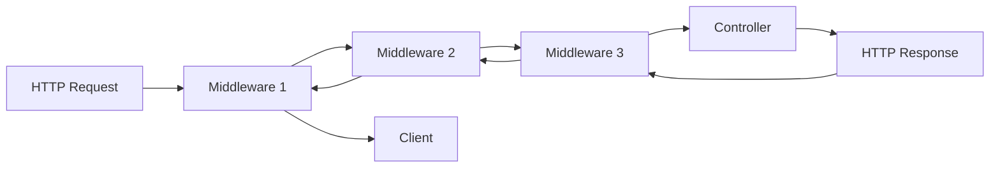

# P2.4 Middleware Implementation Plan

## 1. Overview and Objectives

### 1.1 Purpose
This document provides detailed step-by-step instructions for implementing custom middleware for The Strengths Toolbox website, including HTTPS enforcement, admin authentication, and rate limiting.

### 1.2 Scope
This implementation plan covers tasks P2.4.1 through P2.4.4:
- **P2.4.1**: Create ForceHttps middleware
- **P2.4.2**: Create AdminAuth middleware
- **P2.4.3**: Create RateLimit middleware
- **P2.4.4**: Register middleware in Kernel

### 1.3 Success Criteria
- All middleware classes created
- HTTPS enforced in production
- Admin routes protected
- Rate limiting implemented
- Middleware properly registered
- Middleware tested and working

## 2. Prerequisites

### 2.1 Required Knowledge
- Laravel middleware concepts
- HTTP request/response cycle
- Authentication and authorization
- Rate limiting strategies

### 2.2 Dependencies
- Task P1.3.4 completed (Base controllers created)
- Task P1.4.3 completed (Admin authentication)
- Task P2.3.5-P2.3.8 completed (Admin controllers)

### 2.3 Reference Documents
- Laravel MVC Architecture: `documentation/01-architecture/02-laravel-mvc-architecture.md`
- System Architecture Overview: `documentation/01-architecture/01-system-architecture-overview.md`

## 3. Middleware Overview

### 3.1 What is Middleware?
Middleware provides a convenient mechanism for filtering HTTP requests entering your application. Middleware can perform various tasks like authentication, logging, and request modification.

### 3.2 Middleware Flow


### 3.3 Middleware Types
- **Global Middleware**: Runs on every request
- **Route Middleware**: Applied to specific routes
- **Middleware Groups**: Applied to route groups

## 4. Task P2.4.1: Create ForceHttps Middleware

### 4.1 Overview
Create middleware to enforce HTTPS connections in production environment, redirecting all HTTP requests to HTTPS.

### 4.2 Step-by-Step Implementation

#### Step 1: Create Middleware Class

**File: `app/Http/Middleware/ForceHttps.php`**
```php
<?php

namespace App\Http\Middleware;

use Closure;
use Illuminate\Http\Request;
use Symfony\Component\HttpFoundation\Response;

class ForceHttps
{
    /**
     * Handle an incoming request.
     *
     * @param  \Closure(\Illuminate\Http\Request): (\Symfony\Component\HttpFoundation\Response)  $next
     */
    public function handle(Request $request, Closure $next): Response
    {
        // Only enforce HTTPS in production
        if (app()->environment('production')) {
            // Check if request is not secure (HTTP)
            if (!$request->secure()) {
                // Redirect to HTTPS version of the same URL
                return redirect()->secure($request->getRequestUri());
            }
        }

        return $next($request);
    }
}
```

### 4.3 Alternative Implementation (Using Trusted Proxies)
If your application is behind a load balancer or proxy, you may need to configure trusted proxies:

**File: `app/Http/Middleware/TrustProxies.php`** (Laravel default)
```php
<?php

namespace App\Http\Middleware;

use Illuminate\Http\Middleware\TrustProxies as Middleware;
use Illuminate\Http\Request;

class TrustProxies extends Middleware
{
    /**
     * The trusted proxies for this application.
     *
     * @var array<int, string>|string|null
     */
    protected $proxies = '*'; // Trust all proxies in production

    /**
     * The headers that should be used to detect proxies.
     *
     * @var int
     */
    protected $headers =
        Request::HEADER_X_FORWARDED_FOR |
        Request::HEADER_X_FORWARDED_HOST |
        Request::HEADER_X_FORWARDED_PORT |
        Request::HEADER_X_FORWARDED_PROTO |
        Request::HEADER_X_FORWARDED_AWS_ELB;
}
```

### 4.4 Validation
Test HTTPS redirection:
```bash
# In production, visit http://yourdomain.com
# Should redirect to https://yourdomain.com
```

## 5. Task P2.4.2: Create AdminAuth Middleware

### 5.1 Overview
Create middleware to protect admin routes, ensuring only authenticated admin users can access admin panel.

### 5.2 Step-by-Step Implementation

**File: `app/Http/Middleware/AdminAuth.php`**
```php
<?php

namespace App\Http\Middleware;

use Closure;
use Illuminate\Http\Request;
use Illuminate\Support\Facades\Auth;
use Symfony\Component\HttpFoundation\Response;

class AdminAuth
{
    /**
     * Handle an incoming request.
     *
     * @param  \Closure(\Illuminate\Http\Request): (\Symfony\Component\HttpFoundation\Response)  $next
     */
    public function handle(Request $request, Closure $next): Response
    {
        // Check if user is authenticated using admin guard
        if (!Auth::guard('admin')->check()) {
            // Redirect to admin login page
            return redirect()->route('admin.login')
                ->with('error', 'Please login to access the admin panel.');
        }

        // Optional: Check if user has admin role
        $user = Auth::guard('admin')->user();
        
        // If you have role-based access control
        // if (!in_array($user->role, ['admin', 'editor'])) {
        //     abort(403, 'Unauthorized access.');
        // }

        return $next($request);
    }
}
```

### 5.3 Alternative: Using Laravel's Built-in Auth Middleware
You can also use Laravel's built-in authentication middleware with a guard:

```php
// In routes/admin.php
Route::middleware(['auth:admin'])->group(function () {
    // Admin routes
});
```

### 5.4 Validation
Test admin authentication:
```bash
# Try accessing /admin without logging in
# Should redirect to /admin/login

# Login as admin
# Should be able to access /admin routes
```

## 6. Task P2.4.3: Create RateLimit Middleware

### 6.1 Overview
Create custom rate limiting middleware for specific routes that need more granular control than Laravel's default throttle middleware.

### 6.2 Step-by-Step Implementation

**File: `app/Http/Middleware/RateLimit.php`**
```php
<?php

namespace App\Http\Middleware;

use Closure;
use Illuminate\Http\Request;
use Illuminate\Support\Facades\Cache;
use Symfony\Component\HttpFoundation\Response;

class RateLimit
{
    /**
     * Handle an incoming request.
     *
     * @param  \Closure(\Illuminate\Http\Request): (\Symfony\Component\HttpFoundation\Response)  $next
     * @param  int  $maxAttempts  Maximum number of attempts
     * @param  int  $decayMinutes  Number of minutes to wait before reset
     */
    public function handle(Request $request, Closure $next, int $maxAttempts = 60, int $decayMinutes = 1): Response
    {
        $key = $this->resolveRequestSignature($request);

        // Check current attempts
        $attempts = Cache::get($key, 0);

        if ($attempts >= $maxAttempts) {
            return response()->json([
                'message' => 'Too many requests. Please try again later.',
            ], 429)
            ->header('Retry-After', $decayMinutes * 60);
        }

        // Increment attempts
        Cache::put($key, $attempts + 1, now()->addMinutes($decayMinutes));

        // Add rate limit headers to response
        $response = $next($request);
        
        $remaining = $maxAttempts - ($attempts + 1);
        
        return $response->header('X-RateLimit-Limit', $maxAttempts)
                        ->header('X-RateLimit-Remaining', max(0, $remaining));
    }

    /**
     * Resolve request signature for rate limiting
     *
     * @param  \Illuminate\Http\Request  $request
     * @return string
     */
    protected function resolveRequestSignature(Request $request): string
    {
        // Use IP address as identifier
        // You can also use user ID if authenticated
        if ($user = $request->user()) {
            return 'rate_limit:' . $user->id . ':' . $request->path();
        }

        return 'rate_limit:' . $request->ip() . ':' . $request->path();
    }
}
```

### 6.3 Alternative: Using Laravel's Built-in Throttle
Laravel provides built-in rate limiting via the `throttle` middleware:

```php
// In routes/api.php
Route::middleware(['throttle:10,1'])->group(function () {
    // Routes limited to 10 requests per minute
});
```

### 6.4 Advanced Rate Limiting
For more advanced rate limiting, you can create different limits for different routes:

**File: `app/Http/Middleware/CustomRateLimit.php`**
```php
<?php

namespace App\Http\Middleware;

use Closure;
use Illuminate\Http\Request;
use Illuminate\Support\Facades\RateLimiter;
use Symfony\Component\HttpFoundation\Response;

class CustomRateLimit
{
    /**
     * Handle an incoming request.
     *
     * @param  \Closure(\Illuminate\Http\Request): (\Symfony\Component\HttpFoundation\Response)  $next
     * @param  string  $limiter  Rate limiter name
     */
    public function handle(Request $request, Closure $next, string $limiter = 'default'): Response
    {
        $key = $this->resolveRequestSignature($request, $limiter);

        if (RateLimiter::tooManyAttempts($key, $this->getMaxAttempts($limiter))) {
            return $this->buildResponse($key, $limiter);
        }

        RateLimiter::hit($key, $this->getDecaySeconds($limiter));

        $response = $next($request);

        return $this->addHeaders(
            $response,
            $limiter,
            RateLimiter::remaining($key, $this->getMaxAttempts($limiter))
        );
    }

    /**
     * Resolve request signature
     */
    protected function resolveRequestSignature(Request $request, string $limiter): string
    {
        if ($user = $request->user()) {
            return sha1($limiter . '|' . $user->id);
        }

        return sha1($limiter . '|' . $request->ip());
    }

    /**
     * Get max attempts for limiter
     */
    protected function getMaxAttempts(string $limiter): int
    {
        return match($limiter) {
            'strict' => 5,
            'moderate' => 20,
            'loose' => 100,
            default => 60,
        };
    }

    /**
     * Get decay seconds for limiter
     */
    protected function getDecaySeconds(string $limiter): int
    {
        return match($limiter) {
            'strict' => 60,    // 1 minute
            'moderate' => 300,  // 5 minutes
            'loose' => 3600,    // 1 hour
            default => 60,
        };
    }

    /**
     * Build rate limit response
     */
    protected function buildResponse(string $key, string $limiter): Response
    {
        $seconds = RateLimiter::availableIn($key);

        return response()->json([
            'message' => 'Too many requests. Please try again in ' . $seconds . ' seconds.',
        ], 429)
        ->header('Retry-After', $seconds);
    }

    /**
     * Add rate limit headers
     */
    protected function addHeaders(Response $response, string $limiter, int $remaining): Response
    {
        return $response->header('X-RateLimit-Limit', $this->getMaxAttempts($limiter))
                        ->header('X-RateLimit-Remaining', $remaining);
    }
}
```

## 7. Task P2.4.4: Register Middleware in Kernel

### 7.1 Overview
Register all custom middleware in the HTTP Kernel so they can be used in routes and route groups.

### 7.2 Step-by-Step Implementation

**File: `app/Http/Kernel.php`**
```php
<?php

namespace App\Http;

use Illuminate\Foundation\Http\Kernel as HttpKernel;

class Kernel extends HttpKernel
{
    /**
     * The application's global HTTP middleware stack.
     *
     * These middleware are run during every request to your application.
     *
     * @var array<int, class-string|string>
     */
    protected $middleware = [
        // \App\Http\Middleware\TrustHosts::class,
        \App\Http\Middleware\TrustProxies::class,
        \Illuminate\Http\Middleware\HandleCors::class,
        \App\Http\Middleware\PreventRequestsDuringMaintenance::class,
        \Illuminate\Foundation\Http\Middleware\ValidatePostSize::class,
        \App\Http\Middleware\TrimStrings::class,
        \Illuminate\Foundation\Http\Middleware\ConvertEmptyStringsToNull::class,
    ];

    /**
     * The application's route middleware groups.
     *
     * @var array<string, array<int, class-string|string>>
     */
    protected $middlewareGroups = [
        'web' => [
            \App\Http\Middleware\EncryptCookies::class,
            \Illuminate\Cookie\Middleware\AddQueuedCookiesToResponse::class,
            \Illuminate\Session\Middleware\StartSession::class,
            \Illuminate\View\Middleware\ShareErrorsFromSession::class,
            \App\Http\Middleware\VerifyCsrfToken::class,
            \Illuminate\Routing\Middleware\SubstituteBindings::class,
            \App\Http\Middleware\ForceHttps::class, // Add ForceHttps to web group
        ],

        'api' => [
            // \Laravel\Sanctum\Http\Middleware\EnsureFrontendRequestsAreStateful::class,
            \Illuminate\Routing\Middleware\ThrottleRequests::class.':api',
            \Illuminate\Routing\Middleware\SubstituteBindings::class,
        ],
    ];

    /**
     * The application's middleware aliases.
     *
     * Aliases may be used instead of class names to conveniently assign middleware to routes and groups.
     *
     * @var array<string, class-string|string>
     */
    protected $middlewareAliases = [
        'auth' => \App\Http\Middleware\Authenticate::class,
        'auth.basic' => \Illuminate\Auth\Middleware\AuthenticateWithBasicAuth::class,
        'auth.session' => \Illuminate\Session\Middleware\AuthenticateSession::class,
        'cache.headers' => \Illuminate\Http\Middleware\SetCacheHeaders::class,
        'can' => \Illuminate\Auth\Middleware\Authorize::class,
        'guest' => \App\Http\Middleware\RedirectIfAuthenticated::class,
        'password.confirm' => \Illuminate\Auth\Middleware\RequirePassword::class,
        'signed' => \App\Http\Middleware\ValidateSignature::class,
        'throttle' => \Illuminate\Routing\Middleware\ThrottleRequests::class,
        'verified' => \Illuminate\Auth\Middleware\EnsureEmailIsVerified::class,
        
        // Custom middleware aliases
        'admin.auth' => \App\Http\Middleware\AdminAuth::class,
        'force.https' => \App\Http\Middleware\ForceHttps::class,
        'rate.limit' => \App\Http\Middleware\RateLimit::class,
    ];
}
```

### 7.3 Apply Middleware to Routes

#### Web Routes
**File: `routes/web.php`**
```php
<?php

use Illuminate\Support\Facades\Route;
use App\Http\Controllers\Web\HomeController;

// ForceHttps is applied globally via middlewareGroups['web']
Route::get('/', [HomeController::class, 'index'])->name('home');
```

#### Admin Routes
**File: `routes/admin.php`**
```php
<?php

use Illuminate\Support\Facades\Route;
use App\Http\Controllers\Admin\AdminDashboardController;

Route::prefix('admin')->name('admin.')->group(function () {
    // AdminAuth middleware applied to all admin routes
    Route::middleware(['web', 'admin.auth'])->group(function () {
        Route::get('/', [AdminDashboardController::class, 'index'])->name('dashboard');
        // ... other admin routes
    });
});
```

#### API Routes
**File: `routes/api.php`**
```php
<?php

use Illuminate\Support\Facades\Route;
use App\Http\Controllers\Api\ChatbotController;

Route::prefix('api/v1')->group(function () {
    // Apply rate limiting to chatbot endpoint
    Route::middleware(['throttle:10,1'])->group(function () {
        Route::post('/chatbot/message', [ChatbotController::class, 'sendMessage'])
            ->name('api.chatbot.message');
    });
    
    // Or use custom rate limit middleware
    Route::middleware(['rate.limit:5,1'])->group(function () {
        Route::post('/chatbot/message', [ChatbotController::class, 'sendMessage']);
    });
});
```

## 8. Testing and Validation

### 8.1 Test ForceHttps Middleware
```bash
# In production environment
# Visit http://yourdomain.com
# Should redirect to https://yourdomain.com

# In local environment
# Should not redirect (only works in production)
```

### 8.2 Test AdminAuth Middleware
```bash
# Without authentication
curl http://localhost:8000/admin
# Should redirect to /admin/login

# With authentication
# Login first, then access /admin
# Should work normally
```

### 8.3 Test RateLimit Middleware
```bash
# Make multiple rapid requests
for i in {1..10}; do
  curl http://localhost:8000/api/chatbot/message
done

# After limit, should receive 429 Too Many Requests
```

### 8.4 Common Issues and Solutions

#### Issue: HTTPS redirect loop
**Solution**: 
- Check TrustProxies middleware is configured
- Verify APP_URL in .env includes https://
- Check if behind load balancer/proxy

#### Issue: AdminAuth not working
**Solution**: 
- Verify middleware is registered in Kernel
- Check route has middleware applied
- Verify authentication guard is 'admin'
- Check user is logged in with correct guard

#### Issue: Rate limit not working
**Solution**: 
- Check cache driver is configured
- Verify middleware parameters are correct
- Check cache is working: `php artisan cache:clear`
- Verify middleware is applied to correct routes

#### Issue: Middleware not executing
**Solution**: 
- Clear route cache: `php artisan route:clear`
- Clear config cache: `php artisan config:clear`
- Verify middleware is in correct group
- Check middleware alias is correct

## 9. Best Practices

### 9.1 Middleware Design
- Keep middleware focused on single responsibility
- Use middleware for cross-cutting concerns
- Don't put business logic in middleware
- Return appropriate responses

### 9.2 Performance
- Keep middleware lightweight
- Use caching for rate limiting
- Avoid database queries in middleware when possible
- Consider middleware execution order

### 9.3 Security
- Always validate input
- Use HTTPS in production
- Implement proper rate limiting
- Protect sensitive routes

## 10. Advanced Middleware Examples

### 10.1 Logging Middleware
**File: `app/Http/Middleware/LogRequests.php`**
```php
<?php

namespace App\Http\Middleware;

use Closure;
use Illuminate\Http\Request;
use Illuminate\Support\Facades\Log;
use Symfony\Component\HttpFoundation\Response;

class LogRequests
{
    public function handle(Request $request, Closure $next): Response
    {
        $startTime = microtime(true);

        $response = $next($request);

        $duration = microtime(true) - $startTime;

        Log::info('Request processed', [
            'method' => $request->method(),
            'url' => $request->fullUrl(),
            'ip' => $request->ip(),
            'duration' => round($duration * 1000, 2) . 'ms',
            'status' => $response->getStatusCode(),
        ]);

        return $response;
    }
}
```

### 10.2 CORS Middleware (if needed)
Laravel includes CORS middleware by default, but you can customize it:

**File: `config/cors.php`**
```php
<?php

return [
    'paths' => ['api/*', 'sanctum/csrf-cookie'],
    'allowed_methods' => ['*'],
    'allowed_origins' => env('CORS_ALLOWED_ORIGINS', '*'),
    'allowed_origins_patterns' => [],
    'allowed_headers' => ['*'],
    'exposed_headers' => [],
    'max_age' => 0,
    'supports_credentials' => false,
];
```

## 11. References

### 11.1 Architecture Documents
- Laravel MVC Architecture: `documentation/01-architecture/02-laravel-mvc-architecture.md`
- System Architecture Overview: `documentation/01-architecture/01-system-architecture-overview.md`

### 11.2 External Resources
- [Laravel Middleware](https://laravel.com/docs/10.x/middleware)
- [Laravel Rate Limiting](https://laravel.com/docs/10.x/routing#rate-limiting)
- [Laravel Authentication](https://laravel.com/docs/10.x/authentication)

### 11.3 Related Tasks
- **Previous Task**: P1.4 - Authentication, P2.3 - Controllers
- **Next Task**: P2.5 - Frontend Foundation
- **Dependent Tasks**: All routes will use these middleware

---

**Document Version**: 1.0  
**Last Updated**: 2025  
**Status**: Ready for Implementation
