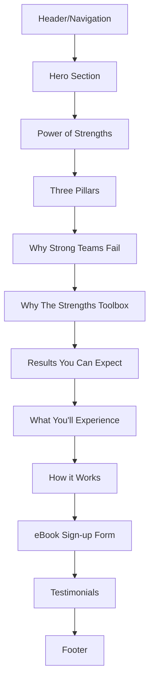

# P4.1 Homepage Implementation Plan

## 1. Overview and Objectives

### 1.1 Purpose
This document provides detailed step-by-step instructions for implementing the complete homepage for The Strengths Toolbox website. The homepage is the primary landing page that introduces visitors to the business, showcases value propositions, and drives conversions through multiple call-to-action sections.

### 1.2 Scope
This implementation plan covers tasks P4.1.1 through P4.1.11:
- **P4.1.1**: Build hero section
- **P4.1.2**: Build "Power of Strengths" section
- **P4.1.3**: Build "Three Pillars" section
- **P4.1.4**: Build "Why Strong Teams Fail" section
- **P4.1.5**: Build "Why The Strengths Toolbox" section
- **P4.1.6**: Build "Results You Can Expect" section
- **P4.1.7**: Build "What You'll Experience" section
- **P4.1.8**: Build "How it Works" section
- **P4.1.9**: Build eBook sign-up form
- **P4.1.10**: Build testimonials section
- **P4.1.11**: Integrate all homepage sections

### 1.3 Success Criteria
- All homepage sections render correctly
- Responsive design works on all devices
- Forms submit successfully
- CTAs link to appropriate pages
- Testimonials display dynamically
- SEO metadata properly configured
- Page loads in < 3 seconds
- All images optimized and lazy-loaded

## 2. Prerequisites

### 2.1 Required Knowledge
- Laravel Blade templating
- Tailwind CSS utility classes
- Alpine.js for interactions
- Component-based architecture
- Form handling and validation
- Responsive design principles

### 2.2 Dependencies
- Task P2.5.1 completed (Main layout created)
- Task P2.3.1 completed (HomeController created)
- Task P3.5.2 completed (Testimonial management)
- Task P3.4.2 completed (Form field types)
- Models: Page, BlogPost, Testimonial, Form
- Services: BlogPostService, SEOService, FormService

### 2.3 Reference Documents
- Frontend Architecture: `documentation/01-architecture/04-frontend-architecture.md`
- Business Requirements: `documentation/00-business-requirement/business-requirement-document.md`
- Laravel MVC Architecture: `documentation/01-architecture/02-laravel-mvc-architecture.md`

## 3. Homepage Structure Overview

The homepage consists of the following sections in order:



## 4. Task P4.1.1: Build Hero Section

### 4.1 Overview
Create the hero section with headline, subheadline, and primary CTA button. This is the first section visitors see and should make a strong first impression.

### 4.2 Step-by-Step Implementation

#### Step 1: Create Hero Section Partial

**File: `resources/views/partials/home/hero-section.blade.php`**

```blade
<section class="relative bg-gradient-to-br from-primary-600 via-primary-700 to-primary-800 text-white overflow-hidden">
    <!-- Background Pattern -->
    <div class="absolute inset-0 opacity-10">
        <div class="absolute inset-0" style="background-image: url('data:image/svg+xml,%3Csvg width=\'60\' height=\'60\' viewBox=\'0 0 60 60\' xmlns=\'http://www.w3.org/2000/svg\'%3E%3Cg fill=\'none\' fill-rule=\'evenodd\'%3E%3Cg fill=\'%23ffffff\' fill-opacity=\'1\'%3E%3Cpath d=\'M36 34v-4h-2v4h-4v2h4v4h2v-4h4v-2h-4zm0-30V0h-2v4h-4v2h4v4h2V4h4V2h-4zM6 34v-4H4v4H0v2h4v4h2v-4h4v-2H6zM6 4V0H4v4H0v2h4v4h2V6h4V4H6z\'/%3E%3C/g%3E%3C/g%3E%3C/svg%3E');"></div>
    </div>

    <div class="container-custom section-padding relative z-10">
        <div class="max-w-4xl mx-auto text-center">
            <!-- Headline -->
            <h1 class="text-4xl md:text-5xl lg:text-6xl font-bold mb-6 leading-tight">
                Build Strong Teams.<br>
                <span class="text-primary-200">Unlock Strong Profits.</span>
            </h1>

            <!-- Subheadline -->
            <p class="text-xl md:text-2xl text-primary-100 mb-8 max-w-2xl mx-auto">
                Transform your business with strengths-based development. 
                Discover how The Strengths Toolbox helps teams achieve peak performance 
                and drive sustainable growth.
            </p>

            <!-- CTA Buttons -->
            <div class="flex flex-col sm:flex-row gap-4 justify-center items-center">
                <a 
                    href="{{ route('contact') }}?source=homepage-hero" 
                    class="btn btn-secondary text-lg px-8 py-4 shadow-lg hover:shadow-xl transition-shadow"
                >
                    Book Your Complimentary 30-Minute Breakthrough Call
                </a>
                <a 
                    href="#power-of-strengths" 
                    class="btn btn-outline text-lg px-8 py-4 border-white text-white hover:bg-white hover:text-primary-700"
                >
                    Learn More
                </a>
            </div>

            <!-- Trust Indicators -->
            <div class="mt-12 flex flex-wrap justify-center items-center gap-8 text-sm text-primary-200">
                <div class="flex items-center gap-2">
                    <svg class="w-5 h-5" fill="currentColor" viewBox="0 0 20 20">
                        <path fill-rule="evenodd" d="M10 18a8 8 0 100-16 8 8 0 000 16zm3.707-9.293a1 1 0 00-1.414-1.414L9 10.586 7.707 9.293a1 1 0 00-1.414 1.414l2 2a1 1 0 001.414 0l4-4z" clip-rule="evenodd"/>
                    </svg>
                    <span>30+ Years Experience</span>
                </div>
                <div class="flex items-center gap-2">
                    <svg class="w-5 h-5" fill="currentColor" viewBox="0 0 20 20">
                        <path fill-rule="evenodd" d="M10 18a8 8 0 100-16 8 8 0 000 16zm3.707-9.293a1 1 0 00-1.414-1.414L9 10.586 7.707 9.293a1 1 0 00-1.414 1.414l2 2a1 1 0 001.414 0l4-4z" clip-rule="evenodd"/>
                    </svg>
                    <span>1560+ Happy Clients</span>
                </div>
                <div class="flex items-center gap-2">
                    <svg class="w-5 h-5" fill="currentColor" viewBox="0 0 20 20">
                        <path fill-rule="evenodd" d="M10 18a8 8 0 100-16 8 8 0 000 16zm3.707-9.293a1 1 0 00-1.414-1.414L9 10.586 7.707 9.293a1 1 0 00-1.414 1.414l2 2a1 1 0 001.414 0l4-4z" clip-rule="evenodd"/>
                    </svg>
                    <span>Proven Results</span>
                </div>
            </div>
        </div>
    </div>

    <!-- Scroll Indicator -->
    <div class="absolute bottom-8 left-1/2 transform -translate-x-1/2 animate-bounce">
        <a href="#power-of-strengths" class="text-white/70 hover:text-white transition-colors">
            <svg class="w-6 h-6" fill="none" stroke="currentColor" viewBox="0 0 24 24">
                <path stroke-linecap="round" stroke-linejoin="round" stroke-width="2" d="M19 14l-7 7m0 0l-7-7m7 7V3"/>
            </svg>
        </a>
    </div>
</section>
```

#### Step 2: Update HomeController (if needed)

The HomeController already exists and passes data to the view. Verify it includes all necessary data:

**File: `app/Http/Controllers/Web/HomeController.php`** (verify existing implementation)

The controller should already have:
- Recent blog posts
- Featured testimonials
- SEO metadata

### 4.3 Validation
- Hero section displays correctly
- Headline is prominent and readable
- CTA buttons are clickable and link correctly
- Responsive on mobile devices
- Trust indicators display properly

## 5. Task P4.1.2: Build "Power of Strengths" Section

### 5.1 Overview
Create a section explaining the core value proposition of strengths-based development with key benefits.

### 5.2 Step-by-Step Implementation

#### Step 1: Create Power of Strengths Partial

**File: `resources/views/partials/home/power-of-strengths.blade.php`**

```blade
<section id="power-of-strengths" class="section-padding bg-white">
    <div class="container-custom">
        <div class="max-w-4xl mx-auto text-center mb-12">
            <h2 class="text-3xl md:text-4xl lg:text-5xl font-bold text-gray-900 mb-4">
                What is the Power of Strengths?
            </h2>
            <p class="text-xl text-gray-600 max-w-2xl mx-auto">
                Strengths-based development is a proven approach that transforms how teams 
                work together, perform, and grow. Instead of focusing on weaknesses, 
                we help you identify and leverage what your team does best.
            </p>
        </div>

        <!-- Key Benefits Grid -->
        <div class="grid grid-cols-1 md:grid-cols-2 lg:grid-cols-3 gap-8 mt-12">
            @php
                $benefits = [
                    [
                        'icon' => 'users',
                        'title' => 'Enhanced Team Performance',
                        'description' => 'Teams that understand their strengths work more effectively together, leading to improved productivity and results.'
                    ],
                    [
                        'icon' => 'chart-line',
                        'title' => 'Increased Profitability',
                        'description' => 'When people work in their strengths zone, they perform better, leading to higher sales and business growth.'
                    ],
                    [
                        'icon' => 'heart',
                        'title' => 'Higher Engagement',
                        'description' => 'Employees who use their strengths daily are more engaged, motivated, and satisfied with their work.'
                    ],
                    [
                        'icon' => 'shield-check',
                        'title' => 'Reduced Turnover',
                        'description' => 'Teams that leverage strengths have lower turnover rates, saving time and money on recruitment.'
                    ],
                    [
                        'icon' => 'lightbulb',
                        'title' => 'Innovation & Creativity',
                        'description' => 'Strengths-based teams are more creative and innovative, driving competitive advantage.'
                    ],
                    [
                        'icon' => 'trophy',
                        'title' => 'Sustainable Growth',
                        'description' => 'Build a business growth system that scales with your team\'s natural talents and capabilities.'
                    ]
                ];
            @endphp

            @foreach($benefits as $benefit)
                <div class="bg-gray-50 rounded-lg p-6 hover:shadow-lg transition-shadow">
                    <div class="w-12 h-12 bg-primary-100 rounded-lg flex items-center justify-center mb-4">
                        @if($benefit['icon'] === 'users')
                            <svg class="w-6 h-6 text-primary-600" fill="none" stroke="currentColor" viewBox="0 0 24 24">
                                <path stroke-linecap="round" stroke-linejoin="round" stroke-width="2" d="M12 4.354a4 4 0 110 5.292M15 21H3v-1a6 6 0 0112 0v1zm0 0h6v-1a6 6 0 00-9-5.197M13 7a4 4 0 11-8 0 4 4 0 018 0z"/>
                            </svg>
                        @elseif($benefit['icon'] === 'chart-line')
                            <svg class="w-6 h-6 text-primary-600" fill="none" stroke="currentColor" viewBox="0 0 24 24">
                                <path stroke-linecap="round" stroke-linejoin="round" stroke-width="2" d="M9 19v-6a2 2 0 00-2-2H5a2 2 0 00-2 2v6a2 2 0 002 2h2a2 2 0 002-2zm0 0V9a2 2 0 012-2h2a2 2 0 012 2v10m-6 0a2 2 0 002 2h2a2 2 0 002-2m0 0V5a2 2 0 012-2h2a2 2 0 012 2v14a2 2 0 01-2 2h-2a2 2 0 01-2-2z"/>
                            </svg>
                        @elseif($benefit['icon'] === 'heart')
                            <svg class="w-6 h-6 text-primary-600" fill="currentColor" viewBox="0 0 20 20">
                                <path fill-rule="evenodd" d="M3.172 5.172a4 4 0 015.656 0L10 6.343l1.172-1.171a4 4 0 115.656 5.656L10 17.657l-6.828-6.829a4 4 0 010-5.656z" clip-rule="evenodd"/>
                            </svg>
                        @elseif($benefit['icon'] === 'shield-check')
                            <svg class="w-6 h-6 text-primary-600" fill="none" stroke="currentColor" viewBox="0 0 24 24">
                                <path stroke-linecap="round" stroke-linejoin="round" stroke-width="2" d="M9 12l2 2 4-4m5.618-4.016A11.955 11.955 0 0112 2.944a11.955 11.955 0 01-8.618 3.04A12.02 12.02 0 003 9c0 5.591 3.824 10.29 9 11.622 5.176-1.332 9-6.03 9-11.622 0-1.042-.133-2.052-.382-3.016z"/>
                            </svg>
                        @elseif($benefit['icon'] === 'lightbulb')
                            <svg class="w-6 h-6 text-primary-600" fill="none" stroke="currentColor" viewBox="0 0 24 24">
                                <path stroke-linecap="round" stroke-linejoin="round" stroke-width="2" d="M9.663 17h4.673M12 3v1m6.364 1.636l-.707.707M21 12h-1M4 12H3m3.343-5.657l-.707-.707m2.828 9.9a5 5 0 117.072 0l-.548.547A3.374 3.374 0 0014 18.469V19a2 2 0 11-4 0v-.531c0-.895-.356-1.754-.988-2.386l-.548-.547z"/>
                            </svg>
                        @elseif($benefit['icon'] === 'trophy')
                            <svg class="w-6 h-6 text-primary-600" fill="none" stroke="currentColor" viewBox="0 0 24 24">
                                <path stroke-linecap="round" stroke-linejoin="round" stroke-width="2" d="M9 12l2 2 4-4M7.835 4.697a3.42 3.42 0 001.946-.806 3.42 3.42 0 014.438 0 3.42 3.42 0 001.946.806 3.42 3.42 0 013.138 3.138 3.42 3.42 0 00.806 1.946 3.42 3.42 0 010 4.438 3.42 3.42 0 00-.806 1.946 3.42 3.42 0 01-3.138 3.138 3.42 3.42 0 00-1.946.806 3.42 3.42 0 01-4.438 0 3.42 3.42 0 00-1.946-.806 3.42 3.42 0 01-3.138-3.138 3.42 3.42 0 00-.806-1.946 3.42 3.42 0 010-4.438 3.42 3.42 0 00.806-1.946 3.42 3.42 0 013.138-3.138z"/>
                            </svg>
                        @endif
                    </div>
                    <h3 class="text-xl font-bold text-gray-900 mb-2">{{ $benefit['title'] }}</h3>
                    <p class="text-gray-600">{{ $benefit['description'] }}</p>
                </div>
            @endforeach
        </div>

        <!-- CTA -->
        <div class="text-center mt-12">
            <a href="{{ route('strengths-programme') }}" class="btn btn-primary text-lg">
                Discover Our Strengths Programme
            </a>
        </div>
    </div>
</section>
```

### 5.3 Validation
- Section displays all 6 benefits
- Icons render correctly
- Responsive grid layout works
- CTA button links to strengths programme page

## 6. Task P4.1.3: Build "Three Pillars" Section

### 6.1 Overview
Create a section highlighting the three core pillars of success: Turn talent into performance, Build teams that stick, and Drive growth with purpose.

### 6.2 Step-by-Step Implementation

#### Step 1: Create Three Pillars Partial

**File: `resources/views/partials/home/three-pillars.blade.php`**

```blade
<section class="section-padding bg-gray-50">
    <div class="container-custom">
        <div class="max-w-4xl mx-auto text-center mb-12">
            <h2 class="text-3xl md:text-4xl lg:text-5xl font-bold text-gray-900 mb-4">
                Three Pillars of Success
            </h2>
            <p class="text-xl text-gray-600 max-w-2xl mx-auto">
                Our proven framework for building strong teams and driving sustainable business growth.
            </p>
        </div>

        <div class="grid grid-cols-1 md:grid-cols-3 gap-8 lg:gap-12">
            @php
                $pillars = [
                    [
                        'number' => '01',
                        'title' => 'Turn Talent into Performance',
                        'description' => 'Identify and develop the unique strengths of each team member. Transform natural talent into exceptional performance that drives results.',
                        'icon' => 'arrow-up',
                        'color' => 'primary'
                    ],
                    [
                        'number' => '02',
                        'title' => 'Build Teams That Stick',
                        'description' => 'Create cohesive teams where members complement each other\'s strengths. Reduce turnover and build lasting professional relationships.',
                        'icon' => 'users',
                        'color' => 'secondary'
                    ],
                    [
                        'number' => '03',
                        'title' => 'Drive Growth with Purpose',
                        'description' => 'Align team strengths with business objectives. Create a clear path to growth that energizes your team and accelerates results.',
                        'icon' => 'rocket',
                        'color' => 'primary'
                    ]
                ];
            @endphp

            @foreach($pillars as $index => $pillar)
                <div class="relative bg-white rounded-xl p-8 shadow-md hover:shadow-xl transition-shadow">
                    <!-- Number Badge -->
                    <div class="absolute -top-4 -left-4 w-16 h-16 bg-{{ $pillar['color'] }}-600 text-white rounded-full flex items-center justify-center text-2xl font-bold shadow-lg">
                        {{ $pillar['number'] }}
                    </div>

                    <!-- Icon -->
                    <div class="mb-6 mt-4">
                        @if($pillar['icon'] === 'arrow-up')
                            <div class="w-16 h-16 bg-{{ $pillar['color'] }}-100 rounded-lg flex items-center justify-center">
                                <svg class="w-8 h-8 text-{{ $pillar['color'] }}-600" fill="none" stroke="currentColor" viewBox="0 0 24 24">
                                    <path stroke-linecap="round" stroke-linejoin="round" stroke-width="2" d="M13 7h8m0 0v8m0-8l-8 8-4-4-6 6"/>
                                </svg>
                            </div>
                        @elseif($pillar['icon'] === 'users')
                            <div class="w-16 h-16 bg-{{ $pillar['color'] }}-100 rounded-lg flex items-center justify-center">
                                <svg class="w-8 h-8 text-{{ $pillar['color'] }}-600" fill="none" stroke="currentColor" viewBox="0 0 24 24">
                                    <path stroke-linecap="round" stroke-linejoin="round" stroke-width="2" d="M12 4.354a4 4 0 110 5.292M15 21H3v-1a6 6 0 0112 0v1zm0 0h6v-1a6 6 0 00-9-5.197M13 7a4 4 0 11-8 0 4 4 0 018 0z"/>
                                </svg>
                            </div>
                        @elseif($pillar['icon'] === 'rocket')
                            <div class="w-16 h-16 bg-{{ $pillar['color'] }}-100 rounded-lg flex items-center justify-center">
                                <svg class="w-8 h-8 text-{{ $pillar['color'] }}-600" fill="none" stroke="currentColor" viewBox="0 0 24 24">
                                    <path stroke-linecap="round" stroke-linejoin="round" stroke-width="2" d="M13 10V3L4 14h7v7l9-11h-7z"/>
                                </svg>
                            </div>
                        @endif
                    </div>

                    <!-- Content -->
                    <h3 class="text-2xl font-bold text-gray-900 mb-4">{{ $pillar['title'] }}</h3>
                    <p class="text-gray-600 leading-relaxed">{{ $pillar['description'] }}</p>
                </div>
            @endforeach
        </div>

        <!-- Bottom CTA -->
        <div class="text-center mt-12">
            <p class="text-lg text-gray-700 mb-4">
                Ready to implement these pillars in your organization?
            </p>
            <a href="{{ route('contact') }}" class="btn btn-primary text-lg">
                Get Started Today
            </a>
        </div>
    </div>
</section>
```

### 6.3 Validation
- Three pillars display in a responsive grid
- Number badges and icons render correctly
- Hover effects work
- CTA button links correctly

## 7. Task P4.1.4: Build "Why Strong Teams Fail" Section

### 7.1 Overview
Create a problem-focused section that highlights why even strong teams can fail without proper strategy, leading to the solution.

### 7.2 Step-by-Step Implementation

#### Step 1: Create Why Strong Teams Fail Partial

**File: `resources/views/partials/home/why-teams-fail.blade.php`**

```blade
<section class="section-padding bg-white">
    <div class="container-custom">
        <div class="grid grid-cols-1 lg:grid-cols-2 gap-12 items-center">
            <!-- Content -->
            <div>
                <h2 class="text-3xl md:text-4xl lg:text-5xl font-bold text-gray-900 mb-6">
                    Why Strong Teams Fail<br>
                    <span class="text-primary-600">Without Strategy</span>
                </h2>
                
                <p class="text-lg text-gray-600 mb-6">
                    Having talented individuals doesn't guarantee success. Even the strongest 
                    teams can struggle when they lack:
                </p>

                <ul class="space-y-4 mb-8">
                    @php
                        $challenges = [
                            'Clear understanding of individual strengths',
                            'Alignment between strengths and roles',
                            'Effective collaboration frameworks',
                            'Strategic focus on what matters most',
                            'Systems to leverage collective talent'
                        ];
                    @endphp

                    @foreach($challenges as $challenge)
                        <li class="flex items-start gap-3">
                            <svg class="w-6 h-6 text-red-500 flex-shrink-0 mt-0.5" fill="none" stroke="currentColor" viewBox="0 0 24 24">
                                <path stroke-linecap="round" stroke-linejoin="round" stroke-width="2" d="M6 18L18 6M6 6l12 12"/>
                            </svg>
                            <span class="text-gray-700">{{ $challenge }}</span>
                        </li>
                    @endforeach
                </ul>

                <div class="bg-primary-50 border-l-4 border-primary-600 p-6 rounded-r-lg mb-8">
                    <p class="text-primary-900 font-semibold mb-2">
                        The Solution:
                    </p>
                    <p class="text-primary-800">
                        A strengths-based approach that transforms individual talent into 
                        collective performance through proven frameworks and strategic alignment.
                    </p>
                </div>

                <a href="{{ route('strengths-programme') }}" class="btn btn-primary text-lg">
                    Learn About Our Approach
                </a>
            </div>

            <!-- Visual/Image -->
            <div class="relative">
                <div class="bg-gradient-to-br from-gray-100 to-gray-200 rounded-2xl p-8 lg:p-12">
                    <!-- Placeholder for image - replace with actual image -->
                    <div class="aspect-square bg-white rounded-lg shadow-lg flex items-center justify-center">
                        <svg class="w-32 h-32 text-gray-400" fill="none" stroke="currentColor" viewBox="0 0 24 24">
                            <path stroke-linecap="round" stroke-linejoin="round" stroke-width="2" d="M9 19v-6a2 2 0 00-2-2H5a2 2 0 00-2 2v6a2 2 0 002 2h2a2 2 0 002-2zm0 0V9a2 2 0 012-2h2a2 2 0 012 2v10m-6 0a2 2 0 002 2h2a2 2 0 002-2m0 0V5a2 2 0 012-2h2a2 2 0 012 2v14a2 2 0 01-2 2h-2a2 2 0 01-2-2z"/>
                        </svg>
                    </div>
                    <!-- Replace above with:  -->
                </div>
            </div>
        </div>
    </div>
</section>
```

### 7.3 Validation
- Two-column layout works responsively
- Challenge list displays correctly
- Solution callout is prominent
- CTA button links to strengths programme

## 8. Task P4.1.5: Build "Why The Strengths Toolbox" Section

### 8.1 Overview
Create a credibility section highlighting company experience, track record, and unique value proposition.

### 8.2 Step-by-Step Implementation

#### Step 1: Create Why The Strengths Toolbox Partial

**File: `resources/views/partials/home/why-us.blade.php`**

```blade
<section class="section-padding bg-gradient-to-br from-primary-50 to-secondary-50">
    <div class="container-custom">
        <div class="max-w-4xl mx-auto text-center mb-12">
            <h2 class="text-3xl md:text-4xl lg:text-5xl font-bold text-gray-900 mb-4">
                Why The Strengths Toolbox?
            </h2>
            <p class="text-xl text-gray-600">
                Decades of experience helping businesses unlock their team's potential
            </p>
        </div>

        <!-- Stats Grid -->
        <div class="grid grid-cols-1 md:grid-cols-3 gap-8 mb-12">
            <div class="text-center">
                <div class="text-5xl md:text-6xl font-bold text-primary-600 mb-2">30+</div>
                <div class="text-lg text-gray-700 font-semibold">Years Experience</div>
                <div class="text-sm text-gray-600 mt-1">Proven track record</div>
            </div>
            <div class="text-center">
                <div class="text-5xl md:text-6xl font-bold text-primary-600 mb-2">1560+</div>
                <div class="text-lg text-gray-700 font-semibold">Happy Clients</div>
                <div class="text-sm text-gray-600 mt-1">Successful transformations</div>
            </div>
            <div class="text-center">
                <div class="text-5xl md:text-6xl font-bold text-primary-600 mb-2">100%</div>
                <div class="text-lg text-gray-700 font-semibold">Strengths-Based</div>
                <div class="text-sm text-gray-600 mt-1">Focused approach</div>
            </div>
        </div>

        <!-- Value Propositions -->
        <div class="grid grid-cols-1 md:grid-cols-2 lg:grid-cols-4 gap-6 mb-12">
            @php
                $values = [
                    [
                        'icon' => 'check-circle',
                        'title' => 'Proven Success',
                        'description' => 'Decades of experience delivering measurable results for businesses across industries.'
                    ],
                    [
                        'icon' => 'puzzle',
                        'title' => 'Customized Solutions',
                        'description' => 'Tailored programs that fit your unique business needs and team dynamics.'
                    ],
                    [
                        'icon' => 'hand-raise',
                        'title' => 'Empower Your Team',
                        'description' => 'Build confidence and capability through strengths-based development.'
                    ],
                    [
                        'icon' => 'globe',
                        'title' => 'Holistic Approach',
                        'description' => 'Comprehensive solutions that address individual, team, and organizational needs.'
                    ]
                ];
            @endphp

            @foreach($values as $value)
                <div class="bg-white rounded-lg p-6 shadow-md hover:shadow-lg transition-shadow">
                    <div class="w-12 h-12 bg-primary-100 rounded-lg flex items-center justify-center mb-4">
                        @if($value['icon'] === 'check-circle')
                            <svg class="w-6 h-6 text-primary-600" fill="currentColor" viewBox="0 0 20 20">
                                <path fill-rule="evenodd" d="M10 18a8 8 0 100-16 8 8 0 000 16zm3.707-9.293a1 1 0 00-1.414-1.414L9 10.586 7.707 9.293a1 1 0 00-1.414 1.414l2 2a1 1 0 001.414 0l4-4z" clip-rule="evenodd"/>
                            </svg>
                        @elseif($value['icon'] === 'puzzle')
                            <svg class="w-6 h-6 text-primary-600" fill="none" stroke="currentColor" viewBox="0 0 24 24">
                                <path stroke-linecap="round" stroke-linejoin="round" stroke-width="2" d="M11 4a2 2 0 114 0v1a1 1 0 001 1h3a1 1 0 011 1v3a1 1 0 01-1 1h-1a2 2 0 100 4h1a1 1 0 011 1v3a1 1 0 01-1 1h-3a1 1 0 01-1-1v-1a2 2 0 10-4 0v1a1 1 0 01-1 1H7a1 1 0 01-1-1v-3a1 1 0 00-1-1H4a2 2 0 110-4h1a1 1 0 001-1V7a1 1 0 011-1h3a1 1 0 001-1V4z"/>
                            </svg>
                        @elseif($value['icon'] === 'hand-raise')
                            <svg class="w-6 h-6 text-primary-600" fill="none" stroke="currentColor" viewBox="0 0 24 24">
                                <path stroke-linecap="round" stroke-linejoin="round" stroke-width="2" d="M7 11.5V14m0-2.5v-6a1.5 1.5 0 113 0m-3 6a1.5 1.5 0 10-3 0v-6a1.5 1.5 0 113 0m6-10V9m0 0v9m0-9a1.5 1.5 0 013 0m-3 0a1.5 1.5 0 00-3 0"/>
                            </svg>
                        @elseif($value['icon'] === 'globe')
                            <svg class="w-6 h-6 text-primary-600" fill="none" stroke="currentColor" viewBox="0 0 24 24">
                                <path stroke-linecap="round" stroke-linejoin="round" stroke-width="2" d="M3.055 11H5a2 2 0 012 2v1a2 2 0 002 2 2 2 0 012 2v2.945M8 3.935V5.5A2.5 2.5 0 0010.5 8h.5a2 2 0 012 2 2 2 0 104 0 2 2 0 012-2h1.064M15 20.488V18a2 2 0 012-2h3.064M21 12a9 9 0 11-18 0 9 9 0 0118 0z"/>
                            </svg>
                        @endif
                    </div>
                    <h3 class="text-xl font-bold text-gray-900 mb-2">{{ $value['title'] }}</h3>
                    <p class="text-gray-600 text-sm">{{ $value['description'] }}</p>
                </div>
            @endforeach
        </div>

        <!-- CTA -->
        <div class="text-center">
            <a href="{{ route('about') }}" class="btn btn-primary text-lg">
                Learn More About Us
            </a>
        </div>
    </div>
</section>
```

### 8.3 Validation
- Stats display prominently
- Value propositions grid is responsive
- Icons render correctly
- CTA links to about page

## 9. Task P4.1.6: Build "Results You Can Expect" Section

### 9.1 Overview
Create a results-focused section highlighting three key outcomes: Stronger Teams, Higher Profits, Confident Leadership.

### 9.2 Step-by-Step Implementation

#### Step 1: Create Results Section Partial

**File: `resources/views/partials/home/results.blade.php`**

```blade
<section class="section-padding bg-white">
    <div class="container-custom">
        <div class="max-w-4xl mx-auto text-center mb-12">
            <h2 class="text-3xl md:text-4xl lg:text-5xl font-bold text-gray-900 mb-4">
                Results You Can Expect
            </h2>
            <p class="text-xl text-gray-600">
                Real outcomes from our strengths-based approach
            </p>
        </div>

        <div class="grid grid-cols-1 md:grid-cols-3 gap-8 lg:gap-12">
            @php
                $results = [
                    [
                        'title' => 'Stronger Teams',
                        'description' => 'Build cohesive teams where members understand and leverage each other\'s strengths for maximum collaboration and performance.',
                        'icon' => 'users',
                        'metrics' => ['Improved collaboration', 'Better communication', 'Higher engagement']
                    ],
                    [
                        'title' => 'Higher Profits',
                        'description' => 'Drive revenue growth through improved sales performance, increased productivity, and optimized team performance.',
                        'icon' => 'chart-bar',
                        'metrics' => ['Increased sales', 'Better productivity', 'Reduced costs']
                    ],
                    [
                        'title' => 'Confident Leadership',
                        'description' => 'Develop leaders who understand their strengths and can effectively guide their teams toward success.',
                        'icon' => 'shield',
                        'metrics' => ['Better decision-making', 'Stronger vision', 'Effective management']
                    ]
                ];
            @endphp

            @foreach($results as $result)
                <div class="text-center">
                    <!-- Icon -->
                    <div class="w-20 h-20 bg-primary-100 rounded-full flex items-center justify-center mx-auto mb-6">
                        @if($result['icon'] === 'users')
                            <svg class="w-10 h-10 text-primary-600" fill="none" stroke="currentColor" viewBox="0 0 24 24">
                                <path stroke-linecap="round" stroke-linejoin="round" stroke-width="2" d="M12 4.354a4 4 0 110 5.292M15 21H3v-1a6 6 0 0112 0v1zm0 0h6v-1a6 6 0 00-9-5.197M13 7a4 4 0 11-8 0 4 4 0 018 0z"/>
                            </svg>
                        @elseif($result['icon'] === 'chart-bar')
                            <svg class="w-10 h-10 text-primary-600" fill="none" stroke="currentColor" viewBox="0 0 24 24">
                                <path stroke-linecap="round" stroke-linejoin="round" stroke-width="2" d="M9 19v-6a2 2 0 00-2-2H5a2 2 0 00-2 2v6a2 2 0 002 2h2a2 2 0 002-2zm0 0V9a2 2 0 012-2h2a2 2 0 012 2v10m-6 0a2 2 0 002 2h2a2 2 0 002-2m0 0V5a2 2 0 012-2h2a2 2 0 012 2v14a2 2 0 01-2 2h-2a2 2 0 01-2-2z"/>
                            </svg>
                        @elseif($result['icon'] === 'shield')
                            <svg class="w-10 h-10 text-primary-600" fill="none" stroke="currentColor" viewBox="0 0 24 24">
                                <path stroke-linecap="round" stroke-linejoin="round" stroke-width="2" d="M9 12l2 2 4-4m5.618-4.016A11.955 11.955 0 0112 2.944a11.955 11.955 0 01-8.618 3.04A12.02 12.02 0 003 9c0 5.591 3.824 10.29 9 11.622 5.176-1.332 9-6.03 9-11.622 0-1.042-.133-2.052-.382-3.016z"/>
                            </svg>
                        @endif
                    </div>

                    <!-- Title -->
                    <h3 class="text-2xl font-bold text-gray-900 mb-4">{{ $result['title'] }}</h3>

                    <!-- Description -->
                    <p class="text-gray-600 mb-6">{{ $result['description'] }}</p>

                    <!-- Metrics -->
                    <ul class="space-y-2">
                        @foreach($result['metrics'] as $metric)
                            <li class="flex items-center justify-center gap-2 text-sm text-gray-700">
                                <svg class="w-4 h-4 text-primary-600" fill="currentColor" viewBox="0 0 20 20">
                                    <path fill-rule="evenodd" d="M10 18a8 8 0 100-16 8 8 0 000 16zm3.707-9.293a1 1 0 00-1.414-1.414L9 10.586 7.707 9.293a1 1 0 00-1.414 1.414l2 2a1 1 0 001.414 0l4-4z" clip-rule="evenodd"/>
                                </svg>
                                {{ $metric }}
                            </li>
                        @endforeach
                    </ul>
                </div>
            @endforeach
        </div>
    </div>
</section>
```

### 9.3 Validation
- Three results display in responsive grid
- Icons and metrics render correctly
- Layout is balanced and visually appealing

## 10. Task P4.1.7: Build "What You'll Experience" Section

### 10.1 Overview
Create a section describing the experience clients will have, linking to sales courses and other offerings.

### 10.2 Step-by-Step Implementation

#### Step 1: Create What You'll Experience Partial

**File: `resources/views/partials/home/experience.blade.php`**

```blade
<section class="section-padding bg-gray-50">
    <div class="container-custom">
        <div class="grid grid-cols-1 lg:grid-cols-2 gap-12 items-center">
            <!-- Image/Visual -->
            <div class="order-2 lg:order-1">
                <div class="bg-gradient-to-br from-primary-100 to-secondary-100 rounded-2xl p-8 lg:p-12">
                    <!-- Placeholder for image -->
                    <div class="aspect-square bg-white rounded-lg shadow-lg flex items-center justify-center">
                        <svg class="w-32 h-32 text-gray-400" fill="none" stroke="currentColor" viewBox="0 0 24 24">
                            <path stroke-linecap="round" stroke-linejoin="round" stroke-width="2" d="M14.828 14.828a4 4 0 01-5.656 0M9 10h.01M15 10h.01M21 12a9 9 0 11-18 0 9 9 0 0118 0z"/>
                        </svg>
                    </div>
                    <!-- Replace with:  -->
                </div>
            </div>

            <!-- Content -->
            <div class="order-1 lg:order-2">
                <h2 class="text-3xl md:text-4xl lg:text-5xl font-bold text-gray-900 mb-6">
                    What You'll Experience
                </h2>
                
                <p class="text-lg text-gray-600 mb-8">
                    When you work with The Strengths Toolbox, you'll discover a transformative 
                    approach that goes beyond traditional training:
                </p>

                <ul class="space-y-4 mb-8">
                    @php
                        $experiences = [
                            [
                                'title' => 'Personalized Assessment',
                                'description' => 'Discover your unique strengths profile and understand how to leverage it for maximum impact.'
                            ],
                            [
                                'title' => 'Practical Training',
                                'description' => 'Engage in hands-on workshops and programs designed to build real-world skills.'
                            ],
                            [
                                'title' => 'Ongoing Support',
                                'description' => 'Receive continuous guidance and resources to maintain momentum and achieve lasting results.'
                            ],
                            [
                                'title' => 'Measurable Outcomes',
                                'description' => 'Track your progress with clear metrics and see tangible improvements in performance.'
                            ]
                        ];
                    @endphp

                    @foreach($experiences as $experience)
                        <li class="flex gap-4">
                            <div class="flex-shrink-0">
                                <div class="w-10 h-10 bg-primary-600 text-white rounded-full flex items-center justify-center">
                                    <svg class="w-6 h-6" fill="none" stroke="currentColor" viewBox="0 0 24 24">
                                        <path stroke-linecap="round" stroke-linejoin="round" stroke-width="2" d="M5 13l4 4L19 7"/>
                                    </svg>
                                </div>
                            </div>
                            <div>
                                <h4 class="font-bold text-gray-900 mb-1">{{ $experience['title'] }}</h4>
                                <p class="text-gray-600">{{ $experience['description'] }}</p>
                            </div>
                        </li>
                    @endforeach
                </ul>

                <div class="flex flex-col sm:flex-row gap-4">
                    <a href="/sales-training" class="btn btn-primary text-lg">
                        Explore Sales Courses
                    </a>
                    <a href="{{ route('contact') }}" class="btn btn-outline text-lg">
                        Schedule a Consultation
                    </a>
                </div>
            </div>
        </div>
    </div>
</section>
```

### 10.3 Validation
- Two-column layout works responsively
- Experience list displays with icons
- CTAs link to correct pages
- Image placeholder can be replaced

## 11. Task P4.1.8: Build "How it Works" Section

### 11.1 Overview
Create a step-by-step section explaining the process: Book a Consultation, Power of Strengths Training, Watch Your Profits Grow.

### 11.2 Step-by-Step Implementation

#### Step 1: Create How it Works Partial

**File: `resources/views/partials/home/how-it-works.blade.php`**

```blade
<section class="section-padding bg-white">
    <div class="container-custom">
        <div class="max-w-4xl mx-auto text-center mb-12">
            <h2 class="text-3xl md:text-4xl lg:text-5xl font-bold text-gray-900 mb-4">
                How it Works
            </h2>
            <p class="text-xl text-gray-600">
                A simple, proven process to transform your team and grow your business
            </p>
        </div>

        <div class="max-w-5xl mx-auto">
            <!-- Steps -->
            <div class="space-y-8 lg:space-y-12">
                @php
                    $steps = [
                        [
                            'number' => '01',
                            'title' => 'Book a Consultation',
                            'description' => 'Schedule your complimentary 30-minute breakthrough call. We\'ll discuss your challenges, goals, and how strengths-based development can help your team.',
                            'cta' => 'Book Your Free Consultation',
                            'cta_link' => route('contact')
                        ],
                        [
                            'number' => '02',
                            'title' => 'Power of Strengths Training',
                            'description' => 'Engage in our comprehensive strengths-based programs tailored to your needs. Whether for individuals, teams, managers, or salespeople, we have the right solution.',
                            'cta' => 'Explore Our Programs',
                            'cta_link' => route('strengths-programme')
                        ],
                        [
                            'number' => '03',
                            'title' => 'Watch Your Profits Grow',
                            'description' => 'Experience measurable results as your team becomes more engaged, productive, and aligned. See improvements in sales, retention, and overall business performance.',
                            'cta' => 'See Success Stories',
                            'cta_link' => '/testimonials'
                        ]
                    ];
                @endphp

                @foreach($steps as $index => $step)
                    <div class="flex flex-col lg:flex-row gap-8 items-center {{ $index % 2 === 1 ? 'lg:flex-row-reverse' : '' }}">
                        <!-- Step Number and Content -->
                        <div class="flex-1">
                            <div class="flex items-center gap-4 mb-4">
                                <div class="w-16 h-16 bg-primary-600 text-white rounded-full flex items-center justify-center text-2xl font-bold flex-shrink-0">
                                    {{ $step['number'] }}
                                </div>
                                <h3 class="text-2xl md:text-3xl font-bold text-gray-900">
                                    {{ $step['title'] }}
                                </h3>
                            </div>
                            <p class="text-lg text-gray-600 mb-6">
                                {{ $step['description'] }}
                            </p>
                            <a href="{{ $step['cta_link'] }}" class="btn btn-primary">
                                {{ $step['cta'] }}
                            </a>
                        </div>

                        <!-- Visual/Icon -->
                        <div class="flex-1 flex justify-center">
                            <div class="w-64 h-64 bg-gradient-to-br from-primary-100 to-secondary-100 rounded-2xl flex items-center justify-center">
                                @if($step['number'] === '01')
                                    <svg class="w-32 h-32 text-primary-600" fill="none" stroke="currentColor" viewBox="0 0 24 24">
                                        <path stroke-linecap="round" stroke-linejoin="round" stroke-width="2" d="M8 7V3m8 4V3m-9 8h10M5 21h14a2 2 0 002-2V7a2 2 0 00-2-2H5a2 2 0 00-2 2v12a2 2 0 002 2z"/>
                                    </svg>
                                @elseif($step['number'] === '02')
                                    <svg class="w-32 h-32 text-primary-600" fill="none" stroke="currentColor" viewBox="0 0 24 24">
                                        <path stroke-linecap="round" stroke-linejoin="round" stroke-width="2" d="M12 6.253v13m0-13C10.832 5.477 9.246 5 7.5 5S4.168 5.477 3 6.253v13C4.168 18.477 5.754 18 7.5 18s3.332.477 4.5 1.253m0-13C13.168 5.477 14.754 5 16.5 5c1.747 0 3.332.477 4.5 1.253v13C19.832 18.477 18.247 18 16.5 18c-1.746 0-3.332.477-4.5 1.253"/>
                                    </svg>
                                @elseif($step['number'] === '03')
                                    <svg class="w-32 h-32 text-primary-600" fill="none" stroke="currentColor" viewBox="0 0 24 24">
                                        <path stroke-linecap="round" stroke-linejoin="round" stroke-width="2" d="M13 7h8m0 0v8m0-8l-8 8-4-4-6 6"/>
                                    </svg>
                                @endif
                            </div>
                        </div>
                    </div>

                    <!-- Connector Line (except for last step) -->
                    @if($index < count($steps) - 1)
                        <div class="flex justify-center">
                            <div class="w-1 h-12 bg-primary-200 rounded"></div>
                        </div>
                    @endif
                @endforeach
            </div>
        </div>
    </div>
</section>
```

### 11.3 Validation
- Three steps display clearly
- Alternating layout works on desktop
- Connector lines display between steps
- CTAs link correctly
- Responsive on mobile

## 12. Task P4.1.9: Build eBook Sign-up Form

### 12.1 Overview
Create an eBook sign-up form section that captures leads and integrates with the existing form system.

### 12.2 Step-by-Step Implementation

#### Step 1: Create eBook Sign-up Form Partial

**File: `resources/views/partials/home/ebook-signup.blade.php`**

```blade
<section class="section-padding bg-gradient-to-br from-primary-600 to-primary-800 text-white">
    <div class="container-custom">
        <div class="max-w-4xl mx-auto">
            <div class="grid grid-cols-1 lg:grid-cols-2 gap-12 items-center">
                <!-- Content -->
                <div>
                    <h2 class="text-3xl md:text-4xl font-bold mb-4">
                        Get Your Free eBook
                    </h2>
                    <p class="text-xl text-primary-100 mb-6">
                        Discover the power of strengths-based development with our 
                        comprehensive guide. Learn how to transform your team and 
                        drive sustainable business growth.
                    </p>
                    <ul class="space-y-3 mb-8">
                        @php
                            $benefits = [
                                'Understanding strengths-based development',
                                'Practical strategies for team building',
                                'Tips for improving team performance',
                                'Real-world case studies and examples'
                            ];
                        @endphp
                        @foreach($benefits as $benefit)
                            <li class="flex items-center gap-3">
                                <svg class="w-5 h-5 text-primary-200 flex-shrink-0" fill="currentColor" viewBox="0 0 20 20">
                                    <path fill-rule="evenodd" d="M10 18a8 8 0 100-16 8 8 0 000 16zm3.707-9.293a1 1 0 00-1.414-1.414L9 10.586 7.707 9.293a1 1 0 00-1.414 1.414l2 2a1 1 0 001.414 0l4-4z" clip-rule="evenodd"/>
                                </svg>
                                <span>{{ $benefit }}</span>
                            </li>
                        @endforeach
                    </ul>
                </div>

                <!-- Form -->
                <div class="bg-white rounded-xl p-8 shadow-2xl">
                    <form 
                        action="{{ route('ebook.signup') }}" 
                        method="POST"
                        x-data="{ 
                            submitting: false,
                            success: false,
                            errors: {}
                        }"
                        @submit.prevent="
                            submitting = true;
                            fetch('{{ route('ebook.signup') }}', {
                                method: 'POST',
                                headers: {
                                    'Content-Type': 'application/json',
                                    'X-CSRF-TOKEN': document.querySelector('meta[name=csrf-token]').content,
                                    'Accept': 'application/json'
                                },
                                body: JSON.stringify({
                                    name: $refs.name.value,
                                    email: $refs.email.value
                                })
                            })
                            .then(response => response.json())
                            .then(data => {
                                submitting = false;
                                if (data.errors) {
                                    errors = data.errors;
                                } else if (data.message || data.success) {
                                    success = true;
                                    $refs.name.value = '';
                                    $refs.email.value = '';
                                }
                            })
                            .catch(() => {
                                submitting = false;
                                errors = { error: ['Something went wrong. Please try again.'] };
                            })
                        "
                    >
                        @csrf

                        <!-- Success Message -->
                        <div x-show="success" x-transition class="mb-4 p-4 bg-green-50 border border-green-200 rounded-lg">
                            <p class="text-green-800 font-semibold">
                                Thank you! Your eBook will be sent to your email shortly.
                            </p>
                        </div>

                        <!-- Error Messages -->
                        <div x-show="Object.keys(errors).length > 0" x-transition class="mb-4">
                            <div class="p-4 bg-red-50 border border-red-200 rounded-lg">
                                <ul class="list-disc list-inside text-red-800 text-sm">
                                    <template x-for="(errorList, field) in errors" :key="field">
                                        <template x-for="error in errorList" :key="error">
                                            <li x-text="error"></li>
                                        </template>
                                    </template>
                                </ul>
                            </div>
                        </div>

                        <!-- Name Field -->
                        <div class="mb-4">
                            <label for="name" class="block text-sm font-semibold text-gray-700 mb-2">
                                First Name
                            </label>
                            <input 
                                type="text" 
                                id="name" 
                                name="name"
                                x-ref="name"
                                required
                                class="w-full px-4 py-3 border border-gray-300 rounded-lg focus:ring-2 focus:ring-primary-500 focus:border-transparent text-gray-900"
                                placeholder="Enter your first name"
                            >
                        </div>

                        <!-- Email Field -->
                        <div class="mb-6">
                            <label for="email" class="block text-sm font-semibold text-gray-700 mb-2">
                                Email Address
                            </label>
                            <input 
                                type="email" 
                                id="email" 
                                name="email"
                                x-ref="email"
                                required
                                class="w-full px-4 py-3 border border-gray-300 rounded-lg focus:ring-2 focus:ring-primary-500 focus:border-transparent text-gray-900"
                                placeholder="Enter your email address"
                            >
                        </div>

                        <!-- Submit Button -->
                        <button 
                            type="submit"
                            :disabled="submitting"
                            class="w-full btn btn-primary text-lg py-4"
                            :class="{ 'opacity-50 cursor-not-allowed': submitting }"
                        >
                            <span x-show="!submitting">Get My Free eBook</span>
                            <span x-show="submitting">Sending...</span>
                        </button>

                        <p class="text-xs text-gray-500 mt-4 text-center">
                            We respect your privacy. Unsubscribe at any time.
                        </p>
                    </form>
                </div>
            </div>
        </div>
    </div>
</section>
```

#### Step 2: Verify HomeController Method

The `submitEbookForm` method already exists in HomeController. Ensure it handles JSON requests properly:

**File: `app/Http/Controllers/Web/HomeController.php`** (update if needed)

```php
public function submitEbookForm(Request $request)
{
    $validated = $request->validate([
        'name' => 'required|string|max:255',
        'email' => 'required|email|max:255',
    ]);

    try {
        // Get or create eBook form
        $form = $this->formService->getBySlug('ebook-signup');
        
        if (!$form) {
            $form = $this->formService->create([
                'name' => 'eBook Sign-up',
                'slug' => 'ebook-signup',
                'email_to' => config('mail.contact_to', config('mail.from.address')),
                'is_active' => true,
                'fields' => json_encode([
                    ['name' => 'name', 'type' => 'text', 'required' => true, 'label' => 'First Name'],
                    ['name' => 'email', 'type' => 'email', 'required' => true, 'label' => 'Email Address'],
                ]),
            ]);
        }

        // Submit form
        $this->formService->submit($form->id, $validated);

        if ($request->expectsJson()) {
            return response()->json([
                'success' => true,
                'message' => 'Thank you! Your eBook will be sent to your email shortly.'
            ]);
        }

        return redirect()->back()->with('success', 'Thank you! Your eBook will be sent to your email shortly.');
    } catch (\Exception $e) {
        if ($request->expectsJson()) {
            return response()->json([
                'errors' => ['error' => ['Something went wrong. Please try again.']]
            ], 422);
        }

        return redirect()->back()
            ->withInput()
            ->withErrors(['error' => 'Something went wrong. Please try again.']);
    }
}
```

### 12.3 Validation
- Form displays correctly
- Validation works (client and server-side)
- Success message appears after submission
- Form integrates with FormService
- Email notifications sent

## 13. Task P4.1.10: Build Testimonials Section

### 13.1 Overview
Create a testimonials section that displays featured testimonials dynamically from the database.

### 13.2 Step-by-Step Implementation

#### Step 1: Create Testimonials Section Partial

**File: `resources/views/partials/home/testimonials.blade.php`**

```blade
<section class="section-padding bg-gray-50">
    <div class="container-custom">
        <div class="max-w-4xl mx-auto text-center mb-12">
            <h2 class="text-3xl md:text-4xl lg:text-5xl font-bold text-gray-900 mb-4">
                What Our Clients Say
            </h2>
            <p class="text-xl text-gray-600">
                Real results from real businesses
            </p>
        </div>

        @if($testimonials && $testimonials->count() > 0)
            <!-- Testimonials Grid -->
            <div class="grid grid-cols-1 md:grid-cols-2 lg:grid-cols-3 gap-8 mb-8">
                @foreach($testimonials->take(6) as $testimonial)
                    <div class="bg-white rounded-lg shadow-md p-6 hover:shadow-lg transition-shadow">
                        <!-- Rating -->
                        @if($testimonial->rating)
                            <div class="flex items-center gap-1 mb-4">
                                @for($i = 1; $i <= 5; $i++)
                                    <svg 
                                        class="w-5 h-5 {{ $i <= $testimonial->rating ? 'text-yellow-400' : 'text-gray-300' }}" 
                                        fill="currentColor" 
                                        viewBox="0 0 20 20"
                                    >
                                        <path d="M9.049 2.927c.3-.921 1.603-.921 1.902 0l1.07 3.292a1 1 0 00.95.69h3.462c.969 0 1.371 1.24.588 1.81l-2.8 2.034a1 1 0 00-.364 1.118l1.07 3.292c.3.921-.755 1.688-1.54 1.118l-2.8-2.034a1 1 0 00-1.175 0l-2.8 2.034c-.784.57-1.838-.197-1.539-1.118l1.07-3.292a1 1 0 00-.364-1.118L2.98 8.72c-.783-.57-.38-1.81.588-1.81h3.461a1 1 0 00.951-.69l1.07-3.292z"/>
                                    </svg>
                                @endfor
                            </div>
                        @endif

                        <!-- Testimonial Text -->
                        <blockquote class="text-gray-700 mb-4 italic">
                            "{{ $testimonial->testimonial }}"
                        </blockquote>

                        <!-- Author -->
                        <footer class="flex items-center gap-3">
                            <div class="w-12 h-12 bg-primary-100 rounded-full flex items-center justify-center flex-shrink-0">
                                <span class="text-primary-600 font-bold text-lg">
                                    {{ strtoupper(substr($testimonial->name, 0, 1)) }}
                                </span>
                            </div>
                            <div>
                                <p class="font-semibold text-gray-900">{{ $testimonial->name }}</p>
                                @if($testimonial->company)
                                    <p class="text-sm text-gray-600">{{ $testimonial->company }}</p>
                                @endif
                                @if($testimonial->position)
                                    <p class="text-xs text-gray-500">{{ $testimonial->position }}</p>
                                @endif
                            </div>
                        </footer>
                    </div>
                @endforeach
            </div>

            <!-- View All Link -->
            <div class="text-center">
                <a href="/testimonials" class="btn btn-outline">
                    View All Testimonials
                </a>
            </div>
        @else
            <!-- Placeholder when no testimonials -->
            <div class="text-center py-12">
                <p class="text-gray-600">Testimonials will appear here once added.</p>
            </div>
        @endif
    </div>
</section>
```

#### Step 2: Verify HomeController

The HomeController already fetches testimonials. Verify the query:

```php
$testimonials = Testimonial::where('is_featured', true)
    ->orderBy('display_order', 'asc')
    ->orderBy('created_at', 'desc')
    ->limit(6)
    ->get();
```

### 13.3 Validation
- Testimonials display in responsive grid
- Ratings show correctly
- Author information displays
- "View All" links to testimonials page
- Handles empty state gracefully

## 14. Task P4.1.11: Integrate All Homepage Sections

### 14.1 Overview
Combine all homepage sections into a single cohesive page view with proper SEO metadata.

### 14.2 Step-by-Step Implementation

#### Step 1: Update Homepage View

**File: `resources/views/pages/home.blade.php`**

```blade
@extends('layouts.app')

@section('title', $seo['title'] ?? 'The Strengths Toolbox - Build Strong Teams, Unlock Strong Profits')

@push('meta')
    @if(isset($seo))
        <meta name="description" content="{{ $seo['description'] ?? 'Transform your business with strengths-based development. Build strong teams and unlock strong profits with The Strengths Toolbox.' }}">
        <meta name="keywords" content="{{ $seo['keywords'] ?? 'strengths-based development, team building, business growth, leadership training' }}">
        
        @if(isset($seo['og_title']))
            <meta property="og:title" content="{{ $seo['og_title'] }}">
            <meta property="og:description" content="{{ $seo['og_description'] ?? $seo['description'] }}">
            <meta property="og:type" content="website">
            <meta property="og:url" content="{{ url('/') }}">
            @if(isset($seo['og_image']))
                <meta property="og:image" content="{{ $seo['og_image'] }}">
            @endif
        @endif
    @endif
@endpush

@section('content')
    <!-- Hero Section -->
    @include('partials.home.hero-section')

    <!-- Power of Strengths -->
    @include('partials.home.power-of-strengths')

    <!-- Three Pillars -->
    @include('partials.home.three-pillars')

    <!-- Why Strong Teams Fail -->
    @include('partials.home.why-teams-fail')

    <!-- Why The Strengths Toolbox -->
    @include('partials.home.why-us')

    <!-- Results You Can Expect -->
    @include('partials.home.results')

    <!-- What You'll Experience -->
    @include('partials.home.experience')

    <!-- How it Works -->
    @include('partials.home.how-it-works')

    <!-- eBook Sign-up -->
    @include('partials.home.ebook-signup')

    <!-- Testimonials -->
    @include('partials.home.testimonials', ['testimonials' => $testimonials])
@endsection
```

#### Step 2: Verify Routes

**File: `routes/web.php`** (verify route exists)

```php
Route::get('/', [HomeController::class, 'index'])->name('home');
Route::post('/ebook-signup', [HomeController::class, 'submitEbookForm'])->name('ebook.signup');
```

#### Step 3: Create Partials Directory

```bash
mkdir -p resources/views/partials/home
```

### 14.3 Validation Checklist

- [ ] All sections render in correct order
- [ ] No JavaScript errors in console
- [ ] All images load (or placeholders display)
- [ ] All links work correctly
- [ ] Forms submit successfully
- [ ] Responsive on mobile, tablet, desktop
- [ ] SEO metadata displays correctly
- [ ] Page loads in < 3 seconds
- [ ] Smooth scrolling works for anchor links
- [ ] All CTAs link to correct pages

### 14.4 Performance Optimization

1. **Lazy Load Images:**
```blade

```

2. **Optimize CSS/JS:**
```bash
npm run build
```

3. **Cache Static Content:**
Ensure proper cache headers are set in production.

## 15. Testing and Validation

### 15.1 Functional Testing
- Test all form submissions
- Verify all links navigate correctly
- Check testimonials display
- Test responsive breakpoints
- Verify SEO metadata

### 15.2 Performance Testing
- Page load time < 3 seconds
- Images optimized
- CSS/JS minified
- No console errors

### 15.3 Cross-Browser Testing
- Chrome (latest)
- Firefox (latest)
- Safari (latest)
- Edge (latest)
- Mobile browsers

## 16. Common Issues and Solutions

### Issue: Sections not displaying
**Solution:** Check that partial files exist in `resources/views/partials/home/`

### Issue: Forms not submitting
**Solution:** Verify CSRF token, check route exists, verify FormService is working

### Issue: Testimonials not showing
**Solution:** Check database has featured testimonials, verify HomeController query

### Issue: Images not loading
**Solution:** Check image paths, verify files exist in `public/images/`

## 17. References

### 17.1 Architecture Documents
- Frontend Architecture: `documentation/01-architecture/04-frontend-architecture.md`
- Business Requirements: `documentation/00-business-requirement/business-requirement-document.md`

### 17.2 Related Tasks
- **Next Task**: P4.2 - Strengths Programme Page Implementation Plan
- **Dependencies**: P2.5.1, P2.3.1, P3.5.2, P3.4.2
- **Dependent Tasks**: P4.2.1-P4.7.3

---

**Document Version**: 1.0  
**Last Updated**: 2025  
**Status**: Ready for Implementation
