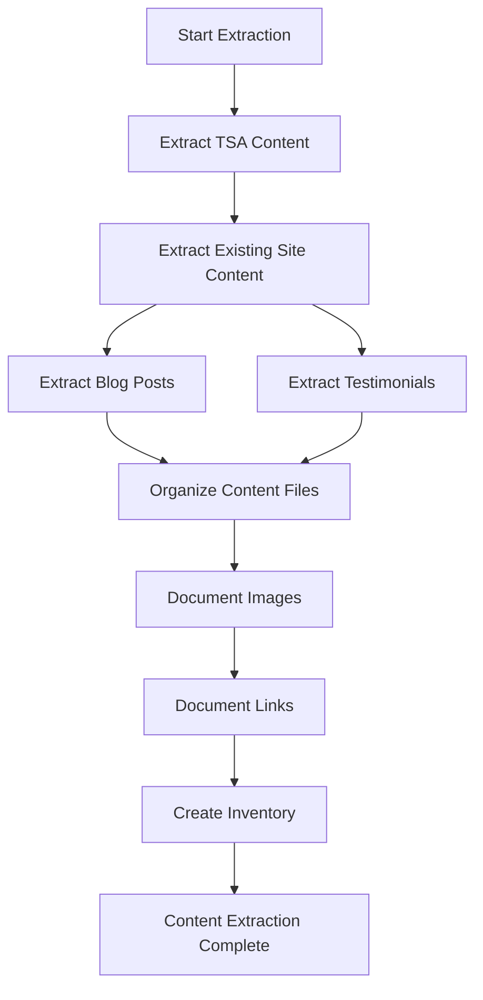

# P5.1 Content Extraction Implementation Plan

## 1. Overview and Objectives

### 1.1 Purpose
This document provides detailed step-by-step instructions for extracting all content from TSA Business School website and the existing The Strengths Toolbox website. Content extraction is the first critical step in the migration process and ensures no content is lost during the transition.

### 1.2 Scope
This implementation plan covers tasks P5.1.1 through P5.1.7:
- **P5.1.1**: Extract TSA Business School homepage content
- **P5.1.2**: Extract Strengths Programme page content
- **P5.1.3**: Extract About Us page content
- **P5.1.4**: Extract existing website content pages
- **P5.1.5**: Extract blog posts and metadata
- **P5.1.6**: Extract testimonials from both sources
- **P5.1.7**: Organize and document all extracted content

### 1.3 Success Criteria
- All content from both sources successfully extracted
- Content organized in structured file format
- Image locations documented
- Link references documented
- Content inventory spreadsheet created
- No content loss during extraction
- All formatting and structure preserved

## 2. Prerequisites

### 2.1 Required Knowledge
- Web content extraction techniques
- HTML structure understanding
- File organization best practices
- Content documentation
- Spreadsheet management

### 2.2 Dependencies
- Access to TSA Business School website (https://www.tsabusinessschool.co.za/)
- Access to existing The Strengths Toolbox website (https://www.thestrengthstoolbox.com/)
- Text editor or word processor
- Spreadsheet application (Excel, Google Sheets)
- File organization system

### 2.3 Reference Documents
- Content Migration Plan: `documentation/02-project-management/07-content-migration-plan.md`
- Business Requirements: `documentation/00-business-requirement/business-requirement-document.md`
- Phase 4 Deferred Items: `documentation/02-project-management/PHASE_4_DEFERRED_ITEMS.md`

## 3. Content Extraction Workflow Overview

The content extraction process follows this workflow:



## 4. Task P5.1.1: Extract TSA Business School Homepage Content

### 4.1 Overview
Extract all content sections from the TSA Business School homepage, including text, headings, CTAs, and structure.

### 4.2 Step-by-Step Implementation

#### Step 1: Access Source Website
1. Navigate to https://www.tsabusinessschool.co.za/
2. View page source or use browser developer tools
3. Take screenshots for reference

#### Step 2: Extract Hero Section
**File to create:** `content-extraction/tsa/homepage-hero-section.md`

Extract:
- Headline: "Build Strong Teams. Unlock Strong Profits."
- Subheadline text
- Primary CTA button text
- Secondary CTA (if any)
- Trust indicators (years experience, client count, etc.)

**Format:**
```markdown
# Homepage Hero Section

## Headline
Build Strong Teams. Unlock Strong Profits.

## Subheadline
[Extract subheadline text]

## Primary CTA
Book Your Complimentary 30-Minute Breakthrough Call

## Trust Indicators
- 30+ Years Experience
- 1560+ Happy Clients
- [Other indicators]

## Notes
- Image location: [URL if applicable]
- Background color/style: [Note]
```

#### Step 3: Extract "What is the Power of Strengths?" Section
**File to create:** `content-extraction/tsa/homepage-power-of-strengths.md`

Extract:
- Section heading
- Main description text
- Key benefits list (6 benefits)
- Business growth system description
- Any images or icons

#### Step 4: Extract "Three Pillars of Success" Section
**File to create:** `content-extraction/tsa/homepage-three-pillars.md`

Extract:
- Section heading
- Three pillars:
  1. Turn talent into performance
  2. Build teams that stick
  3. Drive growth with purpose
- Description for each pillar
- Any supporting text

#### Step 5: Extract "Why Strong Teams Fail Without Strategy" Section
**File to create:** `content-extraction/tsa/homepage-why-teams-fail.md`

Extract:
- Section heading
- Problem statement
- Description text
- Link to Strengths Programme page
- CTA text

#### Step 6: Extract "Why The Strengths Toolbox?" Section
**File to create:** `content-extraction/tsa/homepage-why-us.md`

Extract:
- Section heading
- Company credibility text
- 20+ years experience mention
- Key differentiators
- Link to About Us page

#### Step 7: Extract "Results You Can Expect" Section
**File to create:** `content-extraction/tsa/homepage-results.md`

Extract:
- Section heading
- Three result categories:
  1. Stronger Teams
  2. Higher Profits
  3. Confident Leadership
- Description for each result
- Supporting text

#### Step 8: Extract "What You'll Experience" Section
**File to create:** `content-extraction/tsa/homepage-experience.md`

Extract:
- Section heading
- Results description
- Link to Sales Courses
- Any testimonials or quotes

#### Step 9: Extract "How it Works" Section
**File to create:** `content-extraction/tsa/homepage-how-it-works.md`

Extract:
- Section heading
- Three-step process:
  1. Book a Consultation
  2. Power of Strengths Training
  3. Watch Your Profits Grow
- Description for each step
- Visual elements (if any)

#### Step 10: Extract eBook Sign-Up Form
**File to create:** `content-extraction/tsa/homepage-ebook-form.md`

Extract:
- Form heading
- Form description
- Form fields:
  - First Name
  - Last Name
  - Email
- Submit button text
- Privacy/consent text (if any)

#### Step 11: Extract Testimonials Section
**File to create:** `content-extraction/tsa/homepage-testimonials.md`

Extract:
- Section heading
- All testimonials with:
  - Name
  - Company (if provided)
  - Testimonial text
  - Rating (if any)
  - Image (if any)

### 4.3 Validation Checklist
- [ ] All 10 homepage sections extracted
- [ ] Text content complete and accurate
- [ ] Headings and structure preserved
- [ ] CTA text captured
- [ ] Image locations documented
- [ ] Links documented

## 5. Task P5.1.2: Extract Strengths Programme Page Content

### 5.1 Overview
Extract all content from the Strengths Programme page, including hero, sections, and FAQ.

### 5.2 Step-by-Step Implementation

#### Step 1: Access Page
1. Navigate to https://www.tsabusinessschool.co.za/strengths-programme/
2. View complete page content

#### Step 2: Extract Hero Section
**File to create:** `content-extraction/tsa/strengths-programme-hero.md`

Extract:
- Headline: "Unlock growth through the Power of Strengths"
- Subheadline
- Primary CTA: "Book a 30 Minute Free Consultation"

#### Step 3: Extract "What Strengths Matter for Your Business?" Section
**File to create:** `content-extraction/tsa/strengths-programme-what-matters.md`

Extract:
- Section heading
- Problem identification text
- Four key problems:
  1. Misaligned teams
  2. High turnover
  3. Missed sales targets
  4. Burnout and disengagement
- Description for each problem

#### Step 4: Extract "The Power of Strengths: Four Proven Programs" Section
**File to create:** `content-extraction/tsa/strengths-programme-programs.md`

Extract:
- Section heading
- Four programs:
  1. **For Individuals** - Discover Your Potential
  2. **For Managers & Leaders** - Lead With Strength
  3. **For Salespeople** - Sell With Confidence
  4. **For Teams** - Build Collective Power
- Benefits and outcomes for each program
- Description text for each

#### Step 5: Extract "Ready to Build Strong Teams and Strong Profits" Section
**File to create:** `content-extraction/tsa/strengths-programme-cta.md`

Extract:
- Section heading
- Closing CTA text
- Link to consultation booking

#### Step 6: Extract FAQ Section
**File to create:** `content-extraction/tsa/strengths-programme-faq.md`

Extract all FAQ items:
1. What is the Strengths Programme and how can it benefit my business?
2. Who should participate in the Strengths Programme?
3. How does the Strengths-Based Team Development component work?
4. What results can businesses expect from participating?
5. How do I get started with the Strengths Programme?

For each FAQ:
- Question text
- Answer text
- Any formatting (lists, links, etc.)

### 5.3 Validation Checklist
- [ ] Hero section extracted
- [ ] All content sections extracted
- [ ] Four programs fully documented
- [ ] All FAQ items extracted with answers
- [ ] CTAs captured
- [ ] Links documented

## 6. Task P5.1.3: Extract About Us Page Content

### 6.1 Overview
Extract all content from the About Us page, including biography, company information, and track record.

### 6.2 Step-by-Step Implementation

#### Step 1: Access Page
1. Navigate to https://www.tsabusinessschool.co.za/about-us/
2. View complete page content

#### Step 2: Extract "Our Story" Section
**File to create:** `content-extraction/tsa/about-us-our-story.md`

Extract:
- Section heading
- Founder introduction: Eberhard Niklaus
- Background and experience
- Career progression:
  - Sales Representative
  - Franchisee
  - Sales Manager
  - Franchise Network Leader
- 17+ years in franchise industry
- Transition to coaching and training
- Launch of The Strengths Toolbox (formerly TSA Business School)
- Professional headshot image location

#### Step 3: Extract "Why Choose Us?" Section
**File to create:** `content-extraction/tsa/about-us-why-choose-us.md`

Extract:
- Section heading
- Four key points:
  1. Proven Success
  2. Customized Solutions
  3. Empower Your Team
  4. A Holistic Approach
- Description for each point

#### Step 4: Extract "Track Record" Section
**File to create:** `content-extraction/tsa/about-us-track-record.md`

Extract:
- Section heading
- Statistics:
  - 30 Years Experience
  - 1560+ Happy Clients
- Visual representation notes
- Teamwork imagery location

### 6.3 Validation Checklist
- [ ] Biography content complete
- [ ] Career progression documented
- [ ] "Why Choose Us" points extracted
- [ ] Track record statistics captured
- [ ] Image locations documented

## 7. Task P5.1.4: Extract Existing Website Content Pages

### 7.1 Overview
Extract content from all 19 existing content pages on The Strengths Toolbox website.

### 7.2 Step-by-Step Implementation

#### Step 1: Create Extraction Structure
Create folder: `content-extraction/existing-site/`

#### Step 2: Extract Strengths-Based Development Pages (5 pages)
**Files to create:**
- `content-extraction/existing-site/strengths-based-development/power-of-strengths.md`
- `content-extraction/existing-site/strengths-based-development/teams.md`
- `content-extraction/existing-site/strengths-based-development/managers-leaders.md`
- `content-extraction/existing-site/strengths-based-development/salespeople.md`
- `content-extraction/existing-site/strengths-based-development/individuals.md`

For each page, extract:
- Page title
- Main heading (H1)
- All content sections
- Subheadings (H2, H3)
- Body text
- Lists and bullet points
- CTAs
- Links
- Images and their locations

#### Step 3: Extract Sales Training Pages (6 pages)
**Files to create:**
- `content-extraction/existing-site/sales-training/strengths-based-training.md`
- `content-extraction/existing-site/sales-training/relationship-selling.md`
- `content-extraction/existing-site/sales-training/selling-on-the-phone.md`
- `content-extraction/existing-site/sales-training/sales-fundamentals-workshop.md`
- `content-extraction/existing-site/sales-training/top-10-sales-secrets.md`
- `content-extraction/existing-site/sales-training/in-person-sales.md`

For each page, extract:
- Page title
- Course/workshop description
- Learning objectives
- Who should attend
- Course content/outline
- Duration and format
- Pricing (if available)
- Registration information
- Images

#### Step 4: Extract Facilitation/Workshop Pages (8 pages)
**Files to create:**
- `content-extraction/existing-site/facilitation/customer-service-workshop.md`
- `content-extraction/existing-site/facilitation/emotional-intelligence-workshop.md`
- `content-extraction/existing-site/facilitation/goal-setting.md`
- `content-extraction/existing-site/facilitation/high-performance-teams.md`
- `content-extraction/existing-site/facilitation/interpersonal-skills.md`
- `content-extraction/existing-site/facilitation/personal-finances.md`
- `content-extraction/existing-site/facilitation/presentation-skills.md`
- `content-extraction/existing-site/facilitation/supervising-others.md`

For each workshop page, extract:
- Workshop title
- Description
- Learning outcomes
- Target audience
- Workshop outline/agenda
- Duration
- Format (in-person, online, hybrid)
- Pricing
- Registration details
- Images

#### Step 5: Extract Standalone Pages
**Files to create:**
- `content-extraction/existing-site/keynote-talks.md`
- `content-extraction/existing-site/books.md`
- `content-extraction/existing-site/testimonials.md`
- `content-extraction/existing-site/contact.md`
- `content-extraction/existing-site/privacy-statement.md`

For each page, extract all content including:
- Page title
- All sections
- Forms (field labels, placeholders)
- Contact information
- Legal text (for privacy statement)

### 7.3 Content Extraction Template

Use this template for each page:

```markdown
# [Page Title]

## URL
[Page URL]

## Page Structure
- H1: [Main heading]
- H2: [Section headings]
- H3: [Subsection headings]

## Content Sections

### Section 1: [Section Name]
[Content text]

### Section 2: [Section Name]
[Content text]

## CTAs
- [CTA text] → [Link destination]

## Links
- [Link text] → [URL]

## Images
- [Image description] → [Image URL or location]

## Forms
- Field: [Field name]
  - Label: [Label text]
  - Placeholder: [Placeholder text]
  - Type: [Input type]

## Notes
[Any additional notes about formatting, special elements, etc.]
```

### 7.4 Validation Checklist
- [ ] All 19 pages extracted
- [ ] Content structure preserved
- [ ] All headings documented
- [ ] Links documented
- [ ] Images documented
- [ ] Forms documented
- [ ] CTAs captured

## 8. Task P5.1.5: Extract Blog Posts and Metadata

### 8.1 Overview
Extract all blog posts from the existing website, including content, metadata, categories, and tags.

### 8.2 Step-by-Step Implementation

#### Step 1: Access Blog Section
1. Navigate to blog listing page
2. Identify all blog posts
3. Create folder: `content-extraction/existing-site/blog/`

#### Step 2: Extract Blog Post Metadata
**File to create:** `content-extraction/existing-site/blog/blog-posts-inventory.md`

Create a spreadsheet or list with:
- Post title
- Post URL/slug
- Publication date
- Author
- Category
- Tags
- Featured image URL
- Excerpt
- Status (published/draft)

#### Step 3: Extract Individual Blog Posts
For each blog post, create a file: `content-extraction/existing-site/blog/[post-slug].md`

Extract:
- Post title
- Publication date
- Author
- Category
- Tags (comma-separated)
- Featured image URL
- Excerpt
- Full post content:
  - All headings
  - Paragraphs
  - Lists
  - Images (with URLs)
  - Links
  - Code blocks (if any)
  - Quotes
- SEO metadata (if visible):
  - Meta title
  - Meta description
  - Meta keywords

#### Step 4: Extract Blog Categories
**File to create:** `content-extraction/existing-site/blog/categories.md`

List all categories with:
- Category name
- Category slug/URL
- Description (if any)
- Post count

#### Step 5: Extract Blog Tags
**File to create:** `content-extraction/existing-site/blog/tags.md`

List all tags with:
- Tag name
- Tag slug/URL
- Usage count (if available)

### 8.3 Blog Post Extraction Template

```markdown
# [Blog Post Title]

## Metadata
- **URL:** [Post URL]
- **Publication Date:** [Date]
- **Author:** [Author name]
- **Category:** [Category name]
- **Tags:** [Tag1, Tag2, Tag3]
- **Featured Image:** [Image URL]

## Excerpt
[Post excerpt]

## Content

[Full post content with all formatting preserved]

## Images
- [Image description] → [Image URL]

## Links
- [Link text] → [URL]

## SEO
- Meta Title: [Title]
- Meta Description: [Description]
- Meta Keywords: [Keywords]
```

### 8.4 Validation Checklist
- [ ] All blog posts extracted
- [ ] Metadata captured for each post
- [ ] Categories documented
- [ ] Tags documented
- [ ] Images documented
- [ ] Content formatting preserved

## 9. Task P5.1.6: Extract Testimonials from Both Sources

### 9.1 Overview
Extract all testimonials from both TSA Business School and existing The Strengths Toolbox website.

### 9.2 Step-by-Step Implementation

#### Step 1: Extract TSA Business School Testimonials
**File to create:** `content-extraction/tsa/testimonials.md`

For each testimonial, extract:
- Name
- Company/Title (if provided)
- Testimonial text
- Rating (if any, 1-5 stars)
- Image (if any)
- Date (if available)
- Location on website (homepage, dedicated page, etc.)

#### Step 2: Extract Existing Website Testimonials
**File to create:** `content-extraction/existing-site/testimonials.md`

Extract same information as above.

#### Step 3: Create Testimonials Inventory
**File to create:** `content-extraction/testimonials-inventory.md`

Create a consolidated list with:
- Source (TSA or Existing Site)
- Name
- Company
- Testimonial text
- Rating
- Image location
- Duplicate check (mark if similar testimonial exists in other source)

### 9.3 Testimonial Extraction Template

```markdown
## Testimonial [Number]

**Source:** [TSA Business School / Existing Site]
**Location:** [Homepage / Testimonials Page / Other]
**Name:** [Full name]
**Company/Title:** [Company name or job title]
**Rating:** [1-5 stars or N/A]
**Image:** [Image URL or location]
**Date:** [If available]

**Testimonial:**
[Full testimonial text]

**Notes:**
[Any additional notes]
```

### 9.4 Validation Checklist
- [ ] All TSA testimonials extracted
- [ ] All existing site testimonials extracted
- [ ] Duplicates identified
- [ ] Images documented
- [ ] Ratings captured (if available)

## 10. Task P5.1.7: Organize and Document All Extracted Content

### 10.1 Overview
Organize all extracted content into a structured file system and create comprehensive documentation.

### 10.2 Step-by-Step Implementation

#### Step 1: Create Folder Structure
```
content-extraction/
├── tsa/
│   ├── homepage/
│   │   ├── hero-section.md
│   │   ├── power-of-strengths.md
│   │   ├── three-pillars.md
│   │   ├── why-teams-fail.md
│   │   ├── why-us.md
│   │   ├── results.md
│   │   ├── experience.md
│   │   ├── how-it-works.md
│   │   ├── ebook-form.md
│   │   └── testimonials.md
│   ├── strengths-programme/
│   │   ├── hero.md
│   │   ├── what-matters.md
│   │   ├── programs.md
│   │   ├── cta.md
│   │   └── faq.md
│   ├── about-us/
│   │   ├── our-story.md
│   │   ├── why-choose-us.md
│   │   └── track-record.md
│   └── testimonials.md
├── existing-site/
│   ├── strengths-based-development/
│   ├── sales-training/
│   ├── facilitation/
│   ├── blog/
│   └── [standalone-pages]
└── documentation/
    ├── content-inventory.md
    ├── image-inventory.md
    ├── link-inventory.md
    └── extraction-notes.md
```

#### Step 2: Create Content Inventory Spreadsheet
**File:** `content-extraction/documentation/content-inventory.md` or `.xlsx`

Create a comprehensive inventory with columns:
- Source (TSA / Existing Site)
- Page/Section Name
- File Path
- Content Type (Page / Blog Post / Testimonial / Form)
- Status (Extracted / In Progress / Pending)
- Word Count (approximate)
- Images Count
- Links Count
- Notes

#### Step 3: Create Image Inventory
**File:** `content-extraction/documentation/image-inventory.md`

Document all images with:
- Image description
- Source URL
- File name (if downloaded)
- Page/section where used
- Dimensions (if available)
- File size (if available)
- Alt text (if available)
- Optimization status

#### Step 4: Create Link Inventory
**File:** `content-extraction/documentation/link-inventory.md`

Document all links with:
- Link text
- Source URL
- Destination URL
- Link type (Internal / External)
- Status (Working / Broken / Needs Update)
- Page where link appears

#### Step 5: Create Extraction Notes
**File:** `content-extraction/documentation/extraction-notes.md`

Document:
- Extraction date
- Tools used
- Challenges encountered
- Special formatting notes
- Content that needs clarification
- Missing content identified

#### Step 6: Create Content Extraction Summary
**File:** `content-extraction/EXTRACTION_SUMMARY.md`

Summary document including:
- Total pages extracted
- Total blog posts extracted
- Total testimonials extracted
- Total images identified
- Total links documented
- Extraction completion status
- Next steps

### 10.3 Content Inventory Template

```markdown
# Content Extraction Inventory

## Summary
- **Extraction Date:** [Date]
- **Total Pages:** [Count]
- **Total Blog Posts:** [Count]
- **Total Testimonials:** [Count]
- **Total Images:** [Count]
- **Total Links:** [Count]

## Pages by Source

### TSA Business School
| Page Name | File Path | Status | Word Count | Images | Links |
|-----------|-----------|--------|------------|--------|-------|
| Homepage | tsa/homepage/ | ✓ | [count] | [count] | [count] |
| ... | ... | ... | ... | ... | ... |

### Existing Site
| Page Name | File Path | Status | Word Count | Images | Links |
|-----------|-----------|--------|------------|--------|-------|
| ... | ... | ... | ... | ... | ... |

## Blog Posts
| Title | Slug | Date | Category | Tags | Status |
|-------|------|------|----------|------|--------|
| ... | ... | ... | ... | ... | ... |

## Testimonials
| Name | Company | Source | Status |
|------|---------|--------|--------|
| ... | ... | ... | ... |
```

### 10.4 Validation Checklist
- [ ] Folder structure created
- [ ] All files organized
- [ ] Content inventory spreadsheet created
- [ ] Image inventory created
- [ ] Link inventory created
- [ ] Extraction notes documented
- [ ] Summary document created
- [ ] All content verified and complete

## 11. Extraction Tools and Techniques

### 11.1 Manual Extraction
- Use browser developer tools (F12)
- Copy text directly from rendered page
- Use "View Page Source" for HTML structure
- Take screenshots for reference

### 11.2 Browser Extensions (Optional)
- Web Scraper (Chrome extension)
- Copy All URLs
- Image downloader extensions

### 11.3 Automated Tools (Use with Caution)
- Web scraping scripts (ensure compliance with terms of service)
- HTML parsers
- Content extraction APIs

**Note:** Always respect website terms of service and robots.txt when extracting content.

## 12. Quality Assurance

### 12.1 Content Completeness Check
- Verify all sections extracted
- Check for missing content
- Verify formatting preserved
- Ensure no content truncated

### 12.2 Accuracy Check
- Compare extracted content with source
- Verify all text is correct
- Check for encoding issues
- Verify special characters display correctly

### 12.3 Documentation Check
- Verify all files named correctly
- Check folder structure is logical
- Verify inventory spreadsheets complete
- Ensure all links and images documented

## 13. Next Steps

After content extraction is complete:
1. Review extracted content for completeness
2. Proceed to P5.2 - Content Transformation
3. Begin brand name replacement process
4. Update contact information
5. Merge duplicate content

## 14. References

- Content Migration Plan: `documentation/02-project-management/07-content-migration-plan.md`
- Business Requirements: `documentation/00-business-requirement/business-requirement-document.md`
- Phase 4 Implementation: `documentation/03-development/phase-04/`
- **Next Task:** P5.2 - Content Transformation Implementation Plan

---

**Document Version:** 1.0  
**Last Updated:** 2025  
**Status:** Ready for Implementation
