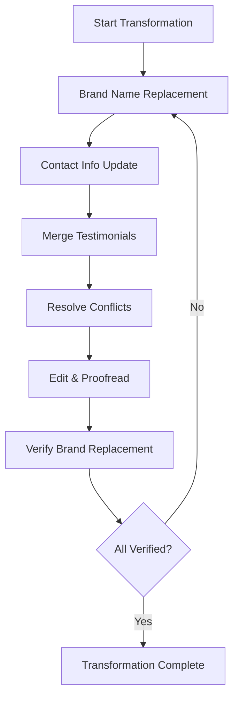

# P5.2 Content Transformation Implementation Plan

## 1. Overview and Objectives

### 1.1 Purpose
This document provides detailed step-by-step instructions for transforming extracted content through brand name replacement, contact information updates, content merging, and editing. This phase ensures all content reflects The Strengths Toolbox branding and maintains consistency.

### 1.2 Scope
This implementation plan covers tasks P5.2.1 through P5.2.6:
- **P5.2.1**: Implement automated brand name replacement
- **P5.2.2**: Update contact information (name, phone, email)
- **P5.2.3**: Merge testimonials from both sources
- **P5.2.4**: Resolve content conflicts and duplicates
- **P5.2.5**: Edit and proofread all content
- **P5.2.6**: Create brand name replacement verification tool

### 1.3 Success Criteria
- 100% brand name replacement verified
- All contact information updated consistently
- Duplicate content merged appropriately
- Content conflicts resolved
- All content edited and proofread
- Verification tools functional
- Content ready for import

## 2. Prerequisites

### 2.1 Required Knowledge
- Text editing and find/replace operations
- Content editing and proofreading
- Brand consistency principles
- Content merging strategies

### 2.2 Dependencies
- Task P5.1 completed (Content Extraction)
- All extracted content files available
- Text editor with find/replace functionality
- Access to content files

### 2.3 Reference Documents
- Content Migration Plan: `documentation/02-project-management/07-content-migration-plan.md`
- Business Requirements: `documentation/00-business-requirement/business-requirement-document.md`
- Brand Requirements: `documentation/00-business-requirement/business-requirement-document.md` (Section 2.1)

## 3. Content Transformation Workflow Overview

The content transformation process follows this workflow:



## 4. Task P5.2.1: Implement Automated Brand Name Replacement

### 4.1 Overview
Replace all instances of "TSA Business School" and variations with "The Strengths Toolbox" throughout all extracted content files.

### 4.2 Step-by-Step Implementation

#### Step 1: Create Brand Replacement Script
**File to create:** `content-transformation/scripts/brand-replacement.php`

Create a PHP script to automate brand name replacement:

```php
<?php

/**
 * Brand Name Replacement Script
 * Replaces TSA Business School references with The Strengths Toolbox
 */

$contentDir = __DIR__ . '/../content-extraction';
$replacements = [
    // Primary replacements
    'TSA Business School' => 'The Strengths Toolbox',
    'TSA Business' => 'The Strengths Toolbox',
    
    // Possessive forms
    "TSA Business School's" => "The Strengths Toolbox's",
    "TSA Business's" => "The Strengths Toolbox's",
    
    // Context-specific replacements
    'at TSA Business School' => 'at The Strengths Toolbox',
    'from TSA Business School' => 'from The Strengths Toolbox',
    'with TSA Business School' => 'with The Strengths Toolbox',
    'TSA Business School website' => 'The Strengths Toolbox website',
    
    // URL references (if any in content)
    'tsabusinessschool.co.za' => 'thestrengthstoolbox.com',
    'www.tsabusinessschool.co.za' => 'www.thestrengthstoolbox.com',
];

function replaceInFile($filePath, $replacements) {
    if (!file_exists($filePath)) {
        return false;
    }
    
    $content = file_get_contents($filePath);
    $originalContent = $content;
    
    foreach ($replacements as $search => $replace) {
        $content = str_replace($search, $replace, $content);
    }
    
    if ($content !== $originalContent) {
        file_put_contents($filePath, $content);
        return true;
    }
    
    return false;
}

function processDirectory($dir, $replacements) {
    $files = new RecursiveIteratorIterator(
        new RecursiveDirectoryIterator($dir),
        RecursiveIteratorIterator::SELF_FIRST
    );
    
    $processed = 0;
    foreach ($files as $file) {
        if ($file->isFile() && $file->getExtension() === 'md') {
            if (replaceInFile($file->getPathname(), $replacements)) {
                $processed++;
                echo "Processed: " . $file->getPathname() . "\n";
            }
        }
    }
    
    return $processed;
}

// Run replacement
echo "Starting brand name replacement...\n";
$processed = processDirectory($contentDir, $replacements);
echo "Completed! Processed {$processed} files.\n";
```

#### Step 2: Create Manual Replacement Checklist
**File to create:** `content-transformation/brand-replacement-checklist.md`

Document all replacement patterns:

```markdown
# Brand Name Replacement Checklist

## Primary Replacements
- [ ] "TSA Business School" → "The Strengths Toolbox"
- [ ] "TSA Business" → "The Strengths Toolbox"
- [ ] "TSA" (when referring to company) → "The Strengths Toolbox"

## Possessive Forms
- [ ] "TSA Business School's" → "The Strengths Toolbox's"
- [ ] "TSA Business's" → "The Strengths Toolbox's"

## Context-Specific Replacements
- [ ] "at TSA Business School" → "at The Strengths Toolbox"
- [ ] "from TSA Business School" → "from The Strengths Toolbox"
- [ ] "with TSA Business School" → "with The Strengths Toolbox"
- [ ] "TSA Business School website" → "The Strengths Toolbox website"

## URL Replacements
- [ ] "tsabusinessschool.co.za" → "thestrengthstoolbox.com"
- [ ] "www.tsabusinessschool.co.za" → "www.thestrengthstoolbox.com"

## Exceptions (Do NOT Replace)
- Historical references in testimonials (if contextually appropriate)
- Third-party quotes (maintain original attribution)
- Legal documents (if applicable)
```

#### Step 3: Run Automated Replacement
1. Execute the brand replacement script
2. Review output for processed files
3. Verify replacements were made correctly

#### Step 4: Manual Review for Context-Specific Cases
Review each file for:
- Context-specific replacements that need manual attention
- Testimonials that may need special handling
- Historical references that should remain unchanged
- Third-party content that should maintain original attribution

#### Step 5: Document Exceptions
**File to create:** `content-transformation/brand-replacement-exceptions.md`

Document any instances where brand name was NOT replaced, with justification:

```markdown
# Brand Name Replacement Exceptions

## Testimonials
| File | Location | Original Text | Reason |
|------|----------|--------------|--------|
| testimonials.md | Testimonial #3 | "TSA Business School helped us..." | Historical reference in quote |

## Third-Party Content
| File | Location | Original Text | Reason |
|------|----------|--------------|--------|
| ... | ... | ... | ... |
```

### 4.3 Validation Checklist
- [ ] Automated replacement script created
- [ ] All primary replacements completed
- [ ] Context-specific replacements reviewed
- [ ] Exceptions documented
- [ ] Manual review completed for all files

## 5. Task P5.2.2: Update Contact Information

### 5.1 Overview
Replace all contact information throughout content with The Strengths Toolbox contact details.

### 5.2 Step-by-Step Implementation

#### Step 1: Define Contact Information Standards
**File to create:** `content-transformation/contact-information-standards.md`

Document the standard contact information:

```markdown
# Contact Information Standards

## Primary Contact Details
- **Name:** Eberhard Niklaus
- **Mobile:** +27 83 294 8033
- **Email:** welcome@eberhardniklaus.co.za

## Display Formats
- Phone: +27 83 294 8033 or (083) 294-8033
- Email: welcome@eberhardniklaus.co.za
- Name: Eberhard Niklaus (full name on first reference, then "Eberhard" or "Mr. Niklaus" as appropriate)
```

#### Step 2: Create Contact Information Replacement Script
**File to create:** `content-transformation/scripts/contact-replacement.php`

```php
<?php

/**
 * Contact Information Replacement Script
 */

$contentDir = __DIR__ . '/../content-extraction';

// Old contact information patterns (from TSA website)
$oldContacts = [
    // Phone numbers (various formats)
    '/\+27\s*83\s*294\s*8033/i',
    '/083\s*294\s*8033/i',
    '/\(083\)\s*294-8033/i',
    // Add other phone formats found
    
    // Email addresses
    '/info@tsabusinessschool\.co\.za/i',
    '/contact@tsabusinessschool\.co\.za/i',
    // Add other email formats found
];

// New contact information
$newPhone = '+27 83 294 8033';
$newEmail = 'welcome@eberhardniklaus.co.za';

function replaceContactInFile($filePath, $oldContacts, $newPhone, $newEmail) {
    if (!file_exists($filePath)) {
        return false;
    }
    
    $content = file_get_contents($filePath);
    $originalContent = $content;
    
    // Replace phone numbers
    foreach ($oldContacts as $pattern) {
        if (preg_match('/phone|mobile|tel|call/i', $pattern)) {
            $content = preg_replace($pattern, $newPhone, $content);
        }
    }
    
    // Replace email addresses
    $content = preg_replace('/[a-zA-Z0-9._%+-]+@tsabusinessschool\.co\.za/i', $newEmail, $content);
    
    if ($content !== $originalContent) {
        file_put_contents($filePath, $content);
        return true;
    }
    
    return false;
}

// Process files (similar to brand replacement script)
// ...
```

#### Step 3: Manual Contact Information Update
For each content file, manually verify and update:
- Phone numbers in all formats
- Email addresses
- Contact person names
- Physical addresses (if applicable)
- Social media links (if applicable)

#### Step 4: Create Contact Information Inventory
**File to create:** `content-transformation/contact-information-inventory.md`

Document all contact information found and updated:

```markdown
# Contact Information Inventory

## Phone Numbers Found
| File | Location | Old Format | New Format | Status |
|------|----------|------------|------------|--------|
| homepage-hero.md | Footer | 083 294 8033 | +27 83 294 8033 | ✓ Updated |

## Email Addresses Found
| File | Location | Old Email | New Email | Status |
|------|----------|----------|-----------|--------|
| contact.md | Contact form | info@tsa... | welcome@eberhard... | ✓ Updated |

## Names Found
| File | Location | Old Name | New Name | Status |
|------|----------|---------|----------|--------|
| ... | ... | ... | ... | ... |
```

### 5.3 Validation Checklist
- [ ] Contact information standards defined
- [ ] Replacement script created
- [ ] All phone numbers updated
- [ ] All email addresses updated
- [ ] All names updated
- [ ] Contact information inventory created
- [ ] Manual verification completed

## 6. Task P5.2.3: Merge Testimonials from Both Sources

### 6.1 Overview
Merge testimonials from TSA Business School and existing website, removing duplicates and organizing by relevance.

### 6.2 Step-by-Step Implementation

#### Step 1: Compare Testimonials
**File to create:** `content-transformation/testimonials-comparison.md`

Compare testimonials from both sources:
- Identify exact duplicates
- Identify similar testimonials (same person, different wording)
- Identify unique testimonials from each source

#### Step 2: Create Merged Testimonials File
**File to create:** `content-transformation/testimonials-merged.md`

Organize merged testimonials:

```markdown
# Merged Testimonials

## Featured Testimonials (Homepage)
1. [Testimonial from TSA or Existing - best quality]
2. [Testimonial from TSA or Existing - best quality]
3. [Testimonial from TSA or Existing - best quality]

## All Testimonials (Full List)
[Complete list with source noted]

## Duplicates Removed
- [Testimonial removed - duplicate of #X]
- [Testimonial removed - similar to #Y]
```

#### Step 3: Resolve Duplicate Testimonials
For each duplicate:
- Keep the more complete version
- If both are identical, keep one
- If similar but different wording, keep the more recent or comprehensive version
- Document which was kept and which was removed

#### Step 4: Organize by Category
Group testimonials by:
- Source (if needed for reference)
- Rating (if available)
- Industry/company type (if applicable)
- Date (if available)

#### Step 5: Update Testimonial Content
For each testimonial:
- Apply brand name replacement
- Update contact information references
- Ensure consistent formatting
- Verify attribution is correct

### 6.3 Validation Checklist
- [ ] Testimonials compared from both sources
- [ ] Duplicates identified and resolved
- [ ] Merged testimonials file created
- [ ] Brand names replaced in testimonials
- [ ] Contact information updated
- [ ] Testimonials organized and ready for import

## 7. Task P5.2.4: Resolve Content Conflicts and Duplicates

### 7.1 Overview
Identify and resolve conflicts between content from TSA Business School and existing website, ensuring consistency and avoiding contradictions.

### 7.2 Step-by-Step Implementation

#### Step 1: Identify Content Conflicts
**File to create:** `content-transformation/content-conflicts.md`

Document conflicts:

```markdown
# Content Conflicts and Resolutions

## Service Descriptions
| Topic | TSA Version | Existing Version | Resolution | Notes |
|-------|------------|-----------------|------------|-------|
| Strengths Programme | [Description] | [Description] | [Which to use] | [Reason] |

## Statistics
| Statistic | TSA Value | Existing Value | Resolution | Notes |
|-----------|-----------|----------------|------------|-------|
| Years Experience | 30 years | 20+ years | Use 30 years | More specific |
| Client Count | 1560+ | 1000+ | Use 1560+ | More recent |

## Contact Information
[Already handled in P5.2.2]

## Service Offerings
| Service | TSA | Existing | Resolution | Notes |
|---------|-----|----------|------------|-------|
| ... | ... | ... | ... | ... |
```

#### Step 2: Create Conflict Resolution Rules
**File to create:** `content-transformation/conflict-resolution-rules.md`

Define rules for resolving conflicts:

```markdown
# Content Conflict Resolution Rules

## Priority Order
1. Use more specific/accurate information
2. Use more recent information
3. Use more comprehensive content
4. Prefer TSA content for new pages (homepage, Strengths Programme, About Us)
5. Preserve existing content for existing pages

## Statistics
- Use the most specific number (e.g., 1560+ over 1000+)
- Use the most recent data
- Verify accuracy with stakeholder if uncertain

## Service Descriptions
- Use the more comprehensive description
- Merge unique value propositions from both
- Ensure no contradictory information

## Testimonials
- Keep all unique testimonials
- Remove exact duplicates
- Keep the more complete version of similar testimonials
```

#### Step 3: Resolve Each Conflict
For each identified conflict:
1. Apply resolution rules
2. Document the resolution
3. Update content files accordingly
4. Note any items requiring stakeholder input

#### Step 4: Create Content Merge Decisions Document
**File to create:** `content-transformation/merge-decisions.md`

Document all merge decisions:

```markdown
# Content Merge Decisions

## Pages to Use TSA Content
- Homepage (all sections)
- Strengths Programme page
- About Us page

## Pages to Use Existing Content
- All 19 existing content pages
- Blog posts
- Workshop descriptions

## Pages to Merge Content
- Testimonials (merge from both sources)
- Contact information (use The Strengths Toolbox details)

## Decisions Requiring Stakeholder Input
- [Item 1]: [Question/Decision needed]
- [Item 2]: [Question/Decision needed]
```

### 7.3 Validation Checklist
- [ ] Content conflicts identified
- [ ] Resolution rules defined
- [ ] All conflicts resolved
- [ ] Merge decisions documented
- [ ] Content files updated
- [ ] Stakeholder input items identified

## 8. Task P5.2.5: Edit and Proofread All Content

### 8.1 Overview
Edit and proofread all transformed content to ensure quality, consistency, and accuracy.

### 8.2 Step-by-Step Implementation

#### Step 1: Create Editing Checklist
**File to create:** `content-transformation/editing-checklist.md`

```markdown
# Content Editing Checklist

## Grammar and Spelling
- [ ] No spelling errors
- [ ] Proper grammar throughout
- [ ] Consistent punctuation
- [ ] Proper capitalization

## Style and Tone
- [ ] Consistent tone across all content
- [ ] Professional yet approachable
- [ ] Clear and concise language
- [ ] No jargon without explanation

## Formatting
- [ ] Consistent heading hierarchy
- [ ] Proper list formatting
- [ ] Consistent paragraph spacing
- [ ] Proper use of emphasis (bold, italic)

## Brand Consistency
- [ ] "The Strengths Toolbox" used consistently
- [ ] Contact information consistent
- [ ] Brand voice consistent
- [ ] No conflicting information

## Accuracy
- [ ] All facts verified
- [ ] Statistics accurate
- [ ] Links working
- [ ] Dates correct
```

#### Step 2: Edit Each Content File
For each content file:
1. Read through for grammar and spelling
2. Check for consistency with brand voice
3. Verify formatting is correct
4. Ensure all replacements were made correctly
5. Check for any remaining TSA references
6. Verify contact information is correct

#### Step 3: Create Proofreading Log
**File to create:** `content-transformation/proofreading-log.md`

Track proofreading progress:

```markdown
# Proofreading Log

## Files Proofread
| File | Date | Proofreader | Status | Notes |
|------|------|-------------|--------|-------|
| homepage-hero.md | [Date] | [Name] | ✓ Complete | [Notes] |
| ... | ... | ... | ... | ... |

## Issues Found
| File | Issue | Fixed | Notes |
|------|-------|-------|-------|
| ... | ... | ... | ... |
```

#### Step 4: Second Pass Review
Conduct a second review focusing on:
- Overall consistency
- Flow and readability
- Brand voice alignment
- Technical accuracy

#### Step 5: Final Quality Check
Before proceeding to import:
- All files edited
- All files proofread
- No spelling/grammar errors
- Consistent formatting
- Brand consistency verified

### 8.3 Validation Checklist
- [ ] Editing checklist created
- [ ] All files edited
- [ ] All files proofread
- [ ] Proofreading log maintained
- [ ] Second pass review completed
- [ ] Final quality check passed

## 9. Task P5.2.6: Create Brand Name Replacement Verification Tool

### 9.1 Overview
Create a command-line tool to verify that all brand name replacements were successful and no TSA references remain.

### 9.2 Step-by-Step Implementation

#### Step 1: Create Verification Command
**File to create:** `app/Console/Commands/VerifyBrandReplacement.php`

```php
<?php

namespace App\Console\Commands;

use Illuminate\Console\Command;
use Illuminate\Support\Facades\File;

class VerifyBrandReplacement extends Command
{
    protected $signature = 'content:verify-brand-replacement 
                            {--path=content-transformation : Path to content files}
                            {--fix : Automatically fix issues found}';

    protected $description = 'Verify that all TSA Business School references have been replaced';

    protected $tsaPatterns = [
        'TSA Business School',
        'TSA Business',
        'tsabusinessschool.co.za',
        'www.tsabusinessschool.co.za',
    ];

    protected $issues = [];

    public function handle()
    {
        $path = $this->option('path');
        
        if (!is_dir($path)) {
            $this->error("Path not found: {$path}");
            return 1;
        }

        $this->info('Scanning content files for TSA references...');
        $this->newLine();

        $this->scanDirectory($path);

        if (empty($this->issues)) {
            $this->info('✓ No TSA references found. Brand replacement verified!');
            return 0;
        }

        $this->warn('Found ' . count($this->issues) . ' potential TSA references:');
        $this->newLine();

        foreach ($this->issues as $issue) {
            $this->line("  File: {$issue['file']}");
            $this->line("  Line {$issue['line']}: {$issue['text']}");
            $this->newLine();
        }

        if ($this->option('fix')) {
            $this->info('Attempting to fix issues...');
            // Add auto-fix logic if needed
        }

        return 1;
    }

    protected function scanDirectory($dir)
    {
        $files = File::allFiles($dir);

        foreach ($files as $file) {
            if ($file->getExtension() !== 'md') {
                continue;
            }

            $content = File::get($file->getPathname());
            $lines = explode("\n", $content);

            foreach ($lines as $lineNum => $line) {
                foreach ($this->tsaPatterns as $pattern) {
                    if (stripos($line, $pattern) !== false) {
                        // Check if it's in an exception list
                        if (!$this->isException($file->getPathname(), $line)) {
                            $this->issues[] = [
                                'file' => $file->getRelativePathname(),
                                'line' => $lineNum + 1,
                                'text' => trim($line),
                                'pattern' => $pattern,
                            ];
                        }
                    }
                }
            }
        }
    }

    protected function isException($file, $line)
    {
        // Check if this is a documented exception
        // Could read from exceptions file
        return false;
    }
}
```

#### Step 2: Create Exception Handling
**File to create:** `content-transformation/brand-verification-exceptions.json`

Store documented exceptions:

```json
{
  "exceptions": [
    {
      "file": "testimonials.md",
      "line": 45,
      "text": "TSA Business School helped us...",
      "reason": "Historical reference in testimonial quote"
    }
  ]
}
```

#### Step 3: Test Verification Tool
1. Run the verification command
2. Review output
3. Fix any issues found
4. Re-run until no issues remain

#### Step 4: Create Verification Report
**File to create:** `content-transformation/brand-verification-report.md`

Document verification results:

```markdown
# Brand Name Replacement Verification Report

## Verification Date
[Date]

## Files Scanned
[Count] files

## Issues Found
[Count] potential TSA references

## Issues by File
[Detailed list]

## Exceptions
[Documented exceptions]

## Status
✓ Brand replacement verified / ⚠ Issues found
```

### 9.3 Validation Checklist
- [ ] Verification command created
- [ ] Command tested
- [ ] Exception handling implemented
- [ ] Verification report generated
- [ ] All issues resolved
- [ ] 100% brand replacement verified

## 10. Content Transformation Summary

### 10.1 Transformation Checklist
- [ ] Brand name replacement completed
- [ ] Contact information updated
- [ ] Testimonials merged
- [ ] Content conflicts resolved
- [ ] All content edited and proofread
- [ ] Verification tool created and run
- [ ] 100% brand replacement verified

### 10.2 Deliverables
- Transformed content files (all TSA references replaced)
- Updated contact information throughout
- Merged testimonials file
- Content conflict resolution document
- Edited and proofread content
- Brand replacement verification report

## 11. Next Steps

After content transformation is complete:
1. Review transformed content
2. Proceed to P5.3 - Content Import
3. Begin importing content into database
4. Update seeders with transformed content

## 12. References

- Content Migration Plan: `documentation/02-project-management/07-content-migration-plan.md`
- Business Requirements: `documentation/00-business-requirement/business-requirement-document.md`
- Content Extraction: `documentation/03-development/phase-05/P5.1-content-extraction.md`
- **Next Task:** P5.3 - Content Import Implementation Plan

---

**Document Version:** 1.0  
**Last Updated:** 2025  
**Status:** Ready for Implementation
