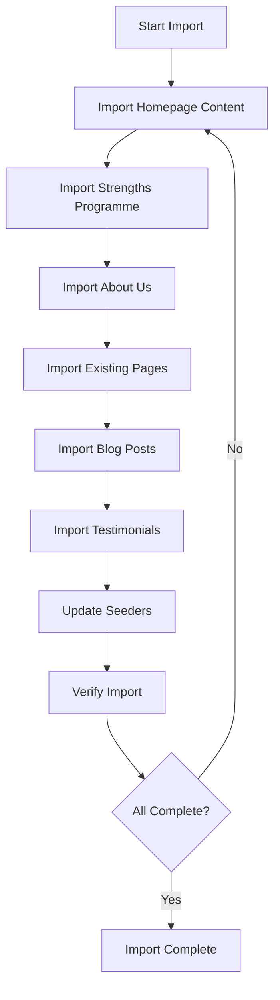

# P5.3 Content Import Implementation Plan

## 1. Overview and Objectives

### 1.1 Purpose
This document provides detailed step-by-step instructions for importing all transformed content into the Laravel application database. This includes homepage sections, page content, blog posts, and testimonials.

### 1.2 Scope
This implementation plan covers tasks P5.3.1 through P5.3.7:
- **P5.3.1**: Import homepage content sections
- **P5.3.2**: Import Strengths Programme page content
- **P5.3.3**: Import About Us page content
- **P5.3.4**: Import existing content pages (19 pages)
- **P5.3.5**: Import blog posts with metadata
- **P5.3.6**: Import testimonials
- **P5.3.7**: Update ContentMigrationSeeder with actual content

### 1.3 Success Criteria
- All homepage sections imported
- All page content imported
- All blog posts imported with metadata
- All testimonials imported
- ContentMigrationSeeder updated with actual content
- All content accessible via CMS
- All pages published and visible

## 2. Prerequisites

### 2.1 Required Knowledge
- Laravel database operations
- Eloquent models
- Database seeders
- Content management system
- HTML content handling

### 2.2 Dependencies
- Task P5.2 completed (Content Transformation)
- All transformed content files available
- Database migrations run
- CMS functional
- Models: Page, BlogPost, Category, Tag, Testimonial

### 2.3 Reference Documents
- Content Migration Plan: `documentation/02-project-management/07-content-migration-plan.md`
- Content Transformation: `documentation/03-development/phase-05/P5.2-content-transformation.md`
- Existing Seeder: `database/seeders/ContentMigrationSeeder.php`
- Page Model: `app/Models/Page.php`
- BlogPost Model: `app/Models/BlogPost.php`

## 3. Content Import Workflow Overview

The content import process follows this workflow:



## 4. Task P5.3.1: Import Homepage Content Sections

### 4.1 Overview
Import all 10 homepage sections into the database. The homepage content is managed through the Page model with a special homepage record.

### 4.2 Step-by-Step Implementation

#### Step 1: Review Homepage Structure
The homepage consists of 10 sections:
1. Hero section
2. Power of Strengths section
3. Three Pillars section
4. Why Strong Teams Fail section
5. Why The Strengths Toolbox section
6. Results You Can Expect section
7. What You'll Experience section
8. How it Works section
9. eBook sign-up form
10. Testimonials section

#### Step 2: Create Homepage Content Seeder Method
**File to update:** `database/seeders/ContentMigrationSeeder.php`

Add method to import homepage content:

```php
protected function importHomepageContent(): void
{
    $this->command->info('Importing homepage content...');

    // Read transformed content files
    $heroContent = $this->readContentFile('content-transformation/tsa/homepage/hero-section.md');
    $powerOfStrengths = $this->readContentFile('content-transformation/tsa/homepage/power-of-strengths.md');
    $threePillars = $this->readContentFile('content-transformation/tsa/homepage/three-pillars.md');
    $whyTeamsFail = $this->readContentFile('content-transformation/tsa/homepage/why-teams-fail.md');
    $whyUs = $this->readContentFile('content-transformation/tsa/homepage/why-us.md');
    $results = $this->readContentFile('content-transformation/tsa/homepage/results.md');
    $experience = $this->readContentFile('content-transformation/tsa/homepage/experience.md');
    $howItWorks = $this->readContentFile('content-transformation/tsa/homepage/how-it-works.md');
    $ebookForm = $this->readContentFile('content-transformation/tsa/homepage/ebook-form.md');

    // Combine all sections into homepage content
    $homepageContent = $this->combineHomepageSections([
        'hero' => $heroContent,
        'power_of_strengths' => $powerOfStrengths,
        'three_pillars' => $threePillars,
        'why_teams_fail' => $whyTeamsFail,
        'why_us' => $whyUs,
        'results' => $results,
        'experience' => $experience,
        'how_it_works' => $howItWorks,
        'ebook_form' => $ebookForm,
    ]);

    // Create or update homepage page
    $homepage = Page::firstOrNew(['slug' => 'home']);
    $homepage->fill([
        'title' => 'Home - The Strengths Toolbox',
        'slug' => 'home',
        'excerpt' => 'Transform your business with strengths-based development. Build strong teams and unlock strong profits.',
        'content' => $homepageContent,
        'meta_title' => 'The Strengths Toolbox - Build Strong Teams, Unlock Strong Profits',
        'meta_description' => 'Transform your business with strengths-based development. Discover how The Strengths Toolbox helps teams achieve peak performance and drive sustainable growth.',
        'meta_keywords' => 'strengths-based development, team building, business growth, CliftonStrengths, team performance',
        'is_published' => true,
        'published_at' => now(),
    ]);
    $homepage->save();

    $this->command->line('  ✓ Homepage content imported');
}

protected function readContentFile(string $path): string
{
    $fullPath = base_path($path);
    
    if (!file_exists($fullPath)) {
        $this->command->warn("  ⚠ File not found: {$path}");
        return '';
    }

    return file_get_contents($fullPath);
}

protected function combineHomepageSections(array $sections): string
{
    $html = '';
    
    foreach ($sections as $key => $content) {
        // Convert markdown to HTML if needed
        $htmlContent = $this->markdownToHtml($content);
        $html .= "<section id=\"{$key}\" class=\"homepage-section\">\n";
        $html .= $htmlContent;
        $html .= "</section>\n\n";
    }

    return $html;
}

protected function markdownToHtml(string $markdown): string
{
    // Simple markdown to HTML conversion
    // For production, consider using a markdown parser like Parsedown
    
    // Convert headers
    $markdown = preg_replace('/^# (.*)$/m', '<h1>$1</h1>', $markdown);
    $markdown = preg_replace('/^## (.*)$/m', '<h2>$1</h2>', $markdown);
    $markdown = preg_replace('/^### (.*)$/m', '<h3>$1</h3>', $markdown);
    
    // Convert bold
    $markdown = preg_replace('/\*\*(.*?)\*\*/', '<strong>$1</strong>', $markdown);
    
    // Convert italic
    $markdown = preg_replace('/\*(.*?)\*/', '<em>$1</em>', $markdown);
    
    // Convert lists
    $markdown = preg_replace('/^\- (.*)$/m', '<li>$1</li>', $markdown);
    $markdown = preg_replace('/(<li>.*<\/li>)/s', '<ul>$1</ul>', $markdown);
    
    // Convert paragraphs
    $markdown = preg_replace('/\n\n/', '</p><p>', $markdown);
    $markdown = '<p>' . $markdown . '</p>';
    
    return $markdown;
}
```

#### Step 3: Alternative: Import via Admin Panel
If preferred, import homepage content manually via admin panel:

1. Log in to admin panel: `/admin`
2. Navigate to Pages: `/admin/pages`
3. Create or edit homepage page
4. Copy content from transformed files
5. Paste into WYSIWYG editor
6. Set SEO metadata
7. Publish page

#### Step 4: Verify Homepage Import
1. Visit homepage: `/`
2. Verify all sections display
3. Check content accuracy
4. Verify SEO metadata
5. Test CTAs and links

### 4.3 Validation Checklist
- [ ] Homepage content imported
- [ ] All 10 sections present
- [ ] Content displays correctly
- [ ] SEO metadata set
- [ ] Page published
- [ ] Links working

## 5. Task P5.3.2: Import Strengths Programme Page Content

### 5.1 Overview
Import all content from the Strengths Programme page, including hero, sections, and FAQ.

### 5.2 Step-by-Step Implementation

#### Step 1: Create Strengths Programme Import Method
**File to update:** `database/seeders/ContentMigrationSeeder.php`

Add method:

```php
protected function importStrengthsProgrammeContent(): void
{
    $this->command->info('Importing Strengths Programme page content...');

    // Read transformed content files
    $hero = $this->readContentFile('content-transformation/tsa/strengths-programme/hero.md');
    $whatMatters = $this->readContentFile('content-transformation/tsa/strengths-programme/what-matters.md');
    $programs = $this->readContentFile('content-transformation/tsa/strengths-programme/programs.md');
    $cta = $this->readContentFile('content-transformation/tsa/strengths-programme/cta.md');
    $faq = $this->readContentFile('content-transformation/tsa/strengths-programme/faq.md');

    // Combine sections
    $content = $this->combinePageSections([
        'hero' => $hero,
        'what_matters' => $whatMatters,
        'programs' => $programs,
        'cta' => $cta,
        'faq' => $faq,
    ]);

    // Create or update page
    $page = Page::firstOrNew(['slug' => 'strengths-programme']);
    $page->fill([
        'title' => 'Strengths Programme - The Strengths Toolbox',
        'slug' => 'strengths-programme',
        'excerpt' => 'Unlock growth through the Power of Strengths. Discover proven programs for individuals, managers, salespeople, and teams.',
        'content' => $content,
        'meta_title' => 'Strengths Programme - Unlock Growth Through Strengths - The Strengths Toolbox',
        'meta_description' => 'Discover how strengths-based development transforms teams and drives business growth. Four proven programs for individuals, managers, salespeople, and teams.',
        'meta_keywords' => 'strengths programme, strengths-based development, team development, leadership training, sales training',
        'is_published' => true,
        'published_at' => now(),
    ]);
    $page->save();

    $this->command->line('  ✓ Strengths Programme page imported');
}
```

#### Step 2: Format FAQ Section
Ensure FAQ is properly formatted as HTML:

```php
protected function formatFAQ(string $faqContent): string
{
    // Parse FAQ items from markdown
    // Format as HTML accordion or structured list
    
    $html = '<div class="faq-section">';
    $html .= '<h2>Frequently Asked Questions</h2>';
    
    // Parse and format each FAQ item
    // Implementation depends on FAQ format in source file
    
    $html .= '</div>';
    
    return $html;
}
```

#### Step 3: Verify Import
1. Visit page: `/strengths-programme`
2. Verify all sections display
3. Check FAQ formatting
4. Verify CTAs work
5. Test links

### 5.3 Validation Checklist
- [ ] Strengths Programme content imported
- [ ] All sections present
- [ ] FAQ formatted correctly
- [ ] CTAs working
- [ ] SEO metadata set
- [ ] Page published

## 6. Task P5.3.3: Import About Us Page Content

### 6.1 Overview
Import About Us page content including biography, company information, and track record.

### 6.2 Step-by-Step Implementation

#### Step 1: Create About Us Import Method
**File to update:** `database/seeders/ContentMigrationSeeder.php`

Add method:

```php
protected function importAboutUsContent(): void
{
    $this->command->info('Importing About Us page content...');

    // Read transformed content files
    $ourStory = $this->readContentFile('content-transformation/tsa/about-us/our-story.md');
    $whyChooseUs = $this->readContentFile('content-transformation/tsa/about-us/why-choose-us.md');
    $trackRecord = $this->readContentFile('content-transformation/tsa/about-us/track-record.md');

    // Combine sections
    $content = $this->combinePageSections([
        'our_story' => $ourStory,
        'why_choose_us' => $whyChooseUs,
        'track_record' => $trackRecord,
    ]);

    // Create or update page
    $page = Page::firstOrNew(['slug' => 'about-us']);
    $page->fill([
        'title' => 'About Us - The Strengths Toolbox',
        'slug' => 'about-us',
        'excerpt' => 'Learn about Eberhard Niklaus and The Strengths Toolbox. 30 years of experience helping businesses build strong teams and drive growth.',
        'content' => $content,
        'meta_title' => 'About Us - The Strengths Toolbox - 30 Years of Experience',
        'meta_description' => 'Meet Eberhard Niklaus and learn about The Strengths Toolbox. 30 years of experience, 1560+ happy clients, proven results in strengths-based development.',
        'meta_keywords' => 'about us, Eberhard Niklaus, strengths-based development, team building, business coaching',
        'is_published' => true,
        'published_at' => now(),
    ]);
    $page->save();

    $this->command->line('  ✓ About Us page imported');
}
```

#### Step 2: Handle Images
If About Us page includes images (e.g., headshot):

```php
protected function importAboutUsImages(): void
{
    // Image import will be handled in P5.4
    // For now, note image locations in content
    // Update image references after images are uploaded
}
```

#### Step 3: Verify Import
1. Visit page: `/about-us`
2. Verify biography content
3. Check statistics display
4. Verify images (if uploaded)
5. Test links

### 6.3 Validation Checklist
- [ ] About Us content imported
- [ ] Biography complete
- [ ] Statistics accurate
- [ ] SEO metadata set
- [ ] Page published
- [ ] Images referenced (if applicable)

## 7. Task P5.3.4: Import Existing Content Pages (19 Pages)

### 7.1 Overview
Import content for all 19 existing content pages that were created in Phase 4 with placeholder content.

### 7.2 Step-by-Step Implementation

#### Step 1: Create Bulk Import Method
**File to update:** `database/seeders/ContentMigrationSeeder.php`

Update existing methods to use transformed content:

```php
protected function seedStrengthsBasedDevelopmentPages(): void
{
    $this->command->info('Importing Strengths-Based Development pages...');

    $pages = [
        [
            'slug' => 'the-power-of-strengths',
            'file' => 'content-transformation/existing-site/strengths-based-development/power-of-strengths.md',
            'title' => 'The Power of Strengths',
            'meta_title' => 'The Power of Strengths - The Strengths Toolbox',
            'meta_description' => 'Discover how identifying and leveraging natural talents transforms individual and team performance.',
        ],
        [
            'slug' => 'strengths-based-development/teams',
            'file' => 'content-transformation/existing-site/strengths-based-development/teams.md',
            'title' => 'Strengths-Based Development for Teams',
            'meta_title' => 'Team Development - Strengths-Based Approach - The Strengths Toolbox',
            'meta_description' => 'Transform your team with strengths-based development. Build stronger collaboration and improve team performance.',
        ],
        // ... add all 5 pages
    ];

    foreach ($pages as $pageData) {
        $content = $this->readContentFile($pageData['file']);
        
        if (empty($content)) {
            $this->command->warn("  ⚠ Content file not found: {$pageData['file']}");
            continue;
        }

        $page = Page::firstOrNew(['slug' => $pageData['slug']]);
        $page->fill([
            'title' => $pageData['title'],
            'slug' => $pageData['slug'],
            'excerpt' => $this->extractExcerpt($content),
            'content' => $this->markdownToHtml($content),
            'meta_title' => $pageData['meta_title'],
            'meta_description' => $pageData['meta_description'],
            'meta_keywords' => $pageData['meta_keywords'] ?? '',
            'is_published' => true,
            'published_at' => now(),
        ]);
        $page->save();

        $this->command->line("  ✓ Imported: {$pageData['title']}");
    }
}
```

#### Step 2: Import Sales Training Pages
Update `seedSalesTrainingPages()` method similarly:

```php
protected function seedSalesTrainingPages(): void
{
    $this->command->info('Importing Sales Training pages...');

    $pages = [
        [
            'slug' => 'sales-training/strengths-based-training',
            'file' => 'content-transformation/existing-site/sales-training/strengths-based-training.md',
            'title' => 'Strengths-Based Sales Training',
            // ... metadata
        ],
        // ... add all 6 pages
    ];

    // Import each page
}
```

#### Step 3: Import Facilitation Pages
Update `seedFacilitationPages()` method:

```php
protected function seedFacilitationPages(): void
{
    $this->command->info('Importing Facilitation/Workshop pages...');

    $pages = [
        [
            'slug' => 'facilitation/customer-service-workshop',
            'file' => 'content-transformation/existing-site/facilitation/customer-service-workshop.md',
            'title' => 'Customer Service Workshop',
            // ... metadata
        ],
        // ... add all 8 pages
    ];

    // Import each page
}
```

#### Step 4: Import Standalone Pages
Update `seedStandalonePages()` method:

```php
protected function seedStandalonePages(): void
{
    $this->command->info('Importing standalone pages...');

    $pages = [
        [
            'slug' => 'keynote-talks',
            'file' => 'content-transformation/existing-site/keynote-talks.md',
            'title' => 'Keynote Talks',
        ],
        [
            'slug' => 'books',
            'file' => 'content-transformation/existing-site/books.md',
            'title' => 'Books & Resources',
        ],
    ];

    // Import each page
}
```

#### Step 5: Helper Methods
Add helper methods to ContentMigrationSeeder:

```php
protected function extractExcerpt(string $content, int $length = 200): string
{
    // Extract first paragraph or first N characters
    $content = strip_tags($this->markdownToHtml($content));
    $content = trim($content);
    
    if (strlen($content) <= $length) {
        return $content;
    }
    
    return substr($content, 0, $length) . '...';
}

protected function combinePageSections(array $sections): string
{
    $html = '';
    
    foreach ($sections as $key => $content) {
        if (empty($content)) {
            continue;
        }
        
        $htmlContent = $this->markdownToHtml($content);
        $html .= "<section id=\"{$key}\" class=\"page-section\">\n";
        $html .= $htmlContent;
        $html .= "</section>\n\n";
    }

    return $html;
}
```

### 7.3 Validation Checklist
- [ ] All 19 pages imported
- [ ] Content from transformed files used
- [ ] SEO metadata set for each page
- [ ] All pages published
- [ ] Pages accessible via URLs
- [ ] Content displays correctly

## 8. Task P5.3.5: Import Blog Posts with Metadata

### 8.1 Overview
Import all blog posts from the existing website with categories, tags, and metadata.

### 8.2 Step-by-Step Implementation

#### Step 1: Create Blog Post Import Method
**File to update:** `database/seeders/BlogPostMigrationSeeder.php`

Update to use transformed content:

```php
public function run(): void
{
    $this->command->info('Importing blog posts...');

    // Read blog posts inventory
    $posts = $this->getBlogPostsFromFiles();

    foreach ($posts as $postData) {
        $this->importBlogPost($postData);
    }

    $this->command->info('✓ Blog posts imported');
}

protected function getBlogPostsFromFiles(): array
{
    $postsDir = base_path('content-transformation/existing-site/blog');
    $files = glob($postsDir . '/*.md');
    
    $posts = [];
    
    foreach ($files as $file) {
        $content = file_get_contents($file);
        $posts[] = $this->parseBlogPostFile($content, $file);
    }
    
    return $posts;
}

protected function parseBlogPostFile(string $content, string $filePath): array
{
    // Parse frontmatter and content
    // Format depends on how blog posts were extracted
    
    $lines = explode("\n", $content);
    $metadata = [];
    $body = [];
    $inBody = false;
    
    foreach ($lines as $line) {
        if (preg_match('/^## Metadata/', $line)) {
            continue;
        }
        
        if (preg_match('/^## Content/', $line)) {
            $inBody = true;
            continue;
        }
        
        if (!$inBody && preg_match('/^\*\*(.*?):\*\* (.*)$/', $line, $matches)) {
            $metadata[trim($matches[1])] = trim($matches[2]);
        } elseif ($inBody) {
            $body[] = $line;
        }
    }
    
    return [
        'title' => $metadata['Title'] ?? basename($filePath, '.md'),
        'slug' => $this->generateSlug($metadata['Title'] ?? basename($filePath, '.md')),
        'excerpt' => $metadata['Excerpt'] ?? '',
        'content' => implode("\n", $body),
        'published_at' => $this->parseDate($metadata['Publication Date'] ?? null),
        'author' => $metadata['Author'] ?? 'Eberhard Niklaus',
        'category' => $metadata['Category'] ?? null,
        'tags' => $this->parseTags($metadata['Tags'] ?? ''),
        'featured_image' => $metadata['Featured Image'] ?? null,
        'meta_title' => $metadata['Meta Title'] ?? $metadata['Title'] ?? '',
        'meta_description' => $metadata['Meta Description'] ?? '',
    ];
}

protected function importBlogPost(array $postData): void
{
    // Get or create category
    $category = null;
    if ($postData['category']) {
        $category = Category::firstOrCreate(
            ['slug' => Str::slug($postData['category'])],
            ['name' => $postData['category']]
        );
    }

    // Create blog post
    $post = BlogPost::firstOrNew(['slug' => $postData['slug']]);
    $post->fill([
        'title' => $postData['title'],
        'slug' => $postData['slug'],
        'excerpt' => $postData['excerpt'],
        'content' => $this->markdownToHtml($postData['content']),
        'category_id' => $category?->id,
        'author' => $postData['author'],
        'published_at' => $postData['published_at'] ?? now(),
        'is_published' => true,
        'meta_title' => $postData['meta_title'],
        'meta_description' => $postData['meta_description'],
    ]);
    $post->save();

    // Attach tags
    if (!empty($postData['tags'])) {
        $tagIds = [];
        foreach ($postData['tags'] as $tagName) {
            $tag = Tag::firstOrCreate(
                ['slug' => Str::slug($tagName)],
                ['name' => $tagName]
            );
            $tagIds[] = $tag->id;
        }
        $post->tags()->sync($tagIds);
    }

    // Handle featured image (will be done in P5.4)
    if ($postData['featured_image']) {
        // Note image location for later import
    }

    $this->command->line("  ✓ Imported: {$postData['title']}");
}
```

#### Step 2: Parse Tags
Add method to parse tags:

```php
protected function parseTags(string $tagsString): array
{
    if (empty($tagsString)) {
        return [];
    }

    // Handle comma-separated or other formats
    $tags = array_map('trim', explode(',', $tagsString));
    return array_filter($tags);
}
```

#### Step 3: Parse Dates
Add method to parse dates:

```php
protected function parseDate(?string $dateString): ?Carbon
{
    if (empty($dateString)) {
        return now();
    }

    try {
        return Carbon::parse($dateString);
    } catch (\Exception $e) {
        return now();
    }
}
```

#### Step 4: Verify Blog Post Import
1. Visit blog listing: `/blog`
2. Verify all posts display
3. Check categories and tags
4. Verify individual post pages
5. Check SEO metadata

### 8.3 Validation Checklist
- [ ] All blog posts imported
- [ ] Categories created and assigned
- [ ] Tags created and assigned
- [ ] Publication dates set
- [ ] SEO metadata imported
- [ ] Posts published and visible

## 9. Task P5.3.6: Import Testimonials

### 9.1 Overview
Import all merged testimonials from both sources.

### 9.2 Step-by-Step Implementation

#### Step 1: Create Testimonials Import Method
**File to create:** `database/seeders/TestimonialMigrationSeeder.php`

```php
<?php

namespace Database\Seeders;

use Illuminate\Database\Seeder;
use App\Models\Testimonial;
use Illuminate\Support\Str;
use Carbon\Carbon;

class TestimonialMigrationSeeder extends Seeder
{
    public function run(): void
    {
        $this->command->info('Importing testimonials...');

        // Read merged testimonials file
        $testimonials = $this->getTestimonialsFromFile();

        foreach ($testimonials as $index => $testimonialData) {
            $this->importTestimonial($testimonialData, $index);
        }

        $this->command->info('✓ Testimonials imported');
    }

    protected function getTestimonialsFromFile(): array
    {
        $file = base_path('content-transformation/testimonials-merged.md');
        
        if (!file_exists($file)) {
            $this->command->warn('Testimonials file not found');
            return [];
        }

        $content = file_get_contents($file);
        return $this->parseTestimonialsFile($content);
    }

    protected function parseTestimonialsFile(string $content): array
    {
        // Parse testimonials from markdown file
        // Format depends on how testimonials were extracted
        
        $testimonials = [];
        $sections = preg_split('/## Testimonial \d+/', $content);
        
        foreach ($sections as $section) {
            if (empty(trim($section))) {
                continue;
            }
            
            $testimonial = $this->parseTestimonialSection($section);
            if ($testimonial) {
                $testimonials[] = $testimonial;
            }
        }
        
        return $testimonials;
    }

    protected function parseTestimonialSection(string $section): ?array
    {
        $data = [];
        
        // Extract name
        if (preg_match('/\*\*Name:\*\* (.+)/', $section, $matches)) {
            $data['name'] = trim($matches[1]);
        }
        
        // Extract company
        if (preg_match('/\*\*Company\/Title:\*\* (.+)/', $section, $matches)) {
            $data['company'] = trim($matches[1]);
        }
        
        // Extract rating
        if (preg_match('/\*\*Rating:\*\* (\d+)/', $section, $matches)) {
            $data['rating'] = (int)$matches[1];
        }
        
        // Extract testimonial text
        if (preg_match('/\*\*Testimonial:\*\*\s*\n(.+?)(?=\*\*|$)/s', $section, $matches)) {
            $data['testimonial'] = trim($matches[1]);
        }
        
        // Extract image
        if (preg_match('/\*\*Image:\*\* (.+)/', $section, $matches)) {
            $data['image'] = trim($matches[1]);
        }
        
        if (empty($data['name']) || empty($data['testimonial'])) {
            return null;
        }
        
        return $data;
    }

    protected function importTestimonial(array $data, int $displayOrder): void
    {
        $testimonial = Testimonial::create([
            'name' => $data['name'],
            'company' => $data['company'] ?? null,
            'testimonial' => $data['testimonial'],
            'rating' => $data['rating'] ?? null,
            'is_published' => true,
            'is_featured' => $displayOrder < 6, // First 5 are featured
            'display_order' => $displayOrder,
        ]);

        // Handle image (will be done in P5.4)
        if (!empty($data['image'])) {
            // Note image location for later import
        }

        $this->command->line("  ✓ Imported: {$data['name']}");
    }
}
```

#### Step 2: Run Testimonials Seeder
```bash
php artisan db:seed --class=TestimonialMigrationSeeder
```

#### Step 3: Verify Testimonials Import
1. Visit testimonials page: `/testimonials`
2. Verify all testimonials display
3. Check featured testimonials on homepage
4. Verify ratings display (if applicable)

### 9.3 Validation Checklist
- [ ] All testimonials imported
- [ ] Featured testimonials set
- [ ] Display order configured
- [ ] Testimonials visible on frontend
- [ ] Ratings display (if applicable)

## 10. Task P5.3.7: Update ContentMigrationSeeder with Actual Content

### 10.1 Overview
Update the ContentMigrationSeeder to use actual transformed content instead of placeholder content.

### 10.2 Step-by-Step Implementation

#### Step 1: Review Current Seeder
**File:** `database/seeders/ContentMigrationSeeder.php`

Review current implementation and identify methods that need updating.

#### Step 2: Update Seeder to Read from Files
Modify seeder to read from transformed content files instead of using hardcoded content:

```php
public function run(): void
{
    $this->command->info('Starting comprehensive content migration...');
    $this->command->newLine();

    // Import homepage content
    $this->importHomepageContent();

    // Import main pages
    $this->importStrengthsProgrammeContent();
    $this->importAboutUsContent();

    // Import existing content pages
    $this->seedStrengthsBasedDevelopmentPages();
    $this->seedSalesTrainingPages();
    $this->seedFacilitationPages();
    $this->seedStandalonePages();

    $this->command->newLine();
    $this->command->info('✓ Content migration completed successfully!');
    $this->command->info('Total pages created: ' . Page::count());
}
```

#### Step 3: Remove Placeholder Content Methods
Remove or update methods that contain placeholder content:

```php
// Remove these methods or update them to read from files:
// - getPowerOfStrengthsContent()
// - getTeamsContent()
// - etc.
```

#### Step 4: Add File Reading Methods
Ensure all helper methods are in place:
- `readContentFile()`
- `markdownToHtml()`
- `extractExcerpt()`
- `combinePageSections()`

#### Step 5: Test Updated Seeder
```bash
# Reset and re-seed (be careful in production!)
php artisan migrate:fresh
php artisan db:seed --class=ContentMigrationSeeder
php artisan db:seed --class=BlogPostMigrationSeeder
php artisan db:seed --class=TestimonialMigrationSeeder
```

#### Step 6: Verify All Content
1. Run verification command: `php artisan content:verify`
2. Check all pages in admin panel
3. Visit pages on frontend
4. Verify content accuracy

### 10.3 Validation Checklist
- [ ] Seeder updated to use transformed content
- [ ] Placeholder content removed
- [ ] File reading methods implemented
- [ ] Seeder tested successfully
- [ ] All content verified
- [ ] No placeholder content remains

## 11. Content Import Summary

### 11.1 Import Checklist
- [ ] Homepage content imported
- [ ] Strengths Programme page imported
- [ ] About Us page imported
- [ ] All 19 existing pages imported
- [ ] All blog posts imported
- [ ] All testimonials imported
- [ ] ContentMigrationSeeder updated
- [ ] All content verified

### 11.2 Deliverables
- All content imported to database
- Pages accessible via URLs
- Blog posts published
- Testimonials displayed
- Seeders updated with actual content
- Content verification passing

## 12. Troubleshooting

### 12.1 Common Issues

**Issue: Content files not found**
- Solution: Verify file paths are correct
- Check content-transformation directory structure

**Issue: Markdown not converting properly**
- Solution: Use a proper markdown parser (e.g., Parsedown)
- Or improve markdownToHtml() method

**Issue: Images not displaying**
- Solution: Images will be handled in P5.4
- For now, note image locations in content

**Issue: SEO metadata missing**
- Solution: Ensure metadata is extracted from content files
- Add default metadata if not present

## 13. Next Steps

After content import is complete:
1. Verify all content imported correctly
2. Proceed to P5.4 - Image Migration and Optimization
3. Upload and optimize images
4. Update image references in content

## 14. References

- Content Migration Plan: `documentation/02-project-management/07-content-migration-plan.md`
- Content Transformation: `documentation/03-development/phase-05/P5.2-content-transformation.md`
- Existing Seeder: `database/seeders/ContentMigrationSeeder.php`
- Blog Post Seeder: `database/seeders/BlogPostMigrationSeeder.php`
- **Next Task:** P5.4 - Image Migration and Optimization Implementation Plan

---

**Document Version:** 1.0  
**Last Updated:** 2025  
**Status:** Ready for Implementation
