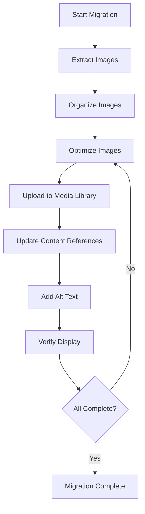

# P5.4 Image Migration and Optimization Implementation Plan

## 1. Overview and Objectives

### 1.1 Purpose
This document provides detailed step-by-step instructions for migrating, optimizing, and uploading all images from source websites to the Laravel media library. This includes image extraction, optimization (WebP conversion, compression), upload, and updating content references.

### 1.2 Scope
This implementation plan covers tasks P5.4.1 through P5.4.7:
- **P5.4.1**: Extract images from source websites
- **P5.4.2**: Organize images by page/section
- **P5.4.3**: Optimize images (WebP, compression)
- **P5.4.4**: Upload images to media library
- **P5.4.5**: Update image references in content
- **P5.4.6**: Add alt text and metadata
- **P5.4.7**: Verify image display and performance

### 1.3 Success Criteria
- All images extracted from source websites
- Images organized and documented
- All images optimized (WebP format, compressed)
- Images uploaded to media library
- Image references updated in content
- Alt text added to all images
- Images display correctly on frontend
- Image performance optimized

## 2. Prerequisites

### 2.1 Required Knowledge
- Image optimization techniques
- WebP format conversion
- Laravel file storage
- Media library usage
- HTML image references

### 2.2 Dependencies
- Task P5.1 completed (Image locations documented)
- Task P5.3 completed (Content imported)
- MediaService functional
- Storage disk configured
- Image optimization tools available

### 2.3 Reference Documents
- Content Migration Plan: `documentation/02-project-management/07-content-migration-plan.md`
- Image Inventory: `content-extraction/documentation/image-inventory.md`
- MediaService: `app/Services/MediaService.php`
- OptimizeImages Command: `app/Console/Commands/OptimizeImages.php`

## 3. Image Migration Workflow Overview

The image migration process follows this workflow:



## 4. Task P5.4.1: Extract Images from Source Websites

### 4.1 Overview
Download all images from TSA Business School and existing website, preserving original files for reference.

### 4.2 Step-by-Step Implementation

#### Step 1: Review Image Inventory
**File:** `content-extraction/documentation/image-inventory.md`

Review the image inventory created during content extraction to identify all images that need to be downloaded.

#### Step 2: Create Image Extraction Directory
```bash
mkdir -p content-migration/images/original
mkdir -p content-migration/images/optimized
```

#### Step 3: Download Images from TSA Website
**Method 1: Manual Download**
1. Visit each page on TSA website
2. Right-click images and "Save As"
3. Save to `content-migration/images/original/tsa/`
4. Organize by page/section

**Method 2: Browser Extension**
Use a browser extension like "Image Downloader" or "Download All Images":
1. Install extension
2. Navigate to page
3. Extract all images
4. Save to organized folders

**Method 3: Command Line (wget/curl)**
```bash
# Download images from a page
wget -r -l1 -H -t1 -nd -N -np -A.jpg,.jpeg,.png,.gif -erobots=off https://www.tsabusinessschool.co.za/
```

#### Step 4: Download Images from Existing Website
Repeat the process for existing website images:
1. Visit each page
2. Download all images
3. Save to `content-migration/images/original/existing-site/`
4. Organize by page/section

#### Step 5: Document Downloaded Images
**File to create:** `content-migration/images/image-download-log.md`

```markdown
# Image Download Log

## TSA Business School Images
| Image Name | Source URL | Page/Section | Status | Notes |
|------------|------------|--------------|--------|-------|
| hero-background.jpg | [URL] | Homepage/Hero | ✓ Downloaded | |
| ... | ... | ... | ... | ... |

## Existing Site Images
| Image Name | Source URL | Page/Section | Status | Notes |
|------------|------------|--------------|--------|-------|
| ... | ... | ... | ... | ... |

## Missing Images
| Description | Expected Location | Status | Notes |
|-------------|-------------------|--------|-------|
| ... | ... | ... | ... |
```

#### Step 6: Verify Image Downloads
1. Check all images downloaded
2. Verify image quality
3. Note any missing images
4. Document any broken image links

### 4.3 Validation Checklist
- [ ] All TSA images downloaded
- [ ] All existing site images downloaded
- [ ] Images organized by source
- [ ] Download log created
- [ ] Missing images documented
- [ ] Image quality verified

## 5. Task P5.4.2: Organize Images by Page/Section

### 5.1 Overview
Organize downloaded images into a logical folder structure matching the website structure.

### 5.2 Step-by-Step Implementation

#### Step 1: Create Folder Structure
```
content-migration/images/original/
├── tsa/
│   ├── homepage/
│   │   ├── hero/
│   │   ├── power-of-strengths/
│   │   ├── three-pillars/
│   │   └── ...
│   ├── strengths-programme/
│   ├── about-us/
│   └── testimonials/
├── existing-site/
│   ├── strengths-based-development/
│   ├── sales-training/
│   ├── facilitation/
│   ├── blog/
│   └── ...
└── shared/
    ├── logos/
    ├── icons/
    └── common/
```

#### Step 2: Organize TSA Images
Move images to appropriate folders:
- Homepage images → `tsa/homepage/[section]/`
- Strengths Programme images → `tsa/strengths-programme/`
- About Us images → `tsa/about-us/`
- Testimonials images → `tsa/testimonials/`

#### Step 3: Organize Existing Site Images
Move images to appropriate folders:
- Page images → `existing-site/[page-slug]/`
- Blog post images → `existing-site/blog/[post-slug]/`
- Workshop images → `existing-site/facilitation/[workshop-slug]/`

#### Step 4: Rename Images
Rename images with descriptive names:
- Use lowercase
- Use hyphens instead of spaces
- Include page/section context
- Example: `homepage-hero-background.jpg`, `about-us-headshot.jpg`

#### Step 5: Create Image Mapping File
**File to create:** `content-migration/images/image-mapping.json`

```json
{
  "tsa": {
    "homepage": {
      "hero": {
        "hero-background.jpg": {
          "original_url": "https://...",
          "new_filename": "homepage-hero-background.jpg",
          "page": "homepage",
          "section": "hero",
          "alt_text": "Hero section background image"
        }
      }
    }
  },
  "existing-site": {
    "blog": {
      "post-slug": {
        "featured-image.jpg": {
          "original_url": "https://...",
          "new_filename": "blog-post-slug-featured.jpg",
          "post": "post-slug",
          "type": "featured"
        }
      }
    }
  }
}
```

### 5.3 Validation Checklist
- [ ] Folder structure created
- [ ] All images organized
- [ ] Images renamed descriptively
- [ ] Image mapping file created
- [ ] Organization matches website structure

## 6. Task P5.4.3: Optimize Images (WebP, Compression)

### 6.1 Overview
Convert images to WebP format and compress them for optimal web performance while maintaining quality.

### 6.2 Step-by-Step Implementation

#### Step 1: Review Image Optimization Requirements
- Format: WebP (with JPEG fallback)
- Quality: 85% for photos, 90% for graphics
- Max width: 1920px for full-width images
- Max width: 1200px for content images
- Max width: 800px for thumbnails

#### Step 2: Create Image Optimization Script
**File to create:** `content-migration/scripts/optimize-images.php`

```php
<?php

/**
 * Image Optimization Script
 * Converts images to WebP and compresses them
 */

require __DIR__ . '/../../vendor/autoload.php';

use Intervention\Image\ImageManager;
use Intervention\Image\Drivers\Gd\Driver;

$imageManager = new ImageManager(new Driver());
$sourceDir = __DIR__ . '/../images/original';
$outputDir = __DIR__ . '/../images/optimized';

function optimizeImage($sourcePath, $outputPath, $imageManager, $maxWidth = 1920, $quality = 85) {
    try {
        $image = $imageManager->read($sourcePath);
        
        // Resize if larger than max width
        if ($image->width() > $maxWidth) {
            $image->scale(width: $maxWidth);
        }
        
        // Convert to WebP
        $image->toWebp($quality)->save($outputPath);
        
        return true;
    } catch (\Exception $e) {
        echo "Error optimizing {$sourcePath}: " . $e->getMessage() . "\n";
        return false;
    }
}

function processDirectory($dir, $outputDir, $imageManager) {
    $files = new RecursiveIteratorIterator(
        new RecursiveDirectoryIterator($dir),
        RecursiveIteratorIterator::SELF_FIRST
    );
    
    $processed = 0;
    $errors = 0;
    
    foreach ($files as $file) {
        if (!$file->isFile()) {
            continue;
        }
        
        $extension = strtolower($file->getExtension());
        if (!in_array($extension, ['jpg', 'jpeg', 'png', 'gif'])) {
            continue;
        }
        
        $relativePath = str_replace($dir . '/', '', $file->getPathname());
        $outputPath = $outputDir . '/' . dirname($relativePath) . '/' . 
                     pathinfo($relativePath, PATHINFO_FILENAME) . '.webp';
        
        // Create output directory if needed
        $outputDirPath = dirname($outputPath);
        if (!is_dir($outputDirPath)) {
            mkdir($outputDirPath, 0755, true);
        }
        
        // Determine max width based on image type
        $maxWidth = 1920; // Default
        if (strpos($relativePath, 'thumbnail') !== false) {
            $maxWidth = 800;
        } elseif (strpos($relativePath, 'blog') !== false) {
            $maxWidth = 1200;
        }
        
        if (optimizeImage($file->getPathname(), $outputPath, $imageManager, $maxWidth)) {
            $processed++;
            echo "Optimized: {$relativePath}\n";
        } else {
            $errors++;
        }
    }
    
    echo "\nProcessed: {$processed}, Errors: {$errors}\n";
}

// Run optimization
echo "Starting image optimization...\n";
processDirectory($sourceDir, $outputDir, $imageManager);
echo "Optimization complete!\n";
```

#### Step 3: Use Existing OptimizeImages Command
Alternatively, use the existing Laravel command:

```bash
# Optimize images in a directory
php artisan images:optimize --path=content-migration/images/original --format=webp --quality=85
```

#### Step 4: Create JPEG Fallbacks
For browsers that don't support WebP, create JPEG fallbacks:

```php
// In optimization script, also create JPEG version
$image->toJpeg(85)->save($outputPathJpeg);
```

#### Step 5: Generate Thumbnails
Create thumbnails for images that need them:

```php
function createThumbnail($sourcePath, $outputPath, $imageManager, $width = 400) {
    $image = $imageManager->read($sourcePath);
    $image->scale(width: $width);
    $image->toWebp(85)->save($outputPath);
}
```

#### Step 6: Verify Optimization
1. Check file sizes (should be reduced)
2. Verify image quality (visual inspection)
3. Test WebP format
4. Verify dimensions are correct

### 6.3 Validation Checklist
- [ ] Optimization script created
- [ ] All images converted to WebP
- [ ] Images compressed appropriately
- [ ] File sizes reduced
- [ ] Image quality maintained
- [ ] Thumbnails created (if needed)
- [ ] JPEG fallbacks created (if needed)

## 7. Task P5.4.4: Upload Images to Media Library

### 7.1 Overview
Upload optimized images to the Laravel media library using MediaService.

### 7.2 Step-by-Step Implementation

#### Step 1: Create Image Upload Command
**File to create:** `app/Console/Commands/UploadMigratedImages.php`

```php
<?php

namespace App\Console\Commands;

use Illuminate\Console\Command;
use App\Services\MediaService;
use Illuminate\Http\UploadedFile;
use Illuminate\Support\Facades\Storage;
use Illuminate\Support\Str;

class UploadMigratedImages extends Command
{
    protected $signature = 'images:upload-migrated 
                            {--path=content-migration/images/optimized : Path to optimized images}
                            {--dry-run : Preview without uploading}';

    protected $description = 'Upload migrated images to media library';

    protected MediaService $mediaService;

    public function __construct(MediaService $mediaService)
    {
        parent::__construct();
        $this->mediaService = $mediaService;
    }

    public function handle(): int
    {
        $path = $this->option('path');
        $dryRun = $this->option('dry-run');

        if (!is_dir($path)) {
            $this->error("Path not found: {$path}");
            return Command::FAILURE;
        }

        $this->info('Uploading migrated images...');
        if ($dryRun) {
            $this->warn('DRY RUN MODE - No files will be uploaded');
        }
        $this->newLine();

        $images = $this->findImages($path);
        $uploaded = 0;
        $errors = 0;

        foreach ($images as $imagePath) {
            try {
                if ($dryRun) {
                    $this->line("Would upload: {$imagePath}");
                    continue;
                }

                $media = $this->uploadImage($imagePath);
                $uploaded++;
                $this->line("  ✓ Uploaded: {$media->filename}");
            } catch (\Exception $e) {
                $errors++;
                $this->error("  ✗ Error uploading {$imagePath}: " . $e->getMessage());
            }
        }

        $this->newLine();
        $this->info("Uploaded: {$uploaded}, Errors: {$errors}");

        return Command::SUCCESS;
    }

    protected function findImages(string $path): array
    {
        $images = [];
        $files = new \RecursiveIteratorIterator(
            new \RecursiveDirectoryIterator($path),
            \RecursiveIteratorIterator::SELF_FIRST
        );

        foreach ($files as $file) {
            if ($file->isFile() && in_array(strtolower($file->getExtension()), ['webp', 'jpg', 'jpeg', 'png'])) {
                $images[] = $file->getPathname();
            }
        }

        return $images;
    }

    protected function uploadImage(string $imagePath): \App\Models\Media
    {
        // Create UploadedFile instance from local file
        $filename = basename($imagePath);
        $mimeType = mime_content_type($imagePath);
        
        // Determine directory based on image path
        $directory = $this->determineDirectory($imagePath);
        
        // Read file content
        $fileContent = file_get_contents($imagePath);
        
        // Create temporary file
        $tempFile = tempnam(sys_get_temp_dir(), 'upload_');
        file_put_contents($tempFile, $fileContent);
        
        // Create UploadedFile
        $uploadedFile = new UploadedFile(
            $tempFile,
            $filename,
            $mimeType,
            null,
            true
        );

        // Extract alt text from image mapping if available
        $altText = $this->getAltText($imagePath);

        // Upload using MediaService
        $media = $this->mediaService->upload($uploadedFile, [
            'directory' => $directory,
            'alt_text' => $altText,
        ]);

        // Clean up temp file
        unlink($tempFile);

        return $media;
    }

    protected function determineDirectory(string $imagePath): string
    {
        // Extract directory from path
        // Example: content-migration/images/optimized/tsa/homepage/hero/image.webp
        // Should become: media/tsa/homepage/hero
        
        $relativePath = str_replace(base_path('content-migration/images/optimized/'), '', $imagePath);
        $directory = dirname($relativePath);
        
        return 'media/' . $directory;
    }

    protected function getAltText(string $imagePath): ?string
    {
        // Try to get alt text from image mapping file
        $mappingFile = base_path('content-migration/images/image-mapping.json');
        
        if (file_exists($mappingFile)) {
            $mapping = json_decode(file_get_contents($mappingFile), true);
            // Search mapping for this image
            // Return alt text if found
        }
        
        // Generate default alt text from filename
        $filename = basename($imagePath, '.webp');
        return Str::title(str_replace(['-', '_'], ' ', $filename));
    }
}
```

#### Step 2: Run Upload Command
```bash
# Dry run first
php artisan images:upload-migrated --dry-run

# Actual upload
php artisan images:upload-migrated
```

#### Step 3: Organize in Media Library
Ensure images are organized in logical folders:
- `media/tsa/homepage/`
- `media/tsa/strengths-programme/`
- `media/existing-site/blog/`
- etc.

#### Step 4: Create Image Reference Mapping
**File to create:** `content-migration/images/media-library-mapping.json`

Map original image paths to media library IDs:

```json
{
  "tsa/homepage/hero/hero-background.webp": {
    "media_id": 1,
    "url": "/storage/media/tsa/homepage/hero/hero-background.webp",
    "alt_text": "Hero section background"
  }
}
```

### 7.3 Validation Checklist
- [ ] Upload command created
- [ ] All images uploaded
- [ ] Images organized in media library
- [ ] Media library mapping created
- [ ] Images accessible via URLs

## 8. Task P5.4.5: Update Image References in Content

### 8.1 Overview
Update all image references in page content and blog posts to point to the new media library URLs.

### 8.2 Step-by-Step Implementation

#### Step 1: Create Image Reference Update Command
**File to create:** `app/Console/Commands/UpdateImageReferences.php`

```php
<?php

namespace App\Console\Commands;

use Illuminate\Console\Command;
use App\Models\Page;
use App\Models\BlogPost;
use App\Models\Media;

class UpdateImageReferences extends Command
{
    protected $signature = 'content:update-image-references 
                            {--dry-run : Preview changes without updating}';

    protected $description = 'Update image references in content to point to media library';

    protected $mapping = [];

    public function handle(): int
    {
        $this->loadImageMapping();
        
        $this->info('Updating image references...');
        if ($this->option('dry-run')) {
            $this->warn('DRY RUN MODE - No changes will be made');
        }
        $this->newLine();

        $pagesUpdated = $this->updatePageImages();
        $postsUpdated = $this->updateBlogPostImages();

        $this->newLine();
        $this->info("Pages updated: {$pagesUpdated}");
        $this->info("Blog posts updated: {$postsUpdated}");

        return Command::SUCCESS;
    }

    protected function loadImageMapping(): void
    {
        $mappingFile = base_path('content-migration/images/media-library-mapping.json');
        
        if (file_exists($mappingFile)) {
            $this->mapping = json_decode(file_get_contents($mappingFile), true);
        }
    }

    protected function updatePageImages(): int
    {
        $pages = Page::all();
        $updated = 0;

        foreach ($pages as $page) {
            $originalContent = $page->content;
            $updatedContent = $this->replaceImageReferences($originalContent);
            
            if ($originalContent !== $updatedContent) {
                if (!$this->option('dry-run')) {
                    $page->content = $updatedContent;
                    $page->save();
                }
                $updated++;
                $this->line("  ✓ Updated: {$page->title}");
            }
        }

        return $updated;
    }

    protected function updateBlogPostImages(): int
    {
        $posts = BlogPost::all();
        $updated = 0;

        foreach ($posts as $post) {
            $originalContent = $post->content;
            $updatedContent = $this->replaceImageReferences($originalContent);
            
            if ($originalContent !== $updatedContent) {
                if (!$this->option('dry-run')) {
                    $post->content = $updatedContent;
                    $post->save();
                }
                $updated++;
                $this->line("  ✓ Updated: {$post->title}");
            }
        }

        return $updated;
    }

    protected function replaceImageReferences(string $content): string
    {
        // Find all img tags
        preg_match_all('/]+src=["\']([^"\']+)["\'][^>]*>/i', $content, $matches);
        
        foreach ($matches[1] as $oldUrl) {
            $newUrl = $this->findNewImageUrl($oldUrl);
            
            if ($newUrl) {
                $content = str_replace($oldUrl, $newUrl, $content);
            }
        }

        // Also handle markdown image syntax: 
        preg_match_all('/!\[([^\]]*)\]\(([^\)]+)\)/', $content, $matches);
        
        foreach ($matches[2] as $index => $oldUrl) {
            $newUrl = $this->findNewImageUrl($oldUrl);
            
            if ($newUrl) {
                $content = str_replace($oldUrl, $newUrl, $content);
            }
        }

        return $content;
    }

    protected function findNewImageUrl(string $oldUrl): ?string
    {
        // Try to find in mapping
        foreach ($this->mapping as $oldPath => $data) {
            if (strpos($oldUrl, $oldPath) !== false || strpos($oldUrl, basename($oldPath)) !== false) {
                return $data['url'];
            }
        }

        // Try to find by filename in media library
        $filename = basename($oldUrl);
        $media = Media::where('filename', $filename)->first();
        
        if ($media) {
            return Storage::disk('public')->url($media->path);
        }

        return null;
    }
}
```

#### Step 2: Run Update Command
```bash
# Dry run first
php artisan content:update-image-references --dry-run

# Actual update
php artisan content:update-image-references
```

#### Step 3: Manual Review
Review updated content to ensure:
- All images display correctly
- Image URLs are correct
- No broken image links

### 8.3 Validation Checklist
- [ ] Update command created
- [ ] Image references updated in pages
- [ ] Image references updated in blog posts
- [ ] All images display correctly
- [ ] No broken image links

## 9. Task P5.4.6: Add Alt Text and Metadata

### 9.1 Overview
Ensure all images have descriptive alt text and proper metadata for accessibility and SEO.

### 9.2 Step-by-Step Implementation

#### Step 1: Review Alt Text Requirements
- Descriptive and specific
- Contextually relevant
- Not redundant (don't start with "image of")
- Maximum 125 characters recommended

#### Step 2: Update Alt Text in Media Library
**File to create:** `app/Console/Commands/UpdateImageAltText.php`

```php
<?php

namespace App\Console\Commands;

use Illuminate\Console\Command;
use App\Models\Media;

class UpdateImageAltText extends Command
{
    protected $signature = 'images:update-alt-text 
                            {--file=content-migration/images/image-mapping.json : Mapping file}';

    protected $description = 'Update alt text for images in media library';

    public function handle(): int
    {
        $mappingFile = $this->option('file');
        
        if (!file_exists($mappingFile)) {
            $this->error("Mapping file not found: {$mappingFile}");
            return Command::FAILURE;
        }

        $mapping = json_decode(file_get_contents($mappingFile), true);
        $updated = 0;

        foreach ($mapping as $path => $data) {
            if (empty($data['alt_text'])) {
                continue;
            }

            $filename = basename($path);
            $media = Media::where('filename', $filename)->first();

            if ($media) {
                $media->alt_text = $data['alt_text'];
                $media->save();
                $updated++;
                $this->line("  ✓ Updated: {$filename}");
            }
        }

        $this->info("Updated {$updated} images");

        return Command::SUCCESS;
    }
}
```

#### Step 3: Update Alt Text in Content
Ensure img tags in content have alt attributes:

```php
// In UpdateImageReferences command, also update alt attributes
protected function updateImageAltText(string $content): string
{
    // Find img tags without alt or with generic alt
    preg_match_all('/]*)>/i', $content, $matches);
    
    foreach ($matches[1] as $index => $attributes) {
        // Check if alt exists
        if (strpos($attributes, 'alt=') === false) {
            // Add alt text based on image mapping
            $newAttributes = $attributes . ' alt="' . $this->getAltText($matches[0][$index]) . '"';
            $content = str_replace($matches[0][$index], '', $content);
        }
    }

    return $content;
}
```

#### Step 4: Verify Alt Text
1. Check media library records
2. Check img tags in content
3. Test with screen reader
4. Verify SEO impact

### 9.3 Validation Checklist
- [ ] Alt text added to all images
- [ ] Alt text is descriptive
- [ ] Alt text in media library records
- [ ] Alt text in content img tags
- [ ] Accessibility verified

## 10. Task P5.4.7: Verify Image Display and Performance

### 10.1 Overview
Verify that all images display correctly and perform well on the frontend.

### 10.2 Step-by-Step Implementation

#### Step 1: Visual Verification
1. Visit each page with images
2. Verify all images display
3. Check image quality
4. Verify responsive images work
5. Test on different devices

#### Step 2: Performance Testing
1. Check image file sizes
2. Test page load times
3. Verify lazy loading works
4. Check Core Web Vitals
5. Test on slow connections

#### Step 3: Create Image Verification Report
**File to create:** `content-migration/images/verification-report.md`

```markdown
# Image Migration Verification Report

## Images Uploaded
- Total: [count]
- TSA: [count]
- Existing Site: [count]

## Images by Type
- Photos: [count]
- Graphics: [count]
- Icons: [count]
- Logos: [count]

## Performance Metrics
- Average file size: [size]
- Largest file: [filename] ([size])
- Smallest file: [filename] ([size])
- Average load time: [time]

## Issues Found
- [List any issues]

## Status
✓ All images verified / ⚠ Issues found
```

#### Step 4: Fix Any Issues
- Broken image links
- Missing images
- Performance issues
- Quality issues

### 10.3 Validation Checklist
- [ ] All images display correctly
- [ ] Image quality acceptable
- [ ] Performance optimized
- [ ] Responsive images work
- [ ] Verification report created
- [ ] All issues resolved

## 11. Image Migration Summary

### 11.1 Migration Checklist
- [ ] All images extracted
- [ ] Images organized
- [ ] Images optimized
- [ ] Images uploaded
- [ ] References updated
- [ ] Alt text added
- [ ] Display verified

### 11.2 Deliverables
- Optimized images in media library
- Image references updated in content
- Alt text added to all images
- Verification report
- Performance optimized

## 12. Next Steps

After image migration is complete:
1. Verify all images display correctly
2. Proceed to P5.5 - Content Validation
3. Run comprehensive validation
4. Fix any remaining issues

## 13. References

- Content Migration Plan: `documentation/02-project-management/07-content-migration-plan.md`
- Content Import: `documentation/03-development/phase-05/P5.3-content-import.md`
- MediaService: `app/Services/MediaService.php`
- OptimizeImages Command: `app/Console/Commands/OptimizeImages.php`
- **Next Task:** P5.5 - Content Validation Implementation Plan

---

**Document Version:** 1.0  
**Last Updated:** 2025  
**Status:** Ready for Implementation
