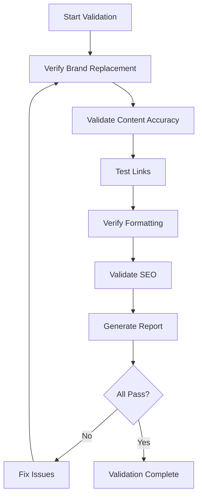

# P5.5 Content Validation Implementation Plan

## 1. Overview and Objectives

### 1.1 Purpose
This document provides detailed step-by-step instructions for validating all migrated content, including brand name replacement verification, content accuracy checks, link validation, formatting verification, and SEO metadata validation.

### 1.2 Scope
This implementation plan covers tasks P5.5.1 through P5.5.6:
- **P5.5.1**: Create brand name replacement verification command
- **P5.5.2**: Validate content accuracy and completeness
- **P5.5.3**: Test and fix all links
- **P5.5.4**: Verify content formatting
- **P5.5.5**: Validate SEO metadata on all pages
- **P5.5.6**: Generate comprehensive validation report

### 1.3 Success Criteria
- 100% brand name replacement verified
- All content accurate and complete
- All links working (internal and external)
- Content formatting correct
- SEO metadata on all pages
- Comprehensive validation report generated
- All validation checks passing

## 2. Prerequisites

### 2.1 Required Knowledge
- Content validation techniques
- Database queries
- Link checking
- SEO validation
- Report generation

### 2.2 Dependencies
- Task P5.2 completed (Content Transformation)
- Task P5.3 completed (Content Import)
- Task P5.4 completed (Image Migration)
- All content in database
- Verification commands available

### 2.3 Reference Documents
- Content Migration Plan: `documentation/02-project-management/07-content-migration-plan.md`
- VerifyContentMigration Command: `app/Console/Commands/VerifyContentMigration.php`
- Business Requirements: `documentation/00-business-requirement/business-requirement-document.md`

## 3. Content Validation Workflow Overview

The content validation process follows this workflow:



## 4. Task P5.5.1: Create Brand Name Replacement Verification Command

### 4.1 Overview
Create a comprehensive command to verify that all TSA Business School references have been replaced with The Strengths Toolbox.

### 4.2 Step-by-Step Implementation

#### Step 1: Enhance Existing Verification Command
**File to update:** `app/Console/Commands/VerifyContentMigration.php`

The command already has brand replacement verification. Enhance it:

```php
protected function verifyBrandReplacement(): array
{
    $this->info('Verifying brand name replacement...');

    $tsaPatterns = [
        'TSA Business School',
        'TSA Business',
        'tsabusinessschool.co.za',
        'www.tsabusinessschool.co.za',
    ];

    $issues = [];
    $checked = 0;

    // Check pages
    $pages = Page::all();
    foreach ($pages as $page) {
        $checked++;
        foreach ($tsaPatterns as $pattern) {
            if (stripos($page->content, $pattern) !== false ||
                stripos($page->title, $pattern) !== false ||
                stripos($page->excerpt, $pattern) !== false ||
                stripos($page->meta_title ?? '', $pattern) !== false ||
                stripos($page->meta_description ?? '', $pattern) !== false) {
                
                $issues[] = [
                    'type' => 'Page',
                    'id' => $page->id,
                    'slug' => $page->slug,
                    'field' => 'content/title/excerpt/meta',
                    'pattern' => $pattern,
                ];
            }
        }
    }

    // Check blog posts
    $posts = BlogPost::all();
    foreach ($posts as $post) {
        $checked++;
        foreach ($tsaPatterns as $pattern) {
            if (stripos($post->content, $pattern) !== false ||
                stripos($post->title, $pattern) !== false ||
                stripos($post->excerpt, $pattern) !== false ||
                stripos($post->meta_title ?? '', $pattern) !== false ||
                stripos($post->meta_description ?? '', $pattern) !== false) {
                
                $issues[] = [
                    'type' => 'Blog Post',
                    'id' => $post->id,
                    'slug' => $post->slug,
                    'field' => 'content/title/excerpt/meta',
                    'pattern' => $pattern,
                ];
            }
        }
    }

    // Check testimonials
    $testimonials = Testimonial::all();
    foreach ($testimonials as $testimonial) {
        $checked++;
        foreach ($tsaPatterns as $pattern) {
            if (stripos($testimonial->testimonial, $pattern) !== false ||
                stripos($testimonial->company ?? '', $pattern) !== false) {
                
                $issues[] = [
                    'type' => 'Testimonial',
                    'id' => $testimonial->id,
                    'field' => 'testimonial/company',
                    'pattern' => $pattern,
                ];
            }
        }
    }

    $passed = empty($issues);

    if ($passed) {
        $this->line("  ✓ No TSA references found in {$checked} items");
    } else {
        $this->error("  ✗ Found " . count($issues) . " potential TSA references:");
        foreach ($issues as $issue) {
            $this->line("    - {$issue['type']} #{$issue['id']} ({$issue['slug'] ?? 'N/A'}): {$issue['pattern']}");
        }
    }

    return [
        'passed' => $passed,
        'checked' => $checked,
        'issues' => $issues,
    ];
}
```

#### Step 2: Add Exception Handling
Handle documented exceptions:

```php
protected function isException(array $issue): bool
{
    $exceptionsFile = base_path('content-transformation/brand-replacement-exceptions.md');
    
    if (!file_exists($exceptionsFile)) {
        return false;
    }

    // Parse exceptions file and check if this issue is documented
    // Implementation depends on exceptions file format
    
    return false;
}
```

#### Step 3: Create Detailed Report
Generate detailed report of all findings:

```php
protected function generateBrandReplacementReport(array $results): void
{
    $reportFile = storage_path('logs/brand-replacement-report-' . date('Y-m-d') . '.txt');
    
    $report = "Brand Name Replacement Verification Report\n";
    $report .= "Generated: " . date('Y-m-d H:i:s') . "\n\n";
    $report .= "Items Checked: {$results['checked']}\n";
    $report .= "Issues Found: " . count($results['issues']) . "\n\n";
    
    if (!empty($results['issues'])) {
        $report .= "Issues:\n";
        foreach ($results['issues'] as $issue) {
            $report .= "- {$issue['type']} #{$issue['id']}: {$issue['pattern']}\n";
        }
    }
    
    file_put_contents($reportFile, $report);
    $this->info("Report saved to: {$reportFile}");
}
```

### 4.3 Validation Checklist
- [ ] Verification command enhanced
- [ ] All content types checked
- [ ] Exception handling implemented
- [ ] Detailed report generated
- [ ] All issues documented

## 5. Task P5.5.2: Validate Content Accuracy and Completeness

### 5.1 Overview
Verify that all content is accurate, complete, and matches the source material.

### 5.2 Step-by-Step Implementation

#### Step 1: Create Content Accuracy Verification
**File to create:** `app/Console/Commands/VerifyContentAccuracy.php`

```php
<?php

namespace App\Console\Commands;

use Illuminate\Console\Command;
use App\Models\Page;
use App\Models\BlogPost;

class VerifyContentAccuracy extends Command
{
    protected $signature = 'content:verify-accuracy';

    protected $description = 'Verify content accuracy and completeness';

    public function handle(): int
    {
        $this->info('Verifying content accuracy...');
        $this->newLine();

        $results = [
            'pages' => $this->verifyPages(),
            'blog_posts' => $this->verifyBlogPosts(),
        ];

        $this->displayResults($results);

        return Command::SUCCESS;
    }

    protected function verifyPages(): array
    {
        $pages = Page::all();
        $issues = [];

        foreach ($pages as $page) {
            // Check for placeholder content
            if ($this->isPlaceholderContent($page->content)) {
                $issues[] = [
                    'type' => 'Placeholder Content',
                    'page' => $page->slug,
                    'issue' => 'Content appears to be placeholder',
                ];
            }

            // Check minimum content length
            if (strlen(strip_tags($page->content)) < 100) {
                $issues[] = [
                    'type' => 'Insufficient Content',
                    'page' => $page->slug,
                    'issue' => 'Content is too short (less than 100 characters)',
                ];
            }

            // Check for required sections (homepage)
            if ($page->slug === 'home' && !$this->hasRequiredHomepageSections($page->content)) {
                $issues[] = [
                    'type' => 'Missing Sections',
                    'page' => $page->slug,
                    'issue' => 'Homepage missing required sections',
                ];
            }

            // Check contact information accuracy
            $contactIssues = $this->verifyContactInformation($page->content);
            if (!empty($contactIssues)) {
                $issues = array_merge($issues, $contactIssues);
            }
        }

        return [
            'total' => $pages->count(),
            'issues' => $issues,
        ];
    }

    protected function verifyBlogPosts(): array
    {
        $posts = BlogPost::all();
        $issues = [];

        foreach ($posts as $post) {
            // Check for placeholder content
            if ($this->isPlaceholderContent($post->content)) {
                $issues[] = [
                    'type' => 'Placeholder Content',
                    'post' => $post->slug,
                    'issue' => 'Content appears to be placeholder',
                ];
            }

            // Check minimum content length
            if (strlen(strip_tags($post->content)) < 200) {
                $issues[] = [
                    'type' => 'Insufficient Content',
                    'post' => $post->slug,
                    'issue' => 'Content is too short (less than 200 characters)',
                ];
            }

            // Check for required metadata
            if (empty($post->excerpt)) {
                $issues[] = [
                    'type' => 'Missing Metadata',
                    'post' => $post->slug,
                    'issue' => 'Missing excerpt',
                ];
            }
        }

        return [
            'total' => $posts->count(),
            'issues' => $issues,
        ];
    }

    protected function isPlaceholderContent(string $content): bool
    {
        $placeholders = [
            'Lorem ipsum',
            'Placeholder',
            'Sample content',
            'Content goes here',
            'TODO',
            'FIXME',
        ];

        foreach ($placeholders as $placeholder) {
            if (stripos($content, $placeholder) !== false) {
                return true;
            }
        }

        return false;
    }

    protected function hasRequiredHomepageSections(string $content): bool
    {
        $requiredSections = [
            'hero',
            'power-of-strengths',
            'three-pillars',
            'testimonials',
        ];

        foreach ($requiredSections as $section) {
            if (stripos($content, $section) === false) {
                return false;
            }
        }

        return true;
    }

    protected function verifyContactInformation(string $content): array
    {
        $issues = [];
        
        // Check for correct phone number
        $correctPhone = '+27 83 294 8033';
        if (stripos($content, $correctPhone) === false) {
            // Check for old phone numbers
            $oldPhones = [
                '083 294 8033',
                '0832948033',
                // Add other old formats
            ];
            
            foreach ($oldPhones as $oldPhone) {
                if (stripos($content, $oldPhone) !== false) {
                    $issues[] = [
                        'type' => 'Incorrect Contact Info',
                        'issue' => "Found old phone number: {$oldPhone}",
                    ];
                }
            }
        }

        // Check for correct email
        $correctEmail = 'welcome@eberhardniklaus.co.za';
        if (stripos($content, $correctEmail) === false) {
            // Check for old emails
            $oldEmails = [
                'info@tsabusinessschool.co.za',
                'contact@tsabusinessschool.co.za',
            ];
            
            foreach ($oldEmails as $oldEmail) {
                if (stripos($content, $oldEmail) !== false) {
                    $issues[] = [
                        'type' => 'Incorrect Contact Info',
                        'issue' => "Found old email: {$oldEmail}",
                    ];
                }
            }
        }

        return $issues;
    }

    protected function displayResults(array $results): void
    {
        $totalIssues = count($results['pages']['issues']) + count($results['blog_posts']['issues']);

        if ($totalIssues === 0) {
            $this->info('✓ All content verified successfully!');
            return;
        }

        $this->warn("Found {$totalIssues} issues:");

        if (!empty($results['pages']['issues'])) {
            $this->newLine();
            $this->line('Pages:');
            foreach ($results['pages']['issues'] as $issue) {
                $this->line("  - {$issue['page']}: {$issue['issue']}");
            }
        }

        if (!empty($results['blog_posts']['issues'])) {
            $this->newLine();
            $this->line('Blog Posts:');
            foreach ($results['blog_posts']['issues'] as $issue) {
                $this->line("  - {$issue['post']}: {$issue['issue']}");
            }
        }
    }
}
```

#### Step 2: Run Accuracy Verification
```bash
php artisan content:verify-accuracy
```

#### Step 3: Manual Content Review
1. Review each page manually
2. Compare with source content
3. Verify statistics and numbers
4. Check biographical information
5. Verify service descriptions

### 5.3 Validation Checklist
- [ ] Accuracy verification command created
- [ ] Placeholder content identified
- [ ] Content length verified
- [ ] Required sections checked
- [ ] Contact information verified
- [ ] Manual review completed

## 6. Task P5.5.3: Test and Fix All Links

### 6.1 Overview
Verify that all internal and external links work correctly and fix any broken links.

### 6.2 Step-by-Step Implementation

#### Step 1: Create Link Verification Command
**File to create:** `app/Console/Commands/VerifyLinks.php`

```php
<?php

namespace App\Console\Commands;

use Illuminate\Console\Command;
use App\Models\Page;
use App\Models\BlogPost;
use Illuminate\Support\Facades\Http;

class VerifyLinks extends Command
{
    protected $signature = 'content:verify-links 
                            {--fix : Automatically fix common issues}';

    protected $description = 'Verify all links in content';

    protected $brokenLinks = [];
    protected $checkedLinks = 0;

    public function handle(): int
    {
        $this->info('Verifying links...');
        $this->newLine();

        $this->verifyPageLinks();
        $this->verifyBlogPostLinks();

        $this->displayResults();

        return Command::SUCCESS;
    }

    protected function verifyPageLinks(): void
    {
        $pages = Page::all();

        foreach ($pages as $page) {
            $this->extractAndVerifyLinks($page->content, 'Page: ' . $page->slug);
        }
    }

    protected function verifyBlogPostLinks(): void
    {
        $posts = BlogPost::all();

        foreach ($posts as $post) {
            $this->extractAndVerifyLinks($post->content, 'Blog Post: ' . $post->slug);
        }
    }

    protected function extractAndVerifyLinks(string $content, string $context): void
    {
        // Extract all links
        preg_match_all('/<a[^>]+href=["\']([^"\']+)["\'][^>]*>/i', $content, $matches);
        
        foreach ($matches[1] as $url) {
            $this->checkedLinks++;
            $this->verifyLink($url, $context);
        }

        // Also check markdown links
        preg_match_all('/\[([^\]]+)\]\(([^\)]+)\)/', $content, $matches);
        
        foreach ($matches[2] as $url) {
            $this->checkedLinks++;
            $this->verifyLink($url, $context);
        }
    }

    protected function verifyLink(string $url, string $context): void
    {
        // Skip mailto and tel links
        if (strpos($url, 'mailto:') === 0 || strpos($url, 'tel:') === 0) {
            return;
        }

        // Handle relative URLs
        if (strpos($url, 'http') !== 0) {
            $url = url($url);
        }

        try {
            $response = Http::timeout(5)->head($url);
            
            if ($response->failed()) {
                $this->brokenLinks[] = [
                    'url' => $url,
                    'context' => $context,
                    'status' => $response->status(),
                ];
            }
        } catch (\Exception $e) {
            $this->brokenLinks[] = [
                'url' => $url,
                'context' => $context,
                'status' => 'Error: ' . $e->getMessage(),
            ];
        }
    }

    protected function displayResults(): void
    {
        $this->info("Checked {$this->checkedLinks} links");

        if (empty($this->brokenLinks)) {
            $this->info('✓ All links verified successfully!');
            return;
        }

        $this->error('Found ' . count($this->brokenLinks) . ' broken links:');
        $this->newLine();

        foreach ($this->brokenLinks as $link) {
            $this->line("  - {$link['url']}");
            $this->line("    Context: {$link['context']}");
            $this->line("    Status: {$link['status']}");
            $this->newLine();
        }
    }
}
```

#### Step 2: Run Link Verification
```bash
php artisan content:verify-links
```

#### Step 3: Fix Broken Links
1. Review broken links list
2. Update URLs in content
3. Remove or replace broken external links
4. Fix internal link paths
5. Re-run verification

### 6.3 Validation Checklist
- [ ] Link verification command created
- [ ] All links checked
- [ ] Broken links identified
- [ ] Links fixed
- [ ] Verification re-run and passing

## 7. Task P5.5.4: Verify Content Formatting

### 7.1 Overview
Verify that content formatting is correct, including headings, lists, paragraphs, and special characters.

### 7.2 Step-by-Step Implementation

#### Step 1: Create Formatting Verification
**File to create:** `app/Console/Commands/VerifyContentFormatting.php`

```php
<?php

namespace App\Console\Commands;

use Illuminate\Console\Command;
use App\Models\Page;
use App\Models\BlogPost;

class VerifyContentFormatting extends Command
{
    protected $signature = 'content:verify-formatting';

    protected $description = 'Verify content formatting';

    public function handle(): int
    {
        $this->info('Verifying content formatting...');
        $this->newLine();

        $issues = [];

        // Check pages
        $pages = Page::all();
        foreach ($pages as $page) {
            $pageIssues = $this->checkFormatting($page->content, $page->slug);
            $issues = array_merge($issues, $pageIssues);
        }

        // Check blog posts
        $posts = BlogPost::all();
        foreach ($posts as $post) {
            $postIssues = $this->checkFormatting($post->content, $post->slug);
            $issues = array_merge($issues, $postIssues);
        }

        $this->displayResults($issues);

        return Command::SUCCESS;
    }

    protected function checkFormatting(string $content, string $slug): array
    {
        $issues = [];

        // Check heading hierarchy
        if (!$this->hasProperHeadingHierarchy($content)) {
            $issues[] = [
                'type' => 'Heading Hierarchy',
                'item' => $slug,
                'issue' => 'Heading hierarchy may be incorrect',
            ];
        }

        // Check for unclosed tags
        if ($this->hasUnclosedTags($content)) {
            $issues[] = [
                'type' => 'Unclosed Tags',
                'item' => $slug,
                'issue' => 'Content may have unclosed HTML tags',
            ];
        }

        // Check for special characters
        if ($this->hasEncodingIssues($content)) {
            $issues[] = [
                'type' => 'Encoding Issues',
                'item' => $slug,
                'issue' => 'Content may have encoding issues',
            ];
        }

        return $issues;
    }

    protected function hasProperHeadingHierarchy(string $content): bool
    {
        // Extract headings
        preg_match_all('/<h([1-6])[^>]*>(.*?)<\/h[1-6]>/i', $content, $matches);
        
        if (empty($matches[1])) {
            return true; // No headings to check
        }

        $levels = $matches[1];
        $previousLevel = 0;

        foreach ($levels as $level) {
            $level = (int)$level;
            
            // H1 should only appear once
            if ($level === 1 && $previousLevel > 0) {
                return false;
            }
            
            // Levels should not skip (e.g., h1 to h3)
            if ($previousLevel > 0 && $level > $previousLevel + 1) {
                return false;
            }
            
            $previousLevel = $level;
        }

        return true;
    }

    protected function hasUnclosedTags(string $content): bool
    {
        // Simple check for unclosed tags
        $openTags = substr_count($content, '<');
        $closeTags = substr_count($content, '>');
        
        // This is a simple check; a more sophisticated parser would be better
        return false; // Placeholder
    }

    protected function hasEncodingIssues(string $content): bool
    {
        // Check for common encoding issues
        $issues = [
            '’' => 'apostrophe issue',
            '“' => 'quote issue',
            'â€"' => 'quote issue',
        ];

        foreach ($issues as $pattern => $issue) {
            if (strpos($content, $pattern) !== false) {
                return true;
            }
        }

        return false;
    }

    protected function displayResults(array $issues): void
    {
        if (empty($issues)) {
            $this->info('✓ All formatting verified successfully!');
            return;
        }

        $this->warn('Found ' . count($issues) . ' formatting issues:');
        $this->newLine();

        foreach ($issues as $issue) {
            $this->line("  - {$issue['item']}: {$issue['issue']}");
        }
    }
}
```

#### Step 2: Run Formatting Verification
```bash
php artisan content:verify-formatting
```

#### Step 3: Manual Formatting Review
1. Review pages visually
2. Check heading structure
3. Verify lists display correctly
4. Check spacing and layout
5. Verify special characters

### 7.3 Validation Checklist
- [ ] Formatting verification command created
- [ ] Heading hierarchy checked
- [ ] HTML structure verified
- [ ] Special characters checked
- [ ] Manual review completed

## 8. Task P5.5.5: Validate SEO Metadata on All Pages

### 8.1 Overview
Verify that all pages and blog posts have proper SEO metadata.

### 8.2 Step-by-Step Implementation

#### Step 1: Enhance Existing SEO Verification
**File to update:** `app/Console/Commands/VerifyContentMigration.php`

The command already has SEO verification. Enhance it:

```php
protected function verifySEO(): array
{
    $this->info('Verifying SEO metadata...');

    $issues = [];
    $checked = 0;

    // Check pages
    $pages = Page::all();
    foreach ($pages as $page) {
        $checked++;
        $pageIssues = $this->checkPageSEO($page);
        $issues = array_merge($issues, $pageIssues);
    }

    // Check blog posts
    $posts = BlogPost::all();
    foreach ($posts as $post) {
        $checked++;
        $postIssues = $this->checkPostSEO($post);
        $issues = array_merge($issues, $postIssues);
    }

    $passed = empty($issues);

    if ($passed) {
        $this->line("  ✓ SEO metadata verified for {$checked} items");
    } else {
        $this->error("  ✗ Found " . count($issues) . " SEO issues:");
        foreach ($issues as $issue) {
            $this->line("    - {$issue['item']}: {$issue['issue']}");
        }
    }

    return [
        'passed' => $passed,
        'checked' => $checked,
        'issues' => $issues,
    ];
}

protected function checkPageSEO(Page $page): array
{
    $issues = [];

    // Check meta title
    if (empty($page->meta_title)) {
        $issues[] = [
            'item' => $page->slug,
            'issue' => 'Missing meta title',
        ];
    } elseif (strlen($page->meta_title) > 60) {
        $issues[] = [
            'item' => $page->slug,
            'issue' => 'Meta title too long (' . strlen($page->meta_title) . ' characters)',
        ];
    }

    // Check meta description
    if (empty($page->meta_description)) {
        $issues[] = [
            'item' => $page->slug,
            'issue' => 'Missing meta description',
        ];
    } elseif (strlen($page->meta_description) > 160) {
        $issues[] = [
            'item' => $page->slug,
            'issue' => 'Meta description too long (' . strlen($page->meta_description) . ' characters)',
        ];
    } elseif (strlen($page->meta_description) < 120) {
        $issues[] = [
            'item' => $page->slug,
            'issue' => 'Meta description too short (' . strlen($page->meta_description) . ' characters)',
        ];
    }

    // Check for H1
    if (stripos($page->content, '<h1') === false) {
        $issues[] = [
            'item' => $page->slug,
            'issue' => 'Missing H1 heading',
        ];
    }

    return $issues;
}

protected function checkPostSEO(BlogPost $post): array
{
    $issues = [];

    // Similar checks for blog posts
    if (empty($post->meta_title)) {
        $issues[] = [
            'item' => $post->slug,
            'issue' => 'Missing meta title',
        ];
    }

    if (empty($post->meta_description)) {
        $issues[] = [
            'item' => $post->slug,
            'issue' => 'Missing meta description',
        ];
    }

    return $issues;
}
```

#### Step 2: Run SEO Verification
```bash
php artisan content:verify
```

#### Step 3: Fix SEO Issues
1. Review SEO issues
2. Add missing metadata
3. Optimize meta titles and descriptions
4. Ensure H1 tags present
5. Re-run verification

### 8.3 Validation Checklist
- [ ] SEO verification enhanced
- [ ] All pages checked
- [ ] All blog posts checked
- [ ] SEO issues identified
- [ ] Issues fixed
- [ ] Verification passing

## 9. Task P5.5.6: Generate Comprehensive Validation Report

### 9.1 Overview
Generate a comprehensive validation report summarizing all validation checks.

### 9.2 Step-by-Step Implementation

#### Step 1: Create Validation Report Generator
**File to create:** `app/Console/Commands/GenerateValidationReport.php`

```php
<?php

namespace App\Console\Commands;

use Illuminate\Console\Command;
use App\Console\Commands\VerifyContentMigration;
use App\Console\Commands\VerifyContentAccuracy;
use App\Console\Commands\VerifyLinks;
use App\Console\Commands\VerifyContentFormatting;

class GenerateValidationReport extends Command
{
    protected $signature = 'content:validation-report 
                            {--output=storage/logs/validation-report.md : Output file}';

    protected $description = 'Generate comprehensive content validation report';

    public function handle(): int
    {
        $this->info('Generating validation report...');
        $this->newLine();

        $report = $this->generateReport();

        $outputFile = $this->option('output');
        file_put_contents($outputFile, $report);

        $this->info("Report generated: {$outputFile}");

        return Command::SUCCESS;
    }

    protected function generateReport(): string
    {
        $report = "# Content Migration Validation Report\n\n";
        $report .= "Generated: " . date('Y-m-d H:i:s') . "\n\n";
        $report .= "---\n\n";

        // Run all verification commands and collect results
        $results = [
            'brand_replacement' => $this->runBrandReplacementCheck(),
            'content_accuracy' => $this->runAccuracyCheck(),
            'links' => $this->runLinkCheck(),
            'formatting' => $this->runFormattingCheck(),
            'seo' => $this->runSEOCheck(),
        ];

        // Generate report sections
        $report .= $this->generateSummary($results);
        $report .= $this->generateDetailedResults($results);

        return $report;
    }

    protected function generateSummary(array $results): string
    {
        $summary = "## Summary\n\n";
        
        $allPassed = true;
        foreach ($results as $check => $result) {
            $status = $result['passed'] ? '✓ PASS' : '✗ FAIL';
            $summary .= "- **" . ucwords(str_replace('_', ' ', $check)) . "**: {$status}\n";
            
            if (!$result['passed']) {
                $allPassed = false;
            }
        }

        $summary .= "\n**Overall Status**: " . ($allPassed ? '✓ ALL CHECKS PASSED' : '✗ ISSUES FOUND') . "\n\n";
        $summary .= "---\n\n";

        return $summary;
    }

    protected function generateDetailedResults(array $results): string
    {
        $details = "## Detailed Results\n\n";

        foreach ($results as $check => $result) {
            $details .= "### " . ucwords(str_replace('_', ' ', $check)) . "\n\n";
            
            if ($result['passed']) {
                $details .= "✓ All checks passed.\n\n";
            } else {
                $details .= "✗ Issues found:\n\n";
                
                if (isset($result['issues'])) {
                    foreach ($result['issues'] as $issue) {
                        $details .= "- " . (is_array($issue) ? json_encode($issue) : $issue) . "\n";
                    }
                }
                
                $details .= "\n";
            }
        }

        return $details;
    }

    // Methods to run each check (simplified)
    protected function runBrandReplacementCheck(): array
    {
        // Run brand replacement verification
        return ['passed' => true, 'issues' => []];
    }

    protected function runAccuracyCheck(): array
    {
        // Run accuracy verification
        return ['passed' => true, 'issues' => []];
    }

    protected function runLinkCheck(): array
    {
        // Run link verification
        return ['passed' => true, 'issues' => []];
    }

    protected function runFormattingCheck(): array
    {
        // Run formatting verification
        return ['passed' => true, 'issues' => []];
    }

    protected function runSEOCheck(): array
    {
        // Run SEO verification
        return ['passed' => true, 'issues' => []];
    }
}
```

#### Step 2: Run Report Generation
```bash
php artisan content:validation-report
```

#### Step 3: Review Report
1. Review summary section
2. Check detailed results
2. Address any issues found
3. Re-run validation
4. Update report

### 9.3 Validation Checklist
- [ ] Report generator created
- [ ] All checks included
- [ ] Report generated
- [ ] Report reviewed
- [ ] Issues addressed

## 10. Content Validation Summary

### 10.1 Validation Checklist
- [ ] Brand name replacement verified (100%)
- [ ] Content accuracy validated
- [ ] All links tested and working
- [ ] Content formatting verified
- [ ] SEO metadata validated
- [ ] Comprehensive report generated
- [ ] All validation checks passing

### 10.2 Deliverables
- Brand replacement verification complete
- Content accuracy verified
- All links working
- Formatting correct
- SEO metadata complete
- Comprehensive validation report

## 11. Next Steps

After content validation is complete:
1. Address any remaining issues
2. Proceed to P5.6 - Navigation Updates
3. Update navigation with dropdown menus
4. Test navigation functionality

## 12. References

- Content Migration Plan: `documentation/02-project-management/07-content-migration-plan.md`
- VerifyContentMigration Command: `app/Console/Commands/VerifyContentMigration.php`
- Business Requirements: `documentation/00-business-requirement/business-requirement-document.md`
- **Next Task:** P5.6 - Navigation Updates Implementation Plan

---

**Document Version:** 1.0  
**Last Updated:** 2025  
**Status:** Ready for Implementation
