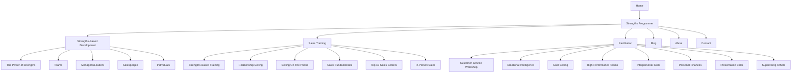

# P5.6 Navigation Updates Implementation Plan

## 1. Overview and Objectives

### 1.1 Purpose
This document provides detailed step-by-step instructions for updating the navigation to include dropdown menus for parent navigation items (Strengths-Based Development, Sales Training, and Facilitation) as deferred from Phase 4.

### 1.2 Scope
This implementation plan covers tasks P5.6.1 through P5.6.6:
- **P5.6.1**: Update navigation component for dropdowns
- **P5.6.2**: Add Strengths-Based Development dropdown menu
- **P5.6.3**: Add Sales Training dropdown menu
- **P5.6.4**: Add Facilitation dropdown menu
- **P5.6.5**: Update mobile navigation menu
- **P5.6.6**: Test navigation functionality

### 1.3 Success Criteria
- Dropdown menus functional on desktop
- All sub-pages linked in dropdowns
- Mobile navigation updated
- Navigation works on all devices
- Active states work correctly
- All links functional

## 2. Prerequisites

### 2.1 Required Knowledge
- Blade templating
- Alpine.js for interactions
- Tailwind CSS for styling
- Responsive design
- Navigation patterns

### 2.2 Dependencies
- Task P5.3 completed (All pages imported)
- All content pages published
- Navigation component exists
- Alpine.js configured

### 2.3 Reference Documents
- Phase 4 Deferred Items: `documentation/02-project-management/PHASE_4_DEFERRED_ITEMS.md`
- Frontend Architecture: `documentation/01-architecture/04-frontend-architecture.md`
- Header Component: `resources/views/components/header.blade.php`

## 3. Navigation Structure Overview

The updated navigation will include:



## 4. Task P5.6.1: Update Navigation Component for Dropdowns

### 4.1 Overview
Update the header navigation component to support dropdown menus using Alpine.js.

### 4.2 Step-by-Step Implementation

#### Step 1: Review Current Navigation Component
**File:** `resources/views/components/header.blade.php`

Review the current implementation to understand the structure.

#### Step 2: Create Dropdown Component
**File to create:** `resources/views/components/navigation-dropdown.blade.php`

```blade
@props(['label', 'items', 'route' => null])

<div class="relative group" x-data="{ open: false }">
    @if($route)
        <a 
            href="{{ $route }}"
            class="nav-link flex items-center gap-1"
            @mouseenter="open = true"
            @mouseleave="open = false"
        >
            {{ $label }}
            <svg class="w-4 h-4 transition-transform group-hover:rotate-180" fill="none" stroke="currentColor" viewBox="0 0 24 24">
                <path stroke-linecap="round" stroke-linejoin="round" stroke-width="2" d="M19 9l-7 7-7-7"/>
            </svg>
        </a>
    @else
        <button 
            type="button"
            class="nav-link flex items-center gap-1"
            @click="open = !open"
            @mouseenter="open = true"
            @mouseleave="open = false"
            aria-expanded="false"
            :aria-expanded="open"
        >
            {{ $label }}
            <svg 
                class="w-4 h-4 transition-transform" 
                :class="open ? 'rotate-180' : ''"
                fill="none" 
                stroke="currentColor" 
                viewBox="0 0 24 24"
            >
                <path stroke-linecap="round" stroke-linejoin="round" stroke-width="2" d="M19 9l-7 7-7-7"/>
            </svg>
        </button>
    @endif

    <div 
        x-show="open"
        x-transition:enter="transition ease-out duration-200"
        x-transition:enter-start="opacity-0 transform scale-95"
        x-transition:enter-end="opacity-100 transform scale-100"
        x-transition:leave="transition ease-in duration-150"
        x-transition:leave-start="opacity-100 transform scale-100"
        x-transition:leave-end="opacity-0 transform scale-95"
        @mouseenter="open = true"
        @mouseleave="open = false"
        @click.away="open = false"
        class="absolute left-0 mt-2 w-56 bg-white rounded-lg shadow-lg py-2 z-50 border border-gray-200"
        role="menu"
        aria-orientation="vertical"
    >
        @foreach($items as $item)
            <a 
                href="{{ $item['url'] }}" 
                class="block px-4 py-2 text-gray-700 hover:bg-primary-50 hover:text-primary-600 transition-colors {{ request()->url() === url($item['url']) ? 'bg-primary-50 text-primary-600 font-medium' : '' }}"
                role="menuitem"
            >
                {{ $item['label'] }}
            </a>
        @endforeach
    </div>
</div>
```

#### Step 3: Update Header Component
**File to update:** `resources/views/components/header.blade.php`

Update the desktop navigation section:

```blade
{{-- Desktop Navigation --}}
<nav class="hidden md:flex space-x-8">
    <a href="{{ route('home') }}"
       class="nav-link {{ request()->routeIs('home') ? 'active' : '' }}">
        Home
    </a>
    
    <a href="{{ route('strengths-programme') }}"
       class="nav-link {{ request()->routeIs('strengths-programme') ? 'active' : '' }}">
        Strengths Programme
    </a>

    {{-- Strengths-Based Development Dropdown --}}
    <x-navigation-dropdown 
        label="Strengths-Based Development"
        :items="[
            ['label' => 'The Power of Strengths', 'url' => route('pages.show', 'the-power-of-strengths')],
            ['label' => 'Teams', 'url' => route('pages.show', 'strengths-based-development/teams')],
            ['label' => 'Managers / Leaders', 'url' => route('pages.show', 'strengths-based-development/managers-leaders')],
            ['label' => 'Salespeople', 'url' => route('pages.show', 'strengths-based-development/salespeople')],
            ['label' => 'Individuals', 'url' => route('pages.show', 'strengths-based-development/individuals')],
        ]"
    />

    {{-- Sales Training Dropdown --}}
    <x-navigation-dropdown 
        label="Sales Training"
        :items="[
            ['label' => 'Strengths-Based Training', 'url' => route('pages.show', 'sales-training/strengths-based-training')],
            ['label' => 'Relationship Selling', 'url' => route('pages.show', 'sales-training/relationship-selling')],
            ['label' => 'Selling On The Phone', 'url' => route('pages.show', 'sales-training/selling-on-the-phone')],
            ['label' => 'Sales Fundamentals Workshop', 'url' => route('pages.show', 'sales-training/sales-fundamentals-workshop')],
            ['label' => 'Top 10 Sales Secrets', 'url' => route('pages.show', 'sales-training/top-10-sales-secrets')],
            ['label' => 'In-Person Sales', 'url' => route('pages.show', 'sales-training/in-person-sales')],
        ]"
    />

    {{-- Facilitation Dropdown --}}
    <x-navigation-dropdown 
        label="Facilitation"
        :items="[
            ['label' => 'Customer Service Workshop', 'url' => route('pages.show', 'facilitation/customer-service-workshop')],
            ['label' => 'Emotional Intelligence Workshop', 'url' => route('pages.show', 'facilitation/emotional-intelligence-workshop')],
            ['label' => 'Goal Setting', 'url' => route('pages.show', 'facilitation/goal-setting')],
            ['label' => 'High-Performance Teams', 'url' => route('pages.show', 'facilitation/high-performance-teams')],
            ['label' => 'Interpersonal Skills', 'url' => route('pages.show', 'facilitation/interpersonal-skills')],
            ['label' => 'Personal Finances', 'url' => route('pages.show', 'facilitation/personal-finances')],
            ['label' => 'Presentation Skills', 'url' => route('pages.show', 'facilitation/presentation-skills')],
            ['label' => 'Supervising Others', 'url' => route('pages.show', 'facilitation/supervising-others')],
        ]"
    />

    <a href="{{ route('blog.index') }}"
       class="nav-link {{ request()->routeIs('blog.*') ? 'active' : '' }}">
        Blog
    </a>
    
    <a href="{{ route('about') }}"
       class="nav-link {{ request()->routeIs('about') ? 'active' : '' }}">
        About
    </a>
    
    <a href="{{ route('contact') }}"
       class="nav-link {{ request()->routeIs('contact') ? 'active' : '' }}">
        Contact
    </a>
</nav>
```

#### Step 4: Create Navigation Helper
**File to create:** `app/Helpers/NavigationHelper.php`

Create a helper to generate navigation items dynamically:

```php
<?php

namespace App\Helpers;

use App\Models\Page;

class NavigationHelper
{
    public static function getStrengthsBasedDevelopmentItems(): array
    {
        $pages = Page::where('slug', 'like', 'strengths-based-development/%')
            ->orWhere('slug', 'the-power-of-strengths')
            ->where('is_published', true)
            ->orderBy('title')
            ->get();

        return $pages->map(function ($page) {
            return [
                'label' => $page->title,
                'url' => route('pages.show', $page->slug),
            ];
        })->toArray();
    }

    public static function getSalesTrainingItems(): array
    {
        $pages = Page::where('slug', 'like', 'sales-training/%')
            ->where('is_published', true)
            ->orderBy('title')
            ->get();

        return $pages->map(function ($page) {
            return [
                'label' => $page->title,
                'url' => route('pages.show', $page->slug),
            ];
        })->toArray();
    }

    public static function getFacilitationItems(): array
    {
        $pages = Page::where('slug', 'like', 'facilitation/%')
            ->where('is_published', true)
            ->orderBy('title')
            ->get();

        return $pages->map(function ($page) {
            return [
                'label' => $page->title,
                'url' => route('pages.show', $page->slug),
            ];
        })->toArray();
    }
}
```

#### Step 5: Update Header to Use Helper
Update header component to use the helper:

```blade
@php
use App\Helpers\NavigationHelper;
@endphp

{{-- Strengths-Based Development Dropdown --}}
<x-navigation-dropdown 
    label="Strengths-Based Development"
    :items="NavigationHelper::getStrengthsBasedDevelopmentItems()"
/>

{{-- Sales Training Dropdown --}}
<x-navigation-dropdown 
    label="Sales Training"
    :items="NavigationHelper::getSalesTrainingItems()"
/>

{{-- Facilitation Dropdown --}}
<x-navigation-dropdown 
    label="Facilitation"
    :items="NavigationHelper::getFacilitationItems()"
/>
```

### 4.3 Validation Checklist
- [ ] Dropdown component created
- [ ] Navigation helper created
- [ ] Header component updated
- [ ] Dropdowns display correctly
- [ ] Hover interactions work

## 5. Task P5.6.2: Add Strengths-Based Development Dropdown Menu

### 5.1 Overview
Ensure the Strengths-Based Development dropdown includes all 5 pages.

### 5.2 Step-by-Step Implementation

#### Step 1: Verify Pages Exist
Ensure all pages are published:
- The Power of Strengths (`/the-power-of-strengths`)
- Teams (`/strengths-based-development/teams`)
- Managers / Leaders (`/strengths-based-development/managers-leaders`)
- Salespeople (`/strengths-based-development/salespeople`)
- Individuals (`/strengths-based-development/individuals`)

#### Step 2: Test Dropdown
1. Hover over "Strengths-Based Development"
2. Verify dropdown appears
3. Verify all 5 items listed
4. Click each item to verify links work

#### Step 3: Verify Active States
When on a Strengths-Based Development page:
- Verify parent item is highlighted (if applicable)
- Verify current page is highlighted in dropdown

### 5.3 Validation Checklist
- [ ] All 5 pages in dropdown
- [ ] Links work correctly
- [ ] Active states work
- [ ] Dropdown displays properly

## 6. Task P5.6.3: Add Sales Training Dropdown Menu

### 6.1 Overview
Ensure the Sales Training dropdown includes all 6 pages.

### 6.2 Step-by-Step Implementation

#### Step 1: Verify Pages Exist
Ensure all pages are published:
- Strengths-Based Training
- Relationship Selling
- Selling On The Phone
- Sales Fundamentals Workshop
- Top 10 Sales Secrets
- In-Person Sales

#### Step 2: Test Dropdown
1. Hover over "Sales Training"
2. Verify dropdown appears
3. Verify all 6 items listed
4. Click each item to verify links work

### 6.3 Validation Checklist
- [ ] All 6 pages in dropdown
- [ ] Links work correctly
- [ ] Active states work
- [ ] Dropdown displays properly

## 7. Task P5.6.4: Add Facilitation Dropdown Menu

### 7.1 Overview
Ensure the Facilitation dropdown includes all 8 workshop pages.

### 7.2 Step-by-Step Implementation

#### Step 1: Verify Pages Exist
Ensure all pages are published:
- Customer Service Workshop
- Emotional Intelligence Workshop
- Goal Setting and Getting Things Done
- High-Performance Teams Workshop
- Interpersonal Skills Workshop
- Managing Personal Finances Workshop
- Presentation Skills Workshop
- Supervising Others Workshop

#### Step 2: Test Dropdown
1. Hover over "Facilitation"
2. Verify dropdown appears
3. Verify all 8 items listed
4. Click each item to verify links work

### 7.3 Validation Checklist
- [ ] All 8 pages in dropdown
- [ ] Links work correctly
- [ ] Active states work
- [ ] Dropdown displays properly

## 8. Task P5.6.5: Update Mobile Navigation Menu

### 8.1 Overview
Update the mobile navigation to include dropdown functionality for parent items.

### 8.2 Step-by-Step Implementation

#### Step 1: Update Mobile Menu Component
**File to update:** `resources/views/components/header.blade.php`

Update the mobile menu section:

```blade
{{-- Mobile Menu --}}
<div 
    x-show="open"
    x-transition:enter="transition ease-out duration-200"
    x-transition:enter-start="opacity-0 transform scale-95"
    x-transition:enter-end="opacity-100 transform scale-100"
    x-transition:leave="transition ease-in duration-150"
    x-transition:leave-start="opacity-100 transform scale-100"
    x-transition:leave-end="opacity-0 transform scale-95"
    class="absolute top-20 left-0 right-0 bg-white shadow-xl border-t border-neutral-200 md:hidden"
    @click.away="close()"
    role="menu"
    aria-label="Mobile navigation menu"
>
    <div class="px-4 py-4 space-y-1">
        <a href="{{ route('home') }}" 
           class="block px-3 py-2 rounded-md text-base font-medium text-gray-700 hover:bg-primary-50 hover:text-primary-600">
            Home
        </a>
        
        <a href="{{ route('strengths-programme') }}" 
           class="block px-3 py-2 rounded-md text-base font-medium text-gray-700 hover:bg-primary-50 hover:text-primary-600">
            Strengths Programme
        </a>

        {{-- Strengths-Based Development (Mobile Dropdown) --}}
        <div x-data="{ open: false }" class="space-y-1">
            <button 
                @click="open = !open"
                class="w-full flex items-center justify-between px-3 py-2 rounded-md text-base font-medium text-gray-700 hover:bg-primary-50 hover:text-primary-600"
            >
                <span>Strengths-Based Development</span>
                <svg 
                    class="w-5 h-5 transition-transform" 
                    :class="open ? 'rotate-180' : ''"
                    fill="none" 
                    stroke="currentColor" 
                    viewBox="0 0 24 24"
                >
                    <path stroke-linecap="round" stroke-linejoin="round" stroke-width="2" d="M19 9l-7 7-7-7"/>
                </svg>
            </button>
            <div x-show="open" class="pl-4 space-y-1">
                @foreach(NavigationHelper::getStrengthsBasedDevelopmentItems() as $item)
                    <a href="{{ $item['url'] }}" 
                       class="block px-3 py-2 rounded-md text-sm text-gray-600 hover:bg-primary-50 hover:text-primary-600">
                        {{ $item['label'] }}
                    </a>
                @endforeach
            </div>
        </div>

        {{-- Sales Training (Mobile Dropdown) --}}
        <div x-data="{ open: false }" class="space-y-1">
            <button 
                @click="open = !open"
                class="w-full flex items-center justify-between px-3 py-2 rounded-md text-base font-medium text-gray-700 hover:bg-primary-50 hover:text-primary-600"
            >
                <span>Sales Training</span>
                <svg 
                    class="w-5 h-5 transition-transform" 
                    :class="open ? 'rotate-180' : ''"
                    fill="none" 
                    stroke="currentColor" 
                    viewBox="0 0 24 24"
                >
                    <path stroke-linecap="round" stroke-linejoin="round" stroke-width="2" d="M19 9l-7 7-7-7"/>
                </svg>
            </button>
            <div x-show="open" class="pl-4 space-y-1">
                @foreach(NavigationHelper::getSalesTrainingItems() as $item)
                    <a href="{{ $item['url'] }}" 
                       class="block px-3 py-2 rounded-md text-sm text-gray-600 hover:bg-primary-50 hover:text-primary-600">
                        {{ $item['label'] }}
                    </a>
                @endforeach
            </div>
        </div>

        {{-- Facilitation (Mobile Dropdown) --}}
        <div x-data="{ open: false }" class="space-y-1">
            <button 
                @click="open = !open"
                class="w-full flex items-center justify-between px-3 py-2 rounded-md text-base font-medium text-gray-700 hover:bg-primary-50 hover:text-primary-600"
            >
                <span>Facilitation</span>
                <svg 
                    class="w-5 h-5 transition-transform" 
                    :class="open ? 'rotate-180' : ''"
                    fill="none" 
                    stroke="currentColor" 
                    viewBox="0 0 24 24"
                >
                    <path stroke-linecap="round" stroke-linejoin="round" stroke-width="2" d="M19 9l-7 7-7-7"/>
                </svg>
            </button>
            <div x-show="open" class="pl-4 space-y-1">
                @foreach(NavigationHelper::getFacilitationItems() as $item)
                    <a href="{{ $item['url'] }}" 
                       class="block px-3 py-2 rounded-md text-sm text-gray-600 hover:bg-primary-50 hover:text-primary-600">
                        {{ $item['label'] }}
                    </a>
                @endforeach
            </div>
        </div>

        <a href="{{ route('blog.index') }}" 
           class="block px-3 py-2 rounded-md text-base font-medium text-gray-700 hover:bg-primary-50 hover:text-primary-600">
            Blog
        </a>
        
        <a href="{{ route('about') }}" 
           class="block px-3 py-2 rounded-md text-base font-medium text-gray-700 hover:bg-primary-50 hover:text-primary-600">
            About
        </a>
        
        <a href="{{ route('contact') }}" 
           class="block px-3 py-2 rounded-md text-base font-medium text-gray-700 hover:bg-primary-50 hover:text-primary-600">
            Contact
        </a>
    </div>
</div>
```

#### Step 2: Test Mobile Navigation
1. Open site on mobile device or resize browser
2. Click hamburger menu
3. Test dropdown functionality
4. Verify all links work
5. Test on different screen sizes

### 8.3 Validation Checklist
- [ ] Mobile menu updated
- [ ] Dropdowns work on mobile
- [ ] All links accessible
- [ ] Tested on multiple devices
- [ ] Touch interactions work

## 9. Task P5.6.6: Test Navigation Functionality

### 9.1 Overview
Comprehensive testing of navigation functionality across all devices and scenarios.

### 9.2 Step-by-Step Implementation

#### Step 1: Desktop Testing
1. Test hover interactions
2. Test click interactions
3. Verify dropdown positioning
4. Test keyboard navigation
5. Verify active states
6. Test all links

#### Step 2: Mobile Testing
1. Test tap interactions
2. Verify dropdown animations
3. Test menu closing
4. Verify all links accessible
5. Test on different screen sizes

#### Step 3: Accessibility Testing
1. Test keyboard navigation
2. Test screen reader compatibility
3. Verify ARIA attributes
4. Test focus states

#### Step 4: Cross-Browser Testing
1. Test in Chrome
2. Test in Firefox
3. Test in Safari
4. Test in Edge
5. Verify consistent behavior

#### Step 5: Performance Testing
1. Verify no layout shift
2. Check animation performance
3. Verify no JavaScript errors

### 9.3 Validation Checklist
- [ ] Desktop navigation tested
- [ ] Mobile navigation tested
- [ ] Accessibility verified
- [ ] Cross-browser tested
- [ ] Performance verified
- [ ] All links functional

## 10. Navigation Updates Summary

### 10.1 Updates Checklist
- [ ] Dropdown component created
- [ ] Navigation helper created
- [ ] Desktop navigation updated
- [ ] Mobile navigation updated
- [ ] All dropdowns functional
- [ ] All links working
- [ ] Tested on all devices

### 10.2 Deliverables
- Updated navigation component
- Dropdown functionality
- Mobile navigation updates
- Navigation helper class
- All navigation tested

## 11. Next Steps

After navigation updates are complete:
1. Verify all navigation works
2. Proceed to P5.7 - Homepage Enhancements
3. Add site-wide search
4. Add contact information section (if needed)

## 12. References

- Phase 4 Deferred Items: `documentation/02-project-management/PHASE_4_DEFERRED_ITEMS.md`
- Frontend Architecture: `documentation/01-architecture/04-frontend-architecture.md`
- Header Component: `resources/views/components/header.blade.php`
- **Next Task:** P5.7 - Homepage Enhancements Implementation Plan

---

**Document Version:** 1.0  
**Last Updated:** 2025  
**Status:** Ready for Implementation
