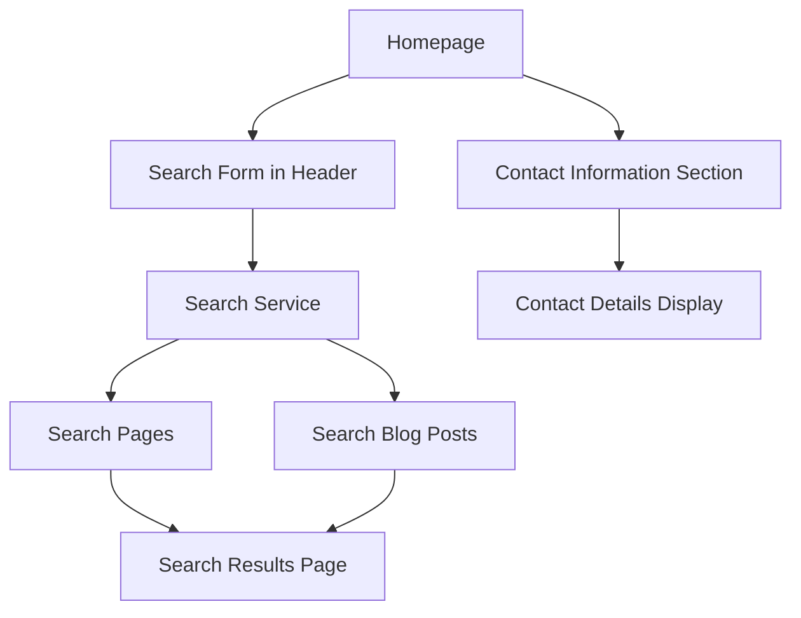

# P5.7 Homepage Enhancements Implementation Plan

## 1. Overview and Objectives

### 1.1 Purpose
This document provides detailed step-by-step instructions for enhancing the homepage with site-wide search functionality and a contact information section, as deferred from Phase 4.

### 1.2 Scope
This implementation plan covers tasks P5.7.1 through P5.7.6:
- **P5.7.1**: Create site-wide search service
- **P5.7.2**: Add search form to homepage header
- **P5.7.3**: Create search results page
- **P5.7.4**: Implement search indexing for pages
- **P5.7.5**: Add contact information section (if required)
- **P5.7.6**: Test search functionality

### 1.3 Success Criteria
- Site-wide search functional
- Search includes pages and blog posts
- Search form in header
- Search results page displays correctly
- Contact information section added (if required)
- Search tested and working
- Performance acceptable

## 2. Prerequisites

### 2.1 Required Knowledge
- Laravel service layer
- Database queries
- Search implementation
- Blade templating
- Frontend JavaScript

### 2.2 Dependencies
- Task P5.3 completed (All content imported)
- All pages and blog posts in database
- BlogPostService exists
- PageService exists

### 2.3 Reference Documents
- Phase 4 Deferred Items: `documentation/02-project-management/PHASE_4_DEFERRED_ITEMS.md`
- Business Requirements: `documentation/00-business-requirement/business-requirement-document.md`
- BlogPostService: `app/Services/BlogPostService.php`
- PageService: `app/Services/PageService.php`

## 3. Homepage Enhancements Overview

The enhancements include:



## 4. Task P5.7.1: Create Site-Wide Search Service

### 4.1 Overview
Create a search service that searches across both pages and blog posts.

### 4.2 Step-by-Step Implementation

#### Step 1: Create Search Service
**File to create:** `app/Services/SearchService.php`

```php
<?php

namespace App\Services;

use App\Models\Page;
use App\Models\BlogPost;
use Illuminate\Contracts\Pagination\LengthAwarePaginator;
use Illuminate\Support\Collection;
use Illuminate\Support\Facades\Cache;

class SearchService
{
    protected int $cacheTtl = 3600; // 1 hour

    /**
     * Perform site-wide search
     *
     * @param string $query
     * @param int $perPage
     * @return array
     */
    public function search(string $query, int $perPage = 10): array
    {
        $query = trim($query);
        
        if (strlen($query) < 2) {
            return [
                'pages' => collect(),
                'posts' => collect(),
                'total' => 0,
            ];
        }

        $cacheKey = "search.{$query}.{$perPage}";

        return Cache::remember($cacheKey, $this->cacheTtl, function () use ($query, $perPage) {
            return [
                'pages' => $this->searchPages($query, $perPage),
                'posts' => $this->searchBlogPosts($query, $perPage),
                'total' => $this->getTotalCount($query),
            ];
        });
    }

    /**
     * Search pages
     *
     * @param string $query
     * @param int $perPage
     * @return Collection
     */
    protected function searchPages(string $query, int $perPage): Collection
    {
        return Page::where('is_published', true)
            ->where(function ($q) use ($query) {
                $q->where('title', 'like', "%{$query}%")
                  ->orWhere('excerpt', 'like', "%{$query}%")
                  ->orWhere('content', 'like', "%{$query}%");
            })
            ->orderBy('title')
            ->limit($perPage)
            ->get()
            ->map(function ($page) use ($query) {
                return [
                    'type' => 'page',
                    'id' => $page->id,
                    'title' => $page->title,
                    'excerpt' => $this->extractExcerpt($page->content, $query),
                    'url' => route('pages.show', $page->slug),
                    'slug' => $page->slug,
                ];
            });
    }

    /**
     * Search blog posts
     *
     * @param string $query
     * @param int $perPage
     * @return Collection
     */
    protected function searchBlogPosts(string $query, int $perPage): Collection
    {
        return BlogPost::where('is_published', true)
            ->where(function ($q) use ($query) {
                $q->where('title', 'like', "%{$query}%")
                  ->orWhere('excerpt', 'like', "%{$query}%")
                  ->orWhere('content', 'like', "%{$query}%");
            })
            ->orderBy('published_at', 'desc')
            ->limit($perPage)
            ->get()
            ->map(function ($post) use ($query) {
                return [
                    'type' => 'blog_post',
                    'id' => $post->id,
                    'title' => $post->title,
                    'excerpt' => $this->extractExcerpt($post->content, $query),
                    'url' => route('blog.show', $post->slug),
                    'slug' => $post->slug,
                    'published_at' => $post->published_at,
                ];
            });
    }

    /**
     * Get total count of results
     *
     * @param string $query
     * @return int
     */
    protected function getTotalCount(string $query): int
    {
        $pageCount = Page::where('is_published', true)
            ->where(function ($q) use ($query) {
                $q->where('title', 'like', "%{$query}%")
                  ->orWhere('excerpt', 'like', "%{$query}%")
                  ->orWhere('content', 'like', "%{$query}%");
            })
            ->count();

        $postCount = BlogPost::where('is_published', true)
            ->where(function ($q) use ($query) {
                $q->where('title', 'like', "%{$query}%")
                  ->orWhere('excerpt', 'like', "%{$query}%")
                  ->orWhere('content', 'like', "%{$query}%");
            })
            ->count();

        return $pageCount + $postCount;
    }

    /**
     * Extract excerpt with highlighted query
     *
     * @param string $content
     * @param string $query
     * @param int $length
     * @return string
     */
    protected function extractExcerpt(string $content, string $query, int $length = 200): string
    {
        $content = strip_tags($content);
        $content = preg_replace('/\s+/', ' ', $content);
        
        $position = stripos($content, $query);
        
        if ($position === false) {
            return substr($content, 0, $length) . '...';
        }

        $start = max(0, $position - 50);
        $excerpt = substr($content, $start, $length);
        
        // Highlight query in excerpt
        $excerpt = preg_replace('/(' . preg_quote($query, '/') . ')/i', '<mark>$1</mark>', $excerpt);
        
        if ($start > 0) {
            $excerpt = '...' . $excerpt;
        }
        
        if (strlen($content) > $start + $length) {
            $excerpt .= '...';
        }

        return $excerpt;
    }

    /**
     * Get popular searches
     *
     * @param int $limit
     * @return Collection
     */
    public function getPopularSearches(int $limit = 5): Collection
    {
        // Could implement search analytics here
        // For now, return empty or predefined popular searches
        return collect([
            'strengths-based development',
            'team building',
            'sales training',
            'leadership development',
        ])->take($limit);
    }
}
```

#### Step 2: Register Search Service
**File to update:** `app/Providers/AppServiceProvider.php`

```php
public function register(): void
{
    $this->app->singleton(\App\Services\SearchService::class);
}
```

### 4.3 Validation Checklist
- [ ] SearchService created
- [ ] Search methods implemented
- [ ] Caching implemented
- [ ] Service registered

## 5. Task P5.7.2: Add Search Form to Homepage Header

### 5.1 Overview
Add a search form to the header that allows users to search from any page.

### 5.2 Step-by-Step Implementation

#### Step 1: Create Search Form Component
**File to create:** `resources/views/components/search-form.blade.php`

```blade
@props(['placeholder' => 'Search...', 'class' => ''])

<form action="{{ route('search') }}" method="GET" class="{{ $class }}" x-data="{ open: false, query: '{{ request('q', '') }}' }">
    <div class="relative">
        <input 
            type="text" 
            name="q" 
            x-model="query"
            value="{{ request('q', '') }}"
            placeholder="{{ $placeholder }}"
            class="w-full px-4 py-2 pl-10 pr-10 border border-gray-300 rounded-lg focus:ring-2 focus:ring-primary-500 focus:border-transparent"
            @focus="open = true"
            @blur="setTimeout(() => open = false, 200)"
        >
        <div class="absolute inset-y-0 left-0 flex items-center pl-3">
            <svg class="w-5 h-5 text-gray-400" fill="none" stroke="currentColor" viewBox="0 0 24 24">
                <path stroke-linecap="round" stroke-linejoin="round" stroke-width="2" d="M21 21l-6-6m2-5a7 7 0 11-14 0 7 7 0 0114 0z"/>
            </svg>
        </div>
        @if(request('q'))
            <a href="{{ route('search') }}" class="absolute inset-y-0 right-0 flex items-center pr-3">
                <svg class="w-5 h-5 text-gray-400 hover:text-gray-600" fill="none" stroke="currentColor" viewBox="0 0 24 24">
                    <path stroke-linecap="round" stroke-linejoin="round" stroke-width="2" d="M6 18L18 6M6 6l12 12"/>
                </svg>
            </a>
        @endif
    </div>
</form>
```

#### Step 2: Update Header Component
**File to update:** `resources/views/components/header.blade.php`

Add search form to header:

```blade
<header class="bg-white/95 backdrop-blur-sm shadow-sm sticky top-0 z-50">
    <div class="container-custom">
        <div class="flex items-center justify-between h-20">
            {{-- Logo --}}
            <div class="flex-shrink-0">
                <a href="{{ route('home') }}" class="flex items-center group">
                    <span class="text-2xl font-bold font-display text-primary-600 group-hover:scale-105 transition-transform">
                        {{ config('app.name') }}
                    </span>
                </a>
            </div>

            {{-- Search Form (Desktop) --}}
            <div class="hidden lg:block flex-1 max-w-md mx-8">
                <x-search-form placeholder="Search pages and blog posts..." />
            </div>

            {{-- Desktop Navigation --}}
            <nav class="hidden md:flex space-x-8">
                {{-- Navigation items --}}
            </nav>

            {{-- CTA Button --}}
            <div class="hidden md:block">
                <a href="{{ route('booking') }}" class="btn btn-primary">
                    Book Consultation
                </a>
            </div>

            {{-- Mobile Menu Button with Search --}}
            <div class="md:hidden flex items-center gap-2">
                {{-- Mobile Search Icon --}}
                <button 
                    type="button"
                    @click="$dispatch('toggle-mobile-search')"
                    class="p-2 rounded-lg text-neutral-700 hover:text-primary-600 hover:bg-primary-50"
                    aria-label="Search"
                >
                    <svg class="h-6 w-6" fill="none" stroke="currentColor" viewBox="0 0 24 24">
                        <path stroke-linecap="round" stroke-linejoin="round" stroke-width="2" d="M21 21l-6-6m2-5a7 7 0 11-14 0 7 7 0 0114 0z"/>
                    </svg>
                </button>

                {{-- Mobile Menu Button --}}
                <div x-data="mobileMenu()">
                    {{-- Existing mobile menu code --}}
                </div>
            </div>
        </div>

        {{-- Mobile Search Bar --}}
        <div 
            x-data="{ open: false }"
            @toggle-mobile-search.window="open = !open"
            x-show="open"
            x-transition
            class="lg:hidden border-t border-gray-200 py-3"
        >
            <div class="container-custom">
                <x-search-form placeholder="Search..." />
            </div>
        </div>
    </div>
</header>
```

### 5.3 Validation Checklist
- [ ] Search form component created
- [ ] Search form added to header
- [ ] Desktop search visible
- [ ] Mobile search functional
- [ ] Form submits correctly

## 6. Task P5.7.3: Create Search Results Page

### 6.1 Overview
Create a search results page that displays results from both pages and blog posts.

### 6.2 Step-by-Step Implementation

#### Step 1: Create Search Controller
**File to create:** `app/Http/Controllers/Web/SearchController.php`

```php
<?php

namespace App\Http\Controllers\Web;

use App\Http\Controllers\Controller;
use App\Services\SearchService;
use Illuminate\Http\Request;

class SearchController extends Controller
{
    protected SearchService $searchService;

    public function __construct(SearchService $searchService)
    {
        $this->searchService = $searchService;
    }

    /**
     * Display search results
     *
     * @param Request $request
     * @return \Illuminate\View\View
     */
    public function index(Request $request)
    {
        $query = trim($request->get('q', ''));

        if (empty($query) || strlen($query) < 2) {
            return view('search.index', [
                'query' => $query,
                'results' => [
                    'pages' => collect(),
                    'posts' => collect(),
                    'total' => 0,
                ],
                'seo' => [
                    'title' => 'Search - ' . config('app.name'),
                    'description' => 'Search pages and blog posts',
                ],
            ])->with('info', 'Please enter at least 2 characters to search.');
        }

        $results = $this->searchService->search($query, 10);

        return view('search.index', [
            'query' => $query,
            'results' => $results,
            'seo' => [
                'title' => "Search: {$query} - " . config('app.name'),
                'description' => "Search results for: {$query}",
            ],
        ]);
    }
}
```

#### Step 2: Add Search Route
**File to update:** `routes/web.php`

```php
use App\Http\Controllers\Web\SearchController;

// Add before catch-all route
Route::get('/search', [SearchController::class, 'index'])->name('search');
```

#### Step 3: Create Search Results View
**File to create:** `resources/views/search/index.blade.php`

```blade
@extends('layouts.app')

@section('title', $seo['title'] ?? 'Search - ' . config('app.name'))

@push('meta')
    <meta name="description" content="{{ $seo['description'] ?? 'Search pages and blog posts' }}">
@endpush

@section('content')
    <section class="section-padding bg-white">
        <div class="container-custom">
            <div class="max-w-4xl mx-auto">
                {{-- Search Form --}}
                <div class="mb-8">
                    <x-search-form placeholder="Search pages and blog posts..." class="max-w-2xl mx-auto" />
                </div>

                {{-- Results Header --}}
                @if(!empty($query))
                    <div class="mb-6">
                        <h1 class="text-3xl font-bold text-gray-900 mb-2">
                            Search Results
                        </h1>
                        <p class="text-gray-600">
                            @if($results['total'] > 0)
                                Found {{ $results['total'] }} result(s) for "<strong>{{ $query }}</strong>"
                            @else
                                No results found for "<strong>{{ $query }}</strong>"
                            @endif
                        </p>
                    </div>
                @endif

                {{-- Results --}}
                @if($results['total'] > 0)
                    {{-- Pages Results --}}
                    @if($results['pages']->isNotEmpty())
                        <div class="mb-8">
                            <h2 class="text-xl font-semibold text-gray-900 mb-4">
                                Pages ({{ $results['pages']->count() }})
                            </h2>
                            <div class="space-y-4">
                                @foreach($results['pages'] as $page)
                                    <div class="bg-gray-50 rounded-lg p-6 hover:shadow-md transition-shadow">
                                        <h3 class="text-lg font-semibold text-gray-900 mb-2">
                                            <a href="{{ $page['url'] }}" class="hover:text-primary-600">
                                                {{ $page['title'] }}
                                            </a>
                                        </h3>
                                        <p class="text-gray-600 mb-2">
                                            {!! $page['excerpt'] !!}
                                        </p>
                                        <a href="{{ $page['url'] }}" class="text-primary-600 hover:text-primary-700 text-sm font-medium">
                                            View Page →
                                        </a>
                                    </div>
                                @endforeach
                            </div>
                        </div>
                    @endif

                    {{-- Blog Posts Results --}}
                    @if($results['posts']->isNotEmpty())
                        <div class="mb-8">
                            <h2 class="text-xl font-semibold text-gray-900 mb-4">
                                Blog Posts ({{ $results['posts']->count() }})
                            </h2>
                            <div class="space-y-4">
                                @foreach($results['posts'] as $post)
                                    <div class="bg-gray-50 rounded-lg p-6 hover:shadow-md transition-shadow">
                                        <h3 class="text-lg font-semibold text-gray-900 mb-2">
                                            <a href="{{ $post['url'] }}" class="hover:text-primary-600">
                                                {{ $post['title'] }}
                                            </a>
                                        </h3>
                                        <p class="text-gray-600 mb-2">
                                            {!! $post['excerpt'] !!}
                                        </p>
                                        <div class="flex items-center justify-between">
                                            <span class="text-sm text-gray-500">
                                                {{ $post['published_at']->format('F j, Y') }}
                                            </span>
                                            <a href="{{ $post['url'] }}" class="text-primary-600 hover:text-primary-700 text-sm font-medium">
                                                Read More →
                                            </a>
                                        </div>
                                    </div>
                                @endforeach
                            </div>
                        </div>
                    @endif
                @elseif(!empty($query))
                    {{-- No Results --}}
                    <div class="text-center py-12">
                        <svg class="mx-auto h-12 w-12 text-gray-400 mb-4" fill="none" stroke="currentColor" viewBox="0 0 24 24">
                            <path stroke-linecap="round" stroke-linejoin="round" stroke-width="2" d="M21 21l-6-6m2-5a7 7 0 11-14 0 7 7 0 0114 0z"/>
                        </svg>
                        <h3 class="text-lg font-medium text-gray-900 mb-2">No results found</h3>
                        <p class="text-gray-600 mb-6">
                            Try different keywords or check your spelling.
                        </p>
                        <a href="{{ route('home') }}" class="btn btn-primary">
                            Return to Homepage
                        </a>
                    </div>
                @endif

                {{-- Popular Searches --}}
                @if(empty($query) || $results['total'] === 0)
                    <div class="mt-8">
                        <h3 class="text-lg font-semibold text-gray-900 mb-4">Popular Searches</h3>
                        <div class="flex flex-wrap gap-2">
                            @foreach($this->searchService->getPopularSearches() as $popular)
                                <a href="{{ route('search', ['q' => $popular]) }}" 
                                   class="px-4 py-2 bg-gray-100 text-gray-700 rounded-full hover:bg-primary-100 hover:text-primary-700 transition-colors">
                                    {{ $popular }}
                                </a>
                            @endforeach
                        </div>
                    </div>
                @endif
            </div>
        </div>
    </section>
@endsection
```

### 6.3 Validation Checklist
- [ ] SearchController created
- [ ] Search route added
- [ ] Search results view created
- [ ] Results display correctly
- [ ] No results message works

## 7. Task P5.7.4: Implement Search Indexing for Pages

### 7.1 Overview
Enhance the search to properly index page content and improve search relevance.

### 7.2 Step-by-Step Implementation

#### Step 1: Enhance PageRepository Search
**File to update:** `app/Repositories/PageRepository.php`

Add search method if not exists:

```php
/**
 * Search pages
 *
 * @param string $query
 * @param int $perPage
 * @return \Illuminate\Contracts\Pagination\LengthAwarePaginator
 */
public function search(string $query, int $perPage = 10)
{
    return Page::where('is_published', true)
        ->where(function ($q) use ($query) {
            $q->where('title', 'like', "%{$query}%")
              ->orWhere('excerpt', 'like', "%{$query}%")
              ->orWhere('content', 'like', "%{$query}%")
              ->orWhere('meta_keywords', 'like', "%{$query}%");
        })
        ->orderByRaw("
            CASE 
                WHEN title LIKE ? THEN 1
                WHEN excerpt LIKE ? THEN 2
                WHEN content LIKE ? THEN 3
                ELSE 4
            END
        ", ["%{$query}%", "%{$query}%", "%{$query}%"])
        ->paginate($perPage);
}
```

#### Step 2: Update SearchService
**File to update:** `app/Services/SearchService.php`

Enhance search to use repository and improve relevance:

```php
protected function searchPages(string $query, int $perPage): Collection
{
    $pages = Page::where('is_published', true)
        ->where(function ($q) use ($query) {
            $q->where('title', 'like', "%{$query}%")
              ->orWhere('excerpt', 'like', "%{$query}%")
              ->orWhere('content', 'like', "%{$query}%");
        })
        ->orderByRaw("
            CASE 
                WHEN title LIKE ? THEN 1
                WHEN excerpt LIKE ? THEN 2
                WHEN content LIKE ? THEN 3
                ELSE 4
            END
        ", ["%{$query}%", "%{$query}%", "%{$query}%"])
        ->limit($perPage)
        ->get();

    return $pages->map(function ($page) use ($query) {
        return [
            'type' => 'page',
            'id' => $page->id,
            'title' => $this->highlightQuery($page->title, $query),
            'excerpt' => $this->extractExcerpt($page->content, $query),
            'url' => route('pages.show', $page->slug),
            'slug' => $page->slug,
            'relevance' => $this->calculateRelevance($page, $query),
        ];
    })->sortByDesc('relevance')->values();
}

protected function highlightQuery(string $text, string $query): string
{
    return preg_replace('/(' . preg_quote($query, '/') . ')/i', '<mark>$1</mark>', $text);
}

protected function calculateRelevance(Page $page, string $query): int
{
    $relevance = 0;
    $queryLower = strtolower($query);
    
    // Title match (highest weight)
    if (stripos($page->title, $query) !== false) {
        $relevance += 10;
    }
    
    // Exact title match
    if (strtolower($page->title) === $queryLower) {
        $relevance += 20;
    }
    
    // Excerpt match
    if (stripos($page->excerpt, $query) !== false) {
        $relevance += 5;
    }
    
    // Content match
    if (stripos($page->content, $query) !== false) {
        $relevance += 1;
    }
    
    return $relevance;
}
```

### 7.3 Validation Checklist
- [ ] PageRepository search enhanced
- [ ] SearchService improved
- [ ] Relevance scoring implemented
- [ ] Search results ordered by relevance

## 8. Task P5.7.5: Add Contact Information Section (if Required)

### 8.1 Overview
Add a contact information section to the homepage if required per business requirements.

### 8.2 Step-by-Step Implementation

#### Step 1: Review Requirement
Check if contact information section is needed on homepage (currently in footer).

#### Step 2: Create Contact Information Component
**File to create:** `resources/views/partials/home/contact-information.blade.php`

```blade
<section class="section-padding bg-gray-50">
    <div class="container-custom">
        <div class="max-w-4xl mx-auto text-center">
            <h2 class="text-3xl md:text-4xl font-bold text-gray-900 mb-6">
                Get in Touch
            </h2>
            <p class="text-xl text-gray-600 mb-8">
                Ready to transform your team? Contact us today to learn more about our strengths-based development programs.
            </p>
            
            <div class="grid grid-cols-1 md:grid-cols-2 gap-8 mb-8">
                <div class="bg-white rounded-lg p-6 shadow-sm">
                    <div class="flex items-center justify-center w-12 h-12 bg-primary-100 rounded-full mb-4 mx-auto">
                        <svg class="w-6 h-6 text-primary-600" fill="none" stroke="currentColor" viewBox="0 0 24 24">
                            <path stroke-linecap="round" stroke-linejoin="round" stroke-width="2" d="M3 5a2 2 0 012-2h3.28a1 1 0 01.948.684l1.498 4.493a1 1 0 01-.502 1.21l-2.257 1.13a11.042 11.042 0 005.516 5.516l1.13-2.257a1 1 0 011.21-.502l4.493 1.498a1 1 0 01.684.949V19a2 2 0 01-2 2h-1C9.716 21 3 14.284 3 6V5z"/>
                        </svg>
                    </div>
                    <h3 class="text-lg font-semibold text-gray-900 mb-2">Phone</h3>
                    <a href="tel:+27832948033" class="text-primary-600 hover:text-primary-700">
                        +27 83 294 8033
                    </a>
                </div>
                
                <div class="bg-white rounded-lg p-6 shadow-sm">
                    <div class="flex items-center justify-center w-12 h-12 bg-primary-100 rounded-full mb-4 mx-auto">
                        <svg class="w-6 h-6 text-primary-600" fill="none" stroke="currentColor" viewBox="0 0 24 24">
                            <path stroke-linecap="round" stroke-linejoin="round" stroke-width="2" d="M3 8l7.89 5.26a2 2 0 002.22 0L21 8M5 19h14a2 2 0 002-2V7a2 2 0 00-2-2H5a2 2 0 00-2 2v10a2 2 0 002 2z"/>
                        </svg>
                    </div>
                    <h3 class="text-lg font-semibold text-gray-900 mb-2">Email</h3>
                    <a href="mailto:welcome@eberhardniklaus.co.za" class="text-primary-600 hover:text-primary-700">
                        welcome@eberhardniklaus.co.za
                    </a>
                </div>
            </div>
            
            <div class="flex flex-col sm:flex-row gap-4 justify-center">
                <a href="{{ route('contact') }}" class="btn btn-primary">
                    Contact Us
                </a>
                <a href="{{ route('booking') }}" class="btn btn-secondary">
                    Book Consultation
                </a>
            </div>
        </div>
    </div>
</section>
```

#### Step 3: Add to Homepage
**File to update:** `resources/views/web/home/index.blade.php` or homepage partial

Add contact information section before footer (if required).

### 8.3 Validation Checklist
- [ ] Requirement reviewed
- [ ] Component created (if needed)
- [ ] Section added to homepage (if needed)
- [ ] Contact information accurate
- [ ] Links work correctly

## 9. Task P5.7.6: Test Search Functionality

### 9.1 Overview
Comprehensive testing of search functionality.

### 9.2 Step-by-Step Implementation

#### Step 1: Functional Testing
1. Test search from header
2. Test search with various queries
3. Verify results display
4. Test pagination (if implemented)
5. Test empty search
6. Test short queries (< 2 characters)

#### Step 2: Performance Testing
1. Test search speed
2. Verify caching works
3. Test with large result sets
4. Check database query performance

#### Step 3: User Experience Testing
1. Test on desktop
2. Test on mobile
3. Verify search form accessibility
4. Test keyboard navigation
5. Verify search highlighting

### 9.3 Validation Checklist
- [ ] Functional testing complete
- [ ] Performance acceptable
- [ ] User experience verified
- [ ] All edge cases tested
- [ ] Search working correctly

## 10. Homepage Enhancements Summary

### 10.1 Enhancements Checklist
- [ ] SearchService created
- [ ] Search form in header
- [ ] Search results page created
- [ ] Page indexing implemented
- [ ] Contact section added (if required)
- [ ] Search tested and working

### 10.2 Deliverables
- Site-wide search functional
- Search form in header
- Search results page
- Enhanced search indexing
- Contact information section (if added)
- All functionality tested

## 11. Next Steps

After homepage enhancements are complete:
1. Verify all functionality works
2. Complete Phase 5 validation
3. Proceed to Phase 6 (SEO and Performance)
4. Continue with remaining phases

## 12. References

- Phase 4 Deferred Items: `documentation/02-project-management/PHASE_4_DEFERRED_ITEMS.md`
- Business Requirements: `documentation/00-business-requirement/business-requirement-document.md`
- BlogPostService: `app/Services/BlogPostService.php`
- PageService: `app/Services/PageService.php`
- **Phase 5 Complete:** All implementation plans created

---

**Document Version:** 1.0  
**Last Updated:** 2025  
**Status:** Ready for Implementation
